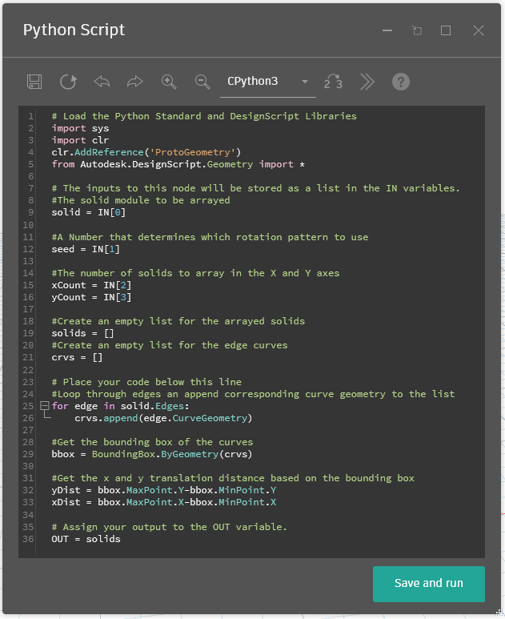
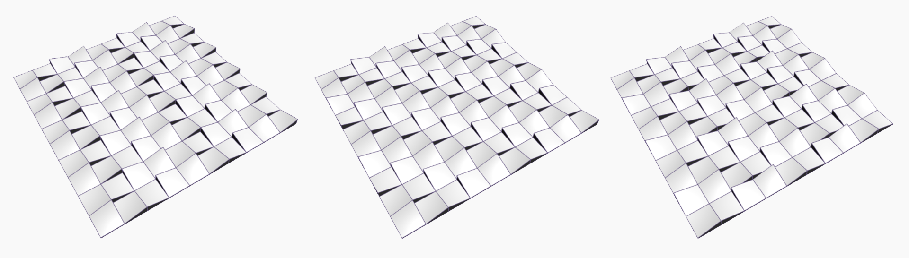

# Węzły języka Python

Dlaczego w środowisku programowania wizualnego Dynamo warto używać programowania tekstowego? [Programowanie wizualne](../../a_appendix/a-1_visual-programming-and-dynamo.md) ma wiele zalet. Umożliwia tworzenie programów bez konieczności poznawania specjalnej składni w intuicyjnym interfejsie wizualnym. Jednak program wizualny może z czasem zawierać zbyt wiele elementów i nie działać zgodnie z założeniami. Na przykład język Python oferuje znacznie więcej dostępnych metod pisania instrukcji warunkowych (jeśli/to) i zapętlania. Język Python jest zaawansowanym narzędziem, które umożliwia rozszerzenie możliwości dodatku Dynamo i zastąpienie wielu węzłów kilkoma zwięzłymi liniami kodu.

**Program wizualny:**

\

**Program tekstowy:**

```py
import clr
clr.AddReference('ProtoGeometry')
from Autodesk.DesignScript.Geometry import *

solid = IN[0]
seed = IN[1]
xCount = IN[2]
yCount = IN[3]

solids = []

yDist = solid.BoundingBox.MaxPoint.Y-solid.BoundingBox.MinPoint.Y
xDist = solid.BoundingBox.MaxPoint.X-solid.BoundingBox.MinPoint.X

for i in xRange:
	for j in yRange:
		fromCoord = solid.ContextCoordinateSystem
		toCoord = fromCoord.Rotate(solid.ContextCoordinateSystem.Origin,Vector.ByCoordinates(0,0,1),(90*(i+j%val)))
		vec = Vector.ByCoordinates((xDist*i),(yDist*j),0)
		toCoord = toCoord.Translate(vec)
		solids.append(solid.Transform(fromCoord,toCoord))

OUT = solids
```

### Węzeł w języku Python

Podobnie jak bloki kodu węzły języka Python są interfejsem skryptowym w środowisku programowania wizualnego. Węzeł Python można znaleźć w bibliotece w obszarze Skrypt>Edytor>Skrypt w języku Python.

\

Dwukrotne kliknięcie węzła powoduje otwarcie edytora skryptów języka Python (można również kliknąć prawym przyciskiem myszy węzeł i wybrać polecenie _Edytuj_). Na górze jest wyświetlany tekst wstępny, który ma ułatwić odnoszenie się do potrzebnych bibliotek. Dane wejściowe są przechowywane w szyku IN. Wartości są zwracane do dodatku Dynamo przez przypisanie ich do zmiennej OUT

\

Biblioteka Autodesk.DesignScript.Geometry umożliwia używanie zapisu kropkowego podobnego do bloków kodu (Code Block). Aby uzyskać więcej informacji na temat składni dodatku Dynamo, zapoznaj się z materiałem [7-2_design-script-scritax.md](../../coding-in-dynamo/7_code-blocks-and-design-script/7-2_design-script-syntax.md "mention") oraz [Przewodnikiem języka DesignScript](https://dynamobim.org/wp-content/links/DesignScriptGuide.pdf). (Aby pobrać ten dokument PDF, kliknij prawym przyciskiem myszy łącze i wybierz opcję „Zapisz łącze jako...”). Wpisanie typu geometrii, takiego jak „Point.”, spowoduje pojawienie się listy metod tworzenia punktów i stosowania do nich zapytań.

\

> Metody obejmują konstruktory, takie jak _ByCoordinates_, akcje, takie jak _Add_, oraz zapytania, takie jak współrzędne _X_, _Y_ i _Z_.

## Ćwiczenie: węzeł niestandardowy ze skryptem w języku Python do tworzenia wzorów z modułu bryłowego

### Część I. Konfigurowanie skryptu w języku Python

> Pobierz plik przykładowy, klikając poniższe łącze.
>
> Pełna lista plików przykładowych znajduje się w załączniku.



W tym przykładzie napiszemy skrypt w języku Python, który tworzy wzorce z modułu bryłowego, i zmienimy go w węzeł niestandardowy. Najpierw utworzymy moduł bryłowy za pomocą węzłów Dynamo.

\

> 1. **Rectangle.ByWidthLength:** utwórz prostokąt, który będzie podstawą bryły.
> 2. **Surface.ByPatch:** połącz prostokąt z wejściem _„closedCurve”_, aby utworzyć dolną powierzchnię.

\

> 1. **Geometry.Translate:** połącz prostokąt z wejściem _„geometry”_, aby przesunąć go w górę, używając węzła Code Block do określenia grubości bazowej bryły.
> 2. **Polygon.Points:** zastosuj zapytanie do przekształconego prostokąta w celu wyodrębnienia punktów narożnych.
> 3. **Geometry.Translate:** użyj węzła Code Block, aby utworzyć listę czterech wartości odpowiadających czterem punktom, przekształcając jeden narożnik bryły w górę.
> 4. **Polygon.ByPoints:** użyj przekształconych punktów, aby odtworzyć górny wielobok.
> 5. **Surface.ByPatch:** połącz wielobok, aby utworzyć górną powierzchnię.

Teraz gdy mamy górną i dolną powierzchnię, wyciągnijmy między dwoma profilami, aby utworzyć boki bryły.

\

> 1. **List.Create:** połącz dolny prostokąt i górny wielobok z wejściami indeksu.
> 2. **Surface.ByLoft:** wyciągnij dwa profile w celu utworzenia boków bryły.
> 3. **List.Create:** połącz górną, boczną i dolną powierzchnię z wejściami indeksu, aby utworzyć listę powierzchni.
> 4. **Solid.ByJoinedSurfaces:** połącz powierzchnie, aby utworzyć moduł bryły.

Po uzyskaniu bryły upuść węzeł skryptu w języku Python w obszarze roboczym.

\

> 1. Aby dodać kolejne wejścia do węzła, kliknij ikonę „+” na węźle. Nazwy wejść to IN[0], IN[1] itd., aby wskazać, że reprezentują one elementy na liście.

Zacznijmy od zdefiniowania wejść i wyjść. Kliknij dwukrotnie węzeł, aby otworzyć edytor języka Python. Zmodyfikuj kod w edytorze na podstawie poniższego kodu.

\

```py
# Load the Python Standard and DesignScript Libraries
import sys
import clr
clr.AddReference('ProtoGeometry')
from Autodesk.DesignScript.Geometry import *

# The inputs to this node will be stored as a list in the IN variables.
#The solid module to be arrayed
solid = IN[0]

#A Number that determines which rotation pattern to use
seed = IN[1]

#The number of solids to array in the X and Y axes
xCount = IN[2]
yCount = IN[3]

#Create an empty list for the arrayed solids
solids = []

# Place your code below this line


# Assign your output to the OUT variable.
OUT = solids
```

Ten kod będzie bardziej przejrzysty w trakcie dalszej analizy tego ćwiczenia. Następnie należy zastanowić się, jakie informacje są wymagane, aby ułożyć moduł bryłowy w szyku. Najpierw musimy znać wymiary bryły, aby określić odległość przekształcenia. Z powodu błędu ramki ograniczającej należy użyć geometrii krzywej krawędzi, aby utworzyć ramkę ograniczającą.



> Przyjrzyj się węzłowi Python w dodatku Dynamo. Zauważ, że używamy tej samej składni, która jest używana w węzłach w dodatku Dynamo. Zapoznaj się z poniższym skomentowanym kodem.

```py
# Load the Python Standard and DesignScript Libraries
import sys
import clr
clr.AddReference('ProtoGeometry')
from Autodesk.DesignScript.Geometry import *

# The inputs to this node will be stored as a list in the IN variables.
#The solid module to be arrayed
solid = IN[0]

#A Number that determines which rotation pattern to use
seed = IN[1]

#The number of solids to array in the X and Y axes
xCount = IN[2]
yCount = IN[3]

#Create an empty list for the arrayed solids
solids = []
#Create an empty list for the edge curves
crvs = []

# Place your code below this line
#Loop through edges an append corresponding curve geometry to the list
for edge in solid.Edges:
    crvs.append(edge.CurveGeometry)

#Get the bounding box of the curves
bbox = BoundingBox.ByGeometry(crvs)

#Get the x and y translation distance based on the bounding box
yDist = bbox.MaxPoint.Y-bbox.MinPoint.Y
xDist = bbox.MaxPoint.X-bbox.MinPoint.X

# Assign your output to the OUT variable.
OUT = solids
```

Ponieważ będziemy zarówno przekształcać, jak i obracać moduły brył, użyjmy operacji Geometry.Transform. Z węzła Geometry.Transform wynika, że będziemy potrzebować źródłowego układu współrzędnych i docelowego układu współrzędnych do przekształcenia bryły. Źródłem jest kontekstowy układ współrzędnych bryły, natomiast elementem docelowym będzie inny układ współrzędnych dla każdego modułu ustawionego w szyku. Oznacza to, że należy utworzyć pętlę przez wartości x i y, aby przekształcić układ współrzędnych za każdym razem w inny sposób.

\

```py
# Load the Python Standard and DesignScript Libraries
import sys
import clr
clr.AddReference('ProtoGeometry')
from Autodesk.DesignScript.Geometry import *

# The inputs to this node will be stored as a list in the IN variables.
#The solid module to be arrayed
solid = IN[0]

#A Number that determines which rotation pattern to use
seed = IN[1]

#The number of solids to array in the X and Y axes
xCount = IN[2]
yCount = IN[3]

#Create an empty list for the arrayed solids
solids = []
#Create an empty list for the edge curves
crvs = []

# Place your code below this line
#Loop through edges an append corresponding curve geometry to the list
for edge in solid.Edges:
    crvs.append(edge.CurveGeometry)

#Get the bounding box of the curves
bbox = BoundingBox.ByGeometry(crvs)

#Get the x and y translation distance based on the bounding box
yDist = bbox.MaxPoint.Y-bbox.MinPoint.Y
xDist = bbox.MaxPoint.X-bbox.MinPoint.X

#Get the source coordinate system
fromCoord = solid.ContextCoordinateSystem

#Loop through x and y
for i in range(xCount):
    for j in range(yCount):
        #Rotate and translate the coordinate system
        toCoord = fromCoord.Rotate(solid.ContextCoordinateSystem.Origin, Vector.ByCoordinates(0,0,1), (90*(i+j%seed)))
        vec = Vector.ByCoordinates((xDist*i),(yDist*j),0)
        toCoord = toCoord.Translate(vec)
        #Transform the solid from the source coord syste, to the target coord system and append to the list
        solids.append(solid.Transform(fromCoord,toCoord))

# Assign your output to the OUT variable.
OUT = solids
```

Kliknij przycisk Uruchom, a następnie Zapisz kod. Połącz węzeł w języku Python z istniejącym skryptem w następujący sposób.

\

> 1. Połącz dane wyjściowe z węzła **Solid.ByJoinedSurfaces** z pierwszym wejściem węzła Python i użyj węzła Code Block, aby zdefiniować pozostałe wejścia.
> 2. Utwórz węzeł **Topology.Edges** i użyj danych wyjściowych z węzła Python jako jego danych wejściowych.
> 3. Na koniec utwórz węzeł **Edge.CurveGeometry** i użyj danych wyjściowych z węzła Topology.Edges jako jego danych wejściowych.

Spróbuj zmienić wartość źródłową, aby utworzyć różne wzorce. Można również zmienić parametry samego modułu bryły w celu uzyskania różnych efektów.



### Część II. Przekształcanie węzła skryptu w języku Python w węzeł niestandardowy

Teraz po utworzeniu przydatnego skryptu w języku Python zapiszemy go jako węzeł niestandardowy. Wybierz węzeł skryptu w języku Python, kliknij prawym przyciskiem myszy obszar roboczy i wybierz opcję „Utwórz węzeł niestandardowy”.

\

Przypisz nazwę, opis i kategorię.

\

Spowoduje to otwarcie nowego obszaru roboczego, w którym będzie edytowany węzeł niestandardowy.

\

> 1. **Wejścia Input:** zmień nazwy wejść na bardziej opisowe i dodaj typy danych oraz wartości domyślne.
> 2. **Wyjście Output:** zmień nazwę węzła danych wyjściowych

Zapisz węzeł jako plik .dyf. Węzeł niestandardowy powinien odzwierciedlać wprowadzone zmiany.

\
