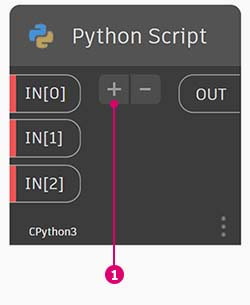
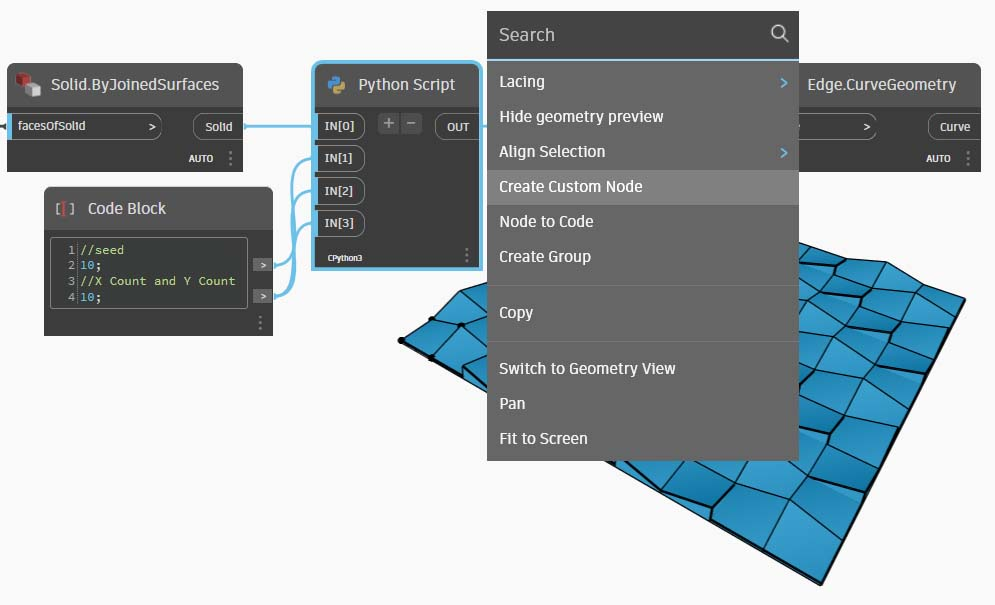

# Python Script ノード

Dynamo のビジュアル プログラミング環境で、テキスト プログラミングを使用するのはなぜでしょうか。[ビジュアル プログラミング](../../a\_appendix/a-1\_visual-programming-and-dynamo.md)には、多くの利点があります。直感的なビジュアル インタフェースにより、特別な構文を学習することなくプログラムを作成することができます。ただし、ビジュアル プログラムは、処理が煩雑になったり、機能が不足することがあります。Python には、「if/then」の条件ステートメントやループを簡単に記述するための方法が用意されています。Python は、Dynamo の機能を拡張し、多数のノードを数行の簡潔なコード行で置き換えることができる強力なツールです。

**ビジュアル プログラミング:**


**テキスト プログラム:**

```py
import clr
clr.AddReference('ProtoGeometry')
from Autodesk.DesignScript.Geometry import *

solid = IN[0]
seed = IN[1]
xCount = IN[2]
yCount = IN[3]

solids = []

yDist = solid.BoundingBox.MaxPoint.Y-solid.BoundingBox.MinPoint.Y
xDist = solid.BoundingBox.MaxPoint.X-solid.BoundingBox.MinPoint.X

for i in xRange:
	for j in yRange:
		fromCoord = solid.ContextCoordinateSystem
		toCoord = fromCoord.Rotate(solid.ContextCoordinateSystem.Origin,Vector.ByCoordinates(0,0,1),(90*(i+j%val)))
		vec = Vector.ByCoordinates((xDist*i),(yDist*j),0)
		toCoord = toCoord.Translate(vec)
		solids.append(solid.Transform(fromCoord,toCoord))

OUT = solids
```

### Python Script ノード

Code Block ノードと同様に、Python Script ノードはビジュアル プログラミング環境内のスクリプト インタフェースです。Python Script ノードは、ライブラリの[Script] > [Editor] > [Python Script]にあります。


このノードをダブルクリックすると、Python のスクリプト エディタが開きます。ノードを右クリックして[_編集..._]を選択することもできます。エディタ上部の定型文は、必要なライブラリを参照する際に役立ちます。Python Script ノードの入力値は、IN 配列に格納されます。値は、OUT 変数に割り当てられて Dynamo に返されます。


Autodesk.DesignScript.Geometry ライブラリにより、Code Block ノードと同様のドット表記を使用することができます。Dynamo 構文の詳細については、「[7-2_design-script-syntax.md](../../coding-in-dynamo/7\_code-blocks-and-design-script/7-2\_design-script-syntax.md "mention")」および「[DesignScript ガイド](https://dynamobim.org/wp-content/links/DesignScriptGuide.pdf)」を参照してください(この PDF 文書をダウンロードするには、リンクを右クリックし、[名前を付けてリンク先を保存...]をクリックしてください)。「Point.」などのジオメトリ タイプを入力すると、点の作成や点のクエリーを実行するためのメソッドのリストが表示されます。


> これらのメソッドには、_ByCoordinates_ などのコンストラクタ、_Add_ などのアクション、_X_、_Y_、_Z_ 座標などのクエリーがあります。

## 演習: Python Script を使用してソリッド モジュールからパターンを作成するカスタム ノード

### パート I: Python Script を設定する

> 下のリンクをクリックして、サンプル ファイルをダウンロードします。
>
> すべてのサンプルファイルの一覧については、付録を参照してください。



この例では、Python Script ノードを記述してソリッド モジュールからパターンを作成し、カスタム ノードに変換します。最初に、Dynamo ノードを使用してソリッド モジュールを作成します。


> 1. **Rectangle.ByWidthLength:** ノードを使用して、ソリッドのベースとなる長方形を作成します。
> 2. **Surface.ByPatch:** ノードの _closedCurve_ 入力に Rectangle 出力を接続し、下部サーフェスを作成します。


> 1. **Geometry.Translate:** ノードの _geometry_ 入力に Rectangle 出力を接続し、長方形を上に移動します。次に、Code Block ノードを使用してソリッドの厚さを指定します。
> 2. **Polygon.Points:** ノードを使用して、変換された長方形に対してクエリーを実行し、頂点を抽出します。
> 3. **Geometry.Translate:** ノードを使用して、4 つの点に対応する 4 つの値のリストを作成します。この操作により、ソリッドの 1 つの頂点が上に移動します。
> 4. 変換後の点を **Polygon.ByPoints:** ノードで使用して、上部ポリゴンを再作成します。
> 5. **Surface.ByPatch:** ノードを使用してポリゴンを結合し、上部サーフェスを作成します。

これで、上部サーフェスと下部サーフェスが作成されました。次に、2 つのプロファイルの間をロフトしてソリッドの側面を作成しましょう。


> 1. **List.Create:** ノードの index 入力に、底面の長方形と上面のポリゴンを接続します。
> 2. **Surface.ByLoft:** ノードを使用して 2 つのプロファイルをロフトし、ソリッドの側面を作成します。
> 3. **List.Create:** ノードの index 入力に上部サーフェス、側面サーフェス、下部サーフェスを接続して、サーフェスのリストを作成します。
> 4. **Solid.ByJoinedSurfaces:** ノードを使用してサーフェスを結合し、ソリッド モジュールを作成します。

これで、ソリッドが作成されました。次に、ワークスペースに Python Script ノードをドロップします。



> 1. ノード上の[+]アイコンをクリックし、ノードに入力を追加します。入力には IN[0]、IN[1]などの名前が付いています。これらはリスト内の項目を表しています。

最初に、入力と出力を定義しましょう。ノードをダブルクリックして、Python エディタを開きます。エディタ内のコードを修正するには、次のコードを実行します。


```py
# Load the Python Standard and DesignScript Libraries
import sys
import clr
clr.AddReference('ProtoGeometry')
from Autodesk.DesignScript.Geometry import *

# The inputs to this node will be stored as a list in the IN variables.
#The solid module to be arrayed
solid = IN[0]

#A Number that determines which rotation pattern to use
seed = IN[1]

#The number of solids to array in the X and Y axes
xCount = IN[2]
yCount = IN[3]

#Create an empty list for the arrayed solids
solids = []

# Place your code below this line


# Assign your output to the OUT variable.
OUT = solids
```

このコードの意味については、演習を進めながら説明していきます。ここで、ソリッド モジュールを配列化するためには、どのような情報が必要になるかを考慮する必要があります。最初に、移動距離を決定するために、ソリッドの寸法を知る必要があります。境界ボックスにはバグがあるため、境界ボックスを作成するにはエッジ曲線のジオメトリを使用する必要があります。


> ここで、Dynamo の Python Script ノードを確認します。Dynamo のノードのタイトルと同じ構文が使用されていることがわかります。以下のコメント付きコードを確認してください。

```py
# Load the Python Standard and DesignScript Libraries
import sys
import clr
clr.AddReference('ProtoGeometry')
from Autodesk.DesignScript.Geometry import *

# The inputs to this node will be stored as a list in the IN variables.
#The solid module to be arrayed
solid = IN[0]

#A Number that determines which rotation pattern to use
seed = IN[1]

#The number of solids to array in the X and Y axes
xCount = IN[2]
yCount = IN[3]

#Create an empty list for the arrayed solids
solids = []
#Create an empty list for the edge curves
crvs = []

# Place your code below this line
#Loop through edges an append corresponding curve geometry to the list
for edge in solid.Edges:
    crvs.append(edge.CurveGeometry)

#Get the bounding box of the curves
bbox = BoundingBox.ByGeometry(crvs)

#Get the x and y translation distance based on the bounding box
yDist = bbox.MaxPoint.Y-bbox.MinPoint.Y
xDist = bbox.MaxPoint.X-bbox.MinPoint.X

# Assign your output to the OUT variable.
OUT = solids
```

ここでは、ソリッドのモジュールの移動と回転を行うため、Geometry.Transform の操作を使用しましょう。Geometry.Transform ノードを確認すると、ソリッドを変換するにはソース座標系とターゲット座標系が必要になることがわかります。この場合、ソース座標系はソリッドのコンテキストの座標系で、ターゲット座標系は配列化された各モジュールの別の座標系になります。そのため、x 値と y 値をループして、座標系を毎回異なる距離と方向で変換する必要があります。


```py
# Load the Python Standard and DesignScript Libraries
import sys
import clr
clr.AddReference('ProtoGeometry')
from Autodesk.DesignScript.Geometry import *

# The inputs to this node will be stored as a list in the IN variables.
#The solid module to be arrayed
solid = IN[0]

#A Number that determines which rotation pattern to use
seed = IN[1]

#The number of solids to array in the X and Y axes
xCount = IN[2]
yCount = IN[3]

#Create an empty list for the arrayed solids
solids = []
#Create an empty list for the edge curves
crvs = []

# Place your code below this line
#Loop through edges an append corresponding curve geometry to the list
for edge in solid.Edges:
    crvs.append(edge.CurveGeometry)

#Get the bounding box of the curves
bbox = BoundingBox.ByGeometry(crvs)

#Get the x and y translation distance based on the bounding box
yDist = bbox.MaxPoint.Y-bbox.MinPoint.Y
xDist = bbox.MaxPoint.X-bbox.MinPoint.X

#Get the source coordinate system
fromCoord = solid.ContextCoordinateSystem

#Loop through x and y
for i in range(xCount):
    for j in range(yCount):
        #Rotate and translate the coordinate system
        toCoord = fromCoord.Rotate(solid.ContextCoordinateSystem.Origin, Vector.ByCoordinates(0,0,1), (90*(i+j%seed)))
        vec = Vector.ByCoordinates((xDist*i),(yDist*j),0)
        toCoord = toCoord.Translate(vec)
        #Transform the solid from the source coord syste, to the target coord system and append to the list
        solids.append(solid.Transform(fromCoord,toCoord))

# Assign your output to the OUT variable.
OUT = solids
```

[実行]をクリックし、コードを保存します。次のように、Python Script ノードを既存のスクリプトに接続します。


> 1. **Solid.ByJoinedSurfaces** からの出力を、Python Script ノードの最初の入力として接続し、Code Block を使用してその他の入力を定義します。
> 2. **Topology.Edges** ノードを作成し、Python Script ノードからの出力を入力として使用します。
> 3. 最後に **Edge.CurveGeometry** ノードを作成し、Topology.Edges からの出力を入力として使用します。

シード値を変更すると、異なるパターンが作成されます。ソリッド モジュールのパラメータを変更して、異なるエフェクトを作成することもできます。


### パート II: Python Script ノードをカスタム ノードに変換する

これで、便利な Python Script ノードが作成されました。このノードをカスタム ノードとして保存しましょう。Python Script ノードを選択し、ワークスペースを右クリックして、[カスタム ノードを作成]を選択します。



名前、説明、カテゴリを設定します。


この操作により、カスタム ノードを編集するための新しいワークスペースが開きます。


> 1. **Inputs:** 入力名をわかりやすい名前に変更し、データ タイプと既定値を追加します。
> 2. **Output:** 出力名を変更します。

ノードを .dyf ファイルとして保存すると、先ほど行った変更がカスタム ノードに反映されます。


