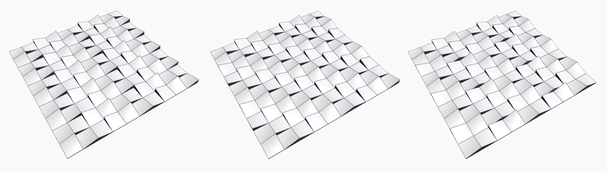

# Nœuds Python

Pourquoi utiliser la programmation textuelle dans l’environnement de programmation visuelle de Dynamo ? La [programmation visuelle](../../a\_appendix/a-1\_visual-programming-and-dynamo.md) présente de nombreux avantages. Elle vous permet de créer des programmes sans avoir à apprendre la syntaxe spéciale dans une interface visuelle intuitive. Toutefois, un programme visuel peut être encombré et peut parfois ne pas fonctionner correctement. Par exemple, Python propose des méthodes beaucoup plus efficaces pour écrire des instructions conditionnelles (if/then) et des boucles. Python est un outil puissant qui permet d’étendre les capacités de Dynamo et de remplacer de nombreux nœuds par quelques lignes de code concises.

**Programme visuel :**


**Programme textuel :**

```py
import clr
clr.AddReference('ProtoGeometry')
from Autodesk.DesignScript.Geometry import *

solid = IN[0]
seed = IN[1]
xCount = IN[2]
yCount = IN[3]

solids = []

yDist = solid.BoundingBox.MaxPoint.Y-solid.BoundingBox.MinPoint.Y
xDist = solid.BoundingBox.MaxPoint.X-solid.BoundingBox.MinPoint.X

for i in xRange:
	for j in yRange:
		fromCoord = solid.ContextCoordinateSystem
		toCoord = fromCoord.Rotate(solid.ContextCoordinateSystem.Origin,Vector.ByCoordinates(0,0,1),(90*(i+j%val)))
		vec = Vector.ByCoordinates((xDist*i),(yDist*j),0)
		toCoord = toCoord.Translate(vec)
		solids.append(solid.Transform(fromCoord,toCoord))

OUT = solids
```

### Nœud Python

Comme les blocs de code, les nœuds Python sont une interface de script au sein d'un environnement de programmation visuelle. Le nœud Python se trouve sous Script > Éditeur > Python Script dans la bibliothèque.


Un double-clic sur le nœud permet d’ouvrir l’éditeur de script Python (vous pouvez également cliquer avec le bouton droit sur le nœud et sélectionner _Éditer…_). Le texte réutilisable situé en haut de l’éditeur vous permet de référencer les bibliothèques dont vous aurez besoin. Les entrées sont stockées dans le réseau IN. Les valeurs sont renvoyées à Dynamo en étant affectées à la variable OUT.


La bibliothèque Autodesk.DesignScript.Geometry vous permet d’utiliser la notation par points de manière similaire aux blocs de code. Pour plus d’informations sur la syntaxe de Dynamo, reportez-vous à la rubrique [7-2\\_design-script-syntax.md](../../coding-in-dynamo/7\_code-blocks-and-design-script/7-2\_design-script-syntax.md "mention") et au document [Guide de DesignScript](https://dynamobim.org/wp-content/links/DesignScriptGuide.pdf) (pour télécharger ce document PDF, cliquez avec le bouton droit de la souris sur le lien et choisissez « Enregistrer le lien sous… »). Si vous tapez un type de géométrie tel que « Point », une liste de méthodes permettant de créer et d’interroger des points s’affiche.


> Les méthodes comprennent des constructeurs tels que _ByCoordinates_, des actions telles que _Add_ et des requêtes telles que les coordonnées _X_, _Y_ et _Z_.

## Exercice : Nœud personnalisé avec le nœud Python Script pour la création de motifs du module solide

### Partie I : Configuration du nœud Python Script

> Téléchargez le fichier d’exemple en cliquant sur le lien ci-dessous.
>
> Vous trouverez la liste complète des fichiers d'exemple dans l'annexe.



Dans cet exemple, vous allez écrire un script Python qui crée des motifs à partir d'un module solide, et le transformer en nœud personnalisé. Commencer par créer le module solide à l’aide de nœuds Dynamo.


> 1. **Rectangle.ByWidthLength :** créez un rectangle qui servira de base au solide.
> 2. **Surface.ByPatch :** connectez le rectangle à l’entrée « _closedCurve_ » pour créer la surface inférieure.


> 1. **Geometry.Translate :** connectez le rectangle à l’entrée « _geometry_ » pour le déplacer vers le haut, à l’aide d’un bloc de code pour spécifier l’épaisseur de base du solide.
> 2. **Polygon.Points :** interrogez le rectangle converti pour extraire les points de coin.
> 3. **Geometry.Translate :** utilisez un bloc de code pour créer une liste de quatre valeurs correspondant aux quatre points, en convertissant un coin du solide vers le haut.
> 4. **Polygon.ByPoints :** utilisez les points convertis pour reconstruire le polygone supérieur.
> 5. **Surface.ByPatch :** connectez le polygone pour créer la surface supérieure.

Maintenant que vous avez les surfaces supérieures et inférieures, effectuez un lissage entre les deux contours pour créer les côtés du solide.


> 1. **List.Create:** connectez le rectangle inférieur et le polygone supérieur aux entrées d’index.
> 2. **Surface.ByLoft :** lissez les deux contours pour créer les côtés du solide.
> 3. **List.Create :** connectez les surfaces supérieures, inférieures et latérales aux entrées d’index pour créer une liste de surfaces.
> 4. **Solid.ByJoiningSurfaces :** joignez les surfaces pour créer le module solide.

Maintenant que le solide est créé, déposez un nœud de script Python dans l’espace de travail.


> 1. Pour ajouter des entrées supplémentaires au nœud, cliquez sur l’icône + sur le nœud. Les entrées sont nommées IN[0], IN[1], etc. pour indiquer qu’elles représentent des éléments dans une liste.

Commencez par définir les entrées et la sortie. Double-cliquez sur le nœud pour ouvrir l'éditeur Python. Suivez le code ci-dessous pour modifier le code dans l’éditeur.


```py
# Load the Python Standard and DesignScript Libraries
import sys
import clr
clr.AddReference('ProtoGeometry')
from Autodesk.DesignScript.Geometry import *

# The inputs to this node will be stored as a list in the IN variables.
#The solid module to be arrayed
solid = IN[0]

#A Number that determines which rotation pattern to use
seed = IN[1]

#The number of solids to array in the X and Y axes
xCount = IN[2]
yCount = IN[3]

#Create an empty list for the arrayed solids
solids = []

# Place your code below this line


# Assign your output to the OUT variable.
OUT = solids
```

Ce code sera plus pertinent à mesure que vous progresserez dans l’exercice. Ensuite, identifiez les informations nécessaires pour la mise en réseau du module solide. Tout d'abord, vous devez connaître les cotes du solide pour déterminer la distance de conversion. En raison d’un bogue relatif à la zone de contour, utilisez la géométrie de courbe d’arête pour créer une zone de contour.


> Examinez le nœud Python dans Dynamo. La syntaxe utilisée est la même que celle utilisée dans les titres des nœuds dans Dynamo. Consultez le code commenté ci-dessous.

```py
# Load the Python Standard and DesignScript Libraries
import sys
import clr
clr.AddReference('ProtoGeometry')
from Autodesk.DesignScript.Geometry import *

# The inputs to this node will be stored as a list in the IN variables.
#The solid module to be arrayed
solid = IN[0]

#A Number that determines which rotation pattern to use
seed = IN[1]

#The number of solids to array in the X and Y axes
xCount = IN[2]
yCount = IN[3]

#Create an empty list for the arrayed solids
solids = []
#Create an empty list for the edge curves
crvs = []

# Place your code below this line
#Loop through edges an append corresponding curve geometry to the list
for edge in solid.Edges:
    crvs.append(edge.CurveGeometry)

#Get the bounding box of the curves
bbox = BoundingBox.ByGeometry(crvs)

#Get the x and y translation distance based on the bounding box
yDist = bbox.MaxPoint.Y-bbox.MinPoint.Y
xDist = bbox.MaxPoint.X-bbox.MinPoint.X

# Assign your output to the OUT variable.
OUT = solids
```

Puisque vous allez convertir et faire pivoter les modules solides, utilisez l'opération Geometry.Transform. Examinez le nœud Geometry.Transform : vous savez que vous avez besoin d'un système de coordonnées source et d'un système de coordonnées cible pour transformer le solide. La source est le système de coordonnées contextuel du solide, alors que la cible est un système de coordonnées différent pour chaque module en réseau. Cela signifie que vous devez parcourir les valeurs x et y pour modifier le système de coordonnées à chaque fois.


```py
# Load the Python Standard and DesignScript Libraries
import sys
import clr
clr.AddReference('ProtoGeometry')
from Autodesk.DesignScript.Geometry import *

# The inputs to this node will be stored as a list in the IN variables.
#The solid module to be arrayed
solid = IN[0]

#A Number that determines which rotation pattern to use
seed = IN[1]

#The number of solids to array in the X and Y axes
xCount = IN[2]
yCount = IN[3]

#Create an empty list for the arrayed solids
solids = []
#Create an empty list for the edge curves
crvs = []

# Place your code below this line
#Loop through edges an append corresponding curve geometry to the list
for edge in solid.Edges:
    crvs.append(edge.CurveGeometry)

#Get the bounding box of the curves
bbox = BoundingBox.ByGeometry(crvs)

#Get the x and y translation distance based on the bounding box
yDist = bbox.MaxPoint.Y-bbox.MinPoint.Y
xDist = bbox.MaxPoint.X-bbox.MinPoint.X

#Get the source coordinate system
fromCoord = solid.ContextCoordinateSystem

#Loop through x and y
for i in range(xCount):
    for j in range(yCount):
        #Rotate and translate the coordinate system
        toCoord = fromCoord.Rotate(solid.ContextCoordinateSystem.Origin, Vector.ByCoordinates(0,0,1), (90*(i+j%seed)))
        vec = Vector.ByCoordinates((xDist*i),(yDist*j),0)
        toCoord = toCoord.Translate(vec)
        #Transform the solid from the source coord syste, to the target coord system and append to the list
        solids.append(solid.Transform(fromCoord,toCoord))

# Assign your output to the OUT variable.
OUT = solids
```

Cliquez sur Exécuter, puis enregistrez le code. Connectez le nœud Python avec le script existant comme suit.


> 1. Connectez la sortie du nœud **Solid.ByJoinedSurfaces** comme première entrée du nœud Python et utilisez un nœud Code Block pour définir les autres entrées.
> 2. Créez un nœud **Topology.Edges** et utilisez la sortie du nœud Python comme son entrée.
> 3. Enfin, créez un nœud **Edge.CurveGeometry** et utilisez la sortie du nœud Topology.Edges comme son entrée.

Modifiez la valeur de départ pour créer différents motifs. Vous pouvez également modifier les paramètres du module solide lui-même pour créer différents effets.



### Partie II : Conversion du nœud Python Script en nœud personnalisé

Maintenant que vous avez créé un script Python utile, enregistrez-le en tant que nœud personnalisé. Sélectionnez le nœud Python Script, cliquez avec le bouton droit sur Espace de travail et sélectionnez « Créer un nœud personnalisé ».


Attribuez un nom, une description et une catégorie.


Un nouvel espace de travail s’ouvre dans lequel vous pouvez modifier le nœud personnalisé.


> 1. **Entrées :** modifiez les noms d’entrée pour qu’ils soient plus descriptifs et ajoutez des types de données et des valeurs par défaut.
> 2. **Sortie :** modifier le nom de la sortie.

Enregistrez le nœud sous forme de fichier .dyf. Le nœud personnalisé doit maintenant refléter les modifications apportées.


