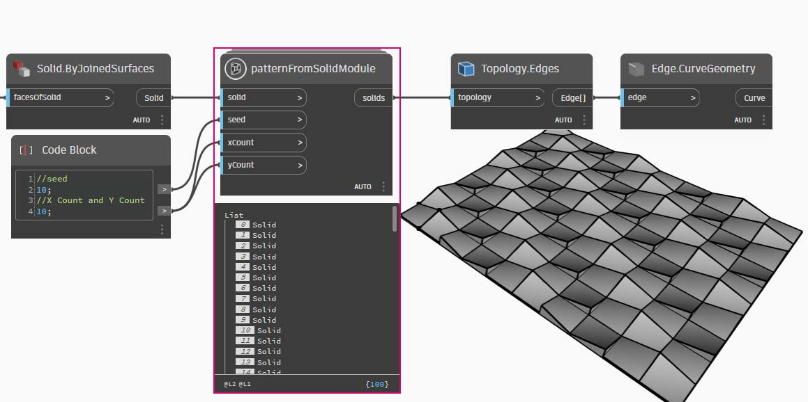

# Python 노드

Dynamo의 시각적 프로그래밍 환경에서 텍스트 프로그래밍을 사용하는 이유는 무엇입니까? [시각적 프로그래밍](../../a\_appendix/visual-programming-and-dynamo.md)에는 많은 장점이 있습니다. 직관적인 시각적 인터페이스에서 특수 구문을 학습하지 않고도 프로그램을 작성할 수 있습니다. 그러나 시각적 프로그램은 다소 복잡해 보일 수 있으며, 경우에 따라 기능이 부족할 수 있습니다. 예를 들어, Python에서는 조건문(if/then)을 작성하고 순환하기 위한 보다 효율적인 메서드를 제공합니다. Python은 Dynamo의 기능을 확장하고 여러 노드를 간단한 몇 개의 코드 줄로 바꿀 수 있게 해주는 강력한 도구입니다.

**시각적 프로그램:**


**텍스트 프로그램:**

```py
import clr
clr.AddReference('ProtoGeometry')
from Autodesk.DesignScript.Geometry import *

solid = IN[0]
seed = IN[1]
xCount = IN[2]
yCount = IN[3]

solids = []

yDist = solid.BoundingBox.MaxPoint.Y-solid.BoundingBox.MinPoint.Y
xDist = solid.BoundingBox.MaxPoint.X-solid.BoundingBox.MinPoint.X

for i in xRange:
	for j in yRange:
		fromCoord = solid.ContextCoordinateSystem
		toCoord = fromCoord.Rotate(solid.ContextCoordinateSystem.Origin,Vector.ByCoordinates(0,0,1),(90*(i+j%val)))
		vec = Vector.ByCoordinates((xDist*i),(yDist*j),0)
		toCoord = toCoord.Translate(vec)
		solids.append(solid.Transform(fromCoord,toCoord))

OUT = solids
```

### Python 노드

code block과 마찬가지로 Python 노드는 시각적 프로그래밍 환경 내의 스크립팅 인터페이스입니다. Python 노드는 라이브러리의 스크립트>편집기>Python 스크립트에서 찾을 수 있습니다.


노드를 두 번 클릭하면 Python 스크립트 편집기가 열립니다. 노드를 마우스 오른쪽 버튼으로 클릭하고 _편집..._ 을 선택할 수도 있습니다. 상단에 상용구가 몇 가지 있습니다. 이 텍스트는 필요한 라이브러리를 참조하는 데 유용합니다. 입력 내용은 IN 배열에 저장됩니다. 값을 OUT 변수에 지정하면 Dynamo로 반환됩니다.


Autodesk.DesignScript.Geometry 라이브러리를 사용하면 Code Block과 유사한 점 표기법을 사용할 수 있습니다. Dynamo 구문에 대한 자세한 내용은 [7-2_design-script-syntax.md](../../coding-in-dynamo/7\_code-blocks-and-design-script/7-2\_design-script-syntax.md "mention")뿐만 아니라 [DesignScript 안내서](https://dynamobim.org/wp-content/links/DesignScriptGuide.pdf)를 참조하십시오. 이 PDF 문서를 다운로드하려면 링크를 마우스 오른쪽 버튼으로 클릭하고 "다른 이름으로 링크 저장..."을 선택하십시오. ‘점’과 같은 형상 유형을 입력하면 점을 작성하고 조회하기 위한 메서드 리스트가 표시됩니다.


> 메서드로는 _ByCoordinates_ 와 같은 구성자, _Add_ 와 같은 동작, _X_, _Y_ 및 _Z_ 좌표와 같은 조회 등이 있습니다.

## 연습: 솔리드 모듈에서 패턴을 작성하기 위한 Python 스크립트가 있는 사용자 노드

### I부: Python 스크립트 설정

> 아래 링크를 클릭하여 예제 파일을 다운로드하십시오.
>
> 전체 예시 파일 리스트는 부록에서 확인할 수 있습니다.



이 예에서는 솔리드 모듈에서 패턴을 작성하는 Python 스크립트를 작성한 후, 사용자 노드로 변환하겠습니다. 먼저, Dynamo 노드를 사용하여 솔리드 모듈을 작성해 보겠습니다.


> 1. **Rectangle.ByWidthLength:** 솔리드의 기반이 될 직사각형을 작성합니다.
> 2. **Surface.ByPatch:** 직사각형을 ‘_closedCurve_’ 입력에 연결하여 하단 표면을 작성합니다.


> 1. **Geometry.Translate:** code block을 사용해 솔리드의 베이스 두께를 지정하고 직사각형을 ‘_geometry_’ 입력에 연결하여 위로 이동합니다.
> 2. **Polygon.Points:** 변환된 직사각형을 조회하여 코너 점을 추출합니다.
> 3. **Geometry.Translate:** code block을 사용하여 4개의 점에 해당하는 4개의 값 리스트를 작성하고 솔리드의 한쪽 코너를 위로 변환합니다.
> 4. **Polygon.ByPoints:** 변환된 점을 사용하여 상단 사각형을 다시 구성합니다.
> 5. **Surface.ByPatch:** 다각형을 연결하여 상단 표면을 작성합니다.

상단 표면과 하단 표면이 생겼으므로 두 프로파일 간을 로프트하여 솔리드의 측면을 작성해 보겠습니다.


> 1. **List.Create:** 하단 직사각형 및 상단 다각형을 색인 입력에 연결합니다.
> 2. **Surface.ByLoft:** 두 프로파일을 로프트하여 솔리드의 측면을 작성합니다.
> 3. **List.Create:** 상단, 측면, 하단 표면을 색인 입력에 연결하여 표면 리스트를 작성합니다.
> 4. **Solid.ByJoinedSurfaces:** 표면을 결합하여 솔리드 모듈을 작성합니다.

솔리드가 생겼으므로 Python 스크립트 노드를 작업공간에 배치해 보겠습니다.


> 1. 노드에 입력을 추가하려면 노드에서 + 아이콘을 클릭합니다. 입력은 리스트의 항목임을 나타낼 수 있도록 IN[0], IN[1] 등으로 이름이 지정됩니다.

먼저 입력과 출력을 정의해 보겠습니다. 노드를 두 번 클릭하여 Python 편집기를 엽니다. 아래 코드에 따라 편집기에서 코드를 수정합니다.


```py
# Load the Python Standard and DesignScript Libraries
import sys
import clr
clr.AddReference('ProtoGeometry')
from Autodesk.DesignScript.Geometry import *

# The inputs to this node will be stored as a list in the IN variables.
#The solid module to be arrayed
solid = IN[0]

#A Number that determines which rotation pattern to use
seed = IN[1]

#The number of solids to array in the X and Y axes
xCount = IN[2]
yCount = IN[3]

#Create an empty list for the arrayed solids
solids = []

# Place your code below this line


# Assign your output to the OUT variable.
OUT = solids
```

이 코드는 연습을 진행하는 동안 좀 더 적절하게 수정됩니다. 다음으로, 솔리드 모듈을 배열하기 위해 필요한 정보를 고려해야 합니다. 먼저, 변환 거리를 결정하기 위해 솔리드의 치수를 알아야 합니다. 경계 상자 버그 때문에 모서리 곡선 형상을 사용하여 경계 상자를 작성해야 합니다.


> Dynamo의 Python 노드를 살펴봅니다. Dynamo의 노드 제목에 표시되는 것과 동일한 구문을 사용하고 있습니다. 아래에서 주석 처리된 코드를 확인하십시오.

```py
# Load the Python Standard and DesignScript Libraries
import sys
import clr
clr.AddReference('ProtoGeometry')
from Autodesk.DesignScript.Geometry import *

# The inputs to this node will be stored as a list in the IN variables.
#The solid module to be arrayed
solid = IN[0]

#A Number that determines which rotation pattern to use
seed = IN[1]

#The number of solids to array in the X and Y axes
xCount = IN[2]
yCount = IN[3]

#Create an empty list for the arrayed solids
solids = []
#Create an empty list for the edge curves
crvs = []

# Place your code below this line
#Loop through edges an append corresponding curve geometry to the list
for edge in solid.Edges:
    crvs.append(edge.CurveGeometry)

#Get the bounding box of the curves
bbox = BoundingBox.ByGeometry(crvs)

#Get the x and y translation distance based on the bounding box
yDist = bbox.MaxPoint.Y-bbox.MinPoint.Y
xDist = bbox.MaxPoint.X-bbox.MinPoint.X

# Assign your output to the OUT variable.
OUT = solids
```

솔리드 모듈을 변환 및 회전하는 작업을 둘 다 수행할 예정이므로 Geometry.Transform 작업을 사용해 보겠습니다. Geometry.Transform 노드를 보면 솔리드를 변환하기 위해 소스 좌표계와 대상 좌표계가 필요하다는 사실을 알게 됩니다. 소스는 솔리드의 컨텍스트 좌표계인 한편, 대상은 배열된 각 모듈의 다른 좌표계가 됩니다. 즉, 매번 좌표계를 다르게 변환하려면 x 및 y 값으로 순환해야 합니다.


``` py
# Load the Python Standard and DesignScript Libraries
import sys
import clr
clr.AddReference('ProtoGeometry')
from Autodesk.DesignScript.Geometry import *

# The inputs to this node will be stored as a list in the IN variables.
#The solid module to be arrayed
solid = IN[0]

#A Number that determines which rotation pattern to use
seed = IN[1]

#The number of solids to array in the X and Y axes
xCount = IN[2]
yCount = IN[3]

#Create an empty list for the arrayed solids
solids = []
#Create an empty list for the edge curves
crvs = []

# Place your code below this line
#Loop through edges an append corresponding curve geometry to the list
for edge in solid.Edges:
    crvs.append(edge.CurveGeometry)

#Get the bounding box of the curves
bbox = BoundingBox.ByGeometry(crvs)

#Get the x and y translation distance based on the bounding box
yDist = bbox.MaxPoint.Y-bbox.MinPoint.Y
xDist = bbox.MaxPoint.X-bbox.MinPoint.X

#Get the source coordinate system
fromCoord = solid.ContextCoordinateSystem

#Loop through x and y
for i in range(xCount):
    for j in range(yCount):
        #Rotate and translate the coordinate system
        toCoord = fromCoord.Rotate(solid.ContextCoordinateSystem.Origin, Vector.ByCoordinates(0,0,1), (90*(i+j%seed)))
        vec = Vector.ByCoordinates((xDist*i),(yDist*j),0)
        toCoord = toCoord.Translate(vec)
        #Transform the solid from the source coord syste, to the target coord system and append to the list
        solids.append(solid.Transform(fromCoord,toCoord))

# Assign your output to the OUT variable.
OUT = solids
```

실행을 클릭한 다음, 코드를 저장합니다. 다음과 같이 Python 노드를 기존 스크립트와 연결합니다.


> 1. Python 노드의 첫 번째 입력으로 **Solid.ByJoinedSurfaces**의 출력을 연결하고 Code Block을 사용하여 다른 입력을 정의합니다.
> 2. **Topology.Edges** 노드를 작성하고 Python 노드의 출력을 입력으로 사용합니다.
> 3. 마지막으로 **Edge.CurveGeometry** 노드를 작성하고 Topology.Edges의 출력을 입력으로 사용합니다.

시드 값을 변경하여 다른 패턴을 작성해 보십시오. 다양한 효과를 위해 솔리드 모듈 자체의 매개변수를 변경할 수도 있습니다.


### 2부: Python 스크립트 노드를 사용자 노드로 전환

유용한 Python 스크립트를 작성했으므로 이를 사용자 노드로 저장해 보겠습니다. Python 스크립트 노드를 선택하고 작업공간을 마우스 오른쪽 버튼으로 클릭한 다음, '사용자 노드 작성'을 선택합니다.


이름, 설명 및 카테고리를 지정합니다.


그러면 사용자 노드를 편집할 새 작업공간이 열립니다.


> 1. **Inputs:** 입력 이름을 좀 더 알아보기 쉽게 변경하고 데이터 유형 및 기본값을 추가합니다.
> 2. **Output:** 출력 이름 변경

노드를 .dyf 파일로 저장하면 방금 변경한 사항이 사용자 노드에 반영되는 것을 확인할 수 있습니다.


