# Python と Revit

### Python と Revit

前のセクションでは、Dynamo で Python スクリプトを使用する方法について説明しました。このセクションでは、スクリプティング環境に Revit ライブラリを接続する方法を見てみましょう。ここまでの手順で、次のコード ブロックの最初の 4 行を使用して、Python 標準ライブラリと Dynamo の Core ノードが既に読み込まれています。数行のコードを追加するだけで、Revit の各種のノード、要素、ドキュメント マネージャを読み込むことができます。

``` py
import sys
import clr
clr.AddReference('ProtoGeometry')
from Autodesk.DesignScript.Geometry import *

# Import RevitNodes
clr.AddReference("RevitNodes")
import Revit

# Import Revit elements
from Revit.Elements import *

# Import DocumentManager
clr.AddReference("RevitServices")
import RevitServices
from RevitServices.Persistence import DocumentManager

import System
```

これにより、Revit API にアクセスし、任意の Revit タスクでカスタム スクリプトを使用できるようになります。ビジュアル プログラミングのプロセスと Revit API スクリプトを組み合わせることにより、コラボレーションやツールの開発が容易になります。たとえば、BIM マネージャと回路設計者が、同じグラフを使用して同時に作業することができます。こうしたコラボレーションにより、モデルの設計と施工を改善できます。

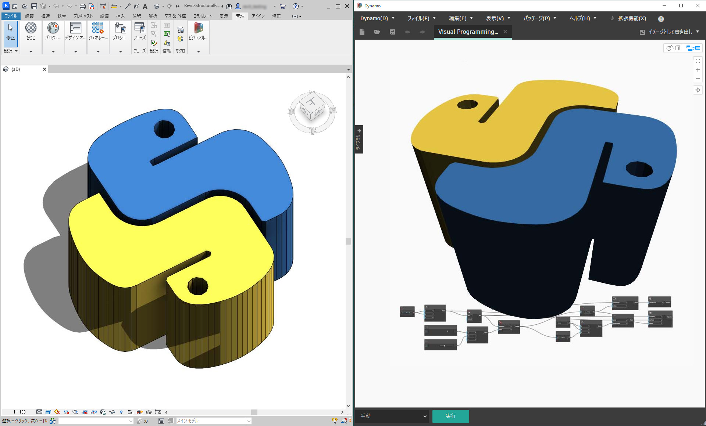

### プラットフォーム固有の API

Dynamo プロジェクトの背景には、プラットフォーム実装のスコープを拡大するという計画があります。そのため、Dynamo には新しいプログラムが追加されていく予定になっています。ユーザは、Python スクリプティング環境からプラットフォーム固有の API にアクセスできるようになります。このセクションでは Revit を扱いますが、今後は章の数を増やして、別のプラットフォーム上でのスクリプト作成に関する説明を追加する予定です。また、さまざまな [IronPython](http://ironpython.net) ライブラリにアクセスして Dynamo に読み込むことができるようになりました。

次の例では、Dynamo で Python を使用して、Revit 固有の操作を実行する方法について説明します。Python と Dynamo および Revit との関係の詳細については、[Dynamo の Wiki ページ](https://github.com/DynamoDS/Dynamo/wiki/Python-0.6.3-to-0.7.x-Migration)を参照してください。Python と Revit のもう 1 つの便利なリソースは、[Revit Python Shell](https://github.com/architecture-building-systems/revitpythonshell) プロジェクトです。

## 演習 1

> 新しい Revit プロジェクトを作成します。
>
> 下のリンクをクリックして、サンプル ファイルをダウンロードします。
>
> すべてのサンプルファイルの一覧については、付録を参照してください。



これ以降の一連の演習では、Dynamo for Revit における基本的な Python スクリプトについて説明します。この演習では、Revit のファイルと要素を使用します。また、Revit と Dynamo 間の通信についても説明します。

ここでは、Dynamo セッションにリンクされた Revit ファイルの _doc_、_uiapp_、_app_ を取得するための一般的な方法について説明します。Revit API を使用したことのある方ならば、Watch リストのような項目を見たことがあるかもしれません。これらの項目を見たことがなくても、特に問題はありません。これ以降の演習で、別の例を使用して説明します。

RevitServices を読み込み、Dynamo のドキュメント データを取得するには、次のようなスクリプトを記述します。

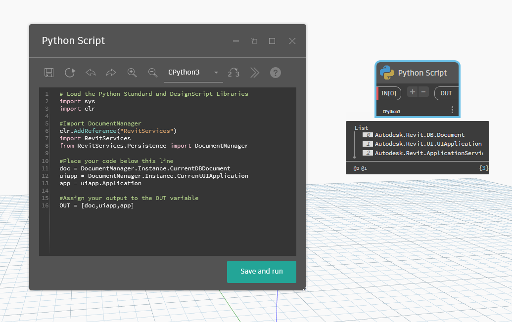

ここで、Dynamo の Python Script ノードを確認します。次のコードを参照することもできます。

``` py
# Load the Python Standard and DesignScript Libraries
import sys
import clr

#Import DocumentManager
clr.AddReference("RevitServices")
import RevitServices
from RevitServices.Persistence import DocumentManager

#Place your code below this line
doc = DocumentManager.Instance.CurrentDBDocument
uiapp = DocumentManager.Instance.CurrentUIApplication
app = uiapp.Application

#Assign your output to the OUT variable
OUT = [doc,uiapp,app]
```

## 演習 2

> 下のリンクをクリックして、サンプル ファイルをダウンロードします。
>
> すべてのサンプルファイルの一覧については、付録を参照してください。



この演習では、Dynamo の Python Script ノードを使用して、Revit 内に単純なモデル曲線を作成します。

最初に、Revit 内に新しいコンセプト マス ファミリを作成します。

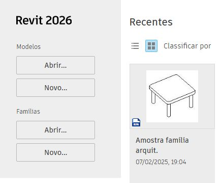

_コンセプト マス フォルダ_ を開き、_Metric Mass.rft_ テンプレート ファイルを使用します。

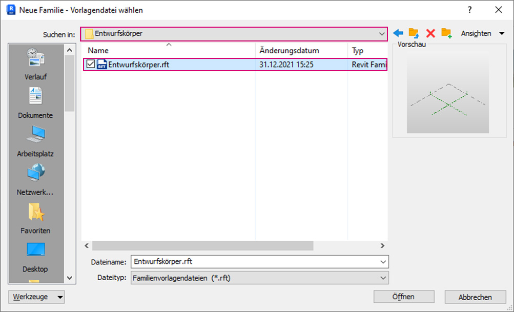

Revit で、キーボード ショートカット **`un`** を使用してプロジェクトの単位の設定を表示し、長さの単位をメートルに変更します。

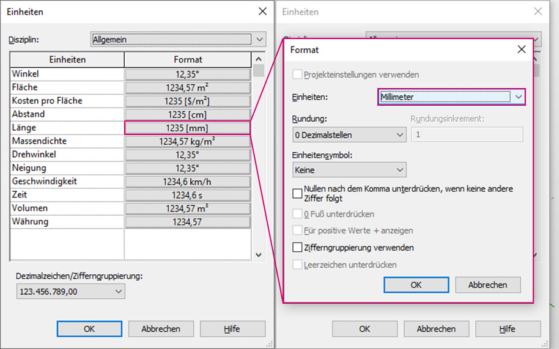

Dynamo を起動し、下図に示す一連のノードを作成します。次に、Dynamo のノードを使用して、Revit 内に 2 つの参照点を作成します。

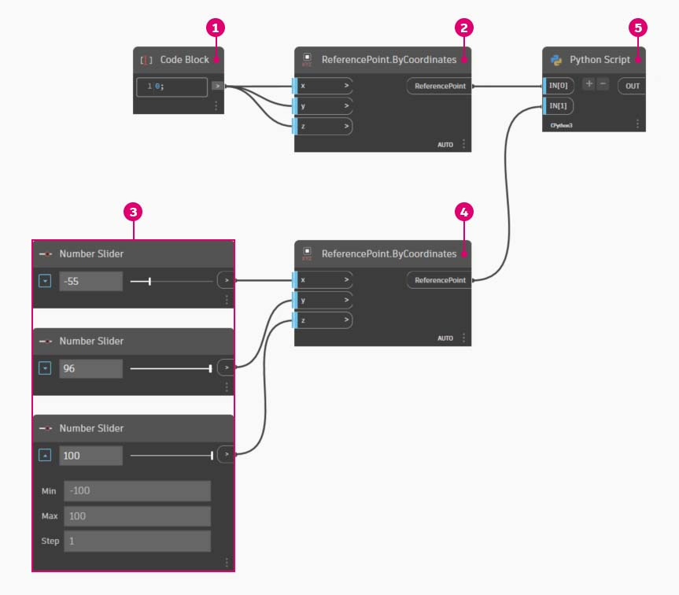

> 1. **Code Block** ノードを作成し、`"0;"` の値を設定します。
> 2. この値を、**ReferencePoint.ByCoordinates** ノードの X、Y、Z 入力に接続します。
> 3. -100 ～ 100 の範囲内で、ステップ値が 1 の Number Slider ノードを 3 つ作成します。
> 4. 各スライダを **ReferencePoint.ByCoordinates** ノードに接続します。
> 5. **Python Script** ノードをワークスペースに追加し、このノードの[+]ボタンをクリックして入力をもう 1 つ追加し、各入力に参照点を接続します。**Python Script** ノードを開きます。

ここで、Dynamo の Python Script ノードを確認します。下の完全なコードを見つけます。

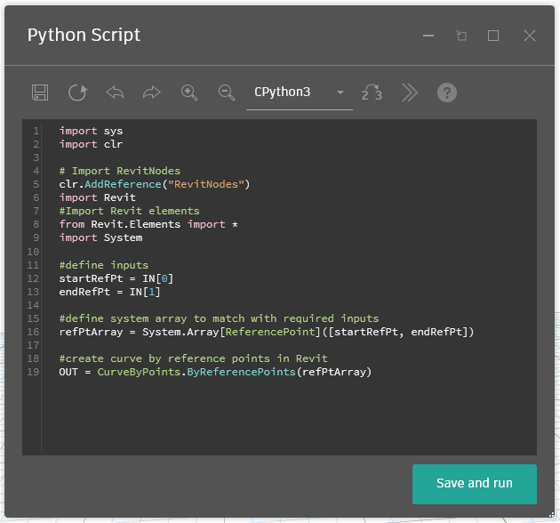

> 1. **System Array:** Revit の入力には、Python リストではなく **System.Array** が必要です。これは 1 行のコードに過ぎませんが、引数のタイプに注意すると、Revit での Python プログラミングが容易になります。

``` py
import sys
import clr

# Import RevitNodes
clr.AddReference("RevitNodes")
import Revit
#Import Revit elements
from Revit.Elements import *
import System

#define inputs
startRefPt = IN[0]
endRefPt = IN[1]

#define system array to match with required inputs
refPtArray = System.Array[ReferencePoint]([startRefPt, endRefPt])

#create curve by reference points in Revit
OUT = CurveByPoints.ByReferencePoints(refPtArray)
```

ここまでの手順では、Dynamo で Python を使用して、線分で接続された 2 つの参照点を作成しました。次の演習で、さらに操作を進めてみましょう。

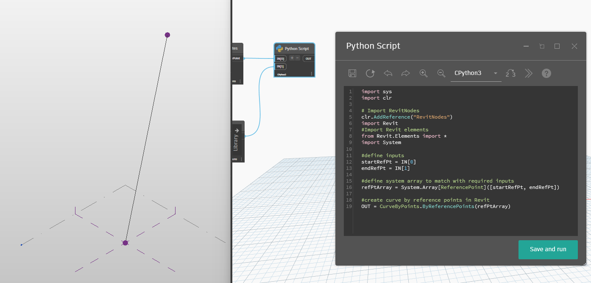

## 演習 3

> 下のリンクをクリックして、サンプル ファイルをダウンロードします。
>
> すべてのサンプルファイルの一覧については、付録を参照してください。



この演習では、簡単な操作を実行することにより、Revit と Dynamo 間で相互にデータやジオメトリを接続する場合の要点について説明します。最初に Revit-StructuralFraming.rvt を開き、次に Dynamo を起動して、Revit-StructuralFraming.dyn ファイルを開きます。


この Revit ファイルは、基本的なファイルです。レベル 1 とレベル 2 にそれぞれ 1 本ずつ、2 本の異なる参照曲線が描画されています。これらの曲線を Dynamo に読み込み、ライブ リンクを作成します。

このファイルでは、Python Script ノードの 5 つの入力に一連のノードが接続されています。

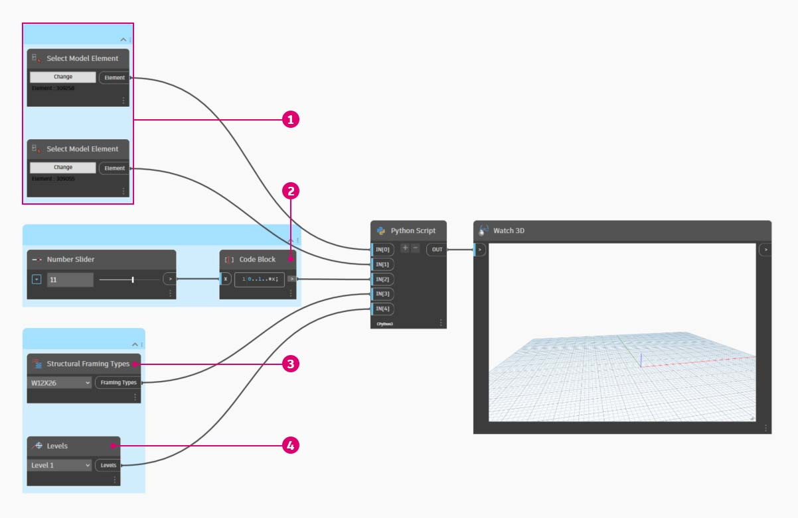

> 1. 各 **Select Model Element** ノードの[選択]ボタンをクリックし、Revit 内の対応する曲線を選択します。
> 2. **Code Block** ノードで「`0..1..#x;`」_という構文を使用して、_ 0 ～ 20 までの範囲を持つ Integer Slider ノードを _x_ 入力に接続します。この操作により、2 本の曲線の間に作成する梁の数を指定します。
> 3. **Structural Framing Types** ノードのドロップダウン メニューで、既定の W12x26 梁を選択します。
> 4. **Levels** ノードで、「Level 1」を選択します。

この Python コードは、これまでのコードよりも行数が多くなっていますが、コード行の前後のコメントを参照すると、プロセス内の処理内容を確認できます。

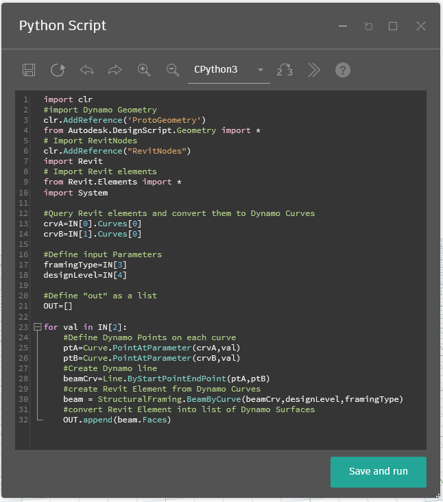

``` py
import clr
#import Dynamo Geometry
clr.AddReference('ProtoGeometry')
from Autodesk.DesignScript.Geometry import *
# Import RevitNodes
clr.AddReference("RevitNodes")
import Revit
# Import Revit elements
from Revit.Elements import *
import System

#Query Revit elements and convert them to Dynamo Curves
crvA=IN[0].Curves[0]
crvB=IN[1].Curves[0]

#Define input Parameters
framingType=IN[3]
designLevel=IN[4]

#Define "out" as a list
OUT=[]

for val in IN[2]:
	#Define Dynamo Points on each curve
	ptA=Curve.PointAtParameter(crvA,val)
	ptB=Curve.PointAtParameter(crvB,val)
	#Create Dynamo line
	beamCrv=Line.ByStartPointEndPoint(ptA,ptB)
	#create Revit Element from Dynamo Curves
	beam = StructuralFraming.BeamByCurve(beamCrv,designLevel,framingType)
	#convert Revit Element into list of Dynamo Surfaces
	OUT.append(beam.Faces)
```

Revit で、2 つの曲線にわたる梁の配列が構造要素として作成されました。注: この構造要素は、Dynamo でネイティブの Revit インスタンスを作成する場合の例として使用しているもので、実際にはあり得ない構造要素であることに注意してください。

Dynamo でも、結果を確認できます。**Watch3D** ノードの梁は、Revit 要素からクエリーされたジオメトリを参照します。

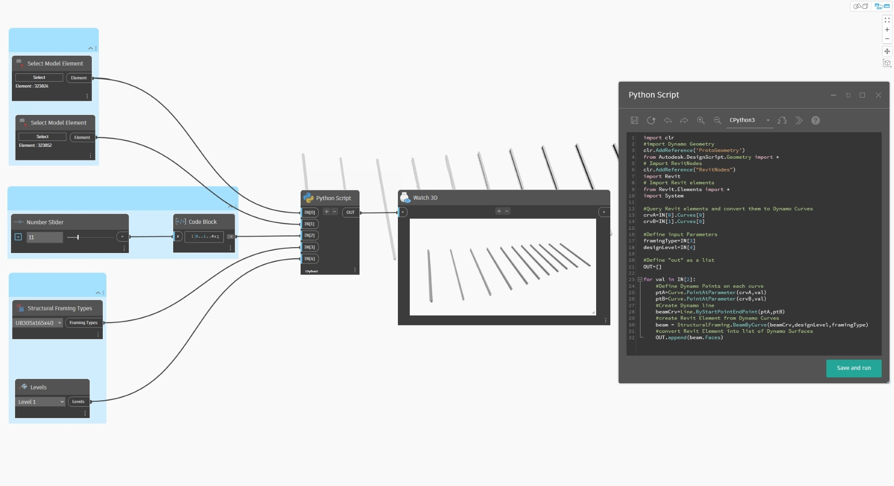

このセクションでは、Revit 環境から Dynamo 環境にデータを変換する一連のプロセスを作成しました。このプロセスをまとめると、次のようになります。

1. Revit の要素を選択する
2. Revit の要素を Dynamo の曲線に変換する
3. Dynamo の曲線を一連の Dynamo の点に分割する
4. Dynamo の 2 つの曲線間の点を使用して Dynamo の線分を作成する
5. Dynamo の線分を参照することにより、Revit の梁を作成する
6. Revit の梁のジオメトリに対してクエリーを実行することにより、Dynamo のサーフェスを出力する

これは複雑なプロセスに見えるかもしれませんが、スクリプトを使用すると、Revit で曲線を編集してソルバを再実行するのと変わらないほど単純な処理になります(ただし、そのためには、元の梁を削除する必要があります)。_これは、Python で梁を配置することによって、初期設定のままのノードにある関連付けが解除されるためです。_

Revit で参照曲線を更新すると、梁の新しい配列が作成されます。

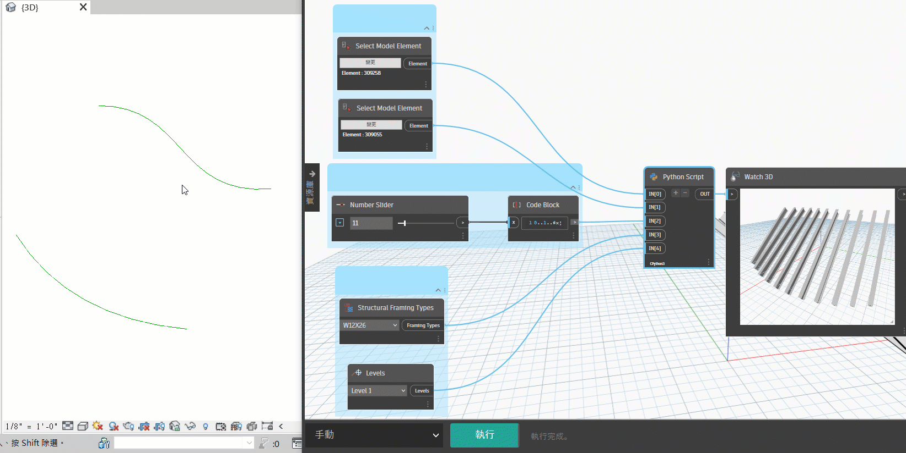
