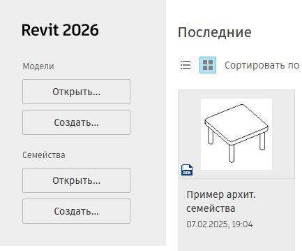
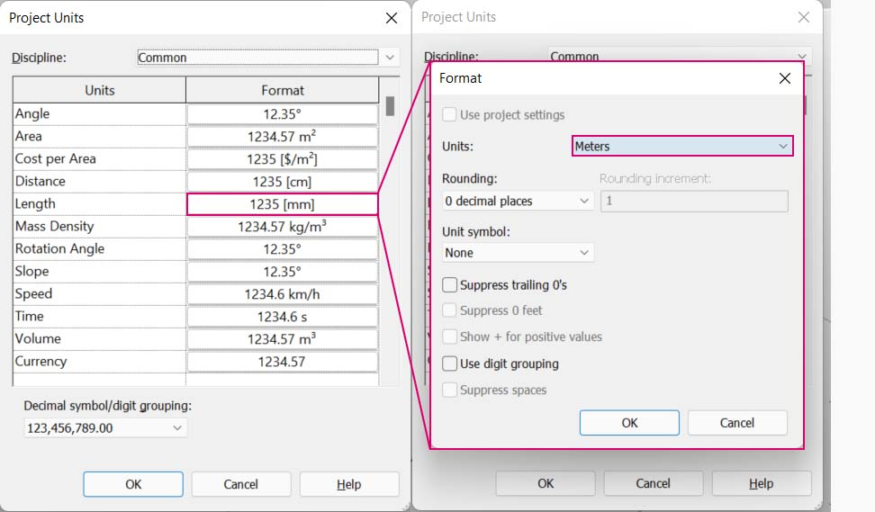

# Python и Revit

### Python и Revit

В предыдущем разделе был приведен пример использования сценариев Python в Dynamo. Теперь рассмотрим подключение библиотек Revit в среде сценариев. Как вы помните, мы импортировали стандартную библиотеку Python и базовые узлы Dynamo с помощью первых четырех строк в блоке кода, представленном ниже. Для импорта узлов Revit, элементов Revit и диспетчера документов Revit необходимо добавить еще несколько строк:

``` py
import sys
import clr
clr.AddReference('ProtoGeometry')
from Autodesk.DesignScript.Geometry import *

# Import RevitNodes
clr.AddReference("RevitNodes")
import Revit

# Import Revit elements
from Revit.Elements import *

# Import DocumentManager
clr.AddReference("RevitServices")
import RevitServices
from RevitServices.Persistence import DocumentManager

import System
```

Это обеспечит доступ к API Revit и позволит создавать пользовательские сценарии для любых задач Revit. Благодаря объединению процесса визуального программирования с написанием сценариев в API Revit возможности совместной работы и разработки инструментов значительно увеличиваются. Например, специалист по BIM и проектировщик схем могут совместно работать над одним и тем же графиком. В результате эффективность проектирования и реализации модели повысится.


### API для конкретных платформ

В основе проекта Dynamo лежит план по расширению масштабов внедрения платформ. По мере добавления в Dynamo поддержки новых программ пользователи получают доступ к API-интерфейсам для конкретных платформ из среды создания сценариев Python. Данный раздел посвящен работе с Revit, однако в будущем можно ожидать появления новых разделов, содержащих учебные пособия по созданию сценариев для других платформ. Кроме того, в данный момент доступно множество библиотек [IronPython](http://ironpython.net), которые можно импортировать в Dynamo.

В приведенных ниже примерах иллюстрируются способы выполнения операций Revit из модуля Dynamo с использованием языка программирования Python. Дополнительные сведения об особенностях использования Python в Dynamo и Revit см. на [странице Wiki, посвященной Dynamo](https://github.com/DynamoDS/Dynamo/wiki/Python-0.6.3-to-0.7.x-Migration). Еще один полезный ресурс по Python и Revit — проект [Revit Python Shell](https://github.com/architecture-building-systems/revitpythonshell).

## Упражнение 1

> Создайте новый проект Revit.
>
> Скачайте файл примера, щелкнув указанную ниже ссылку.
>
> Полный список файлов примеров можно найти в приложении.



В этих упражнениях рассматриваются простейшие сценарии Python, которые можно использовать в модуле Dynamo для Revit. Данное упражнение посвящено работе с файлами и элементами Revit, а также взаимодействию между Revit и Dynamo.

Рассмотрим стандартный способ извлечения элементов _doc_, _uiapp_ и _app_ из файла Revit, связанного с сеансом Dynamo. Программистам, которые уже работали с API Revit, могут быть знакомы элементы в списке отслеживания. Однако даже если эти элементы встречаются в первый раз, в последующих упражнениях будут и другие примеры.

Ниже описывается процедура импорта служб Revit и извлечения данных документа в Dynamo.


Посмотрите, как выглядит узел Python в Dynamo. Код также можно найти ниже.

``` py
# Load the Python Standard and DesignScript Libraries
import sys
import clr

#Import DocumentManager
clr.AddReference("RevitServices")
import RevitServices
from RevitServices.Persistence import DocumentManager

#Place your code below this line
doc = DocumentManager.Instance.CurrentDBDocument
uiapp = DocumentManager.Instance.CurrentUIApplication
app = uiapp.Application

#Assign your output to the OUT variable
OUT = [doc,uiapp,app]
```

## Упражнение 2

> Скачайте файл примера, щелкнув указанную ниже ссылку.
>
> Полный список файлов примеров можно найти в приложении.



В этом упражнении будет создана простая кривая модели в Revit с помощью узла Python в Dynamo.

Для начала добавьте в Revit новое семейство концептуальных формообразующих элементов.



Откройте _папку Conceptual Mass_ и используйте файл шаблона _Metric Mass.rft_.


В Revit используйте комбинацию клавиш **`un`**, чтобы вызвать окно параметров«Единицы проекта», и измените единицы измерения длины на метры.



Запустите Dynamo и сформируйте набор узлов, как показано на изображении ниже. Сначала создайте две опорные точки в Revit с помощью узлов Dynamo.


> 1. Создайте узел **Code Block** и присвойте ему значение `"0;"`.
> 2. Соедините это значение с портами ввода X, Y и Z узла **ReferencePoint.ByCoordinates**.
> 3. Создайте три регулятора в диапазоне от –100 до 100 с шагом 1.
> 4. Соедините каждый из регуляторов с узлом **ReferencePoint.ByCoordinates**.
> 5. Добавьте в рабочее пространство узел **Python**, нажмите кнопку «+» в узле, чтобы добавить еще один порт ввода, и соедините опорные точки с портами ввода. Откройте узел **Python**.

Посмотрите, как выглядит узел Python в Dynamo. Полный код см. ниже.


> 1. **System.Array**. Приложению Revit в качестве входного параметра требуется **системный массив** (а не список Python). Для этого необходима лишь еще одна строка кода, но следует уделить особое внимание типам аргументов, чтобы упростить программирование на языке Python в Revit.

``` py
import sys
import clr

# Import RevitNodes
clr.AddReference("RevitNodes")
import Revit
#Import Revit elements
from Revit.Elements import *
import System

#define inputs
startRefPt = IN[0]
endRefPt = IN[1]

#define system array to match with required inputs
refPtArray = System.Array[ReferencePoint]([startRefPt, endRefPt])

#create curve by reference points in Revit
OUT = CurveByPoints.ByReferencePoints(refPtArray)
```

В Dynamo с помощью Python мы создали две опорные точки, соединенные линией. Продолжим работу с этим примером в следующем упражнении.


## Упражнение 3

> Скачайте файл примера, щелкнув указанную ниже ссылку.
>
> Полный список файлов примеров можно найти в приложении.



Это упражнение довольно несложное, однако оно хорошо иллюстрирует процесс обмена данными и геометрией между Revit и Dynamo. Сначала откройте файл Revit-StructuralFraming.rvt. Затем запустите Dynamo и откройте файл Revit-StructuralFraming.dyn.


Этот файл Revit содержит лишь самые базовые данные. Имеются две опорные кривые: одна на уровне 1, другая — на уровне 2. Эти кривые необходимо добавить в Dynamo, сохранив динамическую связь.

В файле имеется набор узлов, соединяемых с пятью портами ввода узла Python.


> 1. **Узлы Select Model Element**. Нажмите кнопку выбора в каждом узле и выберите соответствующую кривую в Revit.
> 2. **Code Block**. Используя синтаксис `0..1..#x;`_,_ соедините регулятор целых чисел от 0 до 20 с портом ввода _x_. Этот регулятор задает количество балок, которые будут построены между двумя кривыми.
> 3. **Structural Framing Types**. В раскрывающемся меню выберите балку по умолчанию (W12x26).
> 4. **Levels**. Выберите Level 1.

Этот код Python чуть более сложен, но весь процесс снабжен подробными комментариями.


``` py
import clr
#import Dynamo Geometry
clr.AddReference('ProtoGeometry')
from Autodesk.DesignScript.Geometry import *
# Import RevitNodes
clr.AddReference("RevitNodes")
import Revit
# Import Revit elements
from Revit.Elements import *
import System

#Query Revit elements and convert them to Dynamo Curves
crvA=IN[0].Curves[0]
crvB=IN[1].Curves[0]

#Define input Parameters
framingType=IN[3]
designLevel=IN[4]

#Define "out" as a list
OUT=[]

for val in IN[2]:
	#Define Dynamo Points on each curve
	ptA=Curve.PointAtParameter(crvA,val)
	ptB=Curve.PointAtParameter(crvB,val)
	#Create Dynamo line
	beamCrv=Line.ByStartPointEndPoint(ptA,ptB)
	#create Revit Element from Dynamo Curves
	beam = StructuralFraming.BeamByCurve(beamCrv,designLevel,framingType)
	#convert Revit Element into list of Dynamo Surfaces
	OUT.append(beam.Faces)
```

Итак, в Revit появился массив балок, расположенных между двумя кривыми и играющих роль несущих элементов. Примечание. Данный пример не вполне реалистичен. Несущие элементы используются всего лишь в качестве примера собственных экземпляров Revit, созданных в Dynamo.

Результаты также можно увидеть в Dynamo. Балки в узле **Watch3D** ссылаются на геометрию, запрошенную из элементов Revit.


Обратите внимание, что полученный процесс преобразования данных из среды Revit в среду Dynamo является непрерывным. Вкратце этот процесс происходит следующим образом:

1. Выбор элемента Revit.
2. Преобразование элемента Revit в кривую Dynamo.
3. Разделение кривой Dynamo на серию точек Dynamo.
4. Использование точек Dynamo между двумя кривыми для создания линий Dynamo.
5. Создание балок Revit на основе линий Dynamo.
6. Вывод поверхностей Dynamo путем запроса геометрии балок Revit.

Этот процесс может показаться довольно сложным, однако при использовании сценария достаточно отредактировать кривую в Revit и повторно запустить решатель (хотя при этом может потребоваться удалить ранее созданные балки). _Это связано с тем, что при размещении балок в Python связи стандартных узлов по умолчанию разрываются._

Обновив опорные кривые в Revit, мы получим новый массив балок.


