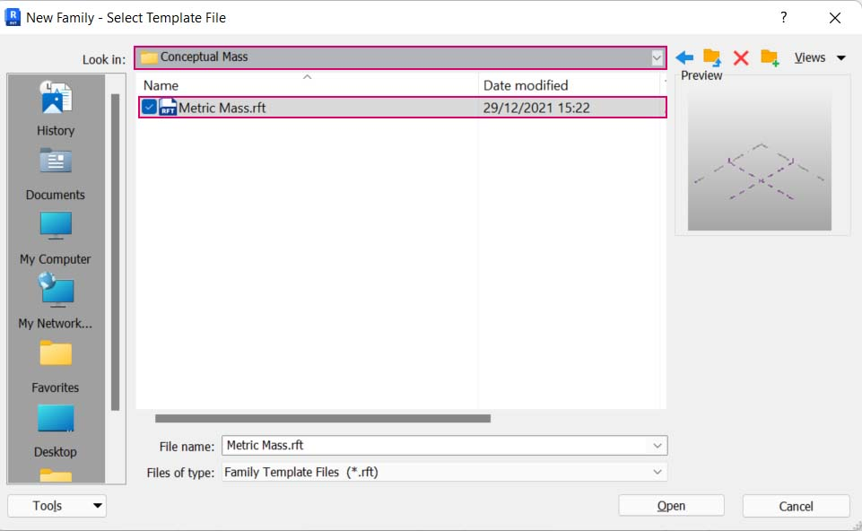
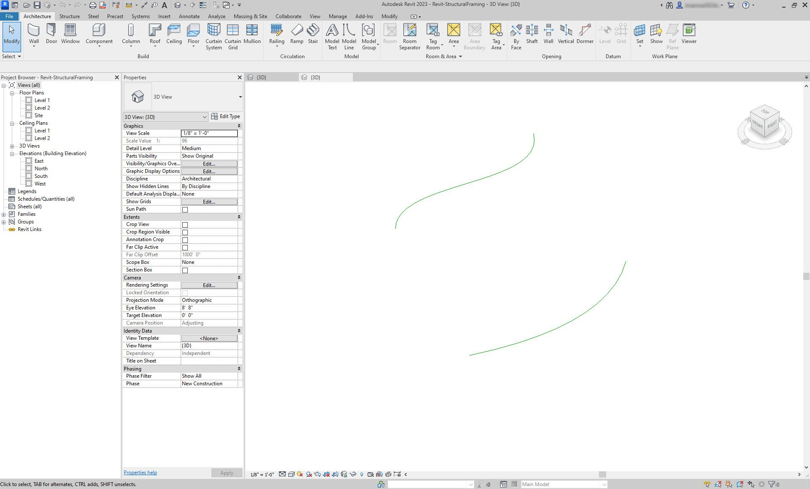
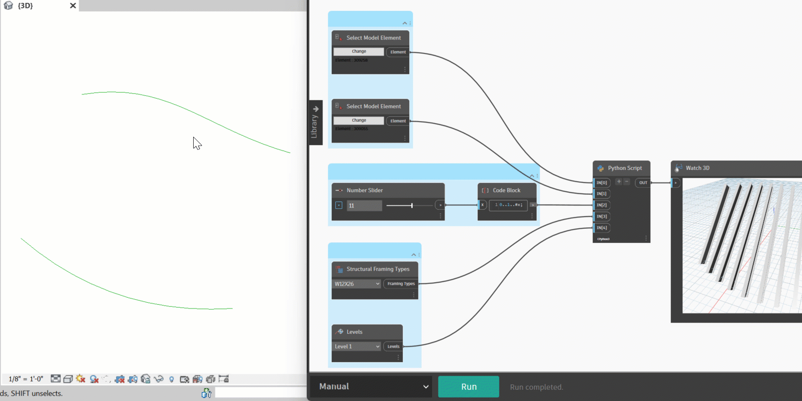

# Python 和 Revit

### Python 和 Revit

現在我們已經示範了如何在 Dynamo 中使用 Python 指令碼，接下來瞭解將 Revit 資源庫連接至指令碼撰寫環境。請記住，我們使用以下 Code Block 的前四行匯入了 Python 標準和 Dynamo 核心節點。若要匯入 Revit 節點、Revit 元素及 Revit 文件管理員，我們只需再加入幾行程式碼：

``` py
import sys
import clr
clr.AddReference('ProtoGeometry')
from Autodesk.DesignScript.Geometry import *

# Import RevitNodes
clr.AddReference("RevitNodes")
import Revit

# Import Revit elements
from Revit.Elements import *

# Import DocumentManager
clr.AddReference("RevitServices")
import RevitServices
from RevitServices.Persistence import DocumentManager

import System
```

這會提供 Revit API 的存取權，以及適用於 Revit 工作的自訂指令碼。透過合併視覺程式設計程序與 Revit API 指令碼，將大幅改進協同合作與工具開發。例如，BIM 管理員與線路圖設計者可以針對同一圖表進行合作。透過這種協同合作，他們可以改善模型的設計與執行。


### 平台特定 API

Dynamo 專案的潛在宗旨是拓寬平台的實作範圍。隨著 Dynamo 加入更多程式至事項表，使用者可以從 Python 指令碼撰寫環境存取平台特定 API。雖然在本節中只是對 Revit 進行案例研究，但我們可以預期在將來的更多章節中，會針對在其他平台撰寫指令碼提供全面的自學課程。此外，現在還可以存取許多 [IronPython](http://ironpython.net) 資源庫，您可以將這些資源庫匯入 Dynamo！

以下範例示範使用 Python 從 Dynamo 實作 Revit 特定作業的方式。若要更詳細地檢閱 Python 與 Dynamo 及 Revit 之間的關係，請參閱[Dynamo Wiki 頁面](https://github.com/DynamoDS/Dynamo/wiki/Python-0.6.3-to-0.7.x-Migration)。Python 與 Revit 的另一項有用資源是 [Revit Python Shell](https://github.com/architecture-building-systems/revitpythonshell) 專案。

## 練習 1

> 建立新的 Revit 專案。
>
> 按一下下方的連結下載範例檔案。
>
> 附錄中提供完整的範例檔案清單。



在以下練習中，我們將探索 Dynamo for Revit 中的基本 Python 指令碼。此練習重點是處理 Revit 檔案及元素，以及 Revit 與 Dynamo 之間的通訊。

這是對連結至 Dynamo 階段作業的 Revit 檔案擷取 _doc_、_uiapp_ 及 _app_ 的現成方法。先前使用 Revit API 的程式設計人員可能會注意到觀看清單中的項目。如果對這些項目不熟悉，沒有問題，我們會在以下練習中使用其他範例。

以下將講述在 Dynamo 中如何匯入 Revit 服務及擷取文件資料。


看一下 Dynamo 中的 Python 節點。您也可以從下方找到程式碼：

``` py
# Load the Python Standard and DesignScript Libraries
import sys
import clr

#Import DocumentManager
clr.AddReference("RevitServices")
import RevitServices
from RevitServices.Persistence import DocumentManager

#Place your code below this line
doc = DocumentManager.Instance.CurrentDBDocument
uiapp = DocumentManager.Instance.CurrentUIApplication
app = uiapp.Application

#Assign your output to the OUT variable
OUT = [doc,uiapp,app]
```

## 練習 2

> 按一下下方的連結下載範例檔案。
>
> 附錄中提供完整的範例檔案清單。



在本練習中，我們將在 Revit 內使用 Dynamo Python 節點建立簡單的模型曲線。

首先，在 Revit 中建立新的概念量體族群。


開啟 _「概念量體」資料夾_，然後使用 _公制量體.rft_ 樣板檔。



在 Revit 中，使用鍵盤快速鍵 **`un`** 帶出「專案單位」設定，將長度單位變更為公尺。


啟動 Dynamo，然後建立以下影像中的一組節點。我們先在 Revit 中從 Dynamo 節點建立兩個參考點。


> 1. 建立 **Code Block**，提供 `"0;"` 的值
> 2. 將此值插入 **ReferencePoint.ByCoordinates** 節點做為 X、Y 與 Z 輸入。
> 3. 建立三個滑棒，讓其範圍介於 -100 與 100 之間，且步長大小為 1。
> 4. 將每個滑棒連接至 **ReferencePoint.ByCoordinates** 節點。
> 5. 在工作區中加入 **Python** 節點，按一下節點上的「+」按鈕以加入另一個輸入，然後將兩個參考點插入每個輸入。開啟 **Python** 節點。

看一下 Dynamo 中的 Python 節點。在下方尋找完整的程式碼。


> 1. **System.Array：**Revit 需要一個**系統陣列**做為輸入 (而非 Python 清單)。這只是又一行程式碼，但注意引數類型將有助於在 Revit 中進行 Python 程式設計。

``` py
import sys
import clr

# Import RevitNodes
clr.AddReference("RevitNodes")
import Revit
#Import Revit elements
from Revit.Elements import *
import System

#define inputs
startRefPt = IN[0]
endRefPt = IN[1]

#define system array to match with required inputs
refPtArray = System.Array[ReferencePoint]([startRefPt, endRefPt])

#create curve by reference points in Revit
OUT = CurveByPoints.ByReferencePoints(refPtArray)
```

我們已在 Dynamo 中使用 Python 建立以直線連接的兩個參考點。接下來在下一個練習中更進一步。


## 練習 3

> 按一下下方的連結下載範例檔案。
>
> 附錄中提供完整的範例檔案清單。



此練習仍很簡單，但講述了在 Revit 與 Dynamo 之間連接資料與幾何圖形的主題。我們從開啟 Revit-StructuralFraming.rvt 開始。開啟後，啟動 Dynamo，並開啟檔案 Revit-StructuralFraming.dyn。



此 Revit 檔案是一個非常基本的檔案。兩條參考曲線：一條繪製在 Level 1 上，另一條繪製在 Level 2 上。我們要將這些曲線匯入 Dynamo 並保持即時連結。

在此檔案中，我們將一組節點插入 Python 節點的五個輸入。


> 1. **Select Model Element 節點：** 按一下每個節點的選取按鈕，然後選取 Revit 中的對應曲線。
> 2. **Code Block：** 使用語法 `0..1..#x;` _，_ 將介於 0 與 20 之間的整數滑棒連接至 _x_ 輸入。此作業會指定在兩條曲線之間繪製的樑數量。
> 3. **Structural Framing Types：** 在此我們將從下拉式功能表中選擇預設的 W12x26 樑。
> 4. **Levels：** 選取「Level 1」。

此 Python 程式碼稍多一些，但程式碼中的註解描述程序的狀況


``` py
import clr
#import Dynamo Geometry
clr.AddReference('ProtoGeometry')
from Autodesk.DesignScript.Geometry import *
# Import RevitNodes
clr.AddReference("RevitNodes")
import Revit
# Import Revit elements
from Revit.Elements import *
import System

#Query Revit elements and convert them to Dynamo Curves
crvA=IN[0].Curves[0]
crvB=IN[1].Curves[0]

#Define input Parameters
framingType=IN[3]
designLevel=IN[4]

#Define "out" as a list
OUT=[]

for val in IN[2]:
	#Define Dynamo Points on each curve
	ptA=Curve.PointAtParameter(crvA,val)
	ptB=Curve.PointAtParameter(crvB,val)
	#Create Dynamo line
	beamCrv=Line.ByStartPointEndPoint(ptA,ptB)
	#create Revit Element from Dynamo Curves
	beam = StructuralFraming.BeamByCurve(beamCrv,designLevel,framingType)
	#convert Revit Element into list of Dynamo Surfaces
	OUT.append(beam.Faces)
```

在 Revit 中，我們有一個跨越兩條曲線的樑陣列做為結構元素。注意：這不是真實範例...結構元素是用做從 Dynamo 所建立原生 Revit 例證的範例。

在 Dynamo 中也可以看到結果。**Watch3D** 節點中的樑是指從 Revit 元素查詢的幾何圖形。


請注意，我們有一套連續的程序，將資料從 Revit 環境轉換到 Dynamo 環境。總之，程序的工作方式如下：

1. 選取 Revit 元素
2. 將 Revit 元素轉換為 Dynamo 曲線
3. 將 Dynamo 曲線分割為一系列 Dynamo 點
4. 使用兩條曲線之間的 Dynamo 點建立 Dynamo 線
5. 透過參考 Dynamo 線建立 Revit 樑
6. 透過查詢 Revit 樑的幾何圖形，輸出 Dynamo 曲面

這聽上去可能有點笨拙，但指令碼可讓該作業非常簡單，只需在 Revit 中編輯曲線並重新執行解析器即可 (雖然在執行此作業時，您可能不得不刪除先前的樑)。_這是因為我們是以 Python 放置樑，因此破壞了 OOTB 節點所擁有的關聯。_

在 Revit 中更新參考曲線後，我們得到一個新的樑陣列。


