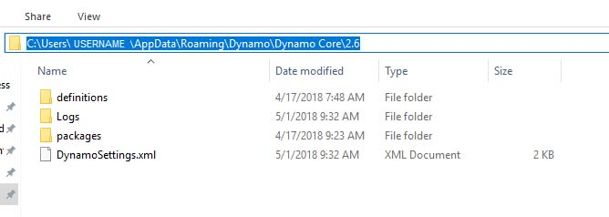
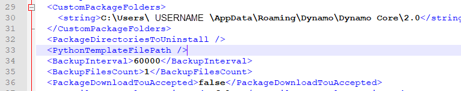

# Настройка собственного шаблона Python

В Dynamo 2.0 появилась возможность задавать шаблон по умолчанию `(.py extension)` для использования при первом открытии окна Python. Эта функция, о которой нас давно просили пользователи, значительно ускоряет процесс работы со сценариями Python в Dynamo. Благодаря возможности использовать шаблон программисты получают мгновенный доступ к данным, которые требуется импортировать по умолчанию и на основе которых они могут разрабатывать пользовательские сценарии Python.

Этот шаблон размещается в подпапке `APPDATA` папки установки Dynamo.

Обычно используется следующий путь: `( %appdata%\Dynamo\Dynamo Core\{version}\ )`.



### Настройка шаблона

Для использования этой функции необходимо добавить в файл `DynamoSettings.xml` следующую строку _(правки вносятся в Блокноте)_.



Найдите строку `<PythonTemplateFilePath />` и замените ее следующим кодом:

```
<PythonTemplateFilePath>
<string>C:\Users\CURRENTUSER\AppData\Roaming\Dynamo\Dynamo Core\2.0\PythonTemplate.py</string>
</PythonTemplateFilePath>
```

 
_Примечание. Замените CURRENTUSER на имя пользователя._ 


Теперь нужно создать шаблон, включающий функции для встраивания. В данном случае требуется встроить функции импорта определенных данных из Revit, а также некоторые другие функции, обычно используемые при работе с Revit.

Создайте документ в Блокноте и вставьте в него следующий код:

``` py
import clr

clr.AddReference('RevitAPI')
from Autodesk.Revit.DB import *
from Autodesk.Revit.DB.Structure import *

clr.AddReference('RevitAPIUI')
from Autodesk.Revit.UI import *

clr.AddReference('System')
from System.Collections.Generic import List

clr.AddReference('RevitNodes')
import Revit
clr.ImportExtensions(Revit.GeometryConversion)
clr.ImportExtensions(Revit.Elements)

clr.AddReference('RevitServices')
import RevitServices
from RevitServices.Persistence import DocumentManager
from RevitServices.Transactions import TransactionManager

doc = DocumentManager.Instance.CurrentDBDocument
uidoc=DocumentManager.Instance.CurrentUIApplication.ActiveUIDocument

#Preparing input from dynamo to revit
element = UnwrapElement(IN[0])

#Do some action in a Transaction
TransactionManager.Instance.EnsureInTransaction(doc)

TransactionManager.Instance.TransactionTaskDone()

OUT = element
```

Когда все будет готово, сохраните этот файл под именем `PythonTemplate.py` в папке `APPDATA`.

### Дальнейшее поведение сценария Python

После того как шаблон Python задан в приложении Dynamo, каждый раз при размещении узла Python будет выполняться поиск этого шаблона. Если шаблон не найден, отображается стандартное окно Python.


Если шаблон Python найден (как в случае с созданным шаблоном для работы с Revit), отображаются встроенные в него функции по умолчанию.


Подробные сведения об этом дополнении см. в следующем материале (автор: Раду Гидей [Radu Gidei]): https://github.com/DynamoDS/Dynamo/pull/8122
