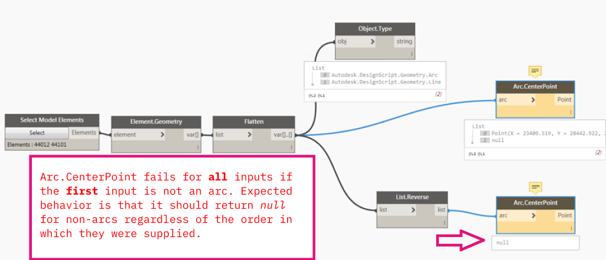

# Language Changes


**Version-Specific Content**: This page documents language changes introduced in Dynamo 2.0. These changes apply to all subsequent versions (2.x, 3.x, 4.x) unless otherwise noted.


The language changes section provides an overview of the updates and modifications made to the language in Dynamo in each version. These changes can impact functionality, performance, and usage, and this guide will help users understand when and why to adapt to these updates.

## Dynamo 2.0 Language Changes

1. Change list@level syntax from "@-1" to "@L1"

* New syntax for list@level, to use list@L1 instead of list@-1
* Motivation: Aligning Code Syntax with preview/UI, user testing shows this new Syntax is more comprehensible

2. Implement Int and Double types in TS to align with Dynamo types
3. Don't allow overloaded functions where arguments only differ by cardinality

* Old graphs that use overloads that have been removed should default to the higher ranked overloads.
* Motivation: Remove ambiguity about which specific function is being executed

4. Disabling array promotion with replication guides
5. Make variables in imperative blocks local to imperative block scope

* Variable values defined inside of imperative code blocks will not be altered by changes inside of Imperative blocks that reference them.

6. Make variables immutable to disable associative update in code block nodes
7. Compile all UI nodes to static methods
8. Support return statements without assignment

* “=” not needed in either function definitions or imperative code.

9. Migration of old method names in CBN’s

* Many nodes have been renamed to increase legibility and placement in Library browser User Interface

10. List as dictionary cleanup

***

Known issues:

* Namespace conflicts in Imperative Blocks cause unexpected input ports to appear. See the [Github issue](https://github.com/DynamoDS/Dynamo/issues/8796) for more info. To get around this, define the function outside of the Imperative Block like this:

```
pnt = Autodesk.Point.ByCoordinates;
lne = Autodesk.Line.ByStartPointEndPoint;

[Imperative]
{
    x = 1;
    start = pnt(0,0,0);
    end = pnt(x,x,x);
    line = lne(start,end);
    return = line;
};
```

## Dynamo 2.0 Language Changes Explained

A number of improvements have been made to the language for the Dynamo 2.0 release. The primary motivations for doing so were to simplify the language. The emphasis has been on making DesignScript more understandable and simple to use in favor of making it more powerful and flexible with the aim to improve end-user comprehensibility.

The following is the list of changes in 2.0 explained:

* Simplified List@Level syntax
* Overloaded methods with parameters that only differ by rank are illegal
* Compile all UI nodes as static methods
* Disabled list promotion when used with replication guides/lacing
* Variables in Associative blocks are immutable to prevent Associative update
* Variables in Imperative blocks are local to imperative scope
* Separation of Lists and Dictionaries

## 1. Simplified list@level syntax

New syntax for list@level, to use `list@L1` instead of `list@-1` 

## 2. Overloaded functions with parameters that only differ by rank are illegal

Overloaded functions are problematic for a number of reasons:

* An overloaded function indicated by a UI node in the graph may not be the same overload that is executed at runtime
* Method resolution is expensive and doesn't work well for overloaded functions
* It is hard to understand replication behavior for overloaded functions

Take `BoundingBox.ByGeometry` as an example (there were two overloaded functions in older versions of Dynamo), one that took a single value argument and the other that took a list of geometries as argument:

```
BoundingBox BoundingBox.ByGeometry(geometry: Geometry) {...}
BoundingBox BoundingBox.ByGeometry(geometry: Geometry[]) {...}
```

If the user dropped the first node on the canvas and connected a list of geometries, he will expect replication to kick in but it would never happen because at runtime the second overload will be called instead as shown: 

In 2.0 we disallow overloaded functions which only differ in parameter cardinality for this reason. This means that for overloaded functions that have the same number and types of parameters but have one or more parameters that differ only in rank, the overload that is defined first always wins while the rest are discarded by the compiler. The main advantage of making this simplification is of simplifying method resolution logic by having a quick path to select function candidates.

In the geometry library for 2.0, the first overload in the `BoundingBox.ByGeometry` example was deprecated and the second was retained so if the node is intended to replicate, i.e. used in the context of the first, it would need to be used with shortest (or longest) lacing option, or in a code block with replication guides:

```
BoundingBox.ByGeometry(geometry<1>);
```

We can see in this example that the higher ranked node can be used in both a replicated as well a non-replicated call and therefore is always preferred to a lower ranked overload. As a rule of thumb therefore, **node authors are always advised to drop lower ranked overloads in favor of higher ranked methods** so that the DesignScript compiler always calls the higher ranked method as the first and only one that it finds.

### Examples:

In the following example, two overloads of function `foo` have been defined. In 1.x, which overload executes at runtime is ambiguous. The user might expect the second overload `foo(a:int, b:int)` to execute, in which case, the method would be expected to replicate thrice returning a value of `10` thrice. In reality what is returned is a single value of `10` as the first overload with the list parameter is called instead.

### Second overload is omitted in 2.0:

In 2.0, it is always the first method that is defined that is picked over the rest. First-come-first-serve wins.


For each of the following cases, the first overload defined will be taken. Note that it is purely based on the order of defining the functions and not on the parameter ranks although it is recommended to give preference to methods with higher ranked parameters for user defined and zero touch nodes.

```
1)
foo(a: int[], b: int); ✓
foo(a: int, b: int); ✕
```

```
2) 
foo(x: int, y: int); ✓
foo(x: int[], y: int[]); ✕
```

## 3. Compile all UI nodes to static methods

In Dynamo 1.x UI nodes (non-code-blocks) were compiled to instance methods and properties respectively. For example, `Point.X` node was compiled to `pt.X` and `Curve.PointAtParameter` was compiled to `curve.PointAtParameter(param)`.This behavior had two issues:

**A. The function that the UI node represented was not always the same function that was executed at runtime**

A typical example is the `Translate` node. There are multiple `Translate` nodes that take the same number and types of arguments such as: `Geometry.Translate`, `Mesh.Translate`, and `FamilyInstance.Translate`. Due to the fact that nodes were compiled as instance methods, passing a `FamilyInstance` to a `Geometry.Translate` node would surprisingly still work as at runtime it would dispatch the call to the `Translate` instance method on a `FamilyInstance`. This was obviously misleading to users as the node did not do what it said.

**B. The second issue was that instance methods did not work with heterogeneous arrays**

At run-time, the execution engine needs to find out which function should be dispatched to. If the input is a list, say `list.Translate()`, as it is expensive to go through each element in a list and lookup methods on its type, the method resolution logic would simply assume the target type to be the same as the type of the first element, and try to lookup the method `Translate()` defined on that type. As a result if the first element type did not match the target type of the method (or even if it was `null` or an empty list), the entire list would fail even if there were other types in the list that matched.

For example, if a list input with the following types `[Arc, Line]` was passed into `Arc.CenterPoint`, the result would contain a center point for the arc and a `null` value for the line as expected. However, if the order was reversed, the entire result was null as the first element failed the method resolution check:

### Dynamo 1.x: Tests only first element of input list for method resolution check



```
x = [arc, line];
y = x.CenterPoint; // y = [centerpoint, null] ✓
```

```
x = [line, arc];
y = x.CenterPoint; // y = null ✕
```

In 2.0, both these issues are resolved by compiling UI nodes as static properties and static methods.

With static methods runtime method resolution is more straightforward and all elements in the input list are iterated over. For example:

`foo.Bar()` (instance method) semantics needs to check for the type of `foo` and also check if it is a list or not and then match it with candidate functions. This is expensive. On the other hand `Foo.Bar(foo)` (static method) semantics only needs to check one function with the parameter type `foo`!

This is what happens in 2.0:

* A UI property node is compiled to a static getter: The engine generates a static version of a getter for each property. For example, a `Point.X` node is compiled into a static getter `Point.get_X(pt)`. Note that the static getter can also be called using its alias: `Point.X(pt)` in a code block node.
* A UI method node is compiled to the static version: The engine generates a corresponding static method for the node. For example, the `Curve.PointAtParameter` node compiles to `Curve.PointAtParameter(curve: Curve, parameter:double)` instead of `curve.PointAtParameter(parameter)`.

**Note:** We have not removed instance method support with this change so existing instance methods used in CBN’s like `pt.X` and `curve.PointAtParameter(parameter)` in the above examples will still work.

This example would work previously in 1.x as the graph would compile to `point.X;` and it would find the `X` property on the point object. It now fails in 2.0 as the compiled code - `Vector.X(point)` expects only a `Vector` type:


### Advantages:

**Coherent/Understandable:** Static methods clear any ambiguity about which method will execute at runtime. The method always matches the UI node used in the graph that the user expects to be called.

**Compatible:** There is better correlation between the code and the visual program.

**Instructional:** Passing heterogeneous list inputs to nodes now result in non-null values for types that are accepted by the node and null values for types that do not implement the node. Results are more predictable and give a better indication of which are the permissible types for the node.

### Caveat: Unsolved ambiguities with overloaded methods

Because Dynamo supports function overloads in general, it may still get confused if there is another overloaded function with the same number of parameters. For example, in the following graph if we connect a numeric value to `Curve.Extrude`'s `direction` input and a vector to `Curve.Extrude`’s `distance` input, both nodes continue to work, which is unexpected. In this case even though the nodes compile to static methods, the engine is still unable to tell the difference at runtime and picks either one depending on the input type. 

### Solved Issues:

The shift to static method semantics introduced the following side-effects which are worth mentioning here as related 2.0 language changes.

**1. Loss of Polymorphic Behavior:**

Let’s consider an example from `TSpline` nodes in `ProtoGeometry` (note that `TSplineTopology` inherits from the base `Topology` type): The `Topology.Edges` node that was previously compiled to the instance method, `object.Edges`, is now compiled to the static method, `Topology.Edges(object)`. The previous call would polymorphically resolve to the derived class method, `TsplineTopology.Edges` after a method dispatch over the runtime type of object.


Whereas the new static behavior was forced to call the base class method, `Topology.Edges`. As a result this node returned the base class, `Edge` objects instead of the derived class objects of type `TSplineEdge`.


This was a regression as downstream `TSpline` nodes expecting `TSplineEdges` started to fail.

The issue was fixed by adding a runtime check in the method dispatch logic to check for the instance type against the type or a subtype of the first parameter of the method. In the case of an input list we simplified the method dispatch to simply check for the type of the first element. Thus the final solution was a compromise between a partly static and partly dynamic method lookup.

**New polymorphic behavior in 2.0:**


In this case since the first element `a` is a `TSpline`, it is the `TSplineTopology.Edges` derived method that is invoked at runtime. As a result it returns `null` for the base `Topology` type `b`.

In the second case, since the general `Topology` type `b` is the first element, the base `Topology.Edges` method is called. Since `Topology.Edges` also happens to accept the derived `TSplineTopology` type, `a` as input it returns `Edges` for both inputs, `a` and `b`.


**2. Regressions from producing redundant outer lists**

There is one main difference between instance methods and static methods when it comes to replication guide behavior. With instance methods, single value inputs with replication guides are not promoted to lists whereas they are promoted for static methods.

Consider the example of `Surface.PointAtParameter` node with cross-lacing and with a single surface input and arrays of `u` and `v` parameter values. The instance method compiles to:

```
surface<1>.PointAtParameter(u<1>, v<2>);
```

resulting in a 2D array of points.

The static method compiles to:

```
Surface.PointAtParameter(surface<1>, u<2>, v<3>);
```

resulting in a 3D list of points with a redundant outermost list.

This side effect of compiling UI nodes to static methods could potentially cause regressions in such existing use cases. This issue has been addressed by disabling the promotion of single value inputs to a list when used with replication guides/lacing (see next item).

**4. Disabled list promotion with replication guides/lacing**

In 1.x there were two cases in which single values were promoted to lists:

* When lower ranked inputs were passed into functions expecting higher ranked inputs
* When lower ranked inputs were passed into functions expecting the same rank but where the input arguments are decorated with replication guides or use lacing

In 2.0 we no longer support the latter case by preventing list promotion in such scenarios.

In the following 1.x graph, one level of replication guide for each of `y` and `z` enforced array promotion of rank 1 for each of them, which is why the result had a rank of 3 (1 each for `x`, `y`, and `z`). Instead a user would expect the result to be of rank 1 since it is not quite obvious that the presence of replication guides for single value inputs would add levels to the result.

```
x = 1..5;
y = 0;
z = 0;
p = Point.ByCoordinates(x<1>, y<2>, z<3>); // cross-lacing
```

### Dynamo 1.x: 3D list of points


In 2.0, the presence of replication guides for each of the single value arguments `y` and `z` do not cause a promotion resulting in a list having the same dimension as the input 1D list for `x`.

### Dynamo 2.0: 1D list of points


The above mentioned regression caused by static method compilation with generating redundant outer lists was also addressed by this language change.

Continuing with the same example above, we saw that a static method call like:

```
Surface.PointAtParameter(surface<1>, u<2>, v<3>); 
```

produced a 3D list of points in Dynamo 1.x. This happened due to promotion of the first single value argument surface, to a list when used with a replication guide.

### Dynamo 1.x: List promotion of argument with replication guide


In 2.0, we have disabled the promotion of single value arguments to lists when used with replication guides or lacing. So now the call to:

```
Surface.PointAtParameter(surface<1>, u<2>, v<3>);
```

simply returns a 2D list as surface is not promoted.

### Dynamo 2.0: Disabled list promotion of single value argument with replication guide


This change now removes the addition of a redundant list level and also solves the regression caused by the transition to static method compilation.

### Advantages:

**Legible:** Results align with user expectations and are easier to comprehend

**Compatible:** UI nodes (with lacing option) and CBN’s using replication guides give compatible results

**Consistent:**

* Instance methods and static methods are consistent (fixes issues with static method semantics)
* Nodes with inputs and with default arguments behave consistently (see below)


## 5. Variables are immutable in Code Block Nodes to prevent Associative update

DesignScript historically supports two programming paradigms - associative and imperative programming. Associative code creates a dependency graph from program statements where variables have a dependency on each other. Updating a variable can trigger updates for all other variables that depend on this variable. This means that the sequence of execution of statements in an associative block is not based on their order but on the dependency relationships between variables.

In the following example, the sequence of execution of the code is lines 1 -> 2 -> 3 -> 2. Since `b` has a dependency on `a`, when `a` updates in line 3, execution jumps to line 2 again to update `b` with the new value of `a`.

```
1. a = 1; 
2. b = a * 2;
3. a = 2;
```

In contrast if the same code is executed in an imperative context, the statements are executed in a linear, top-down flow. Imperative code blocks are therefore suited for sequential execution of code constructs like loops and if-else conditions.

### Ambiguities of associative update:

**1. Variables with cyclic dependency:**

In certain cases, a cyclic dependency between variables may not be so obvious as in the following case. In such cases where the compiler cannot detect the cycle statically, it could lead to an indefinite runtime cycle.

```
a = 1;
b = a;
a = b;
```

**2. Variables depending on self:**

If a variable depends on itself, should its value accumulate or should it be reset to its original value on each update?

```
a = 1;
b = 1;
b = b + a + 2; // b = 4
a = 4;         // b = 10 or b = 7?
```

In this geometry example, since the cube `b` depends on itself as well as on the cylinder, `a`, should moving the slider cause the hole to move along the block or should it create a cumulative effect of riddling several holes along its path for every slider position update?


**3. Updating properties of variables:**

```
1: def foo(x: A) { x.prop = ...; return x; }
2: a = A.A();
3: p = a.prop;
4: a1 = foo(a);  // will p update?
```

**4. Updating functions:**

```
1: def foo(v: double) { return v * 2; }// define “foo”
2: x = foo(5);                         // first definition of “foo” called
3: def foo(v: int) { return v * 3; }   // overload of “foo” defined, will x update?
```

From experience we have found that associative update does not prove to be useful in code block nodes in a node-based dataflow graph context. Before any visual programming environment was available, the only way to explore options was to explicitly change values of some variables in program. A text-based program has the full history of updates of a variable whereas in a visual programming environment only the latest value of a variable is displayed.

If at all it has been used by some users it most likely has been used by them unknowingly causing more harm than good. We therefore decided in 2.0 to hide associativity in code block node usage by making variables immutable while we continue to retain associative update as a native feature of the DS engine only. This is another change made with the idea of simplifying the scripting experience for users.

**Associative update is disabled in CBN’s by preventing variable redefinition:** 

**List indexing still permitted in code blocks**

An exception has been made for list indexing and is still permitted in 2.0 with index operator assignment.

In this next example we see that the list `a` is initialized but can later be overwritten with an index-operator assignment and that any variables dependent on `a` would update associatively as seen by the value of `c`. Also the node preview displays the updated values of `a` after the redefinition of one or more of its elements.


## 6. Variables in imperative blocks are local to imperative block scope

We made imperative scoping rule changes to 2.0 in order to disable complicated cross-language update scenarios.

In Dynamo 1.x, the execution sequence of the following script would be from lines 1 -> 2 -> 4 -> 6 -> 4, where a change is propagated from the outer to inner language scopes. Since `y` is updated in the outer associative block and since `x` in the imperative block has a dependency on `y`, control shifts from the outer associative program to the imperative language in line 4.

```
1: x = 1;
2: y = 2;
3: [Imperative] {
4:     x = 2 * y;
5: }
6: y = 3;
```

The execution sequence in this next example would be lines: 1 -> 2 -> 4 -> 2 where the change would propagate from the inner language scope to the outer.

```
1: x = 1;
2: y = x * 2;
3: [Imperative] {
4:     x = 3;
5: }
```

The above scenarios refer to cross-language update, which just like associative update are not very useful in code block nodes. To disable complex cross-language update scenarios, we have made variables in imperative scope local.

In the following example in Dynamo 2.0:

```
x = 1;
y = x * 2;
i = [Imperative] {
     x = 3;
     return x;
}
```

* `x` defined in the Imperative block is now local to the Imperative scope
* Values of `x` and `y` in the outer scope remain `1` and `2` respectively

Any local variable inside an imperative block needs to be returned if its value is to be accessed in an outer scope.

Consider the following example:

```
1: x = 1;
2: y = 2;
3: [Imperative] {
4:     x = 2 * y;
5: }
6: y = 3; // x = 1, y = 3
```

* `y` is copied locally inside the Imperative scope
* Value of `x` local to Imperative scope is `4`
* Updating value of `y` in outer scope continues to cause `x` to update due to cross-language update but is disabled in code blocks in 2.0 due to variable immutability
* Value of `x` and `y` in outer Associative scope remain `1` and `2` respectively

## 7. Lists and Dictionaries

In Dynamo 1.x, Lists and Dictionaries were represented by a single, unified container, which could be indexed by both an integer index as well as a non-integral key. The following table summarizes the separation between Lists and Dictionaries in 2.0 and rules of the new Dictionary data type:

|                               | 1.x                                                  | 2.0                                      |
| ----------------------------- | ---------------------------------------------------- | ---------------------------------------- |
| **List Initialization**       | `a = {1, 2, 3};`                                     | `a = [1, 2, 3];`                         |
| **Empty list**                | `a = {};`                                            | `a = [];`                                |
| **Dictionary Initialization** | **Could append to the same Dictionary dynamically:** | **Can only create new dictionaries:**    |
|                               | `a = {};`                                            | `a = {“foo” : 1, “bar” : 2};`            |
|                               | `a[“foo”] = 1;`                                      | `b = {“foo” : 1, “bar” : 2, “baz” : 3};` |
|                               | `a[“bar”] = 2;`                                      | `a = {};` // Creates an empty Dictionary |
|                               | `a[“baz”] = 3;`                                      |                                          |
| **Dictionary Indexing**       | **Key Indexing**                                     | **Indexing syntax remains the same**     |
|                               | `b = a[“bar”];`                                      | `b = a[“bar”];`                          |
| **Dictionary Keys**           | **Any key type was legal**                           | **Only string keys are legal**           |
|                               | `a = {};`                                            | `a = {“false” : 23, “point” : 12};`      |
|                               | `a[false] = 23;`                                     |                                          |
|                               | `a[point] = 12;`                                     |                                          |

### New `[]` List Syntax

The list initialization syntax has been changed from curly braces `{}` to square bracket, `[]` in 2.0. All 1.x scripts are automatically migrated to the new syntax when opened in 2.0.

**Note on Default Argument Attributes on Zero Touch nodes:**

Note that the auto-migration will not work with the old syntax used in default argument attributes however. Node authors would need to manually update their zero-touch method definitions to use the new syntax in default argument attributes `DefaultArgumentAttribute` if necessary.

**Note on Indexing:**

The new indexing behavior has changed in certain cases. Indexing into a list/dictionary with an arbitrary list of indices/keys using the `[]` operator, now preserves the list structure of the input list of indices/keys. Previously it would always return a 1D list of values:

```
Given:
a = {“foo” : 1, “bar” : 2};

1.x:
b = a[{“foo”, {“bar”}}];
returns {1, 2}

2.0:
b = a[[“foo”, [“bar”]]];
returns [1, [2]];
```

### Dictionary Initialization Syntax:

The `{}` (curly brace syntax) for Dictionary initialization can only be used in the

```
dict = {<key> : <value>, …}; 
```

key-value pair format where only a string is allowed for `<key>`, and multiple key-value pairs are separated by commas.


The `Dictionary.ByKeysValues` zero-touch method can be used as a more versatile way of initializing a Dictionary by passing in a list of keys and values respectively and having all the bells and whistles of using zero-touch methods like replication guides etc.


### Why did we not use arbitrary expressions for Dictionary initialization syntax?

We had experimented with the idea of using arbitrary expressions for keys in Dictionary key-value initialization syntax and found that it could lead to confusing results, especially when a syntax like `{keys : vals}` (`keys`, `vals` both representing lists) interfered with other language features of DesignScript like replication and produced different results from the zero touch initializer node.

For example, there could be other cases like this statement where it would be difficult to define the expected behavior:

```
dict = {["foo", "bar"] : "baz" };
```

Further adding replication guide syntax etc. to the mix, not just identifiers, would be going against the idea of simplicity in the language.

We _could_ extend dictionary keys to support arbitrary expressions in the future but we will also have to ensure that the interaction with other language features is consistent and intelligible at the cost of adding complexity rather than making the system a little less powerful yet simple to understand. Given that there is always an alternate way to address this by using the `Dictionary.ByKeysValues(keyList, valueList)` method, which is not that much of a stretch.

### Interaction with Zero Touch nodes:

**1. Zero Touch node returning a .NET Dictionary is returned as a Dynamo Dictionary**

**Consider the following zero-touch C# method returning an IDictionary:** 

**The corresponding ZT node return value is marshaled as a Dynamo Dictionary:** 

**2. Multi-return nodes are previewed as Dictionaries**

**Zero Touch node returning IDictionary with Multi-Return Attribute returns a Dynamo Dictionary:** 


**3. Dynamo Dictionary can be passed as input into Zero-touch node accepting .NET Dictionary**

**ZT method with an IDictionary parameter:** 

**ZT node accepts Dynamo Dictionary as input:** 

### Dictionary preview in Multi-Return Nodes

Dictionaries are unordered key-value pairs. Consistent with this idea, the key-value pair previews of nodes returning Dictionaries are therefore not guaranteed to be ordered in the order of the return values of the nodes.

We have however made an exception for Multi-Return nodes that have `MultiReturnAttribute`’s defined. In the following example, the `DateTime.Components` node is a "Multi-Return" node and the node preview reflects its key-value pairs to be in the same order as that of the output ports on the node, which is also the order that the outputs are specified based on the `MultiReturnAttribute`’s on the node definition.

Note also that the previews for code blocks are not ordered unlike the UI node as the output port information (in the form of a multi-return attribute) does not exist for the code block node: 
