# 语言更改

语言更改部分概述了 Dynamo 中每个版本中对语言所做的更新和修改。这些更改可能会影响功能、性能和使用情况，本指南将帮助用户了解何时以及为何适应这些更新。

## Dynamo 2.0 语言更改

1. 将 list@level 语法从“@-1”更改为“@L1”

* list@level 的新语法，使用 list@L1 而不是 list@-1
* 动机：使代码语法与预览/UI 保持一致，用户测试表明这种新语法更易于理解

2. 在 TS 中实现“整数”和“双精度”类型以与 Dynamo 类型保持一致
3. 不允许参数仅因基数而异的重载函数

* 使用已删除的重载的旧图表应默认为等级较高的重载。
* 动机：消除关于正在执行哪个特定函数的歧义

4. 使用复制导向禁用阵列升级
5. 使命令式块中的变量成为命令式块范围的局部变量

* 在命令式代码块中定义的变量值不会因参照它们的命令式块内部的更改而改变。

6. 使变量不可变以禁用代码块节点中的关联更新
7. 将所有 UI 节点编译为静态方法
8. 支持无赋值的 return 语句

* “=”在函数定义或命令式代码中都不需要。

9. CBN 中旧方法名称的迁移

* 许多节点已重命名，以提高库浏览器用户界面的易读性和位置

10. 作为词典清理列表

***

已知问题：

* 命令式块中的命名空间冲突会导致出现意外的输入端口。有关详细信息，请参见 [Github 问题](https://github.com/DynamoDS/Dynamo/issues/8796)。要解决此问题，请在命令式块外部定义函数，如下所示：

```
pnt = Autodesk.Point.ByCoordinates;
lne = Autodesk.Line.ByStartPointEndPoint;

[Imperative]
{
    x = 1;
    start = pnt(0,0,0);
    end = pnt(x,x,x);
    line = lne(start,end);
    return = line;
};
```

## Dynamo 2.0 语言更改说明

对 Dynamo 2.0 版本的语言进行了许多改进。这样做的主要动机是简化语言。重点是使 DesignScript 更易于理解和易于使用，从而使其更强大、更灵活，旨在提高最终用户的可理解性。

下面是 2.0 说明中的更改列表：

* 简化的 List@Level 语法
* 使用仅按等级不同的参数的重载方法是非法的
* 将所有 UI 节点编译为静态方法
* 与复制导向/连缀一起使用时禁用列表提升
* 关联块中的变量不可变，以防止关联更新
* 命令式块中的变量是命令式范围的局部变量
* 列表和词典的分离

## 1\.简化的 list@level 语法

list@level的新语法，使用 `list@L1` 而不是 `list@-1` 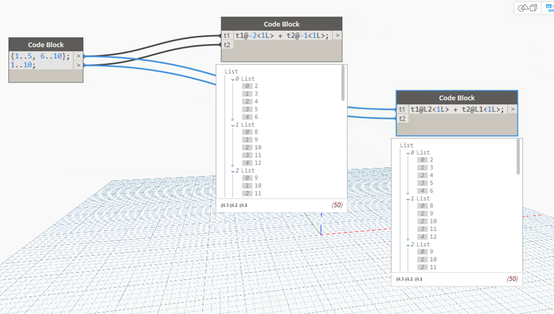

## 2\.使用仅按等级不同的参数的重载函数是非法的

重载函数存在问题的原因有很多：

* 图表中 UI 节点指示的重载函数可能与运行时执行的重载不同
* 方法解决成本高昂，不适用于重载函数
* 很难理解重载函数的复制行为

以 `BoundingBox.ByGeometry` 为例（旧版本的 Dynamo 中有两个重载函数），一个采用单个值参数，另一个采用几何图形列表作为参数：

```
BoundingBox BoundingBox.ByGeometry(geometry: Geometry) {...}
BoundingBox BoundingBox.ByGeometry(geometry: Geometry[]) {...}
```

如果用户将第一个节点放在画布上并连接了一组几何图形，则他将期望执行复制，但这永远不会发生，因为在运行时，将改为调用第二个重载，如下所示：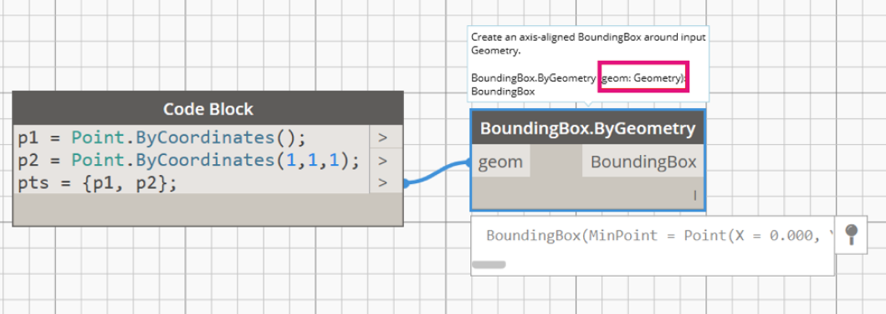

因此，在 2.0 中，我们不允许重载函数，这些函数仅在参数基数上有所不同。这意味着，对于具有相同数量和类型参数但具有一个或多个参数仅等级不同的重载函数，首先定义的重载始终优先，而其余重载则被编译器丢弃。进行这种简化的主要优点是通过选择候选函数的快速路径来简化方法解决逻辑。

在 2.0 的几何图形库中，`BoundingBox.ByGeometry` 示例中的第一个重载已弃用，第二个重载已保留，因此，如果节点要复制，即在第一个实例的上下文中使用，则需要将其与最短（或最长）连缀选项一起使用，或用于具有复制导向的代码块中：

```
BoundingBox.ByGeometry(geometry<1>);
```

在此示例中，我们可以看到，等级较高的节点可用于复制和非复制调用，因此始终优于等级较低的重载。因此，根据经验，始终建议**节点作者放弃等级较低的重载，转而使用等级较高的方法**以便 DesignScript 编译器始终将等级较高的方法称为它找到的第一个也是唯一一个方法。

### 示例：

在下面的示例中，定义了函数 `foo` 的两个重载。在 1.x 中，哪个重载在运行时执行是模棱两可的。用户可能期望执行第二个重载 `foo(a:int, b:int)`，在这种情况下，该方法需要复制三次，返回值 `10` 三次。实际上，返回的是单个值 `10`，因为称为具有 list 参数的第一个重载。

### 2.0 中省略了第二个重载：

在 2.0 中，始终是定义的第一个方法优先于其余方法被拾取。遵循先到先得原则。

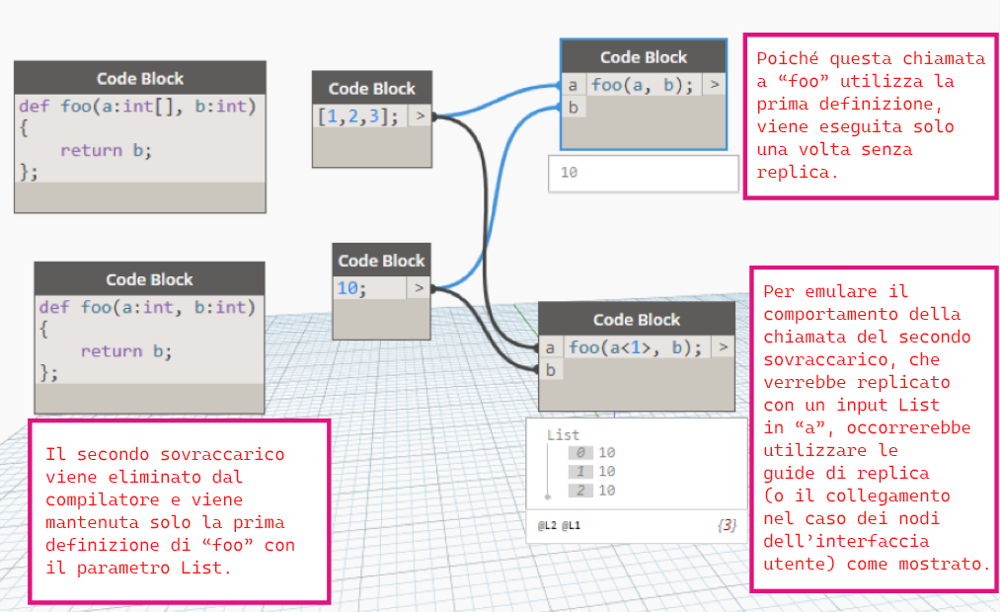

对于以下每种情况，将采用定义的第一个重载。请注意，这纯粹基于函数的定义顺序，而不是参数等级，尽管建议优先使用用户定义节点和 Zero Touch 节点的等级参数较高的方法。

```
1)
foo(a: int[], b: int); ✓
foo(a: int, b: int); ✕
```

```
2) 
foo(x: int, y: int); ✓
foo(x: int[], y: int[]); ✕
```

## 3\.将所有 UI 节点编译为静态方法

在 Dynamo 1.x 中，UI 节点（非代码块）会分别编译为实例方法和特性。例如，`Point.X` 节点编译为 `pt.X`，`Curve.PointAtParameter` 节点编译为 `curve.PointAtParameter(param)`。此行为有两个问题：

**A. UI 节点表示的函数并不总是与运行时执行的函数相同**

典型的例子是 `Translate` 节点。有多个 `Translate` 节点采用相同数量和类型的参数，例如：`Geometry.Translate`、`Mesh.Translate` 和 `FamilyInstance.Translate`。由于节点是作为实例方法编译的，因此将 `FamilyInstance` 传递给 `Geometry.Translate` 节点仍然有效，因为在运行时，它会在 `FamilyInstance` 上分派对 `Translate` 实例方法的调用。这显然会误导用户，因为节点没有按照它所说的去做。

**B. 第二个问题是实例方法不适用于异构阵列**

在运行时，执行引擎需要找出应该分派给哪个函数。如果输入是一个列表，比如 `list.Translate()`，因为浏览列表中的每个元素并查找其类型的方法的成本很高，因此该方法解决逻辑将简单地假设目标类型与第一个元素的类型相同，并尝试查找在该类型上定义的方法 `Translate()`。因此，如果第一个元素类型与方法的目标类型不匹配（或者即使它是 `null` 或空列表），则整个列表都将失败，即使列表中有匹配的其他类型。

例如，如果将具有以下类型 `[Arc, Line]` 的列表输入传递到 `Arc.CenterPoint`，则结果将按预期包含圆弧的中心点和直线的 `null` 值。但是，如果顺序颠倒，则整个结果为 null，因为第一个元素未通过方法解决检查：

### Dynamo 1.x：仅测试输入列表中的第一个元素以进行方法解决检查

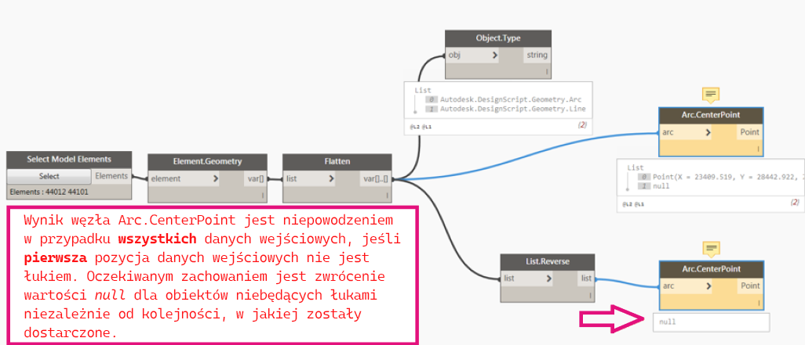

```
x = [arc, line];
y = x.CenterPoint; // y = [centerpoint, null] ✓
```

```
x = [line, arc];
y = x.CenterPoint; // y = null ✕
```

在 2.0 中，通过将 UI 节点编译为静态属性和静态方法，可以解决这两个问题。

使用静态方法，运行时方法解决更加简单，并且输入列表中的所有元素都会迭代。例如：

`foo.Bar()`（实例方法）语义需要检查 `foo` 的类型，还要检查它是否是列表，然后将其与候选函数进行匹配。这很昂贵。另一方面，`Foo.Bar(foo)`（静态方法）语义只需要检查一个参数类型为 `foo` 的函数！

以下是 2.0 中发生的情况：

* 一个 UI 属性节点被编译成一个静态的 getter：插件为每个属性生成一个静态版本的 getter。例如，一个 `Point.X` 节点被编译成一个静态的 getter `Point.get_X(pt)`。请注意，静态 getter 也可以在代码块节点中使用其别名 `Point.X(pt)` 来调用。
* UI 方法节点编译为静态版本：引擎为该节点生成相应的静态方法。例如，`Curve.PointAtParameter` 节点编译为 `Curve.PointAtParameter(curve: Curve, parameter:double)` 而不是 `curve.PointAtParameter(parameter)`。

**注意：** 我们没有通过此更改删除实例方法支持，因此 CBN 中使用的现有实例方法（如上述示例中的 `pt.X` 和 `curve.PointAtParameter(parameter)`）仍将有效。

此示例以前在 1.x 版本中有效，因为图表编译为 `point.X;`，并且它将在点对象上找到 `X` 属性。它现在在 2.0 中失败，因为编译的代码 - `Vector.X(point)` 只需要一个 `Vector` 类型：

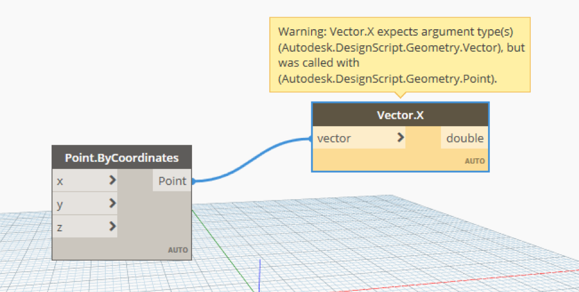

### 优点：

**连贯/可理解：** 静态方法可清除有关在运行时执行哪个方法的任何歧义。该方法始终与用户希望调用的图表中使用的 UI 节点匹配。

**兼容：** 代码和可视化程序之间有更好的相关性。

**说明：** 现在，将异类列表输入传递给节点会导致节点接受的类型具有非 null 值，而未实现节点的类型会产生 null 值。结果更具可预测性，并且可以更好地指示哪些是节点的允许类型。

### 警告：重载方法的未解决歧义

由于 Dynamo 通常支持函数重载，因此如果存在具有相同数量参数的另一个重载函数，它可能仍会感到困惑。例如，在下图中，如果我们将数值连接到 `Curve.Extrude` 的 `direction` 输入，将向量连接到 `Curve.Extrude` 的 `distance` 输入，则两个节点都会继续工作（这是意外情况）。在这种情况下，即使节点编译为静态方法，引擎仍然无法在运行时分辨出差异，而是根据输入类型选择任一方法。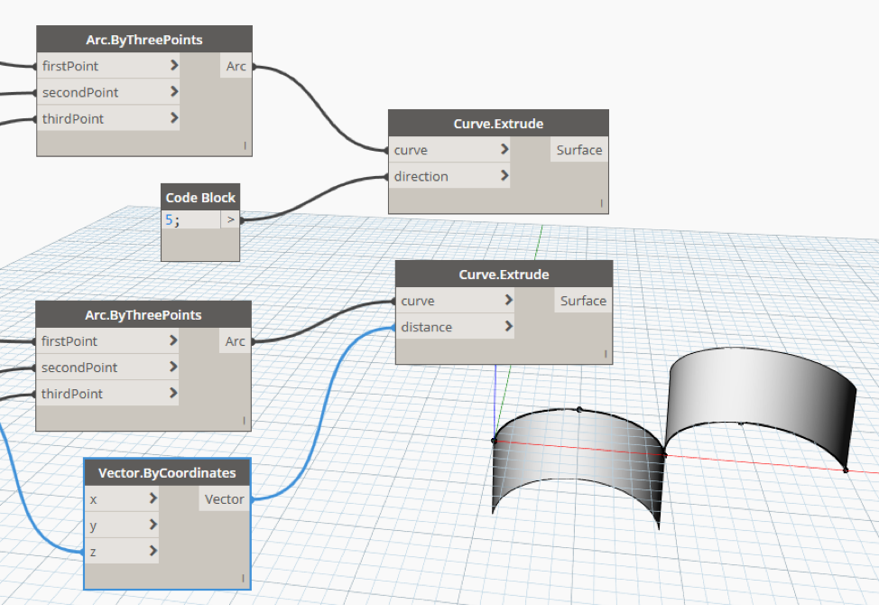

### 已解决的问题：

向静态方法语义的转变带来了以下附带影响，这里值得一提的是相关的 2.0 语言变化。

**1\.多态行为的丧失：**

我们来看一个来自 `ProtoGeometry` 中 `TSpline` 节点的示例（请注意，`TSplineTopology` 继承自基础 `Topology` 类型）：以前编译为实例方法 `object.Edges` 的 `Topology.Edges` 节点现在编译为静态方法 `Topology.Edges(object)`。在运行时类型的对象进行方法调度之后，上一个调用将多态解析为派生类方法 `TsplineTopology.Edges`。

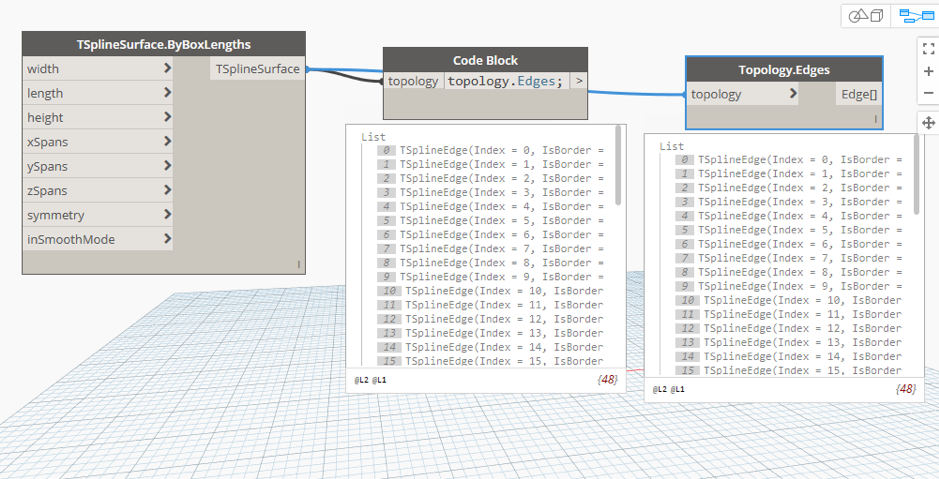

新的静态行为被强制调用基类方法 `Topology.Edges`。因此，此节点返回基类 `Edge` 对象，而不是 `TSplineEdge` 类型的派生类对象。

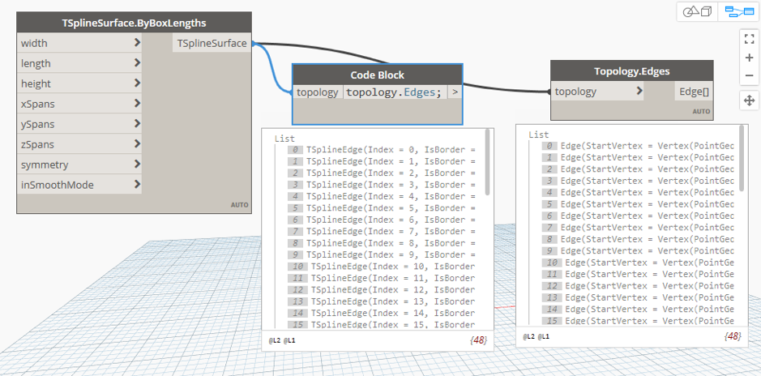

这是一种回归，因为下游 `TSpline` 节点期待 `TSplineEdges` 开始失败。

通过在方法调度逻辑中添加运行时检查来针对方法第一个参数的类型或子类型检查实例类型，从而修复了此问题。在输入列表的情况下，我们简化了方法调度，以简单地检查第一个元素的类型。因此，最终的解决方案是部分静态和部分动态方法查找之间的折衷方案。

**2.0 中的新多态行为：**

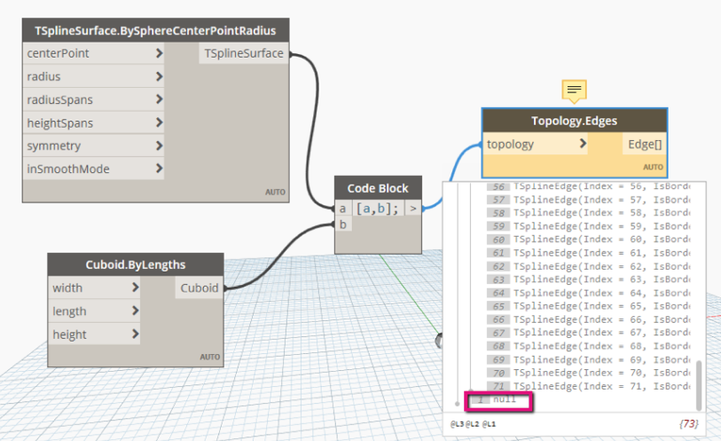

在这种情况下，由于 `a` 的第一个元素是 `TSpline`，因此它是在运行时调用的 `TSplineTopology.Edges` 派生方法。因此，它为基础 `Topology` 类型 `b` 返回 `null`。

在第二种情况下，由于常规 `Topology` 类型 `b` 是第一个元素，因此调用了基础 `Topology.Edges` 方法。由于 `Topology.Edges` 也恰好接受派生的 `TSplineTopology` 类型，因此 `a` 作为输入，它将为输入 `a` 和 `b` 返回 `Edges`。

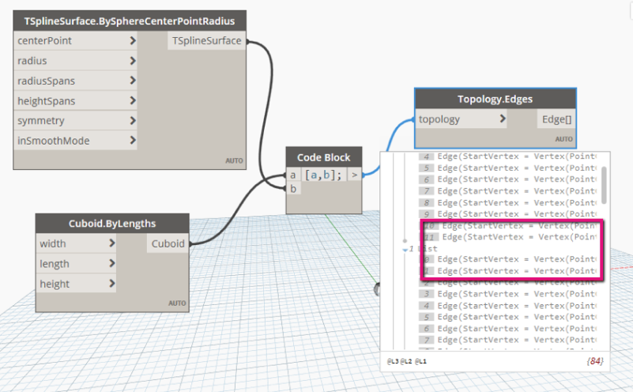

**2\.从生成冗余外部列表的回归**

在复制导向行为方面，实例方法和静态方法之间有一个主要区别。使用实例方法时，带有复制导向的单值输入不会提升为列表，而对于静态方法，它们会被提升为静态方法。

请考虑具有交叉连缀的 `Surface.PointAtParameter` 节点示例，该节点具有单个曲面输入以及 `u` 和 `v` 参数值的数组。实例方法编译为：

```
surface<1>.PointAtParameter(u<1>, v<2>);
```

生成点的二维阵列。

静态方法编译为：

```
Surface.PointAtParameter(surface<1>, u<2>, v<3>);
```

生成具有冗余最外层列表的点的三维列表。

在此类现有用例中，将 UI 节点编译为静态方法的这种附带影响可能会导致回归。此问题已通过在与复制导向/连缀一起使用时禁用将单个值输入提升为列表（请参见下一项）而得到解决。

**4\.使用复制导向/连缀的禁用列表提升**

在 1.x 中，有两种情况将单个值提升为列表：

* 当较低等级的输入被传递到需要较高等级输入的函数时
* 当较低等级的输入传递到需要相同等级的函数时，但其中输入参数带有复制导向或使用连缀

在 2.0 中，我们不再通过阻止在这种情况下进行列表升级来支持后一种情况。

在下面的 1.x 图中，`y` 和 `z` 中的每一个都有一个级别的复制导向，它们中的每一个都强制阵列提升 1 级，这就是为什么结果的等级为 3（`x`、`y` 和 `z` 各 1 级）。相反，用户希望结果的等级为 1，因为对于单个值输入的复制导向的存在会向结果添加级别并不明显。

```
x = 1..5;
y = 0;
z = 0;
p = Point.ByCoordinates(x<1>, y<2>, z<3>); // cross-lacing
```

### Dynamo 1.x：三维点列表

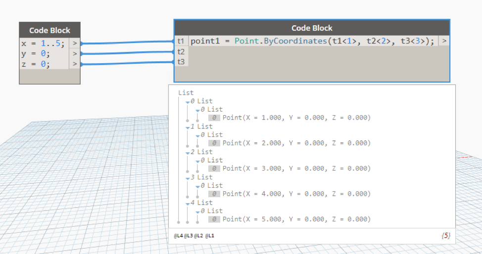

在 2.0 中，每个单值参数 `y` 和 `z` 的复制导向的存在不会导致升级，从而导致列表与 `x` 的输入一维列表具有相同的尺寸。

### Dynamo 2.0：一维点列表

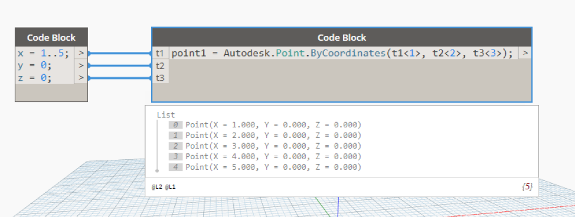

上述由静态方法编译引起的回归问题，并生成冗余的外部列表，也通过此语言更改得到了解决。

继续上面的相同示例，我们看到像这样的静态方法调用：

```
Surface.PointAtParameter(surface<1>, u<2>, v<3>); 
```

在 Dynamo 1.x 中生成了三维点列表。发生这种情况的原因是，当与复制导向一起使用时，第一个单值参数曲面被提升为列表。

### Dynamo 1.x：使用复制导向的参数列表升级

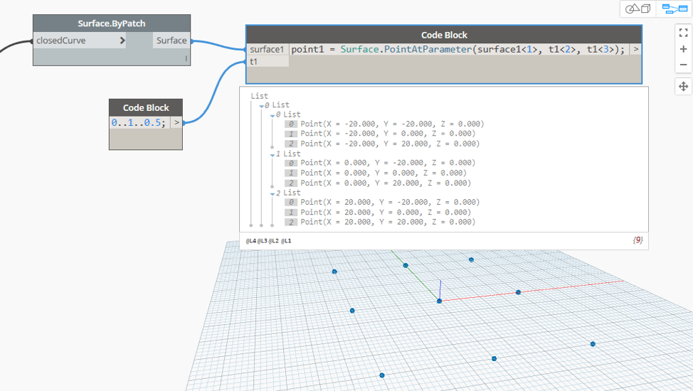

在 2.0 中，我们已禁用在与复制导向或连缀一起使用时将单值参数提升为列表的功能。所以现在调用：

```
Surface.PointAtParameter(surface<1>, u<2>, v<3>);
```

只返回一个二维列表，因为曲面没有被提升。

### Dynamo 2.0：已禁用使用复制导向进行单值参数的列表提升

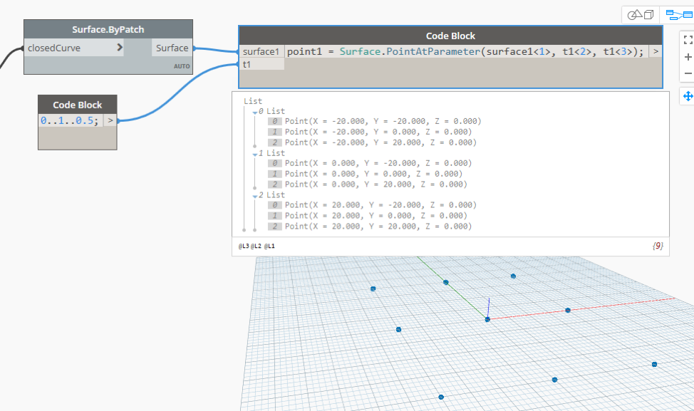

此更改现在删除了冗余列表级别的添加，还解决了过渡到静态方法编译引起的回归。

### 优点：

**清晰易读：** 结果符合用户预期，更易于理解

**兼容：** UI 节点（带连缀选项）和使用复制导向的 CBN 可提供兼容的结果

**一致：**

* 实例方法和静态方法一致（修复了静态方法语义的问题）
* 具有输入和默认参数的节点行为一致（请参见下文）

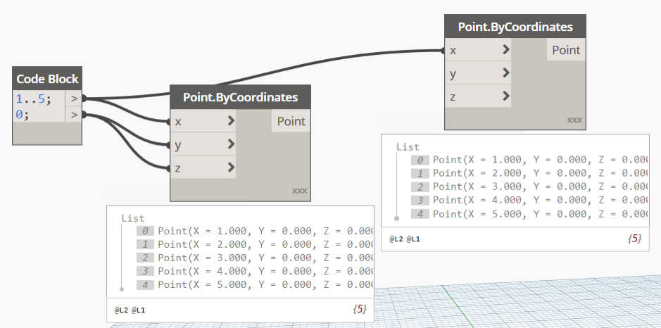

## 5\.变量在代码块节点中不可变以防止关联更新

DesignScript 历来支持两种编程范式 - 关联编程和命令式编程。关联代码从变量相互依赖的程序语句创建依存关系图。更新变量可以触发依赖于该变量的所有其他变量的更新。这意味着关联块中语句的执行顺序不是基于它们的顺序，而是基于变量之间的依存关系。

在以下示例中，代码的执行顺序为第 1 行 -> 第 2 行 -> 第 3 行 -> 第 2 行。由于 `b` 依赖于 `a`，因此当 `a` 在第 3 行更新时，执行会再次跳转到第 2 行，以使用 `a` 的新值更新 `b`。

```
1. a = 1; 
2. b = a * 2;
3. a = 2;
```

相反，如果在命令式上下文中执行相同的代码，则语句将在自上而下的线性流程中执行。因此，命令式代码块适用于循环和 if-else 条件等代码结构的顺序执行。

### 关联更新的歧义：

**1\.具有循环依存关系的变量：**

在某些情况下，变量之间的循环依存关系可能不像以下情况那样明显。在这种情况下，如果编译器无法静态检测周期，则可能导致无限期的运行时周期。

```
a = 1;
b = a;
a = b;
```

**2\.取决于自身的变量：**

如果一个变量依赖于它自己，它的值应该累积还是应该在每次更新时重置为它的原始值？

```
a = 1;
b = 1;
b = b + a + 2; // b = 4
a = 4;         // b = 10 or b = 7?
```

在此几何图形示例中，由于立方体 `b` 取决于自身以及圆柱体 `a`，移动滑块是否应该使孔沿块移动，还是应该在每次滑块位置更新时创建沿其路径布满多个孔的累积效果？


**3\.更新变量的属性：**

```
1: def foo(x: A) { x.prop = ...; return x; }
2: a = A.A();
3: p = a.prop;
4: a1 = foo(a);  // will p update?
```

**4\.更新函数：**

```
1: def foo(v: double) { return v * 2; }// define “foo”
2: x = foo(5);                         // first definition of “foo” called
3: def foo(v: int) { return v * 3; }   // overload of “foo” defined, will x update?
```

根据经验，我们发现关联更新在基于节点的数据流图上下文中的代码块节点中被证明是有用的。在任何可视化编程环境可用之前，探索选项的唯一方法是显式更改程序中某些变量的值。基于文本的程序具有变量更新的完整历史记录，而在可视化编程环境中，仅显示变量的最新值。

如果它被一些用户使用过，那么它很可能在不知不觉中被他们使用，弊大于利。因此，我们决定在 2.0 版中通过使变量不可变来隐藏代码块节点使用中的关联性，同时我们继续仅将关联更新保留为 DS 引擎的原生功能。这是为了简化用户的脚本体验而做出的另一项更改。

**通过防止变量重定义，在 CBN 中禁用了关联更新：** 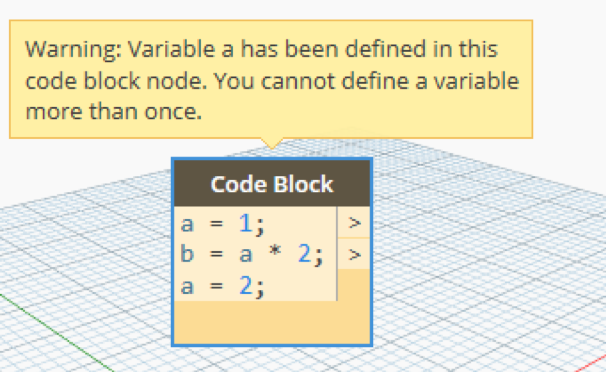

**代码块中仍允许列表索引**

列表索引有一个例外，在 2.0 中仍然允许使用索引运算符分配。

在下一个示例中，我们看到列表 `a` 已初始化，但稍后可以使用索引运算符赋值覆盖，并且依赖于 `a` 的任何变量都将关联更新，如 `c` 的值所示。此外，节点预览还将显示在重新定义其一个或多个单元后更新的 `a` 值。

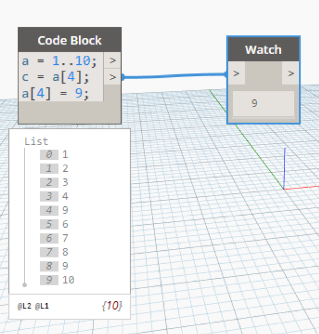

## 6\.命令式块中的变量是命令式块范围的局部变量

我们将命令式范围规则更改为 2.0，以禁用复杂的跨语言更新方案。

在 Dynamo 1.x 中，以下脚本的执行顺序为第 1 行 -> 第 2 行 -> 第 4 行 -> 第 6 行 -> 第 4 行，其中更改从外部语言范围传播到内部语言范围。由于 `y` 在外部关联块中进行了更新，并且命令式块中的 `x` 依赖于 `y`，因此控制权从外部关联程序转移到第 4 行中的命令式语言。

```
1: x = 1;
2: y = 2;
3: [Imperative] {
4:     x = 2 * y;
5: }
6: y = 3;
```

下一个示例中的执行顺序为行：第 1 行 -> 第 2 行 -> 第 4 行 -> 第 2 行，其中更改将从内部语言范围传播到外部语言范围。

```
1: x = 1;
2: y = x * 2;
3: [Imperative] {
4:     x = 3;
5: }
```

以上场景指的是跨语言更新，它就像关联更新一样，在代码块节点中不是很有用。为了禁用复杂的跨语言更新方案，我们使命令式范围中的变量变为局部。

在以下示例中，在 Dynamo 2.0 中：

```
x = 1;
y = x * 2;
i = [Imperative] {
     x = 3;
     return x;
}
```

* 命令式块中定义的 `x` 现在是对命令式范围是局部的
* 外部范围中的 `x` 和 `y` 的值分别保持 `1` 和 `2`

如果要在外部范围中访问命令式块中的任何局部变量的值，则需要返回命令式块中的任何局部变量。

请看下面的样例：

```
1: x = 1;
2: y = 2;
3: [Imperative] {
4:     x = 2 * y;
5: }
6: y = 3; // x = 1, y = 3
```

* 在命令式范围内本地复制 `y`
* 对命令式范围局部的 `x` 的值是 `4`
* 由于跨语言更新，在外部范围内更新 `y` 的值会继续导致 `x` 更新，但由于变量不可变性，在 2.0 中的代码块中被禁用
* 外部关联范围内的 `x` 和 `y` 的值分别保留 `1` 和 `2`

## 7\.列表和词典

在 Dynamo 1.x 中，列表和词典由单个统一的容器表示，该容器可以通过整数索引和非整型键建立索引。下表总结了 2.0 中列表和词典之间的分离以及新词典数据类型的规则：

|                               | 1.x                                                  | 2.0                                      |
| ----------------------------- | ---------------------------------------------------- | ---------------------------------------- |
| **列表初始化**       | `a = {1, 2, 3};`                                     | `a = [1, 2, 3];`                         |
| **空列表**                | `a = {};`                                            | `a = [];`                                |
| **词典初始化** | **可以动态附加到同一词典：** | **只能创建新词典：**    |
|                               | `a = {};`                                            | `a = {“foo” : 1, “bar” : 2};`            |
|                               | `a[“foo”] = 1;`                                      | `b = {“foo” : 1, “bar” : 2, “baz” : 3};` |
|                               | `a[“bar”] = 2;`                                      | `a = {};` // 创建空词典 |
|                               | `a[“baz”] = 3;`                                      |                                          |
| **词典索引**       | **键索引**                                     | **索引语法保持不变**     |
|                               | `b = a[“bar”];`                                      | `b = a[“bar”];`                          |
| **词典键**           | **任何键类型都是合法的**                           | **只有字符串键是合法的**           |
|                               | `a = {};`                                            | `a = {“false” : 23, “point” : 12};`      |
|                               | `a[false] = 23;`                                     |                                          |
|                               | `a[point] = 12;`                                     |                                          |

### 新的 `[]` 列表语法

列表初始化语法已从 2.0 中的大括号 `{}` 更改为方括号 `[]`。在 2.0 中打开时，所有 1.x 脚本都会自动移植为新语法。

**有关 Zero Touch 节点上的默认参数属性的注意事项：**

但是，请注意，自动迁移将不适用于默认参数属性中使用的旧语法。节点作者需要手动更新其 Zero-Touch 方法定义，以在默认参数属性中使用新语法`DefaultArgumentAttribute`（如有必要）。

**索引注意事项：**

在某些情况下，新的索引行为已更改。现在，使用 `[]` 运算符向包含任意索引/键列表的列表/词典编制索引时，可保留输入的索引/键列表的列表结构。以前，它始终返回一维值列表：

```
Given:
a = {“foo” : 1, “bar” : 2};

1.x:
b = a[{“foo”, {“bar”}}];
returns {1, 2}

2.0:
b = a[[“foo”, [“bar”]]];
returns [1, [2]];
```

### 词典初始化语法：

词典初始化的 `{}`（大括号语法）只能是

```
dict = {<key> : <value>, …}; 
```

键值对格式，其中 `<key>` 只允许一个字符串，多个键值对之间用逗号分隔。

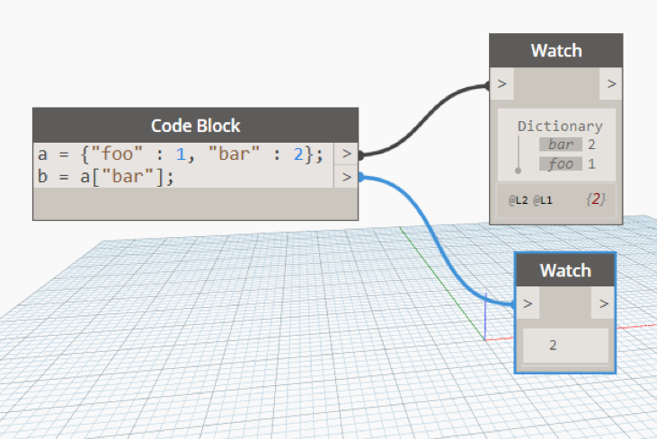

`Dictionary.ByKeysValues` zero-touch 方法可以用作初始化词典的更通用方法，通过分别传入键和值列表并具有使用 zero-touch 方法的所有花里胡哨的功能，如复制导向等。

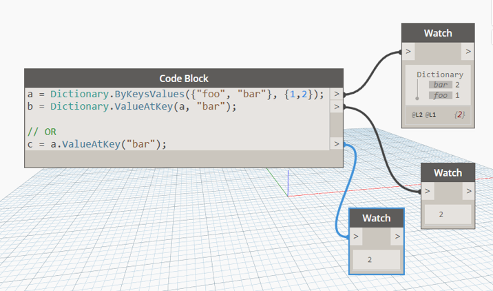

### 为什么我们不使用任意表达式作为词典初始化语法？

我们尝试了在词典键值初始化语法中对键使用任意表达式的想法，发现它可能会导致混乱的结果，尤其是当 `{keys : vals}`（`keys`，`vals`都表示列表）等语法干扰 DesignScript 的其他语言功能（如复制）并从 zero touch 初始值设定项节点产生不同的结果时。

例如，可能还有其他情况（如以下语句）很难定义预期行为：

```
dict = {["foo", "bar"] : "baz" };
```

进一步将复制导向语法等添加到混合，而不仅仅是标识符，将违背语言简单性的想法。

我们 _可以_ 扩展词典键以支持将来的任意表达式，但我们还必须确保与其他语言特性的交互是一致的和可理解的，但代价是增加复杂性，而不是使系统变得不那么强大但易于理解。鉴于总有另一种方法可以解决这个问题，那就是使用 `Dictionary.ByKeysValues(keyList, valueList)` 方法，这并不是什么大问题。

### 与 Zero Touch 节点交互：

**1\.返回 .NET 词典的 Zero Touch 节点会以 Dynamo 词典形式返回**

**请考虑以下返回 IDictionary 的 zero-touch C# 方法：** 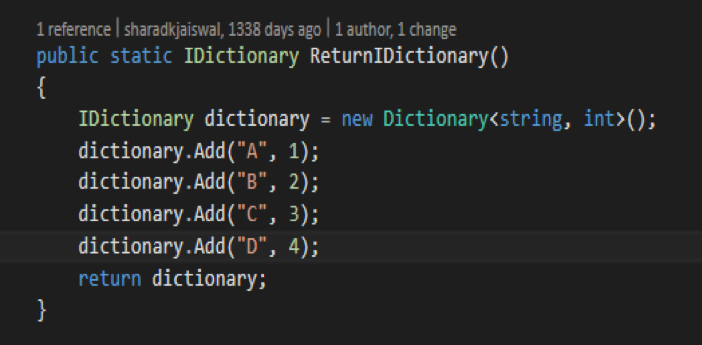

**相应的 ZT 节点返回值以 Dynamo 词典形式封送处理：** 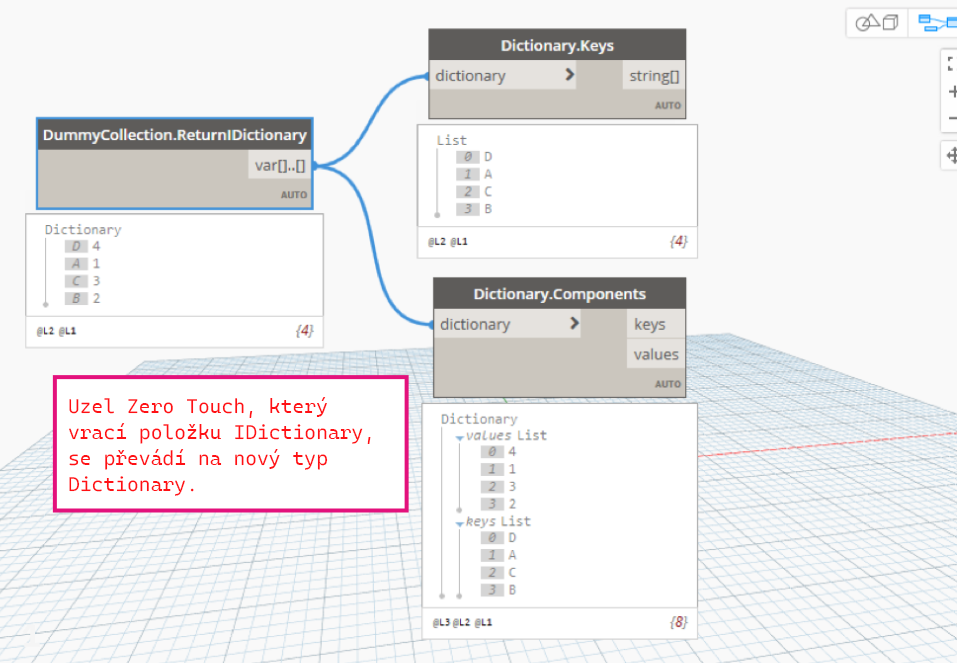

**2\.多回波节点预览为词典**

**返回具有多重返回属性的 IDictionary 的 Zero Touch 节点会返回 Dynamo 词典：** 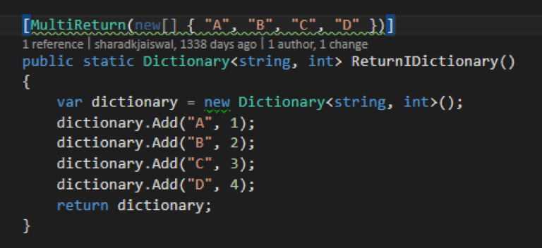

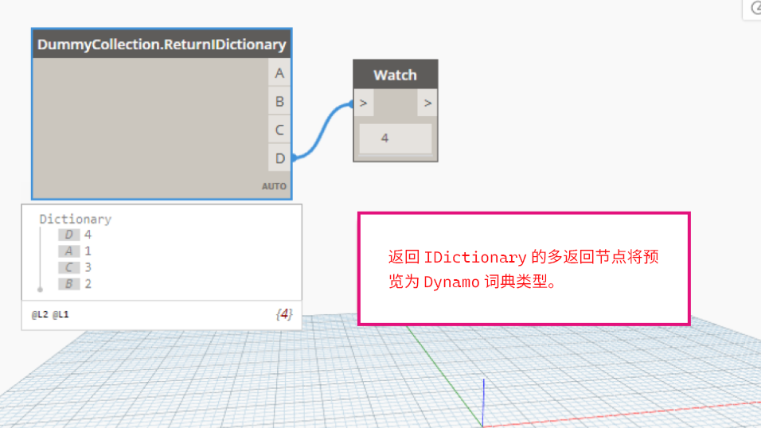

**3\.Dynamo 词典可以作为输入传递到接受 .NET 词典的 Zero-Touch 节点**

**带有 IDictionary 参数的 ZT 方法：** 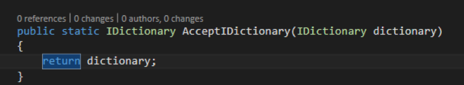

**ZT 节点接受 Dynamo 词典作为输入：** 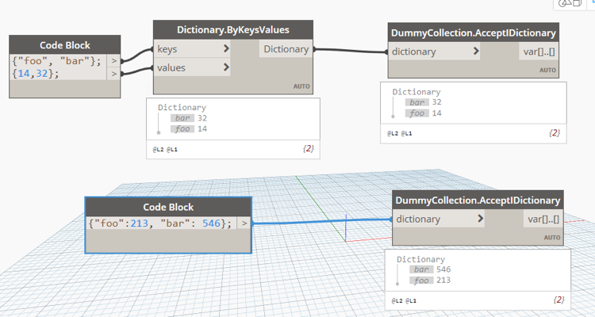

### 多返回节点中的词典预览

词典是未排序的键值对。与此思路一致，因此不能保证按节点返回值的顺序，对返回词典的节点的键值对预览进行排序。

但是，我们对已定义 `MultiReturnAttribute` 的多返回节点进行了例外处理。在以下示例中，`DateTime.Components` 节点是“多返回”节点，节点预览反映其键值对的顺序与节点上的输出端口的顺序相同，这也是根据节点定义上的 `MultiReturnAttribute` 指定输出的顺序。

另请注意，与 UI 节点不同，代码块的预览不按顺序排列，因为代码块节点的输出端口信息（以多返回属性的形式）不存在：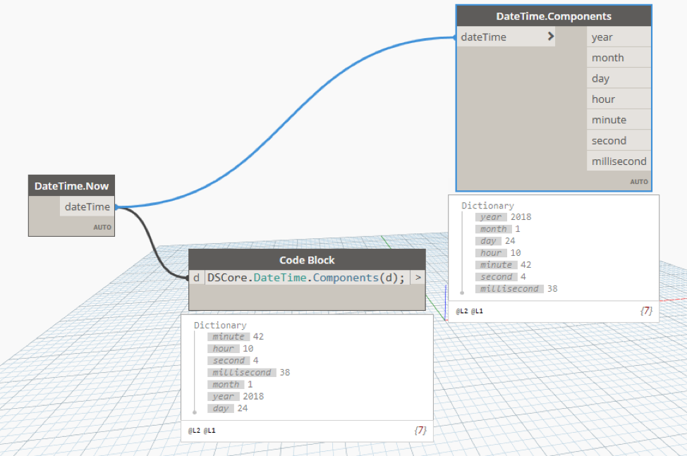
