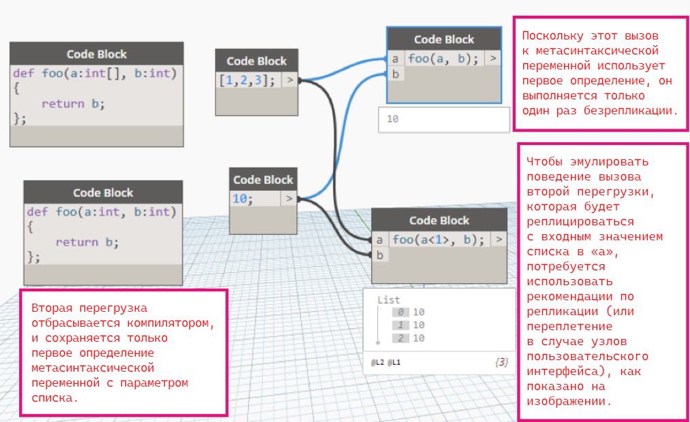

# Изменения языка 

В разделе «Изменение языка» представлен обзор обновлений и изменений, внесенных в язык в каждой версии Dynamo. Эти изменения могут повлиять на функциональность, производительность и использование. В этом руководстве описано, как, когда и почему следует адаптироваться к обновлениям.

## Изменения языка в Dynamo2.0

1. Изменение синтаксиса list@level с @-1 на @L1.
* Новый синтаксис для list@level: требуется list@L1 вместо list@-1.
* Объяснение. Приведение синтаксиса кода в соответствие с предварительным просмотром/пользовательским интерфейсом. Пользовательское тестирование показало, что новый синтаксис выглядит понятнее.

2. Реализация типов Int и Double в TS для согласования с типами Dynamo.

3. Избегание перегруженных функций, где аргументы различаются только по кардинальности.
* Старые графики, в которых используются удаленные перегрузки, должны по умолчанию использовать перегрузки с более высоким рангом.
* Объяснение. Упрощение понимания того, какая именно функция выполняется.

4. Отключение продвижения массива с помощью руководств по репликации.

5. Использование значений переменных только в области видимости императивного блока.
* Значения переменных, определенные в императивных блоках кода, не будут изменяться в результате изменений внутри императивных блоков, которые на них ссылаются.  

6. Переход на неизменяемые переменные с целью запретить ассоциативное обновление в узлах Code Block.

7. Компиляция всех узлов пользовательского интерфейса в статические методы.

8. Поддержка операторов возврата без назначения.
* "=" не требуется ни в определениях функций, ни в императивном коде.

9. Перенос старых названий методов в CBN.
* Многие узлы были переименованы для повышения удобочитаемости и размещения в пользовательском интерфейсе обозревателя библиотеки.

10. Разделение списков и словарей.

----
Известные проблемы
- Конфликты пространств имен в императивных блоках приводят к появлению непредвиденных входных портов. Дополнительные сведения см. на странице [проблемы Github](https://github.com/DynamoDS/Dynamo/issues/8796). Чтобы обойти проблему, определите функцию за пределами императивного блока следующим образом:
```
pnt = Autodesk.Point.ByCoordinates;
lne = Autodesk.Line.ByStartPointEndPoint;

[Imperative]
{
    x = 1;
    start = pnt(0,0,0);
    end = pnt(x,x,x);
    line = lne(start,end);
    return = line;
};
```

## Объяснение изменений языка в Dynamo 2.0

В версии Dynamo2.0 внесен ряд улучшений в основном с целью упрощения языка. Главной задачей было сделать DesignScript более простым в использовании и понятным, чтобы расширить его возможности и варианты применения.

Ниже приведен список изменений в версии 2.0.
* Упрощенный синтаксис List@Level.
* Запрет на перегруженные методы с параметрами, различающимися только по рангу. 
* Компиляция всех узлов пользовательского интерфейса в виде статических методов.
* Отключение преобразования в список при использовании с руководствами по репликации/переплетением.
* Неизменяемость переменных в ассоциативных блоках для предотвращения ассоциативного обновления.
* Ограничение использования переменных областью видимости императивного блока.
* Разделение списков и словарей.

## 1\. Упрощенный синтаксис list@level 

Новый синтаксис для list@level: требуется `list@L1` вместо `list@-1` 


## 2\. Запрет на перегруженные функции с параметрами, различающимися только по рангу
Перегруженные функции вызывают проблемы по ряду причин.
* Перегруженная функция, обозначенная узлом пользовательского интерфейса на графике, может отличаться от перегрузки, выполняемой во время выполнения.
* Разрешение методов требует много ресурсов и плохо работает для перегруженных функций.
* Сложно понять поведение репликации для перегруженных функций.

Например, у узла `BoundingBox.ByGeometry` в старых версиях Dynamo было две перегруженные функции, одна из которых принимала один аргумент значения, а другая — список геометрий:
```
BoundingBox BoundingBox.ByGeometry(geometry: Geometry) {...}
BoundingBox BoundingBox.ByGeometry(geometry: Geometry[]) {...}
```
Если пользователь перетащит первый узел в активное окно и подключит список геометрий, он будет ожидать, что сработает репликация, но этого не произойдет, потому что во время выполнения вместо нее будет вызвана вторая перегрузка, как показано ниже: 
 
По этой причине в версии 2.0 запрещаются перегруженные функции, которые различаются только кардинальностью параметров. Это означает, что для перегруженных функций с одинаковым количеством и типом параметров, которые отличаются только рангом одного или нескольких параметров, перегрузка, определенная первой, всегда будет иметь приоритет, а остальные компилятор будет отбрасывать. Основное преимущество такого улучшения заключается в том, что благодаря быстрому пути выбора функций упрощается логика разрешения методов.

В библиотеке геометрии для версии 2.0 первая перегрузка в примере `BoundingBox.ByGeometry` была исключена, а вторая сохранена, поэтому, если узел предназначен для репликации, т. е. используется в контексте первого, его нужно будет применять с самым коротким (или самым длинным) вариантом переплетения или в блоке кода с руководствами по репликации: 
```
BoundingBox.ByGeometry(geometry<1>);
```
В этом примере видно, что узел с более высоким рангом можно использовать как в реплицированном, так и в нереплицированном вызове, и поэтому он всегда предпочтительнее перегрузки с более низким рангом. Поэтому, как правило, **разработчикам узлов всегда рекомендуется отбрасывать перегрузки с более низким рангом в пользу методов с более высоким рангом**, чтобы компилятор DesignScript всегда вызывал метод с более высоким рангом в качестве первого и единственного, который он найдет.

### Примеры:
В следующем примере были определены две перегрузки функций `foo`. В версии 1.x трудно было однозначно понять, какая перегрузка выбирается во время выполнения. Пользователь мог ожидать, что будет выполняться вторая перегрузка `foo(a:int, b:int)`, и в этом случае метод должен трижды выполнить репликацию и трижды вернуть значение `10`. На самом деле возвращается одно значение `10`, поскольку вместо этого вызывается первая перегрузка с параметром списка.

### В версии 2.0 вторая перегрузка опускается.
В версии 2.0 всегда выбирается первый заданный метод, то есть учитывается их очередность.



В каждом из следующих сценариев будет выбрана первая определенная перегрузка. Здесь учитывается исключительно порядок определения функций, а не ранги параметров, хотя рекомендуется отдавать предпочтение методам с более высоким рангом параметров для пользовательских узлов и узлов ZeroTouch.
```
1)
foo(a: int[], b: int); ✓
foo(a: int, b: int); ✕
```
```
2) 
foo(x: int, y: int); ✓
foo(x: int[], y: int[]); ✕
```
## 3\. Компиляция всех узлов пользовательского интерфейса в статические методы
В Dynamo 1.x узлы пользовательского интерфейса (не являющиеся блоками кода) компилировались в методы и свойства экземпляров соответственно. Например, узел `Point.X` компилировался в `pt.X`, а `Curve.PointAtParameter` — в `curve.PointAtParameter(param)`. Это поведение приводило к двум проблемам:

__A. Функция, представленная узлом пользовательского интерфейса, не всегда совпадала с той, которая выполнялась во время выполнения__

Типичный пример — узел `Translate`. Существует несколько узлов `Translate`, которые принимают одинаковое количество аргументов и типы аргументов, например `Geometry.Translate`, `Mesh.Translate` и `FamilyInstance.Translate`. Из-за того что узлы компилировались как методы экземпляра, можно было передать `FamilyInstance` в узел `Geometry.Translate`, и ошибки бы не возникло, поскольку во время выполнения вызов отправлялся бы в метод экземпляра `Translate` для `FamilyInstance`. Это вводило пользователей в заблуждение, так как узел не выполнял заявленных функций.

__B. Вторая проблема заключалась в том, что методы экземпляров не работали с гетерогенными массивами__

Во время выполнения механизм выполнения должен узнать, в какую функцию следует отправить запрос. Если во входных данных предоставлен список, например `list.Translate()`, поскольку перебор каждого элемента в списке и поиск методов по типу требуют много ресурсов, логика разрешения метода предполагала, что целевой тип совпадает с типом первого элемента, и пыталась найти метод, `Translate()`, определенный для этого типа. В результате, если тип первого элемента не совпадал с целевым типом метода (или даже был значением `null` или пустым списком), весь список завершался ошибкой, даже если в списке были другие, подходящие типы. 

Например, если в `Arc.CenterPoint` передавался входной список со следующими типами `[Arc, Line]`, результат содержал ожидаемую центральную точку дуги и значение `null` для линии. Однако, если порядок был обратным, весь результат имел значение null, так как первый элемент не прошел проверку разрешения метода:
### Dynamo 1.x: для проверки разрешения метода используется только первый элемент входного списка

```
x = [arc, line];
y = x.CenterPoint; // y = [centerpoint, null] ✓
```
```
x = [line, arc];
y = x.CenterPoint; // y = null ✕
```
В версии 2.0 обе эти проблемы решаются путем компиляции узлов пользовательского интерфейса в виде статических свойств и статических методов. 

При использовании статических методов упрощается разрешение методов во время выполнения и не требуется перебирать все элементы во входном списке. Например:

Семантика `foo.Bar()` (метод экземпляра) должна проверять тип `foo`, а также проверять, является ли он списком, а затем сопоставлять его с функциями-кандидатами. При этом задействуется большой объем ресурсов. Зато семантика `Foo.Bar(foo)` (статический метод) проверяет только одну функцию с типом параметра `foo`.

Вот что происходит в версии 2.0:
* Узел свойства пользовательского интерфейса компилируется в статический метод получения: движок создает статическую версию метода получения для каждого свойства. Например, узел `Point.X` компилируется в статический метод получения `Point.get_X(pt)`. Статический метод получения также можно вызвать с помощью псевдонима: `Point.X(pt)` в узле блока кода.
* Узел метода пользовательского интерфейса компилируется в статическую версию: механизм выполнения генерирует соответствующий статический метод для узла. Например, узел `Curve.PointAtParameter` компилируется в `Curve.PointAtParameter(curve: Curve, parameter:double)`, а не `curve.PointAtParameter(parameter)`. 

**Примечание.** В рамках этого изменения поддержка методов экземпляров не была удалена, поэтому существующие методы экземпляров, используемые в CBN, такие как `pt.X` и `curve.PointAtParameter(parameter)` в приведенных выше примерах, по-прежнему будут работать.

Этот пример ранее работал в версии 1.x, так как график компилировался в `point.X;` и находил свойство `X` в объекте точки. Теперь в версии 2.0 происходит сбой, так как скомпилированный код `Vector.X(point)` ожидает только тип `Vector`:


### Преимущества
**Согласованность и понятность:** при использовании статических методов нет сомнений, какой метод будет выбираться во время выполнения. Метод всегда соответствует узлу пользовательского интерфейса, используемому в графике, вызов которого ожидается пользователем.

**Совместимость:** улучшилась взаимосвязь между кодом и визуальной программой.

**Контроль:** при передаче в узлы разнородных входных списков теперь формируются значения, отличные от null, для типов, допустимых узлом, а также значения null для типов, несовместимых с узлом. Результаты становятся более предсказуемыми и дают более четкое представление о допустимых типах для узла.

### Двусмысленность при использовании перегруженных методов

Так как Dynamo, в целом, поддерживает перегрузки функций, может возникнуть путаница, если есть другая перегруженная функция с тем же количеством параметров. Например, см. следующий график. Если соединить числовое значение с входным параметром `direction` `Curve.Extrude`, а вектор — с входным параметром `distance` `Curve.Extrude`, оба узла продолжат работать, хотя не должны. В этом случае, несмотря на то что узлы компилируются в статические методы, механизм выполнения все равно не может определить разницу во время выполнения и выбирает любой из них в зависимости от типа входных данных. 
 
### Устраненные проблемы
Переход на статические методы привел к следующим побочным эффектам, которые стоит упомянуть в связи с изменениями языка в версии 2.0.

**1\. Невозможность полиморфного поведения**

Рассмотрим для примера узлы `TSpline` в `ProtoGeometry` (`TSplineTopology` наследуется от базового типа `Topology`): узел `Topology.Edges`, который ранее компилировался в метод экземпляра `object.Edges`, теперь компилируется в статический метод `Topology.Edges(object)`. Раньше вызов полиморфно разрешался в метод производного класса `TsplineTopology.Edges` после назначения метода в соответствии с типом объекта во время выполнения. 


После введения статических методов приходится вызывать метод базового класса `Topology.Edges`. В результате этот узел возвращал базовый класс, объекты `Edge` вместо объектов производного класса типа `TSplineEdge`.
 


Это оказалось регрессией, так как последующие узлы `TSpline`, ожидавшие `TSplineEdges`, завершались сбоями. 

Проблема устранена добавлением дополнительной проверки в логику диспетчеризации метода. Она выполняется в процессе выполнения и проверяет тип экземпляра на соответствие типу или подтипу первого параметра метода. Для входных списков упрощено назначение методов — теперь достаточно проверить тип первого элемента. Таким образом, в итоге достигнут компромисс между частично статическим и частично динамическим поиском метода.

**Новое полиморфное поведение в версии 2.0**


В этом случае, поскольку переменная `a` первого элемента является `TSpline`, во время выполнения вызывается производный метод `TSplineTopology.Edges`. В результате возвращается `null` для переменной `b` базового типа `Topology`. 

Во втором случае, так как переменная `b` общего типа `Topology` является первым элементом, вызывается базовый метод `Topology.Edges`. Поскольку `Topology.Edges` также принимает производный тип `TSplineTopology`, при поступлении `a` возвращается `Edges` для обоих входных значений: `a` и `b`.


 
**2\. Регрессии в результате создания избыточных внешних списков**

В контексте поведения руководства по репликации между методами экземпляра и статическими методами есть одно важное различие. При использовании методов экземпляра единичные входные значения с руководствами по репликации не преобразуются в списки при преобразовании в статические методы.

Рассмотрим пример узла `Surface.PointAtParameter` с перекрестным переплетением, с одним входным значением поверхности и массивами значений параметров `u` и `v`. Метод экземпляра компилируется следующим образом:
```
surface<1>.PointAtParameter(u<1>, v<2>);
```
в результате будет создан двумерный массив точек.
 
Статический метод компилируется следующим образом:
```
Surface.PointAtParameter(surface<1>, u<2>, v<3>);
```
в результате будет создан трехмерный список точек с избыточным последним списком.

Этот побочный эффект компиляции узлов пользовательского интерфейса в статические методы потенциально может вызвать регрессию в подобных вариантах использования. Для устранения проблемы была отключена возможность преобразования единичных входных значений в список при использовании с руководствами по репликации или переплетением (см. следующий пункт).
 
**4\. Отключение преобразования в список при использовании с руководствами по репликации/переплетением**

В версии 1.x было два случая, когда отдельные значения преобразовывались в списки:

* Когда входные данные с более низким рангом передавались в функции, ожидающие входные данные с более высоким рангом.
* Когда входные данные с более низким рангом передавались в функции, ожидающие тот же ранг, но при этом входные аргументы были декорированы руководствами по репликации или использовали переплетение.

В версии 2.0 больше не поддерживается последний случай, и в таких сценариях не будет происходить преобразование в список.

На следующем графике в версии 1.x один уровень руководства по репликации для `y` и `z` привел к повышению до ранга для каждого из них, поэтому результатом стал ранг 3 (по 1 для `x`, `y` и `z`). Пользователь ожидает ранг 1, поскольку не очевидно, что наличие руководств по репликации для единичных входных значений приведет к сложению уровней.
```
x = 1..5;
y = 0;
z = 0;
p = Point.ByCoordinates(x<1>, y<2>, z<3>); // cross-lacing
```

### Dynamo 1.x: трехмерный список точек


В версии 2.0 наличие руководств по репликации для каждого из аргументов с одним значением (`y` и `z`) не приводит к повышению уровня, поэтому список имеет ту же размерность, что и входной одномерный список для `x`. 

### Dynamo 2.0: одномерный список точек


Это изменение также устраняет упомянутую выше регрессию, вызванную компиляцией статического метода с генерацией избыточных внешних списков.

Продолжая приведенный выше пример, мы увидели, что при вызове статического метода вида:
```
Surface.PointAtParameter(surface<1>, u<2>, v<3>); 
```
был создан трехмерный список точек в Dynamo 1.x. Это произошло, поскольку первая поверхность аргумента с одним значением была преобразована в список при использовании с руководством по репликации.
 
### Dynamo 1.x: преобразование аргументов в список при использовании руководства по репликации


В версии 2.0 отключено преобразование аргументов с одним значением в списки при использовании с руководствами по репликации или переплетением. Теперь вызов:
```
Surface.PointAtParameter(surface<1>, u<2>, v<3>);
```
просто возвращает двумерный список, так как ранг поверхности не повышается.

### Dynamo 2.0: отключено преобразование аргументов с одним значением в список при использовании руководства по репликации.


Теперь избыточный уровень списка не будет добавляться. Кроме того, устраняется регрессия, вызванная переходом на компиляцию статических методов.

### Преимущества

**Удобочитаемость:** результаты соответствуют ожиданиям пользователей и проще воспринимаются.

**Совместимость:** узлы пользовательского интерфейса (с параметром переплетения) и CBN, использующие руководства по репликации, дают совместимые результаты.

**Согласованность:** 
* Методы экземпляров и статические методы согласованы (устранены проблемы с семантикой статических методов).
* Узлы с входными данными и аргументами по умолчанию ведут себя согласованно (см. ниже).


## 5\. Переменные в узлах Code Block являются неизменяемыми для предотвращения ассоциативного обновления 

Исторически сложилось так, что DesignScript поддерживает две парадигмы программирования: ассоциативное и императивное. Ассоциативный код создает граф зависимостей на основе операторов программы, в которых переменные зависят друг от друга. Обновление одной переменной может инициировать обновление остальных переменных, зависимых от нее. Это означает, что последовательность выполнения операторов в ассоциативном блоке основана не на их порядке, а на зависимостях между переменными.

В следующем примере последовательность выполнения кода выглядит следующим образом: строки 1 -> 2 -> 3 -> 2. Поскольку `b` зависит от `a`, при обновлении `a` в строке 3 выполнение снова переходит на строку 2, чтобы обновить `b` с учетом нового значения `a`. 
```
1. a = 1; 
2. b = a * 2;
3. a = 2;
```
Если тот же код выполняется в императивном контексте, операторы выполняются последовательно друг за другом. Таким образом, императивные блоки кода подходят для последовательного выполнения таких конструкций как циклы и условия if-else.

### Неоднозначность при ассоциативном обновлении

**1\. Переменные с циклической зависимостью**

Иногда циклическая зависимость между переменными не так очевидна, как в следующем случае. В таких ситуациях, когда компилятор не может обнаружить цикл статически, цикл может выполняться бесконечно.
```
a = 1;
b = a;
a = b;
```
**2\. Переменные зависят от себя**

Если переменная зависит от самой себя, должно ли ее значение складываться или сбрасываться до исходного при каждом обновлении?
```
a = 1;
b = 1;
b = b + a + 2; // b = 4
a = 4;         // b = 10 or b = 7?
```
В этом примере геометрии, поскольку переменная `b` куба зависит от себя и от цилиндра `a`, должно ли перемещение ползунка приводить к перемещению отверстия вдоль блока или эффект должен быть накопительным и необходимо создавать нескольких отверстий вдоль траектории при каждом обновлении положения ползунка?


**3\. Обновление свойств переменных**

```
1: def foo(x: A) { x.prop = ...; return x; }
2: a = A.A();
3: p = a.prop;
4: a1 = foo(a);  // will p update?
```

**4\. Обновление функций**

```
1: def foo(v: double) { return v * 2; }// define “foo”
2: x = foo(5);                         // first definition of “foo” called
3: def foo(v: int) { return v * 3; }   // overload of “foo” defined, will x update?
```
Опыт показывает, что ассоциативное обновление не подходит для узлов Code Block в контексте потока данных на основе узлов. Когда среды визуального программирования еще не использовались, единственным способом изучения вариантов было явное изменение значений некоторых переменных в программе. В текстовой программе хранится полный список обновлений переменной, тогда как в среде визуального программирования отображается только последнее значение. 

Если некоторые пользователи применяли эти возможности, скорее всего, они делали это ненамеренно, и это приносило больше вреда, чем пользы. Поэтому в версии 2.0 было решено скрыть ассоциативность при использовании узлов Code Block, сделав переменные неизменяемыми, но при этом ассоциативное обновление сохранилось как встроенная функция исключительно для механизма DS. Это еще одно изменение, сделанное с целью упростить пользователям процесс написания сценариев.

**Ассоциативное обновление отключено в CBN путем запрета на переопределение переменной:** 

**Индексация списков по-прежнему разрешена в блоках кода**

Для индексирования списков было сделано исключение — оно по-прежнему разрешено в версии 2.0 с назначением оператора индекса.

В следующем примере видно, что переменная `a` списка инициализирована, но впоследствии может быть перезаписана назначением оператора индекса, и что все переменные, зависящие от `a`, будут обновляться ассоциативно, как видно по значению `c`. Кроме того, при предварительном просмотре узла отображаются обновленные значения `a` после переопределения одного или нескольких элементов переменной.


## 6\. Переменные в императивных блоках являются локальными по отношению к области видимости императивного блока

В версии 2.0 мы внесли существенные изменения в правила определения области, чтобы запретить сложные сценарии обновления между версиями.

В Dynamo 1.x в следующем сценарии строки будут выполняться в следующей последовательности: 1 -> 2 -> 4 -> 6 -> 4, причем изменение распространяется из внешней области во внутреннюю. Поскольку `y` обновляется во внешнем ассоциативном блоке, а `x` в императивном блоке зависит от `y`, управление переходит от внешней ассоциативной программы к императивному оператору в строке 4. 
```
1: x = 1;
2: y = 2;
3: [Imperative] {
4:     x = 2 * y;
5: }
6: y = 3;
```

Последовательность выполнения в примере ниже будет следующей: 1 -> 2 -> 4 -> 2, причем изменение распространится из внутренней языковой области во внешнюю.
```
1: x = 1;
2: y = x * 2;
3: [Imperative] {
4:     x = 3;
5: }
```
Приведенные выше сценарии относятся к обновлению между языками, которое, как и ассоциативное обновление, не очень подходит для узлов Code Block. Во избежание сложных сценариев обновлений между языками переменные в императивной области видимости стали локальными. 

Пример ниже относится к Dynamo 2.0:
```
x = 1;
y = x * 2;
i = [Imperative] {
     x = 3;
     return x;
}
```
* Переменная `x`, определенная в императивном блоке, теперь является локальной для области видимости императивного блока.
* Во внешней области переменные `x` и `y` по-прежнему имеют значения `1` и `2` соответственно.

Любая локальная переменная внутри императивного блока должна возвращаться, если ее значение должно быть доступно во внешней области.

Рассмотрим пример:
```
1: x = 1;
2: y = 2;
3: [Imperative] {
4:     x = 2 * y;
5: }
6: y = 3; // x = 1, y = 3
```
* Переменная `y` копируется локально внутри области действия императивного блока.  
* Значение переменной `x`, локальное для области видимости императивного блока, равно `4`.
* При обновлении значения переменной `y` во внешней области значение переменной `x` по-прежнему меняется из-за обновления между языками, но не обновляется в узлах Code Block в версии 2.0, поскольку переменные являются неизменяемыми.
* Переменные `x` и `y` во внешней ассоциативной области по-прежнему имеют значения `1` и `2` соответственно.

## 7\. Списки и словари

В Dynamo 1.x списки и словари были представлены единым унифицированным контейнером, который можно было индексировать как по целочисленному индексу, так и по ключу, не представленному целым числом. В следующей таблице описано разделение списков и словарей в версии 2.0 и приводятся правила нового типа данных «словарь».

|                               |    1.x                      |    2.0                                   |
| :---------------------------- | --------------------------- | ---------------------------------------- |
| **Инициализация списка**       | `a = {1, 2, 3};`            | `a = [1, 2, 3];`                         |
| **Пустой список**                | `a = {};`                   | `a = [];`                                |
| **Инициализация словаря** | **Словарь можно было динамически дополнять:** | **Можно только создавать новые словари:** |
|                           | `a = {};`                   | `a = {“foo” : 1, “bar” : 2};`            |
|                           | `a[“foo”] = 1;`             | `b = {“foo” : 1, “bar” : 2, “baz” : 3};` |
|                           | `a[“bar”] = 2;`             | `a = {};` // Создание пустого словаря |
|                           | `a[“baz”] = 3;`             |                                          |
| **Индексация словаря**   | **Индексация ключей**            | **Синтаксис индексации остался прежним**     |
|                           | `b = a[“bar”];`             | `b = a[“bar”];`                          |
| **Ключи словаря**       | **Допускались ключи любого типа**  | **Ключами могут быть только строки**           |
|                           | `a = {};`                   | `a  = {“false” : 23, “point” : 12};`     |
|                           | `a[false] = 23;`            |                                          |
|                           | `a[point] = 12;`            |                                          |

### Новый синтаксис списка `[]`
В версии 2.0 для инициализации списка используются не фигурные скобки `{}`, а квадратные `[]`. Все сценарии версии 1.x автоматически будут преобразованы с учетом нового синтаксиса при открытии в версии 2.0. 

**Обратите внимание на атрибуты аргументов по умолчанию в узлах Zero Touch:**

Автоматический перенос не будет выполнен для старого синтаксиса, используемого в атрибутах аргументов по умолчанию. При необходимости разработчикам узлов потребуется вручную обновить определения методов Zero Touch, чтобы использовать новый синтаксис в атрибутах аргументов по умолчанию `DefaultArgumentAttribute`.

**Примечание по индексации**

Новое поведение индексации в некоторых случаях изменилось. При индексации в список/словарь с произвольным списком индексов/ключей с помощью оператора `[]` теперь сохраняется структура входного списка индексов/ключей. Ранее всегда возвращался одномерный список значений:
```
Given:
a = {“foo” : 1, “bar” : 2};

1.x:
b = a[{“foo”, {“bar”}}];
returns {1, 2}

2.0:
b = a[[“foo”, [“bar”]]];
returns [1, [2]];
```

### Синтаксис инициализации словаря:

Синтаксис `{}` (с фигурными скобками) для инициализации словаря может использоваться только в 
```
dict = {<key> : <value>, …}; 
```
формате пар «ключ-значение», в котором для ключа`<key>` допускается только строка, а несколько пар «ключ-значение» разделены запятыми.


Метод `Dictionary.ByKeysValues` Zero Touch можно использовать как более универсальный способ инициализации словаря, передавая список ключей и значений соответственно и используя все возможности методов Zero Touch, такие как руководства по репликации.


### Почему в синтаксисе инициализации словаря нельзя использовать произвольные выражения?

Мы экспериментировали с произвольными выражениями для ключей в синтаксисе инициализации словаря и обнаружили, что это может привести к недоразумениям, особенно когда синтаксис вида `{keys : vals}` (где `keys` и `vals` представляют собой списки) конфликтует с другими языковыми функциями DesignScript, такими как репликация, и выдает результаты, отличные от узла инициализатора Zero Touch. 

Например, могут быть и другие случаи, подобные этому оператору, когда будет трудно определить ожидаемое поведение:
```
dict = {["foo", "bar"] : "baz" };
```
Если дальше добавить синтаксис руководств по репликации и т. д., а не только идентификаторы, это будет противоречить принципам простоты языка. 

В будущем мы _можем_ расширить синтаксис ключей словаря, чтобы они поддерживали произвольные выражения, но нам необходимо убедиться, что взаимодействие с другими языковыми функциями будет согласованным и понятным. Расширение возможностей приведет к усложнению языка. При этом проблему всегда можно решить альтернативным способом — с помощью метода `Dictionary.ByKeysValues(keyList, valueList)`.

### Взаимодействие с узлами Zero Touch

__1\. Узел Zero Touch возвращает словарь .NET в виде словаря Dynamo__

**Рассмотрим следующий метод C# Zero Touch, возвращающий IDictionary:** 

**Возвращаемое значение соответствующего узла Zero Touch преобразуется в словарь Dynamo:** 

__2\. Узлы, возвращающие несколько значений, предварительно отображаются в виде словарей__

**Узел Zero Touch, возвращающий идентификатор IDictionary с несколькими возвращаемыми значениями, возвращает словарь Dynamo:** 


__3\. Словарь Dynamo можно передать в качестве входных данных в узел Zero Touch, принимающий словарь .NET__

**Метод Zero Touch с параметром IDictionary:** 

**Узел Zero Touch принимает словарь Dynamo в качестве входных данных:** 

### Предварительный просмотр словаря в узлах с несколькими возвращаемыми значениями

Словари представляют собой неупорядоченные пары «ключ-значение». В соответствии с этим принципом, предварительный просмотр пар «ключ-значение» в узлах, возвращающих словари, не обязательно будет упорядочен в соответствии с порядком возвращаемых значений узлов. 

Однако мы сделали исключение для узлов, возвращающих несколько значений, для которых определен атрибут `MultiReturnAttribute`. В следующем примере узел `DateTime.Components` возвращает несколько значений, и в предварительном просмотре узла его пары «ключ-значение» отображаются в том же порядке, что и выходные порты на узле, и этот же порядок используется для выходных данных на основе атрибута `MultiReturnAttribute` в определении узла.

В отличие от узла пользовательского интерфейса, предварительный просмотр для блоков кода не упорядочен, так как сведения о выходных портах (в виде атрибута с несколькими возвращаемыми значениями) не существуют для узла Code Block: 
