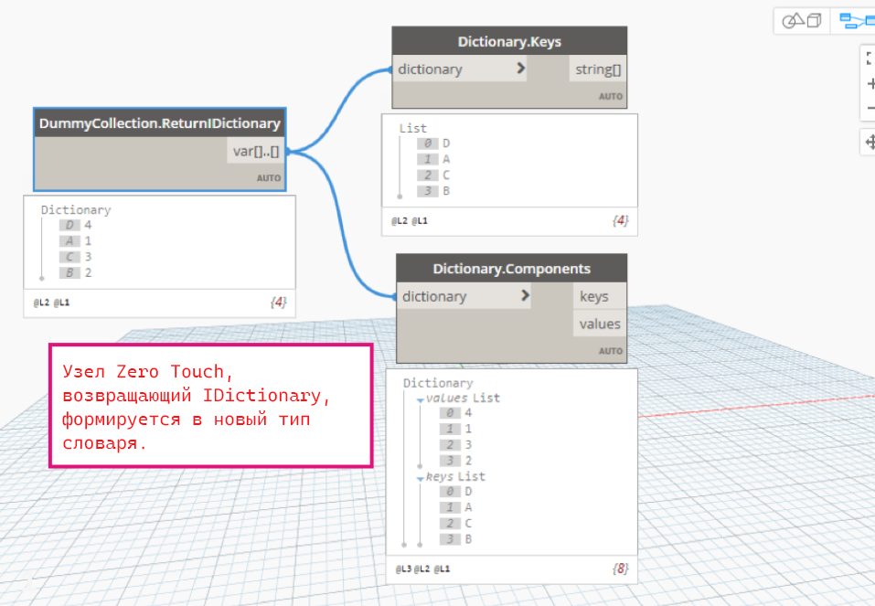

# Cambios en el lenguaje

La sección Cambios en el lenguaje proporciona una descripción general de las actualizaciones y modificaciones realizadas en el lenguaje de Dynamo en cada versión. Estos cambios pueden afectar a la funcionalidad, el rendimiento y el uso, y esta guía ayudará a los usuarios a comprender cuándo y por qué adaptarse a estas actualizaciones.

## Cambios en el lenguaje de Dynamo 2.0

1. Cambio en la sintaxis de list@level de "@-1" a "@L1"
* Nueva sintaxis de list@level para usar list@L1 en lugar de list@-1.
* Motivo: alinear la sintaxis del código con la vista previa y la interfaz de usuario; las pruebas de usuario muestran que esta nueva sintaxis es más comprensible.

2. Implementación de los tipos Int y Double en TS para que coincidan con los tipos de Dynamo

3. No se permiten las funciones sobrecargadas en las que los argumentos solo difieren por cardinalidad
* Los gráficos antiguos que utilizan sobrecargas que se han eliminado deben usar por defecto las sobrecargas de mayor rango.
* Motivo: eliminar la ambigüedad sobre qué función específica se está ejecutando.

4. Desactivación de la promoción de matriz con guías de replicación

5. Convertir las variables de los bloques imperativos en locales al ámbito del bloque imperativo
* Los valores de variable definidos dentro de los bloques de código imperativo no se verán alterados por los cambios realizados dentro de los bloques imperativos que hacen referencia a ellos.  

6. Conversión de las variables en inmutables para desactivar la actualización asociativa en los nodos de bloque de código

7. Compilación de todos los nodos de la interfaz de usuario en métodos estáticos

8. Admisión de sentencias de retorno sin asignación
* "=" no es necesario ni en definiciones de función ni en código imperativo.

9. Migración de los nombres de métodos antiguos en CBN
* Se ha cambiado el nombre de muchos nodos para mejorar la legibilidad y la ubicación en la interfaz de usuario del navegador de biblioteca.

10. Lista como limpieza de diccionario

----
Problemas conocidos:
- Los conflictos de espacio de nombres en los bloques imperativos provocan la aparición de puertos de entrada inesperados. Consulte el [problema de GitHub](https://github.com/DynamoDS/Dynamo/issues/8796) para obtener más información. Para evitar esto, defina la función fuera del bloque imperativo de la siguiente manera:
```
pnt = Autodesk.Point.ByCoordinates;
lne = Autodesk.Line.ByStartPointEndPoint;

[Imperative]
{
    x = 1;
    start = pnt(0,0,0);
    end = pnt(x,x,x);
    line = lne(start,end);
    return = line;
};
```

## Explicación de los cambios en el lenguaje de Dynamo 2.0

Se han realizado varias mejoras en el lenguaje de la versión 2.0 de Dynamo. El principal motivo para hacerlo fue simplificar el lenguaje. Se ha hecho hincapié en hacer que DesignScript sea más comprensible y fácil de usar con el objetivo de hacerlo más eficaz y flexible y mejorar la comprensibilidad por parte del usuario final.

A continuación se muestra la lista de cambios de la versión 2.0 explicada:
* Sintaxis de List@Level simplificada
* Los métodos sobrecargados con parámetros que solo difieren por rango no son válidos 
* Compilación de todos los nodos de la interfaz de usuario como métodos estáticos
* Desactivada la promoción a lista cuando se utiliza con guías de replicación/encaje
* Las variables de los bloques asociativos son inmutables para evitar la actualización asociativa
* Las variables de los bloques imperativos son locales al ámbito imperativo
* Separación de listas y diccionarios

## 1\. Sintaxis de list@level simplificada 

Nueva sintaxis de list@level para usar `list@L1` en lugar de `list@-1` 


## 2\. Las funciones sobrecargadas con parámetros que solo difieren por rango no son válidas
Las funciones sobrecargadas son problemáticas por varios motivos:
* Es posible que una función sobrecargada indicada por un nodo de interfaz de usuario en el gráfico no sea la misma sobrecarga que se ejecuta en tiempo de ejecución.
* La resolución del método es costosa y no funciona bien para funciones sobrecargadas.
* Es difícil comprender el comportamiento de replicación de funciones sobrecargadas.

Tomemos `BoundingBox.ByGeometry` como ejemplo (había dos funciones sobrecargadas en versiones anteriores de Dynamo); en un caso toma un argumento de un solo valor y en el otro toma una lista de geometrías como argumento:
```
BoundingBox BoundingBox.ByGeometry(geometry: Geometry) {...}
BoundingBox BoundingBox.ByGeometry(geometry: Geometry[]) {...}
```
Si el usuario coloca el primer nodo en el lienzo y conecta una lista de geometrías, espera que la replicación se active, pero esto nunca sucede porque se llamará a la segunda sobrecarga en tiempo de ejecución, como se muestra a continuación: 
 
En la versión 2.0, no se permiten las funciones sobrecargadas que solo difieren en la cardinalidad de los parámetros por este motivo. Esto significa que, para las funciones sobrecargadas que tienen el mismo número y tipo de parámetros, pero que tienen uno o más parámetros que difieren solo en el rango, la sobrecarga que se define primero siempre se impone, mientras que el resto las descarta el compilador. La principal ventaja de realizar esta simplificación es la de simplificar la lógica de resolución del método al tener una ruta rápida para seleccionar las funciones candidatas.

En la biblioteca de geometría de la versión 2.0, la primera sobrecarga del ejemplo d `BoundingBox.ByGeometry` quedó obsoleta y la segunda se conservó, por lo que si el nodo estuviera destinado a replicarse, es decir, a usarse en el contexto de la primera, tendría que usarse con la opción de encaje más corta (o más larga), o en un bloque de código con guías de replicación: 
```
BoundingBox.ByGeometry(geometry<1>);
```
Podemos ver en este ejemplo que el nodo de mayor rango se puede usar tanto en una llamada replicada como en una no replicada y, por lo tanto, siempre se prefiere a una sobrecarga de menor rango. Por lo tanto, como regla general, **siempre se recomienda a los autores de nodos que descarten las sobrecargas de menor rango en favor de los métodos de mayor rango**, de modo que el compilador de DesignScript siempre llame al método de mayor rango al ser el primero y único que encuentra.

### Ejemplos:
En el ejemplo siguiente, se han definido dos sobrecargas de la función `foo`. En las versiones 1.x, no está claro qué sobrecarga se ejecuta en tiempo de ejecución. El usuario podría esperar que se ejecute el segundo `foo(a:int, b:int)` de sobrecarga, en cuyo caso, se esperaría que el método se replicara tres veces y devolviese un valor de `10` tres veces. En realidad, lo que se devuelve es un único valor de `10`, ya que lo que se invoca es la primera sobrecarga con el parámetro list.

### La segunda sobrecarga se omite en 2.0:
En la versión 2.0, siempre se elige el primer método definido sobre el resto. Se hace valer el orden de llegada.


En cada uno de los siguientes casos, se toma la primera sobrecarga definida. Tenga en cuenta que se considera exclusivamente el orden de definición de las funciones, y no el rango de los parámetros, aunque se recomienda dar preferencia a los métodos con parámetros de mayor rango en el caso de los nodos definidos por el usuario y los nodos Zero-Touch.
```
1)
foo(a: int[], b: int); ✓
foo(a: int, b: int); ✕
```
```
2) 
foo(x: int, y: int); ✓
foo(x: int[], y: int[]); ✕
```
## 3\. Compilación de todos los nodos de la interfaz de usuario en métodos estáticos
En Dynamo 1.x, los nodos de la interfaz de usuario (bloques sin código) se compilaban en métodos y propiedades de ejemplar respectivamente. Por ejemplo, el nodo `Point.X` se compilaba en `pt.X` y `Curve.PointAtParameter` se compilaba en `curve.PointAtParameter(param)`. Este comportamiento presentaba dos problemas:

__A. La función que representaba el nodo de la interfaz de usuario no siempre era la misma función que se ejecutaba en tiempo de ejecución__

Un ejemplo típico es el nodo `Translate`. Hay varios nodos `Translate` que toman el mismo número y tipos de argumentos, tales como: `Geometry.Translate`, `Mesh.Translate` y `FamilyInstance.Translate`. Debido al hecho de que los nodos se compilaban como métodos de ejemplar, la acción de pasar un `FamilyInstance` a un nodo `Geometry.Translate` sorprendentemente funcionaba, ya que en tiempo de ejecución enviaba la llamada al método de instancia `Translate` en un `FamilyInstance`. Obviamente, esto era engañoso para los usuarios, ya que el nodo no hacía lo que decía.

__B. El segundo problema era que los métodos de ejemplar no funcionaban con matrices heterogéneas__

En tiempo de ejecución, el motor de ejecución necesita averiguar a qué función se debe enviar. Si la entrada es una lista, digamos `list.Translate()`, ya que es costoso revisar cada elemento de una lista y buscar métodos en su tipo, la lógica de resolución del método simplemente asumía que el tipo de destino era el mismo que el tipo del primer elemento e intentaba buscar el método `Translate()` definido en ese tipo. De esta forma, si el tipo del primer elemento no coincidía con el tipo objetivo del método (o incluso si era `null` o una lista vacía), se producía un error en toda la lista, incluso si había otros tipos en la lista que coincidiesen. 

Por ejemplo, si se pasaba una entrada de lista con los siguientes tipos `[Arc, Line]` a `Arc.CenterPoint`, el resultado contenía un punto central para el arco y un valor de `null` para la línea según lo previsto. Sin embargo, si se invertía el orden, todo el resultado era nulo, ya que el primer elemento no superaba la comprobación de resolución del método:
### Dynamo 1.x: prueba solo el primer elemento de la lista de entrada en la comprobación de resolución del método

```
x = [arc, line];
y = x.CenterPoint; // y = [centerpoint, null] ✓
```
```
x = [line, arc];
y = x.CenterPoint; // y = null ✕
```
En la versión 2.0, ambos problemas se resuelven mediante la compilación de los nodos de interfaz de usuario como propiedades estáticas y métodos estáticos. 

Con los métodos estáticos, la resolución del método en tiempo de ejecución es más sencilla y se repiten todos los elementos de la lista de entrada. Por ejemplo:

La semántica de `foo.Bar()` (método de ejemplar) debe verificar el tipo de `foo` y también comprobar si es una lista o no y, luego, compararlo con las funciones candidatas. Esto es mucho trabajo. Por otro lado, la semántica de `Foo.Bar(foo)` (método estático) solo necesita verificar una función con el tipo de parámetro `foo`.

Esto es lo que sucede en la versión 2.0:
* Un nodo de propiedad de la interfaz de usuario se compila en un getter estático: el motor genera una versión estática de un getter para cada propiedad. Por ejemplo, un nodo `Point.X` se compila en un getter estático `Point.get_X(pt)`. Tenga en cuenta que también se puede llamar al getter estático mediante su alias: `Point.X(pt)` en un nodo de bloque de código.
* Un nodo de método de interfaz de usuario se compila en la versión estática: el motor genera el método estático correspondiente para el nodo. Por ejemplo, el nodo `Curve.PointAtParameter` se compila en `Curve.PointAtParameter(curve: Curve, parameter:double)` en lugar de `curve.PointAtParameter(parameter)`. 

**Nota:** No hemos eliminado la compatibilidad con el método de ejemplar con este cambio, por lo que los métodos de ejemplar existentes utilizados en CBN, como `pt.X` y `curve.PointAtParameter(parameter)` en los ejemplos anteriores, seguirán funcionando.

Este ejemplo funcionaba anteriormente en la versión 1.x, ya que el gráfico se compilaba en `point.X;` y encontraba la propiedad `X` en el objeto de punto. Ahora falla en la versión 2.0, ya que el código compilado `Vector.X(point)` solo espera un tipo de `Vector`:


### Ventajas:
**Coherente/comprensible:** los métodos estáticos aclaran cualquier ambigüedad sobre qué método se ejecutará en tiempo de ejecución. El método siempre coincide con el nodo de la interfaz de usuario utilizado en el gráfico que el usuario espera que se llame.

**Compatible:** existe una mejor correlación entre el código y el programa visual.

**Informativo:** el paso de entradas de lista heterogéneas a los nodos ahora produce valores no nulos para los tipos que acepta el nodo y valores nulos para los tipos que no implementan el nodo. Los resultados son más predecibles y proporcionan una mejor indicación de cuáles son los tipos permitidos para el nodo.

### Advertencia: ambigüedades no resueltas en los métodos sobrecargados

Dado que Dynamo admite sobrecargas de funciones en general, aún puede confundirse si hay otra función sobrecargada con la misma cantidad de parámetros. Por ejemplo, en el siguiente gráfico, si conectamos un valor numérico a la entrada `direction` de `Curve.Extrude` y un vector a la entrada `distance` de `Curve.Extrude`, ambos nodos continúan funcionando, lo cual no es un comportamiento esperado. En este caso, aunque los nodos se compilan en métodos estáticos, el motor sigue sin poder establecer una diferencia en tiempo de ejecución y elige cualquiera de ellos en función del tipo de entrada. 
 
### Problemas resueltos:
El cambio a la semántica del método estático introdujo los siguientes efectos secundarios que vale la pena mencionar aquí como cambios relacionados con el lenguaje de la versión 2.0.

**1\. Pérdida del comportamiento polimórfico:**

Consideremos un ejemplo de nodos `TSpline` en `ProtoGeometry` (tenga en cuenta que `TSplineTopology` se hereda del tipo de `Topology` base): el nodo `Topology.Edges` que se antes se compilaba en el método de ejemplar, `object.Edges`, ahora se compila en el método estático, `Topology.Edges(object)`. La llamada antes se resolvía polimórficamente en el método de clase derivada, `TsplineTopology.Edges`, después de enviarse el método mediante el tipo de objeto del tiempo de ejecución. 


Por su parte, el nuevo comportamiento estático se veía forzado a llamar al método de clase base, `Topology.Edges`. De este modo, este nodo devolvió objetos `Edge` de clase base en lugar de los objetos de clase derivados de tipo `TSplineEdge`.
 


Se trata de una regresión, ya que los nodos `TSpline` descendentes que esperaban la presencia de `TSplineEdges` comenzaron a fallar. 

El problema se solucionó añadiendo una verificación de tiempo de ejecución en la lógica de envío del método para contrastar el tipo de ejemplar con el tipo o un subtipo del primer parámetro del método. En el caso de una lista de entrada, hemos simplificado el envío del método para comprobar simplemente el tipo del primer elemento. Por lo tanto, la solución final resulta del equilibrio de una búsqueda de método en parte estática y en parte dinámica.

**Nuevo comportamiento polimórfico en la versión 2.0:**


En este caso, dado que el primer elemento `a` es una `TSpline`, es el método derivado `TSplineTopology.Edges` el que se invoca en tiempo de ejecución. De este modo, devuelve `null` para el tipo de `Topology` base `b`. 

En el segundo caso, dado que el tipo de `Topology` general `b` es el primer elemento, se llama al método de `Topology.Edges` base. Dado que `Topology.Edges` también acepta el tipo de `TSplineTopology` derivado, usar `a` como entrada devuelve `Edges` tanto para la entrada `a` como para la `b`.


 
**2\. Regresiones por la generación de listas externas redundantes**

Hay una diferencia principal entre los métodos de ejemplar y los métodos estáticos en lo que respecta al comportamiento de la guía de replicación. Con los métodos de ejemplar, las entradas de un solo valor con guías de replicación no se promueven a listas, mientras que en los métodos estáticos sí se promueven.

Considere el ejemplo del nodo `Surface.PointAtParameter` con encaje cruzado, una sola entrada de superficie y matrices de valores de parámetros de `u` y `v`. El método de ejemplar lo compila en:
```
surface<1>.PointAtParameter(u<1>, v<2>);
```
lo que genera una matriz de puntos 2D.
 
El método estático lo compila en:
```
Surface.PointAtParameter(surface<1>, u<2>, v<3>);
```
lo que genera una lista de puntos 3D con una lista exterior redundante.

Este efecto secundario de compilar nodos de interfaz de usuario en métodos estáticos podría provocar regresiones en los casos de uso existentes. Este problema se ha solucionado desactivando la promoción de las entradas de un solo valor a listas cuando se utilizan con guías de replicación o encaje (consulte el siguiente punto).
 
**4\. Desactivada la promoción a lista con guías de replicación/encaje**

En la versión 1.x había dos casos en los que los valores únicos se promovían a listas:

* Cuando las entradas de menor rango se pasaban a funciones que esperaban entradas de mayor rango.
* Cuando las entradas de menor rango se pasaban a funciones que esperaban el mismo rango, pero donde los argumentos de entrada iban acompañados de guías de replicación o utilizaban encaje.

En la versión 2.0, ya no se admite este último caso al impedir la promoción a lista en tales escenarios.

En el siguiente gráfico de la versión 1.x, una guía de nivel de replicación por cada uno de los elementos `y` e `z` forzaba la promoción de matriz de rango 1 para cada uno de ellos, razón por la cual el rango de resultado era de 3 (1 por cada elemento `x`, `y` y `z`). En realidad, el usuario esperaría que el resultado fuera de rango 1, ya que no es del todo obvio que la presencia de guías de replicación para entradas de un solo valor añada niveles al resultado.
```
x = 1..5;
y = 0;
z = 0;
p = Point.ByCoordinates(x<1>, y<2>, z<3>); // cross-lacing
```

### Dynamo 1.x: lista de puntos 3D


En la versión 2.0, la presencia de guías de replicación por cada uno de los argumentos de valor único `y` y `z` no provoca una promoción que dé como resultado una lista con la misma dimensión que la lista 1D de entrada de `x`. 

### Dynamo 2.0: lista de puntos 1D


La regresión mencionada anteriormente y causada por la compilación de métodos estáticos con la generación de listas externas redundantes también se ha abordado con este cambio de lenguaje.

Continuando con el mismo ejemplo anterior, vimos que una llamada a un método estático, como:
```
Surface.PointAtParameter(surface<1>, u<2>, v<3>); 
```
generaba una lista de puntos 3D en Dynamo 1.x. Esto sucedía debido a la promoción de la primera superficie de argumento de valor único a una lista cuando se usaba con una guía de replicación.
 
### Dynamo 1.x: promoción a lista de argumentos con guía de replicación


En la versión 2.0, hemos deshabilitado la promoción de argumentos de valor único a listas cuando se usan con guías de replicación o encaje. Así que ahora la llamada a:
```
Surface.PointAtParameter(surface<1>, u<2>, v<3>);
```
simplemente devuelve una lista 2D, ya que la superficie no se promueve.

### Dynamo 2.0: desactivada la promoción a lista de los argumentos de valor único con guía de replicación


Este cambio elimina ahora la adición de un nivel de lista redundante y también resuelve la regresión causada por la transición a la compilación de método estático.

### Ventajas:

**Legible:** los resultados se ajustan a las expectativas del usuario y son más fáciles de comprender.

**Compatible: ** los nodos de interfaz de usuario (con opción de encaje) y los CBN que utilizan guías de replicación ofrecen resultados compatibles.

**Coherente:** 
* Los métodos de ejemplar y los métodos estáticos son coherentes (se solucionan los problemas relacionados con la semántica del método estático).
* Los nodos con entradas y con argumentos predeterminados se comportan de forma coherente (consulte el punto siguiente).


## 5\. Las variables son inmutables en los nodos de bloque de código para evitar la actualización asociativa 

DesignScript ha admitido tradicionalmente dos paradigmas de programación: la programación asociativa y la programación imperativa. El código asociativo crea un gráfico de dependencias a partir de las sentencias del programa en las que las variables tienen una dependencia entre sí. La actualización de una variable puede activar actualizaciones para todas las demás variables que dependen de ella. Esto significa que la secuencia de ejecución de sentencias en un bloque asociativo no se basa en su orden, sino en las relaciones de dependencia entre las variables.

En el siguiente ejemplo, la secuencia de ejecución del código son las líneas 1 -> 2 -> 3 -> 2. Dado que `b` tiene una dependencia de `a`, cuando `a` se actualiza en la línea 3, la ejecución salta a la línea 2 nuevamente para actualizar `b` con el nuevo valor de `a`. 
```
1. a = 1; 
2. b = a * 2;
3. a = 2;
```
Por el contrario, si el mismo código se ejecuta en un contexto imperativo, las sentencias se ejecutan en un flujo lineal de arriba hacia abajo. Por lo tanto, los bloques de código imperativos son adecuados para la ejecución secuencial de construcciones de código, como bucles y condiciones if-else.

### Ambigüedades de la actualización asociativa:

**1\. Variables con dependencia cíclica:**

En ciertos casos, una dependencia cíclica entre variables puede no ser tan obvia, como ocurre en el caso siguiente. En los casos en los que el compilador no puede detectar el ciclo estáticamente, podría darse un ciclo de tiempo de ejecución indefinido.
```
a = 1;
b = a;
a = b;
```
**2\. Variables dependientes de sí mismas:**

Si una variable depende de sí misma, ¿debe acumularse su valor o debe restablecerse a su valor original en cada actualización?
```
a = 1;
b = 1;
b = b + a + 2; // b = 4
a = 4;         // b = 10 or b = 7?
```
En este ejemplo de geometría, dado que el valor `b` del cubo depende de sí mismo y del cilindro, `a`, al mover el control deslizante, ¿debería moverse agujero a lo largo del bloque o debería crearse un efecto acumulativo por el que se añadieran varios agujeros a lo largo de la ruta por cada actualización de la posición del control deslizante?


**3\. Actualización de propiedades de variables:**

```
1: def foo(x: A) { x.prop = ...; return x; }
2: a = A.A();
3: p = a.prop;
4: a1 = foo(a);  // will p update?
```

**4\. Actualización de funciones:**

```
1: def foo(v: double) { return v * 2; }// define “foo”
2: x = foo(5);                         // first definition of “foo” called
3: def foo(v: int) { return v * 3; }   // overload of “foo” defined, will x update?
```
A partir de la experiencia, hemos comprobado que la actualización asociativa no resulta útil en los nodos de bloque de código dentro de un contexto de gráfico de flujo de datos basado en nodos. Antes de que estuviesen disponibles los entornos de programación visual, la única forma de explorar las opciones era cambiar explícitamente los valores de algunas de las variables en el programa. Los programas basados en texto mantienen un historial completo de las actualizaciones de una variable, mientras que en un entorno de programación visual, solo se muestra el último valor de una variable. 

Si lo ha utilizado algún usuario, lo más probable es que haya sido sin saberlo, lo que provoca más daño que beneficio. Por lo tanto, en la versión 2.0, decidimos ocultar la asociatividad en el uso de nodos de bloque de código haciendo que las variables sean inmutables, mientras que seguimos conservando la actualización asociativa solo como característica nativa del motor DS." Este es otro cambio realizado con la idea de simplificar la experiencia del usuario a la hora de crear secuencias de comandos.

**La actualización asociativa se ha deshabilitado en los CBN al impedir la redefinición de variables:** 

**La indexación de listas aún se permite en los bloques de código**

Se ha realizado una excepción para la indexación de listas y todavía se permite en la versión 2.0 con la asignación de operadores de índice.

En el siguiente ejemplo, se observa que la lista `a` se inicializa, pero se puede sobrescribir posteriormente con una asignación de operador de índice, y que las variables que dependen de `a` se actualizarían asociativamente, como se ve en el valor de `c`. Además, la vista preliminar del nodo muestra los valores actualizados de `a` tras la redefinición de uno o varios de sus elementos.


## 6\. Las variables de los bloques imperativos son locales al ámbito del bloque imperativo

Hemos realizado cambios en la regla sobre el ámbito imperativo en la versión 2.0 para desactivar escenarios complicados de actualización entre lenguajes diferentes.

En Dynamo 1.x, la secuencia de ejecución de la siguiente secuencia de comandos se daría desde las líneas 1 -> 2 -> 4 -> 6 -> 4, donde un cambio se propaga desde el ámbito del lenguaje externo al interno. Dado que `y` se actualiza en el bloque asociativo externo y dado que `x` en el bloque imperativo tiene una dependencia de `y`, el control se pasa del programa asociativo externo al lenguaje imperativo en la línea 4. 
```
1: x = 1;
2: y = 2;
3: [Imperative] {
4:     x = 2 * y;
5: }
6: y = 3;
```

La secuencia de ejecución en el siguiente ejemplo sería la de las líneas: 1 -> 2 -> 4 -> 2, donde el cambio se propagaría desde el ámbito del lenguaje interno al externo.
```
1: x = 1;
2: y = x * 2;
3: [Imperative] {
4:     x = 3;
5: }
```
Los escenarios anteriores hacen referencia a la actualización entre lenguajes, que, al igual que la actualización asociativa, no es muy útil en los nodos de bloque de código. Para deshabilitar los escenarios complejos de actualización entre lenguajes, hemos hecho que las variables en el ámbito imperativo sean locales. 

En el siguiente ejemplo de Dynamo 2.0:
```
x = 1;
y = x * 2;
i = [Imperative] {
     x = 3;
     return x;
}
```
* La variable `x` definida en el bloque imperativo ahora es local al ámbito imperativo.
* Los valores de `x` e `y` en el ámbito externo siguen siendo `1` y `2` respectivamente.

Cualquier variable local dentro de un bloque imperativo debe devolverse si se va a acceder a su valor en un ámbito externo.

Véase el siguiente ejemplo:
```
1: x = 1;
2: y = 2;
3: [Imperative] {
4:     x = 2 * y;
5: }
6: y = 3; // x = 1, y = 3
```
* `y` se copia localmente dentro del ámbito imperativo.  
* El valor de `x` local para el ámbito imperativo es `4`.
* La actualización del valor de `y` en el ámbito externo sigue provocando la actualización de `x` debido a la actualización entre lenguajes, pero está desactivada en los bloques de código de la versión 2.0 debido a la inmutabilidad de las variables.
* El valor de `x` e `y` en el ámbito asociativo exterior sigue siendo `1` y `2` respectivamente.

## 7\. Listas y diccionarios

En Dynamo 1.x, las listas y los diccionarios se representaban mediante un único contenedor unificado que se podía indexar mediante un índice entero o mediante una clave no integral. En la siguiente tabla se resume la separación entre listas y diccionarios en la versión 2.0 y las reglas del nuevo tipo de datos Dictionary:

|                               |    1.x                      |    2.0                                   |
| :---------------------------- | --------------------------- | ---------------------------------------- |
| **Inicialización de lista**       | `a = {1, 2, 3};`            | `a = [1, 2, 3];`                         |
| **Lista vacía**                | `a = {};`                   | `a = [];`                                |
| **Inicialización del diccionario** | **Se puede añadir al mismo diccionario dinámicamente:** | **Solo pueden crear diccionarios nuevos:** |
|                           | `a = {};`                   | `a = {“foo” : 1, “bar” : 2};`            |
|                           | `a[“foo”] = 1;`             | `b = {“foo” : 1, “bar” : 2, “baz” : 3};` |
|                           | `a[“bar”] = 2;`             | `a = {};` // Crea un diccionario vacío |
|                           | `a[“baz”] = 3;`             |                                          |
| **Indexación de diccionarios**   | **Indexación de claves**            | **La sintaxis de indexación sigue siendo la misma**     |
|                           | `b = a[“bar”];`             | `b = a[“bar”];`                          |
| **Claves de diccionario**       | **Cualquier tipo de clave era válido**  | **Solo son válidas las claves de cadena**           |
|                           | `a = {};`                   | `a  = {“false” : 23, “point” : 12};`     |
|                           | `a[false] = 23;`            |                                          |
|                           | `a[point] = 12;`            |                                          |

### Nueva sintaxis de lista de `[]`
La sintaxis de inicialización de la lista se ha cambiado de llaves `{}` a corchetes `[]` en la versión 2.0. Todas las secuencias de comandos de la versión 1.x se migran automáticamente a la nueva sintaxis cuando se abren en la versión 2.0. 

**Nota sobre los atributos de argumento por defecto en los nodos Zero Touch:**

Tenga en cuenta que la migración automática no funciona con la sintaxis antigua utilizada en los atributos de argumento por defecto. Los autores de nodos tendrían que actualizar manualmente las definiciones de método de Zero-Touch para utilizar la nueva sintaxis en los atributos de argumento por defecto `DefaultArgumentAttribute` si fuera necesario.

**Nota sobre la indexación:**

El nuevo comportamiento de indexación ha cambiado en algunos casos. La indexación en una lista/diccionario con una lista arbitraria de índices/claves mediante el operador `[]` ahora conserva la estructura de listas de la lista de entrada de índices/claves. Anteriormente, siempre devolvía una lista de valores 1D:
```
Given:
a = {“foo” : 1, “bar” : 2};

1.x:
b = a[{“foo”, {“bar”}}];
returns {1, 2}

2.0:
b = a[[“foo”, [“bar”]]];
returns [1, [2]];
```

### Sintaxis de inicialización del diccionario:

Las `{}` (sintaxis de llaves) para la inicialización del diccionario solo se pueden utilizar en el 
```
dict = {<key> : <value>, …}; 
```
formato de par clave-valor, en el que solo se permite una cadena para `<key>` y los pares clave-valor múltiples se separan mediante comas.


El método Zero-Touch `Dictionary.ByKeysValues` se puede utilizar como una forma más versátil de inicializar un diccionario pasando una lista de claves y valores respectivamente con todas las comodidades que ofrece el uso de métodos Zero-Touch, como las guías de replicación, etc.


### ¿Por qué no se han utilizado expresiones arbitrarias para la sintaxis de inicialización del diccionario?

Experimentamos con la idea de usar expresiones arbitrarias para las claves en la sintaxis de inicialización de clave-valor del diccionario y descubrimos que podía conducir a resultados confusos, especialmente cuando una sintaxis como `{keys : vals}` (tanto `keys` como `vals` representaban listas) interfería con otras características del lenguaje de DesignScript, como la replicación, y producía resultados diferentes desde el nodo inicializador de Zero Touch. 

Por ejemplo, podría haber otros casos, como esta sentencia, en los que sería difícil definir el comportamiento esperado:
```
dict = {["foo", "bar"] : "baz" };
```
Añadir más sintaxis de guía de replicación, etc. a la mezcla, no solo identificadores, iría en contra de la idea de simplificar el lenguaje. 

_Podríamos_ ampliar las claves del diccionario para admitir expresiones arbitrarias en el futuro, pero también tendremos que asegurarnos de que la interacción con otras características del lenguaje sea coherente e inteligible a costa de añadir complejidad en lugar de hacer que el sistema sea un poco menos potente pero simple de entender. Siempre hay una forma alternativa de abordar esto mediante el uso del método `Dictionary.ByKeysValues(keyList, valueList)`, lo cual no es tan exagerado.

### Interacción con nodos Zero Touch:

__1\. Nodo Zero-Touch que devuelve un diccionario de .NET como un diccionario de Dynamo__

**Veamos el siguiente método de C# de Zero-Touch que devuelve un IDictionary:** 

**El valor de retorno del nodo ZT correspondiente se calcula según las referencias de un diccionario de Dynamo:** 

__2\. Los nodos de retorno múltiple se previsualizan como diccionarios__

**El nodo Zero Touch que devuelve IDiccionario con el atributo de retorno múltiple devuelve un diccionario de Dynamo:** 


__3\. El diccionario de Dynamo se puede transferir como entrada al nodo Zero-Touch que acepta diccionarios .NET.__

**Método ZT con un parámetro IDictionary:** 

**El nodo ZT acepta el diccionario de Dynamo como entrada:** 

### Vista preliminar de diccionario en nodos de retorno múltiple

Los diccionarios son pares clave-valor sin ordenar. De acuerdo con esta idea, no se garantiza que las vistas previas de los pares clave-valor de los nodos que devuelven diccionarios se ordenen en el orden de los valores devueltos por los nodos. 

Sin embargo, hemos hecho una excepción con los nodos de retorno múltiple que tienen definidos `MultiReturnAttribute`. En el siguiente ejemplo, el nodo `DateTime.Components` es un nodo de "retorno múltiple" y la vista preliminar del nodo refleja sus pares clave-valor para que estén en el mismo orden que el de los puertos de salida del nodo, que también es el orden en que se especifican las salidas en función de los `MultiReturnAttribute` en la definición del nodo.

Tenga en cuenta también que las vistas preliminares de los bloques de código no se ordenan, a diferencia del nodo de interfaz de usuario, ya que la información del puerto de salida (en forma de atributo de retorno múltiple) no existe para el nodo de bloque de código: 
