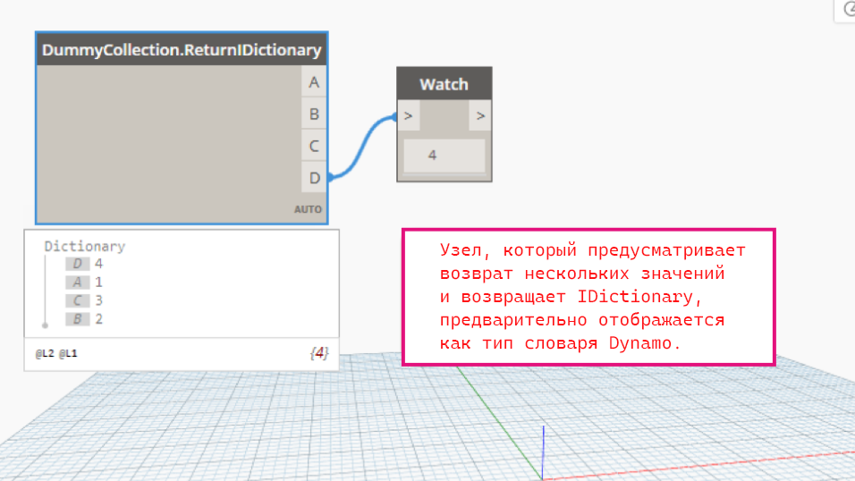

# 語言變更

語言變更部分概述對 Dynamo 每個版本中的語言所做的更新和修改。這些變更可能會影響功能、效能和使用方式，本指南將協助使用者瞭解何時以及為何要適應這些更新。

## Dynamo 2.0 語言變更

1. 將 list@level 語法從「@-1」變更為「@L1」

* list@level 的新語法是使用 list@L1 而不是 list@-1
* 動機：讓程式碼語法與預覽/使用者介面一致，使用者測試表明此新語法更容易理解

2. 在 TS 中實施 Int 和 Double 類型，以便與 Dynamo 類型保持一致
3. 不允許其引數僅基數不同的多載函數

* 使用已移除多載的舊圖表，應預設為等級較高的多載。
* 動機：消除要執行哪個特定函數的不明確性

4. 使用複製指南時停用陣列提升
5. 讓指令式區塊中的變數對指令式區塊範圍是局部變數

* 指令式 Code Block 內部定義的變數值，不會因參考它們的指令式區塊內部的變更而改變。

6. 讓變數成為不變，以停用 Code Block 節點中的關聯式更新
7. 將所有使用者介面節點編譯為靜態方法
8. 支援沒有指定的傳回陳述式

* 函數定義或指令式程式碼中都不需要「=」。

9. 移轉 CBN 中的舊方法名稱

* 許多節點已更名，提高在資源庫瀏覽器使用者介面中的可讀性和放置

10. 在字典清理時使用清單

***

已知問題：

* 指令式區塊中的名稱空間衝突會導致出現意外的輸入埠。請參閱 [Github 問題](https://github.com/DynamoDS/Dynamo/issues/8796)以取得更多資訊。若要解決此問題，請如下所示定義指令式區塊外部的函數：

```
pnt = Autodesk.Point.ByCoordinates;
lne = Autodesk.Line.ByStartPointEndPoint;

[Imperative]
{
    x = 1;
    start = pnt(0,0,0);
    end = pnt(x,x,x);
    line = lne(start,end);
    return = line;
};
```

## Dynamo 2.0 語言變更說明

我們大量改進 Dynamo 2.0 版的語言。這樣做的主要動機是簡化語言。重點一直是讓 DesignScript 更容易理解和使用，使其更強大和靈活，目的是提高終端使用者的理解。

以下是 2.0 中的變更清單說明：

* 簡化 List@Level 語法
* 其參數只有等級不同的多載方法是不合法的
* 將所有使用者介面節點編譯為靜態方法
* 與複製指南/交織一起使用時停用清單提升
* 關聯式區塊中的變數是不變的，以防止關聯式更新
* 指令式區塊中的變數對指令式範圍是局部變數
* 將清單與字典分開

## 1\.簡化 list@level 語法

list@level 的新語法是使用 `list@L1` 而不是 `list@-1` 

## 2\.其參數只有等級不同的多載函數是不合法的

多載函數有問題的原因很多：

* 圖表中的使用者介面節點指出的多載函數，可能與執行階段所執行的多載不同
* 方法解析成本高昂，也不適用於多載函數
* 很難理解多載函數的複製行為

以 `BoundingBox.ByGeometry` 為例 (舊版 Dynamo 中有兩個多載函數)，一個採用單值引數，另一個採用幾何清單作為引數：

```
BoundingBox BoundingBox.ByGeometry(geometry: Geometry) {...}
BoundingBox BoundingBox.ByGeometry(geometry: Geometry[]) {...}
```

如果使用者將第一個節點放在圖元區上並連接一個幾何圖形清單，他希望複製能夠啟動，但這永遠不會發生，因為在執行階段將改為呼叫第二個多載，如下所示：

在 2.0 中，我們不允許由於這個原因僅在參數基數上不同的多載函數。這表示，對於有相同數量和類型的參數但有一個或多個參數只是等級不同的多載函數，先定義的多載永遠優先，編譯器會捨棄其餘多載。進行這種簡化的主要優點是透過一個快速方式選擇候選函數，可以簡化方法解析邏輯。

在 2.0 的幾何圖形資源庫中，棄用了 `BoundingBox.ByGeometry` 範例中的第一個多載，保留了第二個多載，因此，如果節點是要複製 (亦即用於第一個的環境中)，則必須搭配最短 (或最長) 交織選項使用，或在有複製指南的 Code Block 中使用：

```
BoundingBox.ByGeometry(geometry<1>);
```

在這個例子中，我們可以看到，等級較高的節點既可以在複製呼叫中使用，也可以在非複製呼叫中使用，因此永遠優先於等級較低的多載。因此，根據經驗法則，**一律建議節點作者放棄等級較低的多載，而使用等級較高的方法**，以便 DesignScript 編譯器永遠會呼叫等級較高的方法，作為它找到的第一個方法 (也是唯一一個方法)。

### 範例：

下面的範例中定義了函數 `foo` 的兩個多載。在 1.x 中，哪個多載會在執行階段執行並不明確。使用者可能期望執行第二個多載 `foo(a:int, b:int)`，在這種情況下，應該是方法要複製三次並傳回三次 `10` 的值。實際上傳回的是 `10` 的單一值，因為呼叫的是帶有 list 參數的第一個多載。

### 在 2.0 中省略第二個多載：

在 2.0 中，永遠是定義的第一種方法而不是其餘方法。先到先贏。


對於以下每種情況，將採用定義的第一個多載。請注意，它純粹基於定義函數的順序，而不是參數等級，但建議針對使用者定義和 ZeroTouch 節點優先使用參數等級較高的方法。

```
1)
foo(a: int[], b: int); ✓
foo(a: int, b: int); ✕
```

```
2) 
foo(x: int, y: int); ✓
foo(x: int[], y: int[]); ✕
```

## 3\.將所有使用者介面節點編譯為靜態方法

在 Dynamo 1.x 中，分別將 1.x 的使用者介面節點 (非 Code Block) 編譯為實體方法和性質。例如，`Point.X` 節點編譯為 `pt.X`，`Curve.PointAtParameter` 編譯為 `curve.PointAtParameter(param)`。此行為有兩個問題：

**A.使用者介面節點表示的函數並不一定與執行階段所執行的函數相同**

一個典型的範例是 `Translate` 節點。有多個 `Translate` 節點採用相同數量和類型的引數，例如：`Geometry.Translate`、`Mesh.Translate` 和 `FamilyInstance.Translate`。由於這些節點都是編譯為實體方法，因此將 `FamilyInstance` 傳入 `Geometry.Translate` 節點在執行階段意外地仍然有作用，因為它會將呼叫分派到 `FamilyInstance` 上的 `Translate` 實體方法。這顯然會誤導使用者，因為該節點並沒有按照它說的進行。

**B.第二個問題是實體方法不適用於異質陣列**

在執行階段時，執行引擎需要找出應該分派到哪個函數。如果輸入是清單 (例如 `list.Translate()`)，由於完整瀏覽清單中的每個元素並對其類型查詢方法非常耗費資源，因此方法解析邏輯只需假設目標類型與第一個元素的類型相同，然後嘗試查詢針對該類型定義的 `Translate()` 方法。因此，如果第一個元素類型與方法的目標類型不符 (或者如果它甚至是 `null` 或空清單)，則即使清單中有其他相符的類型，整個清單也會失敗。

例如，如果將具有類型 `[Arc, Line]` 的清單輸入傳入 `Arc.CenterPoint`，則如果是弧，結果如預期會包含一個中心點，如果是線，結果則是 `null` 值。但是如果順序顛倒，則整個結果是空值，因為第一個元素無法通過方法解析檢查：

### Dynamo 1.x：只測試輸入清單的第一個元素進行方法解析檢查


```
x = [arc, line];
y = x.CenterPoint; // y = [centerpoint, null] ✓
```

```
x = [line, arc];
y = x.CenterPoint; // y = null ✕
```

在 2.0 中，透過將使用者介面節點編譯為靜態性質和靜態方法，可以解決這兩個問題。

使用靜態方法，執行階段方法解析更直接，會反覆運算輸入清單中的所有元素。例如：

`foo.Bar()` (實體方法) 語義需要檢查 `foo` 的類型，也會檢查它是否是清單，然後將其與候選函數比對。這很耗費資源。相反地，`Foo.Bar(foo)` (靜態方法) 語義只需要檢查一個其參數類型為 `foo` 的函數！

以下是在 2.0 中發生的情況：

* 使用者介面性質節點編譯為靜態 getter：引擎為每個性質產生 getter 的靜態版本。例如，`Point.X` 節點編譯為靜態 getter `Point.get_X(pt)`。請注意，靜態 getter 也可以在 Code Block 節點中使用其別名 `Point.X(pt)` 來呼叫。
* 使用者介面方法節點編譯為靜態版本：引擎為節點產生對應的靜態方法。例如，`Curve.PointAtParameter` 節點編譯為 `Curve.PointAtParameter(curve: Curve, parameter:double)` 而非 `curve.PointAtParameter(parameter)`。

**注意:** 我們尚未移除此變更的實體方法支援，因此 CBN 中使用的現有實體方法 (如上述範例中的 `pt.X` 和`curve.PointAtParameter(parameter)`) 仍然有作用。

此範例先前在 1.x 中有作用，因為圖表將編譯為 `point.X;`，它會尋找點物件的 `X` 性質。它現在在 2.0 中失敗，因為編譯的程式碼 - `Vector.X(point)` 只需要一個 `Vector` 類型：


### 優點：

**前後一致/可理解：**靜態方法消除了哪個方法將在執行階段執行的任何不確定性。方法永遠與圖表中使用者預期會被呼叫的使用者介面節點一致。

**相容：**程式碼和視覺程式之間有更好的相關性。

**提供指導：**將異質清單輸入傳入節點現在會導致節點接受的類型為非空值，而未實作節點的類型為空值。結果更可預測，且更清楚指出哪些是節點允許的類型。

### 警告：多載方法有無法解析的不明確性

由於 Dynamo 通常支援函數多載，因此如果另一個多載函數有相同數量的參數，可能還是會讓人感到困惑。例如，在以下圖表中，如果我們將一個數值連接到 `Curve.Extrude` 的 `direction` 輸入，將一個向量連接到 `Curve.Extrude` 的 `distance` 輸入，兩個節點都會繼續運作，這不是預期的狀況。在這種情況下，即使節點編譯為靜態方法，引擎仍然無法在執行階段分辨出差異，並根據輸入類型選擇其中一種。

### 解決的問題：

轉換成靜態方法語義會產生以下副作用，由於相關的 2.0 語言變更，因此在這裡說明這些副作用。

**1\.喪失多型行為：**

我們考慮 `ProtoGeometry` 中 `TSpline` 節點的範例 (請注意，`TSplineTopology` 繼承自基底 `Topology` 類型)：先前編譯為實體方法 `object.Edges` 的 `Topology.Edges` 節點現在編譯為靜態方法 `Topology.Edges(object)`。某個方法在執行階段分派物件類型後，先前的呼叫會以多型方式解析為衍生的類別方法 `TsplineTopology.Edges`。


而新的靜態行為則被迫呼叫基底類別方法 `Topology.Edges`。結果，此節點傳回的是基底類別 `Edge` 物件，而不是類型為 `TSplineEdge` 的衍生類別物件。


這是一種倒退的結果，因為預期是 `TSplineEdges` 的下游 `TSpline` 節點開始失敗。

此問題已透過在方法分派邏輯中增加一個執行階段檢查，針對方法第一個參數的類型或子類型檢查實體類型而解決。對於輸入清單，我們簡化了方法分派，只檢查第一個元素的類型。因此，最終的解決方法是折衷使用部分靜態和部分動態的方法查詢。

**2.0 中新的多型行為：**


在此案例中，由於第一個元素 `a` 是 `TSpline` ，因此在執行階段呼叫的是 `TSplineTopology.Edges` 衍生方法。結果它針對基底 `Topology` 類型 `b` 傳回 `null`。

在第二個案例中，由於一般的 `Topology` 類型 `b` 是第一個元素，因此呼叫基底 `Topology.Edges` 方法。由於 `Topology.Edges` 也恰好接受衍生的 `TSplineTopology` 類型 `a` 當作輸入，因此它針對 `a` 和 `b` 兩個輸入都傳回 `Edges`。


**2\.因為外層產生多餘的清單而導致倒退**

在複製指南行為方面，實體方法和靜態方法之間有一個主要差異。使用實體方法，帶有複製指南的單值輸入不會提升為清單，而靜態方法會提升。

我們來看看 `Surface.PointAtParameter` 節點的範例，該節點使用笛卡兒積交織、單一曲面輸入以及 `u` 和 `v` 參數值的陣列。實體方法編譯為：

```
surface<1>.PointAtParameter(u<1>, v<2>);
```

產生一個 2D 點陣列。

靜態方法編譯為：

```
Surface.PointAtParameter(surface<1>, u<2>, v<3>);
```

產生一個 3D 點清單 (最外層多出一個清單)。

將使用者介面節點編譯為靜態方法的這種副作用，可能會導致這類現有使用案例的倒退。此問題已透過在與複製指南/交織一起使用時，停用將單值輸入提升為清單來解決 (請參閱下一項)。

**4\.使用複製指南/交織時停用清單提升**

在 1.x 中，有兩種情況會將單值提升為清單：

* 將等級較低的輸入傳入需要等級較高輸入的函數時
* 將等級較低的輸入傳入需要相同等級的函數，但輸入引數使用複製指南裝飾或使用交織時

在 2.0 中，我們阻止且不再支援在後者這類情況下進行清單提升。

在下面的 1.x 圖表中，每個 `y` 和 `z` 各有一層複製指南，強制對它們都進行 1 級的陣列提升，這就是為什麼結果有 3 級 (`x`、`y`、`z` 各 1 級)。但是使用者期望結果是 1 級，因為即使單值輸入有複製指南，也不容易看出會讓結果增加層數。

```
x = 1..5;
y = 0;
z = 0;
p = Point.ByCoordinates(x<1>, y<2>, z<3>); // cross-lacing
```

### Dynamo 1.x：3D 點清單


在 2.0 中，每個單值引數 `y` 和 `z` 即使有複製指南也不會導致提升，因此清單維度與 `x` 的 1D 輸入清單相同。

### Dynamo 2.0：1D 點清單


上述因靜態方法編譯而產生外層多餘清單的倒退，也透過這種語言變更而獲得解決。

繼續使用上面同一個範例，我們看到像下面的靜態方法呼叫：

```
Surface.PointAtParameter(surface<1>, u<2>, v<3>); 
```

在 Dynamo 1.x 中產生一個 3D 點清單。發生這種情況的原因是，當與複製指南一起使用時，第一個單值引數曲面提升為清單。

### Dynamo 1.x：使用複製指南時，引數提升為清單


在 2.0 中，我們停用與複製指南或交織搭配使用時，將單值引數提升為清單的功能。所以現在呼叫：

```
Surface.PointAtParameter(surface<1>, u<2>, v<3>);
```

只會傳回 2D 清單，因為沒有將曲面提升。

### Dynamo 2.0：使用複製指南時，停用將單值引數提升為清單


這項變更現在移除額外多出的清單階層，也解決因為轉換為靜態方法編譯所導致的倒退問題。

### 優點：

**清楚：**結果符合使用者預期，也更容易理解

**相容：**使用者介面節點 (使用交織選項) 和使用複製指南的 CBN 會提供相容的結果

**一致：**

* 實體方法和靜態方法一致 (修正靜態方法語義的問題)
* 使用輸入和使用預設引數的節點行為一致 (請參閱下文)


## 5\.變數在 Code Block 節點中是不可變的，以防止關聯式更新

DesignScript 歷來支援兩種程式設計典範 - 關聯式程式設計和指令式程式設計。關聯式程式碼從變數彼此有相依性的程式陳述句建立相依性圖表。更新某個變數可能會觸發相依於此變數的其他所有變數的更新。這表示關聯式區塊中陳述句的執行順序，不是根據其順序，而是根據變數之間的相依性關係。

在下面的範例中，程式碼的執行順序是行 1 -> 2 -> 3 -> 2。由於 `b` 相依於 `a`，因此當第 3 行的 `a` 更新時，執行會再跳到第 2 行，以使用新的 `a` 值更新 `b`。

```
1. a = 1; 
2. b = a * 2;
3. a = 2;
```

相反地，如果在指令式環境中執行相同的程式碼，則陳述句會以線性方式、從上到下的流程執行。因此，指令式的 Code Block 適合依序執行 (如迴圈和 if-else 條件) 的程式碼結構。

### 關聯式更新的不明確性：

**1\.具有循環相依性的變數：**

在某些情況下，變數之間的循環相依性可能不像以下案例如此明顯。在編譯器無法靜態偵測循環的這類案例中，可能會導致無限的執行階段循環。

```
a = 1;
b = a;
a = b;
```

**2\.相依於自己的變數：**

如果變數相依於自己，其值應該要累積？還是應該在每次更新時重設為其原始值？

```
a = 1;
b = 1;
b = b + a + 2; // b = 4
a = 4;         // b = 10 or b = 7?
```

在此幾何圖形範例中，由於立方體 `b` 既相依於自己，也相依於圓柱 `a`，則移動滑棒應該要讓孔沿圖塊移動？還是應該針對每個滑棒位置更新，沿其路徑打出多個孔而產生一個累積性的效果？


**3\.更新變數的性質：**

```
1: def foo(x: A) { x.prop = ...; return x; }
2: a = A.A();
3: p = a.prop;
4: a1 = foo(a);  // will p update?
```

**4\.更新函數：**

```
1: def foo(v: double) { return v * 2; }// define “foo”
2: x = foo(5);                         // first definition of “foo” called
3: def foo(v: int) { return v * 3; }   // overload of “foo” defined, will x update?
```

根據經驗，我們發現關聯式更新對節點型的資料流程圖表環境中的 Code Block 節點沒有用處。在任何視覺程式設計環境出現之前，探索選項唯一的方法是明確地更改程式中某些變數的值。文字型程式有變數更新的完整記錄，而在視覺程式設計環境中只顯示變數的最新值。

如果某些使用者真的使用變數，很可能他們是在不知不覺的情況下使用，而導致弊大於利。因此，我們決定在 2.0 的 Code Block 節點讓變數不變來隱藏關聯性，同時繼續讓關聯式更新只作為 DS 引擎的原生功能。這是為簡化使用者的腳本編寫體驗而進行的另一項變更。

**透過阻止 CBN 中的變數重新定義，停用關聯式更新：** 

**在 Code Block 中仍允許使用清單編製索引**

清單編製索引是一個例外，在 2.0 中仍允許指定索引運算子。

在下一個範例中，我們會看到清單 `a` 已初始化，但之後可以指定索引運算子來覆寫，且任何相依於 `a` 的變數都會關聯地更新，如 `c` 的值所示。而且，在重新定義一個或多個元素之後，節點預覽會顯示 `a` 的更新值。


## 6\.指令式區塊中的變數對指令式區塊範圍是局部變數

我們變更了 2.0 的指令式範圍規則，停用複雜的跨語言更新情境。

在 Dynamo 1.x 中，以下腳本的執行順序會是行 1 -> 2 -> 4 -> 6 -> 4，當中會從外部向內部的語言範圍傳遞變更。由於 `y` 是在外部的關聯式區塊中更新，而指令式區塊中的 `x` 相依於 `y`，因此控制將從外部的關聯式程式轉移到第 4 行的指令式語言。

```
1: x = 1;
2: y = 2;
3: [Imperative] {
4:     x = 2 * y;
5: }
6: y = 3;
```

在下一個範例中，執行順序會是行：1 -> 2 -> 4 -> 2，其中會從內部向外部的語言範圍傳遞變更。

```
1: x = 1;
2: y = x * 2;
3: [Imperative] {
4:     x = 3;
5: }
```

上述情境是指跨語言更新，就像關聯式更新在 Code Block 節點中不是很有用一樣。為了停用複雜的跨語言更新情境，我們已讓指令式範圍中的變數成為局部變數。

在 Dynamo 2.0 的以下範例中：

```
x = 1;
y = x * 2;
i = [Imperative] {
     x = 3;
     return x;
}
```

* 指令式區塊中定義的 `x` 現在對於指令式範圍是局部變數
* 外部範圍中的 `x` 值和 `y` 值分別仍是 `1` 和 `2`

如果要在外部範圍中存取指令式區塊內的任何局部變數值，則需要傳回該變數。

請參考以下範例：

```
1: x = 1;
2: y = 2;
3: [Imperative] {
4:     x = 2 * y;
5: }
6: y = 3; // x = 1, y = 3
```

* 在指令式範圍內局部複製 `y`
* 指令式範圍內 `x` 的局部值為 `4`
* 由於跨語言更新，更新外部範圍中 `y` 的值，會繼續導致 `x` 更新，但在 2.0 的 Code Block 中由於變數不變性而停用
* 外部關聯式範圍中的 `x` 值和 `y` 值分別仍是 `1` 和 `2`

## 7\.清單與字典

在 Dynamo 1.x 中，清單和字典由單一統一的容器表示，透過整數索引和非整數鍵可以對該容器編製索引。下表總結 2.0 中清單和字典之間的區別，以及新字典資料類型的規則：

|                               | 1.x                                                  | 2.0                                      |
| ----------------------------- | ---------------------------------------------------- | ---------------------------------------- |
| **清單初始化**       | `a = {1, 2, 3};`                                     | `a = [1, 2, 3];`                         |
| **空清單**                | `a = {};`                                            | `a = [];`                                |
| **字典初始化** | **可以動態附加到同一個字典：** | **只能建立新字典：**    |
|                               | `a = {};`                                            | `a = {“foo” : 1, “bar” : 2};`            |
|                               | `a[“foo”] = 1;`                                      | `b = {“foo” : 1, “bar” : 2, “baz” : 3};` |
|                               | `a[“bar”] = 2;`                                      | `a = {};` // 建立一個空字典 |
|                               | `a[“baz”] = 3;`                                      |                                          |
| **字典編製索引**       | **鍵編製索引**                                     | **編製索引語法維持不變**     |
|                               | `b = a[“bar”];`                                      | `b = a[“bar”];`                          |
| **字典鍵**           | **任何鍵類型都是合法的**                           | **只有字串鍵是合法的**           |
|                               | `a = {};`                                            | `a = {“false” : 23, “point” : 12};`      |
|                               | `a[false] = 23;`                                     |                                          |
|                               | `a[point] = 12;`                                     |                                          |

### 新的 `[]` 清單語法

在 2.0 中，清單初始化語法從大括號 `{}` 變更為方括號 `[]`。所有 1.x 腳本在 2.0 中打開時，都會自動移轉成新語法。

**關於 Zero Touch 節點上預設引數屬性的注意事項：**

但是請注意，自動移轉不適用於預設引數屬性中使用的舊語法。節點作者需要手動更新其 zero-touch 方法定義，才能使用預設引數屬性 `DefaultArgumentAttribute` 中的新語法 (如有必要)。

**關於編製索引的注意事項：**

新的編製索引行為在某些情況下變得不同。使用 `[]` 運算子將索引編製成包含任意索引/鍵清單的清單/字典，現在會保留索引/鍵輸入清單的清單結構。以前永遠會傳回值的 1D 清單：

```
Given:
a = {“foo” : 1, “bar” : 2};

1.x:
b = a[{“foo”, {“bar”}}];
returns {1, 2}

2.0:
b = a[[“foo”, [“bar”]]];
returns [1, [2]];
```

### 字典初始化語法：

字典初始化的 `{}` (大括號語法) 只能用在

```
dict = {<key> : <value>, …}; 
```

的鍵值對格式，其中的 `<key>` 只能使用一個字串，而且以逗號分隔多個鍵值對。


`Dictionary.ByKeysValues` zero-touch 方法可透過分別傳入鍵和值的清單，並使用 zero-touch 方法 (如複製指南等) 的所有花俏功能，當作初始化字典一個更多樣的方式。


### 為什麼沒有以任意表示式呈現字典初始化語法？

我們嘗試過在字典鍵值初始化語法中對鍵使用任意表示式的想法，但是發現它可能會導致讓人混淆的結果，尤其是像 `{keys : vals}` (`keys`，`vals` 都表示清單) 這樣的語法會干擾 DesignScript 的其他語言功能 (如複製) 並產生與 zero touch 初始設定式節點不同的結果。

例如，可能會有其他類似此陳述句很難定義預期行為的情況：

```
dict = {["foo", "bar"] : "baz" };
```

進一步增加複製指南語法等而不只是識別項，有違語言簡單性的想法。

我們將來也許_可以_擴充字典鍵以支援任意表示式，但我們也必須確保與其他語言功能的互動是一致且可理解，但代價是提高複雜度，而不是讓系統功能變弱但容易理解。因為總是能使用 `Dictionary.ByKeysValues(keyList, valueList)` 方法作為替代方法來解決問題，這並不會很困難。

### 與 Zero Touch 節點的互動：

**1\.傳回 .NET 字典的 Zero Touch 節點會傳回為 Dynamo 字典**

**請考慮以下傳回 IDictionary 的 zero-touch C# 方法：** 

**對應的 ZT 節點傳回值會編組成 Dynamo 字典：** 

**2\.多重傳回節點的預覽形式為字典**

**以多重傳回屬性傳回 IDictionary 的 Zero Touch 節點會傳回 Dynamo 字典：** 



**3\.Dynamo 字典可作為輸入傳入接受 .NET 字典的 Zero-touch 節點**

**具有 IDictionary 參數的 ZT 方法：** 

**ZT 節點接受 Dynamo 字典作為輸入：** 

### 多重傳回節點中的字典預覽

字典是未排序的鍵值對。因此同樣地，傳回字典之節點的鍵值對預覽，也無法保證會按照節點傳回值的順序進行排序。

但是，我們為已定義 `MultiReturnAttribute` 的多重傳回節點做出例外。在以下範例中，`DateTime.Components` 節點是一個「多重傳回」節點，節點預覽反映出其鍵值對與節點輸出埠的順序相同，這也是根據節點定義上的 `MultiReturnAttribute` 指定輸出的順序。

另請注意，與使用者介面節點不同，Code Block 的預覽並未排序，因為 Code Block 節點沒有輸出埠資訊 (以多重傳回屬性的形式)： 
