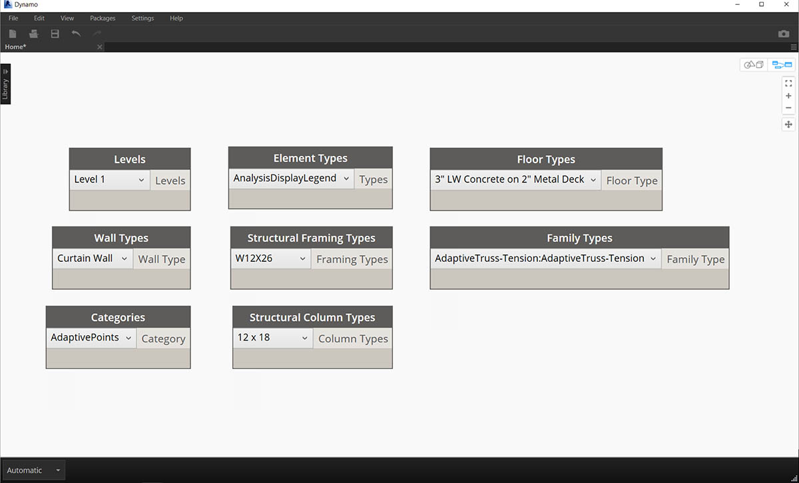
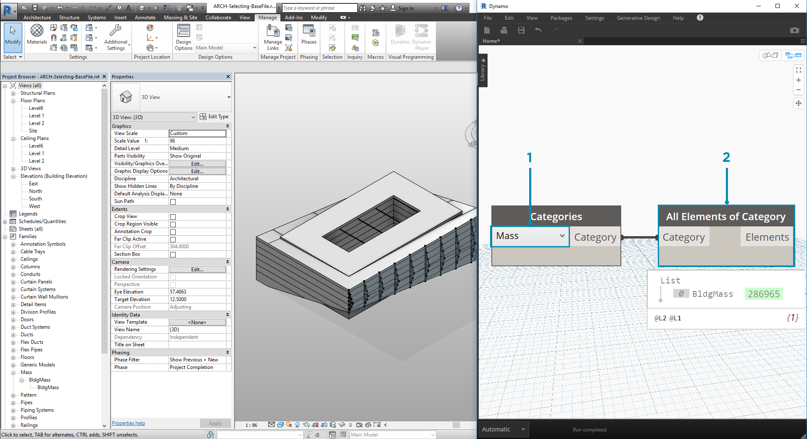
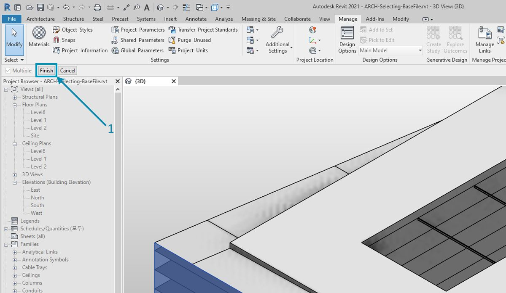
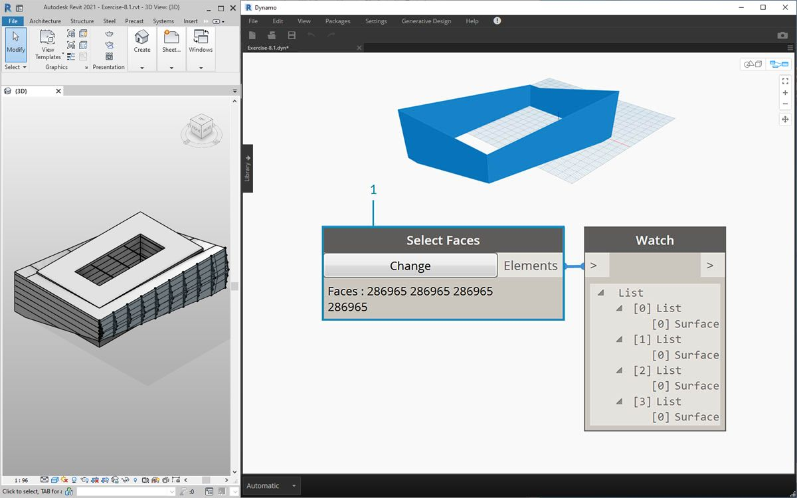
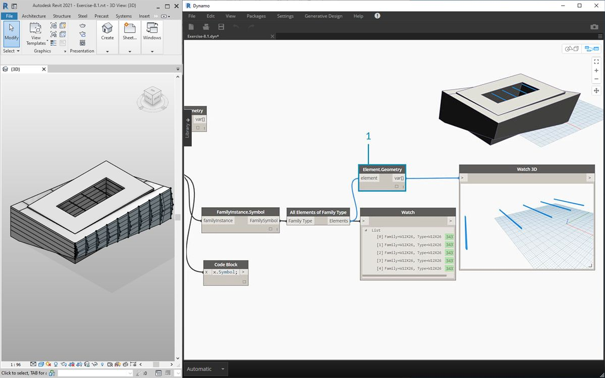

# Selecting

Revit is a data-rich environment. This gives us a range of selection abilities which expands far beyond "point-and-click". We can query the Revit database and dynamically link Revit elements to Dynamo geometry while performing parametric operations.

> The Revit library in the UI offers a "Selection" category which enables multiple ways to select geometry.

To select Revit elements properly, it's important to have a full-understanding of the Revit element hierarchy. Want to select all the walls in a project? Select by category. Want to select every Eames chair in your mid-century modern lobby? Select by family. Before jumping into an exercise, let's do a quick review of the Revit hierarchy.

### Revit Hierarchy

Remember the taxonomy from Biology? Kingdom, Phylum, Class, Order, Family, Genus, Species? Revit elements are categorized in a similar manner. On a basic level, the Revit hierarchy can be broken down into Categories, Families, Types\*, and Instances. An instance is an individual model element (with a unique ID) while a category defines a generic group (like "walls" or "floors"). With the Revit database organized in this manner, we can select one element and choose all similar elements based on a specified level in the hierarchy.

\*_Note - Types in Revit are defined differently from types in programming. In Revit, a type refers to a branch of the hierarchy, rather than a "data type"._

### Database Navigation with Dynamo nodes

The three images below breakdown the main categories for Revit element selection in Dynamo. These are great tools to use in combination, and we'll explore some of these in the following exercises.

> _Point-and-click_ is the easiest way to directly select a Revit element. You can select a full model element, or parts of its topology (like a face or an edge). This remains dynamically linked to that Revit object, so when the Revit file updates its location or parameters, the referenced Dynamo element will update in the graph.

> _Dropdown menus_ create a list of all accessible elements in a Revit project. You can use this to reference Revit elements which are not necessarily visible in a view. This is a great tool for querying existing elements or creating new ones in a Revit project or family editor.

> You can also select Revit element by specific tiers in the _Revit hierarchy_. This is a powerful option for customizing large arrays of data in preparation for documentation or generative instantiation and customization.

With the three images above in mind, let's dive into an exercise which selects elements from a basic Revit project in preparation for the parametric applications we'll create in the remaining sections of this chapter.

## Exercise

> Download the example files that accompanies this exercise (Right click and "Save Link As..."). A full list of example files can be found in the Appendix.

1. [Selecting.dyn](https://github.com/h-iL/ForkedDynamoPrimerReorganized/blob/main/08\_Dynamo-for-Revit/datasets/8-2/Selecting.dyn)
2. [ARCH-Selecing-BaseFile.rvt](https://github.com/h-iL/ForkedDynamoPrimerReorganized/blob/main/08\_Dynamo-for-Revit/datasets/8-2/ARCH-Selecting-BaseFile.rvt)

.png>)

> In this example Revit file, we have three element types of a simple building. We're going to use this as an example for selecting Revit elements within the context of the Revit hierarchy:

1. Building Mass
2. Trusses (Adaptive Components)
3. Beams (Structural Framing)

> What conclusions can we draw from the elements currently in the Revit project view? And how far down the hierarchy do we need to go to select the appropriate elements? This will of course become a more complex task when working on a large project. There are a lot of options available: we can select elements by categories, levels, families, instances, etc.

1. Since we're working with a basic setup, let's select the building mass by choosing _"Mass"_ in the Categories dropdown node. This can be found in the Revit>Selection tab.
2. The output of the Mass category is just the category itself. We need to select the elements. To do this, we use the _"All Elements of Category"_ node.

At this point, notice that we don't see any geometry in Dynamo. We've selected a Revit element, but have not converted the element into Dynamo geometry. This is an important separation. If you were to select a large number of elements, you don't want to preview all of them in Dynamo because this would slow everything down. Dynamo is a tool to manage a Revit project without necessarily performing geometry operations, and we'll look at that in the next section of this chapter.

In this case, we're working with simple geometry, so we want to bring the geometry into the Dynamo preview. The "BldgMass" in the watch node above has a green number\* next to it. This represents the element's ID and tells us that we are dealing with a Revit element, not Dynamo geometry. The next step is to convert this Revit element into geometry in Dynamo.

> 1. Using the _Element. Faces_ node, we get a list of surfaces representing each face of the Revit Mass. We can now see the geometry in the Dynamo viewport and start to reference the face for parametric operations.

.jpg>)

> Here's an alternative method. In this case, we're stepping away from selecting via the Revit Hierarchy _("All Elements of Category")_ and electing to explicitly select geometry in Revit.

1. Using the _"Select Model Element"_ node, click the \*"select" \*(or _"change"_) button. In the Revit viewport, select the desired element. In this case, we're selecting the building mass.
2. Rather than _Element.Faces_, we can select the full mass as one solid geometry using _Element.Geometry_. This selects all of the geometry contained within that mass.
3. Using _Geometry.Explode,_ we can get the list of surfaces again. These two nodes work the same as _Element.Faces_ but offer alternative options for delving into the geometry of a Revit element.

.jpg>)

> 1. Using some basic list operations, we can query a face of interest.

1. First, the _List.Count_ node reveals that we're working with 23 surfaces in the mass.
2. Referencing this number, we change the Maximum value of an \*integer slider \*to _"22"_.
3. Using _List.GetItemAtIndex_, we input the lists and the \*integer slider \*for the _index_. Sliding through with the selected, we stop when we get to _index 9_ and have isolated the main facade hosts the trusses.

.jpg>)

> 1. The previous step was a little cumbersome. We can do this much faster with the _"Select Face"_ node. This allows us to isolate a face that is not an element itself in the Revit project. The same interaction applies as _"Select Model Element"_, except we select the surface rather than the full element.

> Suppose we want to isolate the main facade walls of the building. We can use the _"Select Faces"_ node to do this. Click the "Select" button and then select the four main facades in Revit.

> 1. After selecting the four walls, make sure you click the _"Finish"_ button in Revit.

> 1. The faces are now imported into Dynamo as surfaces.

> 1. Now, let's take a look at the beams over the atrium. Using the _"Select Model Element"_ node, select one of the beams.

1. Plug the beam element into the _Element.Geometry_ node and we now have the beam in the Dynamo viewport.
2. We can zoom in on the geometry with a _Watch3D_ node (if you don't see the beam in Watch 3D, right click and hit "zoom to fit").

.jpg>)

> A question that may come up often in Revit/Dynamo workflows: how do I select one element and get all similar elements? Since the selected Revit element contains all of its hierarchical information, we can query its family type and select all elements of that type.

1. Plug the beam element into a _FamilyInstance.Symbol_\* node.
2. The _Watch_ node reveals that the output is now a family symbol rather than a Revit element.
3. _FamilyInstance.Symbol_ is a simple query, so we can do this in the code block just as easily with `x.Symbol;` and get the same results.

\*_Note - a family symbol is Revit API terminology for family type. Since this may cause some confusion, it will be updated in upcoming releases._

.jpg>)

> 1. To select the remaining beams, we use the _"All Elements of Family Type"_ node.

1. The watch node shows that we've selected five revit elements.

> 1. We can convert all of these five elements to Dynamo geometry too.

What if we had 500 beams? Converting all of these elements into Dynamo geometry would be really slow. If Dynamo is taking a long time to calculate nodes, you may want to use the "freeze" node functionality in order to pause the execution of Revit operations while you develop your graph. For more information on freezing nodes, check out the "Freezing" section in the [solids chapter](../a-closer-look-at-dynamo-essential-nodes-and-concepts/5\_geometry-for-computational-design/5-6\_solids.md#freezing).

In any case, if we were to import 500 beams, do we need all of the surfaces to perform the intended parametric operation? Or can we extract basic information from the beams and perform generative tasks with fundamental geometry? This is a question that we'll keep in mind as we walk through this chapter. For example, let's take a look at the truss system:

.jpg>)

> Using the same graph of nodes, select the truss element rather than the beam element. Before doing this, delete the Element.Geometry from the previous step.

.jpg>)

> 1. In the _Watch_ node, we can see that we have a list of adaptive components selected from Revit. We want to extract the basic information, so we're start with the adaptive points.

1. Plug the _"All Elements of Family Type"_ node into the _"AdaptiveComponent.Location"_ node. This gives us a list of lists, each with three points which represent the adaptive point locations.
2. Connecting a _"Polygon.ByPoints"_ node returns a polycurve. We can see this in the Dynamo viewport. By this method, we've visualized the geometry of one element and abstracted the geometry of the remaining array of elements (which could be larger in number than this example).

\*_Tip: if you click on the green number of a Revit element in Dynamo, the Revit viewport will zoom to that element._
