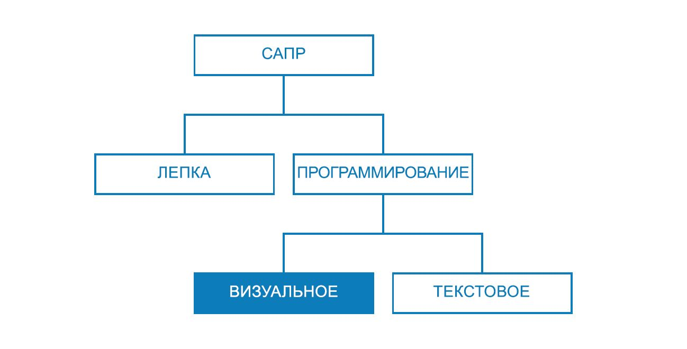
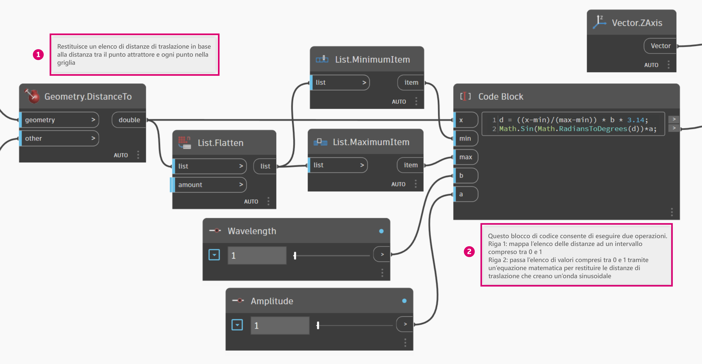
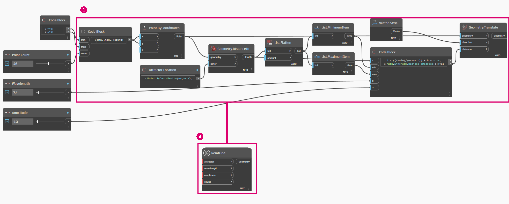
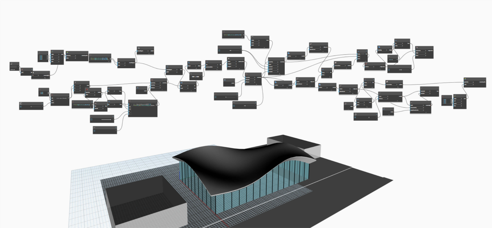
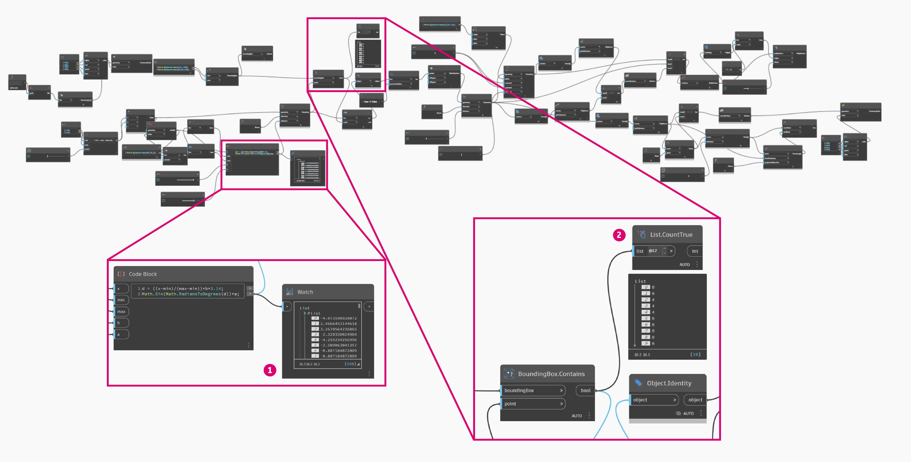
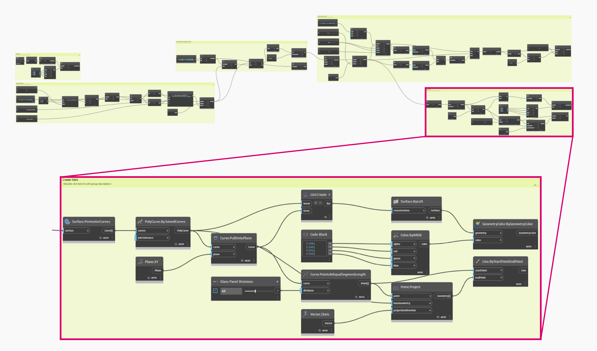
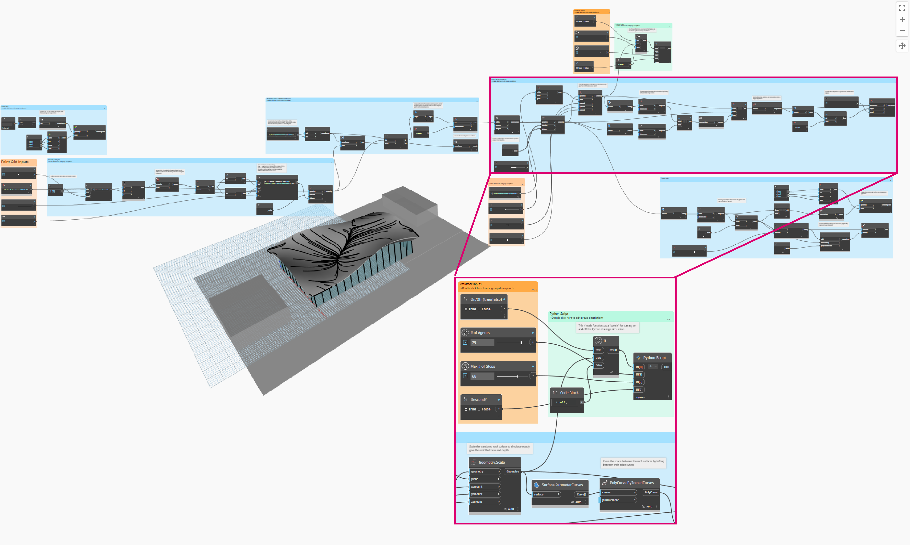
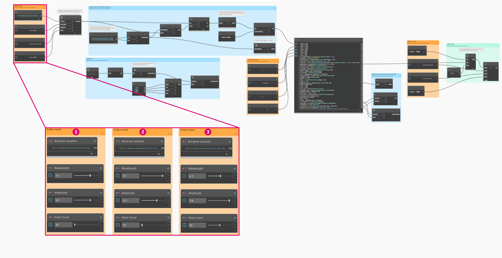

# Strategie grafů

Před touto kapitolou se příručka Primer zabývala implementací výkonných funkcí vizuálního skriptování v aplikaci Dynamo. Správné pochopení těchto možností je pevným základem a prvním krokem ve vytváření robustních vizuálních programů. Když vizuální programy používáme v ostrém provozu, sdílíme je s kolegy, řešíme chyby nebo zkoušíme meze, vyvstávají další problémy, které je třeba řešit. Pokud váš program bude používat někdo jiný nebo očekáváte, že jej otevřete až za šest měsíců, je v obou případech nutné, aby vše bylo ihned graficky a logicky přehledné. Aplikace Dynamo nabízí mnoho nástrojů ke správě složitosti programu a tato kapitola se zabývá pokyny k tomu, jak tyto nástroje použít.

## Snížení složitosti

Při vývoji grafu aplikace Dynamo a zkušebních nápadů může rychle dojít k nárůstu složitosti i velikosti grafu. I když je důležité vytvořit fungující program, je stejně důležité, aby byl co nejjednodušší. Nejenže graf bude fungovat rychleji a předvídatelněji, ale v případě otevření po nějakém čase vy i ostatní uživatelé rychleji porozumí logice grafu. Zde je několik způsobů, které vám pomohou vyjasnit logiku grafu.

### **Modularizace pomocí skupin**

* Skupiny vám při tvorbě programu umožní **vytvářet funkčně odlišné součásti**.
* Skupiny umožňují **přesouvat velké části programu** při zachování modularity a zarovnání.
* Můžete změnit **barvu skupiny k rozlišení** toho, co je účelem skupiny (vstupy vs. funkce).
* Pomocí skupin můžete vytvořit **organizaci grafu ke zjednodušení tvorby uživatelských uzlů**.

> Barvy v tomto programu určují účel každé skupiny. Pomocí této strategie je možné vytvořit hierarchii v libovolných grafických normách nebo šablonách, které vyvíjíte.
>
> 1. Skupina funkcí (modrá)
> 2. Skupina vstupů (oranžová)
> 3. Skupina skriptů (zelená)
>
> Informace o tom, jak používat skupiny, naleznete v části [Správa programu](http://primer.dynamobim.org/en/03\_Anatomy-of-a-Dynamo-Definition/3-4\_best\_practices.html).

### **Efektivní vývoj pomocí bloků kódu**

* Někdy můžete použít blok kódu k **rychlejšímu zadání čísla nebo metody uzlu než při vyhledávání** (Point.ByCoordinates, Number, String, Formula).
* Bloky kódu jsou užitečné, **pokud chcete definovat vlastní funkce v jazyce DesignScript, aby se snížil počet uzlů v grafu**.

.png)

> Vzor 1 i 2 provádí stejnou funkci. Bylo však mnohem rychlejší napsat několik řádků kódu, než vyhledávat a přidávat jednotlivé uzly. Blok kódu je také mnohem výstižnější.
>
> 1. Kód jazyka DesignScript zapsaný v bloku kódu
> 2. Ekvivalentní program v uzlech
>
> Informace o použití bloku kódu naleznete v části [Co je blok kódu](../coding-in-dynamo/7\_code-blocks-and-design-script/7-1\_what-is-a-code-block.md).

### **Zhuštění pomocí možnosti Uzel na kód**

* Složitost grafu můžete **snížit pomocí možnosti Uzel na kód**, která vezme kolekci jednoduchých uzlů a zapíše odpovídající skript DesignScript do jednoho bloku kódu.
* Možnost Uzel na kód** může zhustit kód, aniž by došlo k porušení přehlednosti programu**.
* Následují **klady** použití možnosti Uzel na kód:
  * Snadno zhustí kód do jedné komponenty, kterou je stále možné upravit
  * Může zjednodušit významnou část grafu
  * Užitečná, pokud „miniprogram“ nebude často upravován
  * Užitečná k zahrnutí dalších funkcí bloku kódu, například funkce
* Následují **zápory** použití možnosti Uzel na kód:
  * Obecné pojmenování snižuje čitelnost
  * Pro některé uživatele je obtížnější na porozumění
  * Neexistuje snadný způsob, jak se vrátit k verzi vizuálního programování

> 1. Existující program
> 2. Blok kódu vytvořený pomocí možnosti Uzel na kód
>
> Informace o tom, jak používat možnost Uzel na kód, naleznete v části [Syntaxe jazyka DesignScript](../coding-in-dynamo/7\_code-blocks-and-design-script/7-2\_design-script-syntax.md#node-to-code).

### **Flexibilní přístup k datům pomocí funkce List@Level**

* Funkce List@Level pomáhá **snížit složitost grafu nahrazením uzlů List.Map a List.Combine**, které mohou zabírat značné množství místa na pracovní ploše.
* Funkce List@Level nabízí** rychlejší způsob, jak vytvořit logiku uzlu konstrukce, než u uzlů List.Map a List.Combine**, umožněním přístupu k datům na libovolné úrovni v seznamu přímo ze vstupního portu uzlu.

.png>)

> Můžeme ověřit, kolik hodnot True vrátí metoda BoundingBox.Contains a ve kterých seznamech, a to aktivováním funkce List@Level u vstupu seznamu funkce CountTrue. List@Level umožňuje uživateli určit, ze které úrovně se bude přebírat vstup. Použití funkce List@Level je flexibilní, efektivní a vysoce podporované u jiných metod zahrnujících metody List.Map a List.Combine.
>
> 1. Počítání hodnot True na úrovni seznamu 2
> 2. Počítání hodnot True na úrovni seznamu 3
>
> Informace o tom, jak používat funkci List@Level, naleznete v části [Seznamy seznamů](http://primer.dynamobim.org/en/06\_Designing-with-Lists/6-3\_lists-of-lists.html#list@level).

## Zachovejte čitelnost

Kromě zjednodušení a zefektivnění grafu nejvíce, jak je to možné, snažte se dbát i na grafickou přehlednost. Navzdory nejlepšímu úsilí o intuitivnost grafu s logickými seskupeními nemusí být vztahy zjevné. Jednoduchá poznámka uvnitř skupiny nebo přejmenování posuvníku vám nebo jinému uživateli může ušetřit zbytečné nejasnosti nebo procházení grafu. Následuje několik způsobů, jak uvnitř grafů i mezi nimi zavést grafickou konzistenci.

### **Vizuální spojitost se zarovnáním uzlu**

* Chcete-li si ušetřit práci po dokončení tvorby grafu, měli byste se snažit zajistit čitelnost rozvržení uzlů **častým zarovnáváním uzlů během práce**.
* Pokud s grafem budou pracovat i ostatní, měli byste se **před jeho odesláním ujistit, že rozvržení drátů a uzlů je přehledné**.
* Chcete-li si usnadnit zarovnání, **použijte funkci Rozvržení uzlů vyčištění k automatickému zarovnání** grafu, zarovnání však bude méně přesné, než když je uděláte sami.

.png>)

> 1. Neuspořádaný graf
> 2. Zarovnaný graf
>
> Informace o tom, jak používat zarovnání uzlů, naleznete v části [Správa programu](3-4\_best\_practices.md).

### **Označení přejmenováním**

* Přejmenování vstupů může ostatním usnadnit porozumění vašemu grafu, **zejména pokud jejich vstup nebude vidět na obrazovce**.
* **Buďte opatrní při přejmenovávání jiných uzlů než vstupů.** Alternativou je vytvoření vlastního uzlu ze shluku uzlů a jeho přejmenování; bude zřejmé, že obsahuje něco jiného.

> 1. Vstupy pro manipulaci s povrchem
> 2. Vstupy architektonických parametrů
> 3. Vstupy pro skript simulace odvodnění
>
> Chcete-li uzel přejmenovat, klikněte pravým tlačítkem na jeho název a vyberte příkaz „Přejmenovat uzel...“.

### **Vysvětlení pomocí poznámek**

* Pokud něco v **grafu vyžaduje vysvětlení v jednoduchém jazyce**, které není možné vyjádřit uzly, měli byste přidat poznámku.
* Poznámka by měla být přidána, pokud je kolekce **uzlů nebo skupina příliš velká nebo složitá a není možné jí ihned porozumět**.

> 1. Poznámka popisující část programu, která vrací nezpracované vzdálenosti posunu
> 2. Poznámka popisující kód, který mapuje tyto hodnoty na sinusovou vlnu
>
> Postup přidání poznámky naleznete v části [Správa programu](http://primer.dynamobim.org/en/03\_Anatomy-of-a-Dynamo-Definition/3-4\_best\_practices.html).

## Neustále kontrolujte data

Při tvorbě vizuálního skriptu je důležité ověřit, zda skript vrací očekávaný výstup. Ne všechny chyby nebo problémy způsobí chybu celého programu, zejména hodnoty null nebo nulové hodnoty, které by mohly ovlivnit něco dále v programu. Tato strategie je také popsána v kontextu textového skriptování v části [Strategie skriptování](http://primer.dynamobim.org/en/12\_Best-Practice/13-2\_Scripting-Strategies.html). Následující postup vám pomůže zajistit, že skript vrátí očekávaný výstup.

### **Monitorování dat pomocí uzlů Watch a bublin náhledů**

* Pomocí uzlů Watch a bublin náhledů můžete při sestavování programu** ověřit, zda se na klíčových výstupech vrací očekávané hodnoty**.

> K porovnání se použijí uzly Watch:
>
> 1. Nezpracované vzdálenosti posunu
> 2. Hodnoty, které prošly rovnicí sinu
>
> Postup použití sledování naleznete v části [Knihovna](http://primer.dynamobim.org/en/03\_Anatomy-of-a-Dynamo-Definition/3-2\_dynamo\_libraries.html).

## Zajistěte opakovatelnost použití

Je vysoce pravděpodobné, váš program otevře i někdo jiný, a to i v případě, že pracujete nezávisle. I tito lidé by měli být schopni rychle porozumět, co program potřebuje na svých vstupech a co vytváří na svých výstupech. Toto je důležité zejména při vývoji vlastního uzlu, který má být sdílen s komunitou aplikace Dynamo a používán v programu jiného uživatele. Tyto postupy vedou k robustním, opakovaně použitelným programům a uzlům.

### **Správa vstupů a výstupů**

* Aby byla zajištěna čitelnost a škálovatelnost, měli byste se pokusit **co nejvíce minimalizovat vstupy a výstupy**.
* Ještě před přidáním jakéhokoli uzlu na plátno byste se měli pokusit **stanovit strategii, jak budete logiku vytvářet, a to tak, že nejprve vytvoříte hrubý náčrt** toho, jak by logika mohla fungovat. Při vývoji hrubého obrysu byste měli sledovat, které vstupy a výstupy budou vloženy do skriptů.

### **Vložení vstupních hodnot pomocí předvoleb**

* Pokud existují **konkrétní možnosti nebo podmínky, které chcete do grafu vložit**, měli byste použít předvolby, abyste k těmto položkám měli rychlý přístup.
* Pomocí předvoleb můžete také **snížit složitost ukládáním specifických hodnot posuvníku do mezipaměti** u grafu s dlouhou dobou běhu.

> Postup použití předvoleb naleznete v části [Správa dat s předvolbami](http://primer.dynamobim.org/en/03\_Anatomy-of-a-Dynamo-Definition/3-5\_presets.html).

### **Izolace programů pomocí vlastních uzlů**

* Pokud je možné **program shromáždit do jednoho kontejneru**, měli byste použít vlastní uzel.
* Vlastní uzel byste měli použít i v případě, **že se část grafu často znovu používá** v jiných aplikacích.
* Pokud chcete **sdílet funkce s komunitou aplikace Dynamo**, měli byste použít vlastní uzel.

> Shromáždění programu sloužícího k převodu bodů do vlastního uzlu učiní robustní, jedinečný program přenositelným a mnohem snadnějším na pochopení. Dobře pojmenované vstupní porty pomohou ostatním uživatelům porozumět tomu, jak tento uzel používat. Nezapomeňte přidávat popisy a požadované typy dat pro každý vstup.
>
> 1. Existující program atraktoru
> 2. Vlastní uzel, který tento program shromažďuje, PointGrid
>
> Informace o použití vlastních uzlů naleznete v části [Úvod do vlastních uzlů](http://primer.dynamobim.org/en/09\_Custom-Nodes/9-1\_Introduction.html).

### **Tvorba šablon**

* Můžete vytvořit šablony pro **stanovení grafických standardů ve vizuálních grafech, aby spolupracovníci měli standardizovaný způsob, jak grafům porozumět**.
* Při tvorbě šablony můžete standardizovat **barvy skupin a velikosti písem** a kategorizovat tak typy pracovních postupů nebo akcí s daty.
* Při tvorbě šablony můžete dokonce standardizovat, jakým způsobem chcete v grafu **označovat, barvit nebo stylizovat rozdíly mezi front-end a back-end pracovními postupy**.

.png)

> 1. Uživatelské rozhraní nebo front-end programu obsahuje název projektu, posuvníky vstupu a importovanou geometrii.
> 2. Back-end programu.
> 3. Seskupení kategorií podle barev (obecný návrh, vstupy, skriptování v jazyce Python, importovaná geometrie).

## Cvičení – Architektonická střecha

> Kliknutím na odkaz níže si stáhněte vzorový soubor.
>
> Úplný seznam vzorových souborů najdete v dodatku.

Nyní, když bylo stanoveno několik osvědčených postupů, použijeme tyto postupy na rychle sestavený program. I když program při generování střechy uspěje, stav grafu je „mapou mysli“ autora. Chybí jakákoli organizace a popis použití. Projdeme si nejlepší postupy organizace, popisu a analýzy programu, aby ostatní uživatelé mohli porozumět tomu, jak se tento program používá.

> Program funguje, ale graf není uspořádán.

Začneme určením dat a geometrie vrácené programem.

> Porozumění tomu, kdy dochází k velkým změnám dat, je velmi důležité ke stanovení logického dělení nebo modularity. Zkuste zkontrolovat zbytek programu pomocí uzlů Watch, čímž zjistíte, zda můžete před přechodem na další krok určit skupiny.
>
> 1. Tento **blok kódu** s matematickou rovnicí vypadá jako klíčový prvek programu. Uzel **Watch** zobrazuje, že vrací seznamy vzdáleností posunu.
> 2. Účel této oblasti není zcela zřejmý. Uspořádání hodnot True na úrovni seznamu L2 z výstupu uzlu **BoundingBox.Contains** a přítomnost položky **List.FilterByBoolMask** naznačuje, že jsme vzorkovali část osnovy bodů.

Když teď rozumíte základním prvkům programu, můžeme je umístit do skupin.

> Skupiny umožňují uživateli vizuální rozlišení částí programu.
>
> 1. Import 3D modelu pozemku
> 2. Osnova převodu bodů založená na rovnici sinu
> 3. Ukázková část bodové osnovy
> 4. Tvorba povrchu architektonické střechy
> 5. Tvorba skleněného obvodového pláště

Jakmile budou skupiny stanoveny, zarovnejte uzly, tak aby vznikla vizuální spojitost přes celý graf.

> Vizuální spojitost zlepšuje pro uživatele viditelnost toku programu a implicitních vztahů mezi uzly.

Zlepšete přístup k programu přidáním další hladiny grafických vylepšení. Přidáním poznámek popisujete, jak určitá oblast programu funguje, zadejte u vstupů vlastní názvy a přiřaďte k různým typům skupin barvy.

.png)

> Tato grafická vylepšení sdělují uživateli více o tom, co program dělá. Různé barvy skupin pomáhají rozlišit vstupy od funkcí.
>
> 1. Poznámky
> 2. Vstupy s popisnými názvy

Před zhuštěním programu, je třeba najít strategické umístění, kde představíme simulátor odvodnění ve skriptu jazyka Python. Výstup prvního povrchu střechy s měřítkem připojte k odpovídajícímu vstupu skriptování.

> V této části programu jsme se rozhodli integrovat skriptování, aby simulace odvodnění mohla být spuštěna na původním, jediném povrchu střechy. Tento konkrétní povrch není zobrazen v náhledu, ale ušetří krok výběru horního povrchu u zkoseného objektu Polysurface.
>
> 1. Zdrojová geometrie pro vstup skriptu
> 2. Uzel jazyka Python
> 3. Posuvníky vstupů
> 4. „Přepínač“ zapnutí/vypnutí

Nyní, když je vše připraveno, zjednodušíme graf.

> Berte v potaz, že program s využitím možnosti Uzel na kód a vlastního uzlu značně zmenšil velikost grafu. Skupiny, které tvoří povrch střechy a stěny, byly převedeny na kód, protože jsou pro tento program velmi specifické. Skupina převodu bodů je obsažena ve vlastním uzlu, protože by mohla být využita i v jiném programu. Ve vzorovém souboru vytvořte vlastní uzel ze skupiny převodu bodů.
>
> 1. Vlastní uzel, který má obsahovat skupinu „osnovy převodu bodů“
> 2. Možnost Uzel na kód ke zhuštění skupin „tvorby povrchu architektonické střechy a obvodového pláště“

Jako poslední krok vytvořte předvolby pro ukázkové tvary střechy.

> Tyto vstupy jsou primárními ovladači tvaru střechy a díky nim uživatel snadněji pochopí potenciál programu.

Program s pohledy dvou předvoleb.

> Vzory odvodnění střechy nabízí uživateli analytický pohled příslušných předvoleb.
