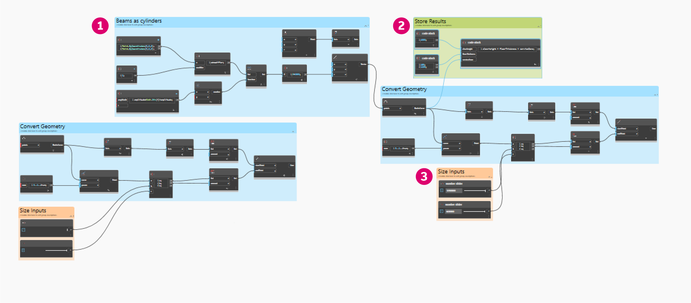
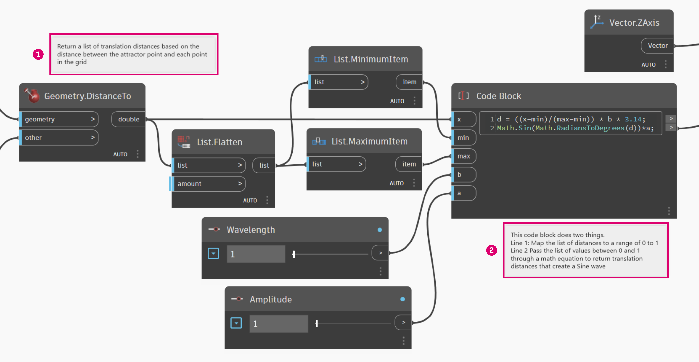

# 圖表策略

在此章節之前，本手冊已涵蓋如何實施 Dynamo 的強大視覺腳本撰寫功能。充分瞭解這些功能是重要的基礎，以及建置功能強大的視覺程式的第一步。當我們實際使用視覺程式、將其與同事共享、疑難排解錯誤或測試限制時，我們將需要處理其他問題。如果其他使用者將使用您的程式，或您預期六個月後將會打開它，程式則需要有直接、清晰的圖形和邏輯。Dynamo 有多個工具可管理程式的複雜性，本章將提供有關何時使用它們的準則。

## 減少複雜性

當您開發 Dynamo 圖表和測試您的想法時，它的大小和複雜性可快速增加。建立可運作的程式和建立簡單的程式同樣重要。圖表不僅更快且更有預測性地執行，您與其他使用者亦將瞭解其邏輯。以下幾種方法可協助您闡明圖表的邏輯。

### **以群組模組化**

* 建置程式時，透過群組可以**建立功能不同的部分**
* 群組可讓您四處**移動程式的大塊部分**，同時維持模組性與一致性
* 您可以變更**群組的顏色來區分**群組執行的內容 (輸入與函數)
* 您可以使用群組開始**組織圖表，以簡化自訂節點的建立**

> 此程式中的顏色用於識別每個群組的目的。此策略可用於建立任何您開發的圖形標準或樣板裡的架構。
>
> 1. 函數群組 (藍色)
> 2. 輸入群組 (橘色)
> 3. 腳本群組 (綠色)
>
> 若要瞭解如何使用群組，請參閱[管理您的程式](https://primer2.dynamobim.org/v/zh-tw/9_best_practices/4-managing-your-program)。

### **使用 Code Block 有效率地開發**

* 有時，您可以使用 Code Block，以**快於搜尋的方式輸入數字或節點方法** (Point.ByCoordinates、Number、String、Formula)
* **如果您要在 DesignScript 定義自訂函數以減少圖表中的節點數量**，Code Block 就非常好用

.png)

> 1 和 2 均執行相同的功能。寫入數行程式碼遠遠比搜尋並加入每個個別節點更快。Code block 也會更精確。
>
> 1. 使用 Code Block 撰寫的 DesignScript
> 2. 節點中的相等程式
>
> 若要瞭解如何使用 Code Block，請參閱[什麼是 Code Block](../8\_coding\_in\_dynamo/8-1\_code-blocks-and-design-script/1-what-is-a-code-block.md)。

### **使用「將節點轉換為程式碼」進行濃縮**

* 您可以**使用「將節點轉換為程式碼」減低圖表的複雜性**，它會收集簡單的節點，並在一個 Code Block 裡寫入與其對應的 DesignScript。
* 「將節點轉換為程式碼」可以**濃縮程式碼，而不會減低程式的清晰度**
* 以下是使用「將節點轉換為程式碼」的**優點**：
  * 輕鬆地將程式碼濃縮為仍可編輯的元件
  * 可以簡化圖表的重要部分
  * 如果不會對「小型程式」進行頻密的編輯，它將會很有用處
  * 適合用來整合其他程式碼區塊功能，例如函數
* 以下是使用「將節點轉換為程式碼」的**缺點**：
  * 一般命名使其不易辨認
  * 其他使用者比較難以瞭解
  * 較難返回視覺程式版本

> 1. 既有的程式
> 2. 從「將節點轉換為程式碼」建立的 Code Block
>
> 若要瞭解如何使用「將節點轉換為程式碼」，請參閱 [DesignScript 語法](../8\_coding\_in\_dynamo/8-1\_code-blocks-and-design-script/2-design-script-syntax.md)。

### **使用 List@Level 彈性存取資料**

* 使用 List@Level 可以協助您**取代可能會佔用大量圖元區空間的 List.Map 和 List.Combine 節點，降低圖表的複雜性**。
* List@Level 是比 List.Map/List.Combine **更快建構節點邏輯的方法**，可讓您直接從節點的輸入埠存取清單中任何層級的資料。

\.png>)

> 我們可以為 CountTrue 的 list 輸入啟用 List@Level，來確認 BoundingBox.Contains 在哪些清單中傳回多少 True 值。List@Level 可讓使用者決定輸入將在哪個層級取得資料。使用 List@Level 更為彈性、有效，強烈建議您以它來取代涉及 List.Map 和 List.Combine 的其他方式。
>
> 1. 計算 List Level 2 的 true 值
> 2. 計算 List Level 3 的 true 值
>
> 若要瞭解如何使用 List@Level，請參閱[清單的清單](https://primer2.dynamobim.org/v/zh-tw/5_essential_nodes_and_concepts/5-4_designing-with-lists/3-lists-of-lists)。

## 保持可讀性

除了使圖表更為簡單和高效外，您亦應致力於維持它的清晰度。即使您盡最大的努力讓圖表擁有直覺式的邏輯分組，關係仍然可能不會立即顯現。在群組裡加入簡單的註記或更名滑棒可以幫助您或其他使用者避免不必要的混淆或橫跨圖表的麻煩。以下幾種方法可協助確保圖表內和圖表間的一致性。

### **使用節點對齊維持視覺連續性**

* 為減少您在完成建構圖表的後續工作，您應該嘗試**時常對齊節點**以確保節點配置易於辨認
* 如果其他人要處理您的圖表，您應該**確保節點線路的配置在傳輸前能夠輕鬆地流動**
* 為了協助您對齊，**請使用「清理節點配置」功能自動對齊**圖表，即使它未能如您自己手動對齊般精確

\.png>)

> 1. 未排列過的圖表
> 2. 對齊的圖表
>
> 若要瞭解如何使用「節點對齊」，請參閱[管理您的程式](4-managing-your-program.md)。

### **利用更名做描述性的標示**

* 將輸入更名可協助他人輕鬆瞭解您的圖表，**尤其當他們插入的內容不在螢幕上顯示時**
* **更名節點而非輸入時請小心。**另一種替代方法是從節點叢集建立自訂節點並對其進行更名；這會讓人瞭解它包含其他內容

> 1. 操控曲面的輸入
> 2. 建築參數的輸入
> 3. 排水模擬腳本的輸入
>
> 若要更名節點，請在其名稱上按一下右鍵，然後選擇「更名節點...」。

### **使用註釋做解釋**

* 如果**圖表需要節點無法表達的普通語言說明**，您應該加入註釋
* 如果**節點太多，或群組太大或太複雜，而無法輕鬆瞭解**，您應該加入註釋

> 1. 描述傳回原始轉換距離的程式部分的註釋
> 2. 描述將這些值對映至正弦波形的程式碼的註釋
>
> 若要瞭解如何加入註釋，請參閱[管理您的程式](https://primer2.dynamobim.org/v/zh-tw/9_best_practices/4-managing-your-program)。

## 持續調整

建置視覺指令碼時，請務必確認所傳回的與您所預期的相符。並非所有錯誤或問題都會導致程式立即失敗，尤其是可能會影響下游較遠處的 null 或零值。[指令碼撰寫策略](2-scripting-strategies.md)中討論文字指令碼撰寫的脈絡也討論此策略。以下練習將有助於確保您獲得預期的內容。

### **使用 Watch 和「預覽標示圈」監看資料**

* 建立程式時，使用 Watch 或「預覽標示圈」**確認關鍵輸出傳回您預期的內容**

> Watch 節點用於比較：
>
> 1. 原始轉換距離
> 2. 通過正弦方程式的值
>
> 若要瞭解如何使用 Watch，請參閱[資源庫](../3\_user\_interface/2-library.md)。

## 確保可重複使用

即使您獨立工作，其他使用者亦很有可能會開啟您的程式。他們應該可以快速瞭解程式需要，以及使用程式的輸入與輸出執行作業。如果開發自訂節點是為了與 Dynamo 社群共用和用於其他人的程式，這點尤其重要。這些做法能夠產生強大、可重複使用的程式和節點。

### **管理 I/O**

* 若要確保易讀和可調整，您應該嘗試**儘量減少輸入與輸出**
* 在圖元區加入任何節點之前，您應該嘗試**先建立邏輯能運作的粗略大綱，來策劃您要如何建置邏輯**。當您建立粗略的大綱時，您應該持續記錄指令碼要新增哪些輸入和輸出。

### **使用「預置」嵌入輸入值**

* 如果您有**想要嵌入到圖表中的特定選項或條件**，您應該使用「預置」以快速存取。
* 您也可以使用「預置」，在執行時間較長的圖表中**快取特定的滑棒值來降低複雜性**。

> 若要瞭解如何使用「預置」，請參閱[使用預置管理您的資料](1-graph-strategies.md#use-presets-to-embed-input-values)。

### **使用自訂節點包含程式**

* 如果您的**程式可以收集到單一容器中**，您應該使用自訂節點。
* **當圖表的一部分經常在其他程式中重複使用**，您應該使用自訂節點。
* 如果您想要**與 Dynamo 社群分享功能**，您應該使用自訂節點。

> 將點平移程式收集成一個自訂節點，可以建立一個功能強大、獨特、可攜式和更易於瞭解的程式。清晰地命名輸入埠將協助其他使用者瞭解如何使用節點。請記得為每個輸入加入描述和所需的資料類型。
>
> 1. 既有牽引程式
> 2. 收集此程式 PointGrid 的自訂節點
>
> 若要瞭解如何使用自訂節點，請參閱[自訂節點簡介](../6\_custom\_nodes\_and\_packages/6-1\_custom-nodes/1-introduction.md)。

### **建立樣板**

* 您可以建立樣板來**建立視覺圖表的圖形標準，以確保協同合作者使用標準化的方式瞭解圖表**
* 建立樣板時，您可以標準化**群組顏色和字體大小**，為工作流程類型或資料動作分類。
* 建立樣板時，您甚至可以標準化您想要如何在圖表中**為前端與後端工作流程之間的差異進行標示、著色或設計型式**。

.png)

> 1. 程式的使用者介面 (前端) 包括專案名稱、輸入滑棒和匯入幾何圖形。
> 2. 程式的後端。
> 3. 群組顏色品類 (一般設計、輸入、Python 指令碼、匯入的幾何圖形)。

## 練習 - 建築的屋頂

> 按一下下方的連結下載範例檔案。
>
> 附錄中提供完整的範例檔案清單。

現在我們已建立多個最佳作法，讓我們將它們套用至一個快速建置的程式。雖然程式成功產生屋頂，但圖表的狀態是作者的思維導圖。它缺少任何組織或有關使用它的說明。我們將逐步瞭解組織、描述和分析程式的最佳實踐，以便其他使用者可以瞭解如何使用它。

> 程式正常運作，但圖表缺乏組織。

我們先決定程式傳回的資料和幾何圖形。

> 瞭解資料會在何時發生重大變化，對於建立邏輯劃分或模組性非常重要。請嘗試利用 Watch 節點來檢查程式的其餘部分，看看您是否可以先決定群組，然後才移至下一個步驟。
>
> 1. 這個有數學方程式的 **Code Block** 似乎是程式的關鍵部分。**Watch** 節點會顯示方程式傳回平移距離的清單。
> 2. 此區域的目的並不明顯。**BoundingBox.Contains** 在清單層級 L2 的 True 值排列，且 **List.FilterByBoolMask** 的存在，表示我們正在對點格線的一部分進行取樣。

一旦我們瞭解程式的元素部分，就可將其分組。

> 群組可讓使用者從視覺上區分程式的各個部分。
>
> 1. 匯入 3D 敷地模型
> 2. 根據正弦方程式轉換點網格
> 3. 點網格的範例部分
> 4. 建立建築屋頂的曲面
> 5. 建立玻璃帷幕牆

建立群組後，對齊節點以建立圖表的視覺連續性。

> 視覺連續性可協助使用者查看程式流程和節點之間的隱含關係。

透過加入另一層圖形改進來使程式更容易存取。加入註釋以描述程式中特定區域的運作方式、為輸入自訂名稱，以及對不同類型的群組指定顏色。

.png)

> 這些圖形改進可讓使用者瞭解更多有關程式的執行。不同的群組顏色有助於區分輸入與函數。
>
> 1. 註釋
> 2. 輸入的描述性名稱

在開始壓縮程式之前，讓我們先尋找關鍵位置引入 Python 指令碼排水模擬器。將第一個已調整比例的屋頂曲面的輸出插入各自的腳本輸入。

> 我們選擇現在將腳本整合到程式，以便可以在原始、單一的屋頂曲面執行排水模擬。指定的曲面無法被預覽，但它可讓我們不必選取倒角 Polysurface 的頂部表面。
>
> 1. 腳本輸入的來源幾何圖形
> 2. Python 節點
> 3. 輸入滑棒
> 4. 打開/關閉開關

一切就緒，我們來簡化圖表。

> 使用「將節點轉換為程式碼」和「自訂節點」濃縮程式，已經大幅減少圖表的大小。建立屋頂曲面和牆的群組已轉換為程式碼，因為它們特定於此程式。點轉換群組包含在自訂節點中，並且可以用於其他程式。在範例檔案中，從轉換點群組建立您的自訂節點。
>
> 1. 包含「轉換點網格」群組的自訂節點
> 2. 使用「將節點轉換為程式碼」壓縮「建立建築屋頂曲面和帷幕牆」群組

最後一步是建立典型屋頂形狀的預置。

> 這些輸入是屋頂形狀的主要驅動因素，將協助使用者發現程式的潛能。

我們的程式有兩個預置視圖。

> 屋頂排水模式提供使用者以解析分式檢視各個預置。
