# 指令碼撰寫策略

使用 DesignScript、Python 和 ZeroTouch (C#) 在視覺指令碼撰寫環境中進行文字指令碼撰寫，可建立功能強大的視覺關係。使用者可以在相同的工作區內執行以下所有作業：顯示如輸入滑棒等的元素、將大型作業壓縮並輸入至 DesignScript，以及透過 Python 或 C# 存取功能強大的工具和資源庫。如果有效管理，結合這些策略可為整體程式增添極大的自訂成份、透明度和效率。以下是一組準則，協助您利用文字指令碼擴充您的視覺指令碼。

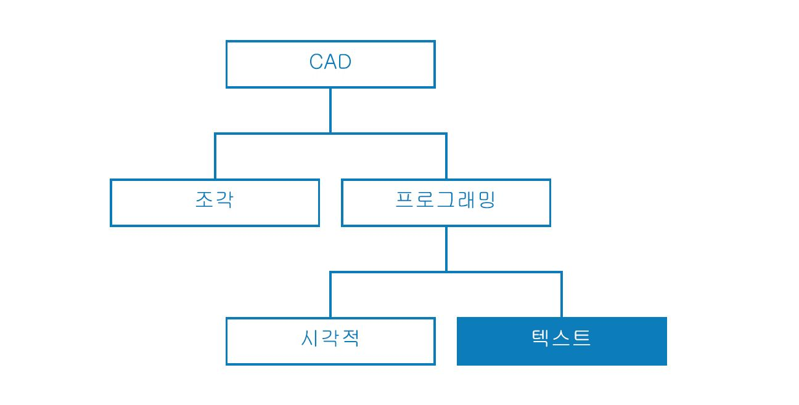

### 瞭解何時撰寫指令碼

與視覺程式設計相比，文字指令碼更能建立較高複雜性的關係，但兩者的功能也明顯重疊。這是合理的，因為節點是預先封裝的程式碼，而我們或許可以將整個 Dynamo 程式寫入 DesignScript 或 Python。但是，由於節點介面和線路建立直覺的圖形資訊流程，因此我們仍然使用視覺指令碼。瞭解文字指令碼比視覺指令碼優異的地方，可以幫助您瞭解應何時使用它，而又同時保留節點和線路的直覺本質。以下是有關何時撰寫指令碼和使用哪種語言的準則。

**在以下情況使用文字指令碼：**

* 迴圈
* 遞迴
* 存取外部資源庫

**選擇語言：**

|                    |             |               |                    |                    |               |
| ------------------ | ----------- | ------------- | ------------------ | ------------------ | ------------- |
|                    | **迴圈** | **遞迴** | **濃縮節點** | **外部資源庫** | **速寫** |
| **DesignScript**   | 是         | 是           | 是                | 否                 | 是           |
| **Python**         | 是         | 是           | 局部          | 是                | 否            |
| **ZeroTouch (C#)** | 否          | 否            | 否                 | 是                | 否            |

 
請參閱[指令碼撰寫參考](13-3\_scripting-reference.md)以瞭解每個 Dynamo 資源庫可讓您存取的功能清單。


### 以參數方式思考

當使用 Dynamo 撰寫指令碼時，在這個必然參數式的環境中適宜組織您的程式碼，使其與它將處於的節點和線路的架構相對。請將包含您文字指令碼的節點當做為程式中的任何其他節點，它有一些特定輸入、函數和預期的輸出。這讓節點內部的程式碼獲得一小組可讓您工作的變數，從而獲得一個清晰的參數式系統。以下是如何將程式碼更充分整合到視覺程式中的一些指導方針。

**識別外部變數：**

* 嘗試決定在您的設計問題中的給定參數，以便您可以直接使用該資料建置模型。
* 撰寫程式碼之前，請先識別變數：
  * 最小組輸入
  * 預期的輸出
  * 常數

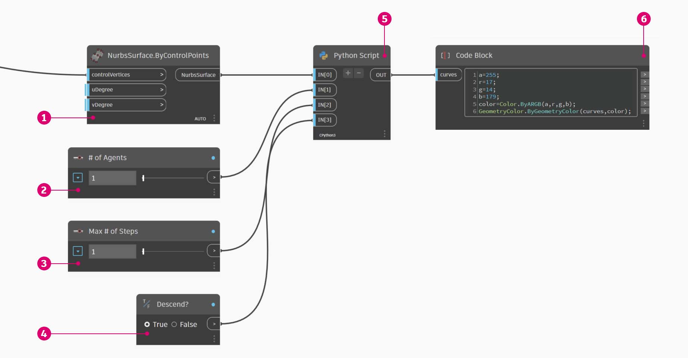

> 撰寫程式碼之前已建立多個變數。
>
> 1. 我們將模擬降雨的曲面。
> 2. 我們所需的雨滴 (代理程式) 數量。
> 3. 我們希望的降雨路程。
> 4. 在沿著最陡峭的路徑下降與穿過曲面之間切換。
> 5. Python 節點與其輸入數量。
> 6. 讓傳回的曲線變為藍色的 Code Block。

**設計內部關係：**

* 參數化允許對某些參數或變數進行編輯，以操控或變更方程式或系統的最終結果。
* 只要指令碼中的實體都是邏輯性相關，請嘗試將它們定義為對方的函數。如果使用此方法，當其中一個實體被修改，另一個就可以按比例更新。
* 只顯示關鍵參數來最小化輸入的數量：
  * 如果一組參數可從多個父系參數推導而來，就只顯示父系參數為指令碼輸入。這會降低指令碼介面的複雜性，進而提高可用性。

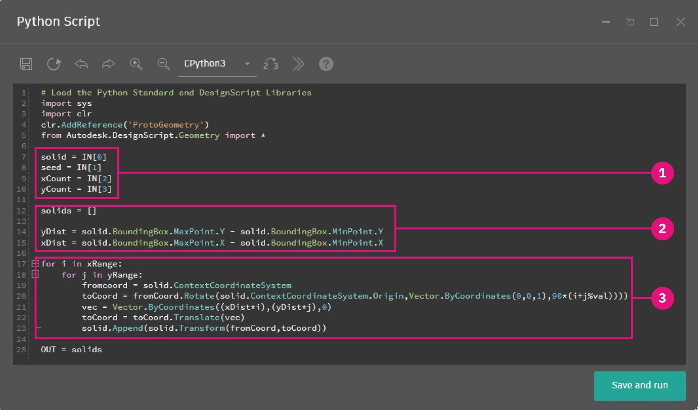

> 來自 [Python 節點](http://primer.dynamobim.org/en/09\_Custom-Nodes/9-4\_Python.html)中範例的程式碼「模組」。
>
> 1. 輸入。
> 2. 指令碼內部的變數。
> 3. 使用這些輸入和變數執行其函數的迴圈。

 秘訣：強調程序，如同您強調解決方案一樣。

### **不要重複自己 (DRY 原則)：**

* 當您在指令碼中使用多種方式表達同一件事，重複的表現方法在某些時刻可能會不一致，因而發生維護變得麻煩、分解困難和內部矛盾的情況。
* 「DRY」原則是「系統中的每個知識都必須有單一、清晰和權威性的表現法」：
  * 若成功應用此原則，指令碼中所有相關的元素都是可預測且一致地改變，所有不相關的元素彼此之間不會有邏輯性的後果。

```
### BAD
for i in range(4):
  for j in range(4):
    point = Point.ByCoordinates(3*i, 3*j, 0)
    points.append(point)
```

```
### GOOD
count = IN[0]
pDist = IN[1]

for i in range(count):
  for j in range(count):
    point = Point.ByCoordinates(pDist*i, pDist*j, 0)
    points.append(point)
```

 秘訣：在指令碼中複製實體前 (例如上述範例中的常數)，先檢查是否可以改為連結至來源。

### 模組化結構

當您的程式碼變得更長、「構想」變得更複雜，或總體演算法變得更難以辨認。追蹤特定作業的發生 (及在哪裡發生)、尋找錯誤、整合其他程式碼和指定開發工作時將會變得更因難。若要避免這些麻煩，應該將程式碼撰寫成模組型態，這是根據執行的工作來拆分程式碼的組織策略。以下是透過模組化方式讓您的指令碼更容易管理的一些秘訣。

**將程式碼撰寫成模組型態：**

* 「模組」是執行特定工作的一組程式碼，類似於工作區的 Dynamo 節點。
* 這可以是任何需要在視覺上從相鄰程式碼分離的內容 (函數、類別、一組輸入，或您要匯入的資源庫)。
* 以模組開發程式碼這一方法利用節點的視覺和直覺特性，以及只有文字指令碼可以辦到的複雜關係。


> 這些迴圈呼叫一個名為「代理程式」的類別，我們將在練習中開發。
>
> 1. 定義每個代理程式起點的程式碼模組。
> 2. 更新代理程式的程式碼模組。
> 3. 為代理程式的路徑繪製一條軌跡的程式碼模組。

**找出重複使用的程式碼：**

* 如果您發現您的程式碼在不同的地方做同樣 (或非常類似) 的事情，應尋找方法把它叢集為可呼叫的函數。
* 「管理員」函數控制程式流程，主要包含對處理低階詳細資料 (例如在結構之間移動資料) 的「工作者」函數的呼叫。

此範例使用根據中心點的 Z 值所設定的半徑和顏色建立圓球。


> 1. 兩個「工作者」父系函數：一個根據中心點的 Z 值以半徑建立圓球，一個根據中心點的 Z 值顯示顏色。
> 2. 結合兩個工作者函數的「管理員」父系函數。呼叫此父系函數時將一同呼叫包含在其內的兩個函數。

**只顯示需要顯示的東西：**

* 模組介面表示模組提供與所需的元素。
* 定義好單位之間的介面時，每個單位的詳細設計可以分別繼續。

**可分離性/可取代性：**

* 模組並不知道彼此的存在。

**模組化的一般形式：**

*   群組程式碼：

    ```
    # IMPORT LIBRARIES
    import random
    import math
    import clr
    clr.AddReference('ProtoGeometry')
    from Autodesk.DesignScript.Geometry import *

    # DEFINE PARAMETER INPUTS
    surfIn = IN[0]
    maxSteps = IN[1]
    ```
*   函數：

    ```
    def get_step_size():
      area = surfIn.Area
      stepSize = math.sqrt(area)/100
      return stepSize

    stepSize = get_step_size()
    ```
*   類別：

    ```
    class MyClass:
      i = 12345

      def f(self):
        return 'hello world'

    numbers = MyClass.i
    greeting = MyClass.f
    ```

### 連續地調整

在 Dynamo 開發文字指令碼時，應時常確定您實際建立的內容與您的預期相符。這確保在意外事件 (語法錯誤、邏輯差異、值錯誤、異常輸出等) 一出現就可以快速發現並處理，而非最後才一次處理。因為文字指令碼位於圖元區的節點內部，它們已經整合到視覺程式的資料流。這會讓指令碼的連續監視變得十分簡單：包括分配要輸出的資料、執行程式，以及使用 Watch 節點計算流出指令碼的內容。以下是在建構指令碼時不斷檢查它們的一些秘訣。

**建構時同時進行測試：**

* 每當您完成一堆功能時：
  * 回頭檢查您的程式碼。
  * 好好地審視它。協同合作者是否能瞭解此作業？我是否需要執行此作業？此函數是否可以更有效率地完成？我是否建立了不必要的複本或相依性？
  * 進行快速測試，以確定它傳回「有意義」的資料。
* 指定指令碼中最近使用的資料為輸出，當指令碼更新時，節點永遠會輸出相關的資料：

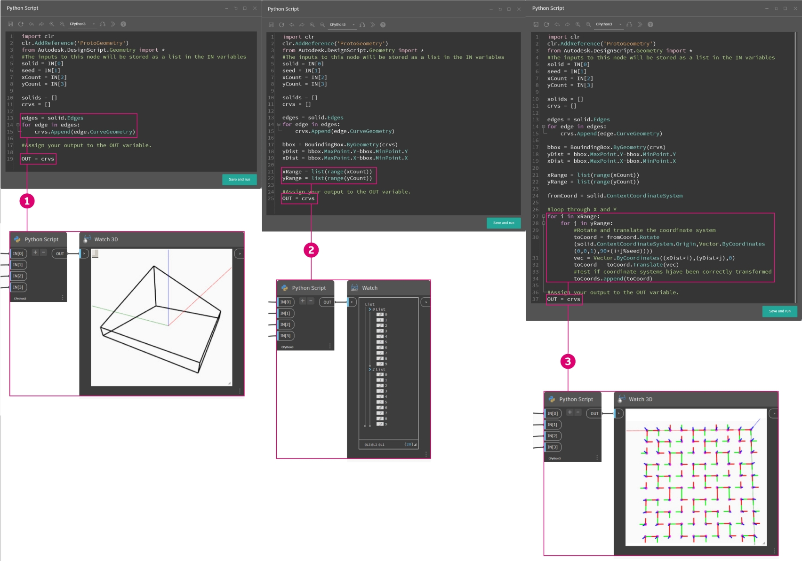

> 1. 檢查實體的所有邊以曲線方式傳回，以建立一個邊界框。
> 2. 檢查已將計數輸入成功轉換為範圍。
> 3. 確認此迴圈的座標系統已正確平移和旋轉。

**預期「極端情形」：**

* 撰寫指令碼時，將您的輸入參數設定為其指定範圍的最小值和最大值，以檢查程式在極端情形下是否仍能正常運作。
* 即使程式在極端情形下仍能正常運作，請檢查其是否正在傳回非預期的 null/空白/零值。
* 有時候，反映指令碼某些基本問題的錯誤只會在這些極端情形下出現。
  * 瞭解錯誤的成因，然後決定是否需要進行內部的修正，或是需要重新定義某個參數範圍以避免此問題。

 秘訣：永遠假定使用者將使用他/她會看到的每一個輸入值的每個組合。這樣有助於避免不必要的意外。

### 有效率地除錯

除錯是從指令碼中消除「錯誤」的過程。錯誤可能是誤差、低效率、不精確，或任何非預期的結果。解決錯誤可以是簡單地修正拼錯的變數名稱，或者是指令碼中更普遍的結構問題。在理想狀態下，建置指令碼時同時調整它可以幫助及早發現這些潛在問題，但這不能保證指令碼沒有錯誤。以下是對上述幾個最佳實踐的回顧，以協助您有系統地解決錯誤。

**使用 Watch 標示圈：**

* 將程式碼指定給 OUT 變數，檢查程式碼不同位置傳回的資料，類似於調整程式的概念。

**撰寫有意義的註釋：**

* 如果清楚說明了預期結果，程式碼的模組將會更容易除錯。

```py
# Loop through X and Y
for i in range(xCount):
  for j in range(yCount):

    # Rotate and translate the coordinate system
    toCoord = fromCoord.Rotate(solid.ContextCoordinateSystem.Origin,Vector.ByCoordinates(0,0,1),(90*(i+j%seed)))
    vec = Vector.ByCoordinates((xDist*i),(yDist*j),0)
    toCoord = toCoord.Translate(vec)

    # Transform the solid from the source coord system to the target coord system and append to the list
    solids.append(solid.Transform(fromCoord,toCoord))
```

> 這通常會產生大量註解和空白行，但除錯時將事情分解成可管理的部分會很有用。

**利用程式碼的模組性：**

* 問題的根源可以追溯到某些模組。
* 一旦識別錯誤的模組，修正問題就會較為簡單。
* 如果必須修改程式，就可以更輕鬆地變更開發成為模組的程式碼：
  * 您可以將新的或已除錯的模組插入既有的程式，確信程式的其餘部分不會改變。

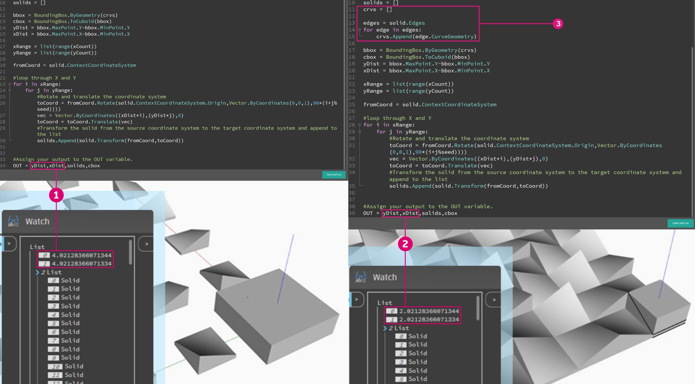

> 在 [Python 節點](http://primer.dynamobim.org/en/09\_Custom-Nodes/9-4\_Python.html)的範例檔案中進行除錯。
>
> 1. 當指定 xDist 和 yDist 為 OUT 時，我們可以看到輸入幾何圖形會傳回一個大於自己的邊界框。
> 2. 輸入幾何圖形的邊的曲線會傳回合適的邊界框和 xDist 和 yDist 的正確距離。
> 3. 我們為解決 xDist 和 yDist 值的問題而插入的「模組」程式碼。

## 練習：最陡的路徑

> 按一下下方的連結下載範例檔案。
>
> 附錄中提供範例檔案的完整清單。



請記住文字指令碼的最佳實踐，我們撰寫一個降雨模擬的指令碼。雖然我們可以在圖表策略中將最佳實踐套用至缺乏條理的視覺程式，但要將最佳實踐套用至文字指令碼則難得多。在文字指令碼中建立的邏輯關係不太明顯，並且幾乎無法在混亂的程式碼中解開。文字指令碼的強大功能意味著需要更多的組織。我們會檢視每個步驟並套用最佳實踐。

我們的指令碼已套用至牽引點變形的曲面。

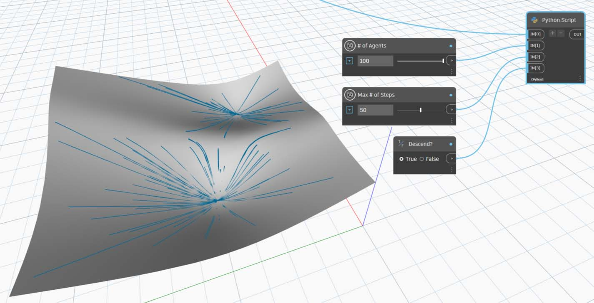

我們首先需要匯入必要的 Dynamo 資源庫。首先執行此作業可取得 Python 中對 Dynamo 功能的整體存取。

我們需要將想使用的所有資源庫匯入此處。

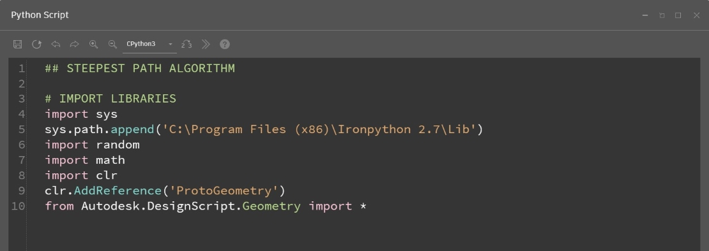

接下來，我們需要定義指令碼的輸入和輸出，它將顯示為節點的輸入埠。這些外部輸入是指令碼的基礎，以及建立參數式環境的關鍵。

我們需要定義對應 Python 指令碼中變數的輸入，並決定所需的輸出：

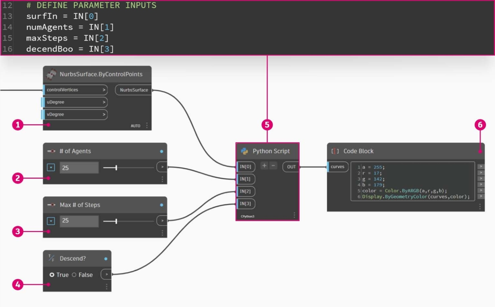

> 1. 我們想要沿著走的曲面。
> 2. 我們想要走動的代理程式數目。
> 3. 允許代理程式採取的最大步數。
> 4. 以最短路徑漫遊或橫過曲面的選項。
> 5. Python 節點的輸入識別碼與腳本中的輸入對應 (IN[0], IN[1])。
> 6. 輸出曲線可使用不同的顏色顯示。

現在，讓我們採用模組化的做法，並建立指令碼的本體。模擬從多個起點沿著曲面走最短路徑是一項很重要的工作，這需要多個函數。我們可以將程式碼收集成單一類別 (代理程式) 來將程式碼模組化，而不需要在整個指令碼中呼叫不同的函數。此類別的不同函數 (或稱「模組」) 可以使用不同的變數呼叫，或甚至可重複用於其他指令碼。

我們必須為代理程式定義一個類別 (或稱藍圖)，讓它每走一步後都會選擇最陡的方向沿著曲面繼續前進：

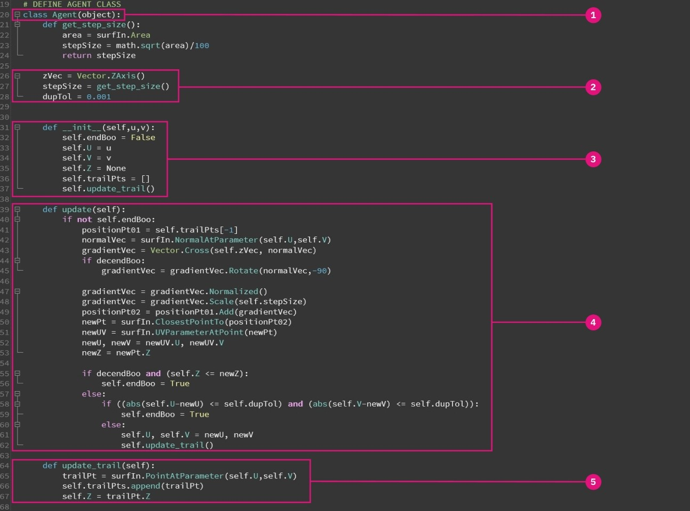

> 1. 名稱。
> 2. 所有代理程式共用的全域屬性。
> 3. 每個代理程式獨有的例證屬性。
> 4. 行走一步的函數。
> 5. 將每步位置編入軌跡清單的函數。

我們來定義代理程式的起點位置來加以初始化。這是一個很好的機會去調整指令碼，確保代理程式類別有作用。

我們需要將所有我們要觀察它沿著曲面走的代理程式實體化，並定義其初始屬性：

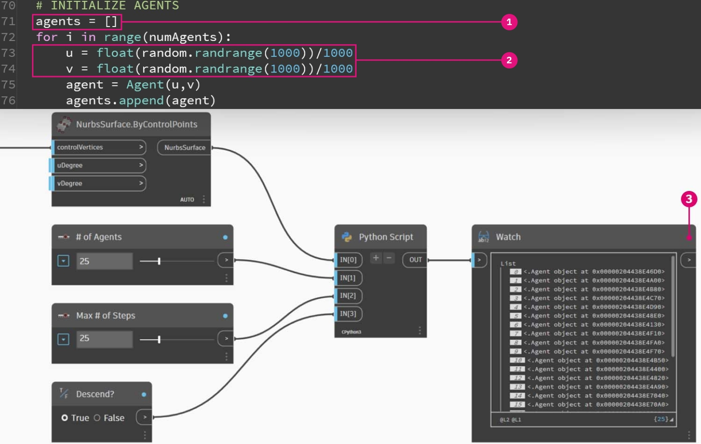

> 1. 新的空白軌跡清單。
> 2. 代理程式在曲面上開始路程的位置。
> 3. 我們已指定代理程式清單為輸出，查看指令碼會傳回什麼。傳回的代理程式數目正確，但稍後我們需要再次調整指令碼，以確認傳回的幾何圖形。

在每一步更新每個代理程式。然後，我們需要為每個代理程式及每一步輸入巢狀迴路，並且在軌跡清單中更新和記錄位置。在每一步，我們也要確保代理程式始終能夠在曲面上保持行走以允許其下降。如果滿足該條件，我們就結束代理程式的路程。

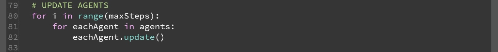

現在我們的代理程式已完全更新，我們來傳回代表它們的幾何圖形。當所有代理程式都達到它們的下降限制或最大步數時，我們將建立一條穿過軌跡清單中各點的 polycurve，並輸出 polycurve 軌跡。

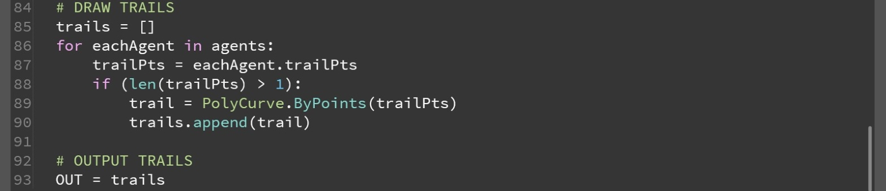

尋找最陡路徑的指令碼。

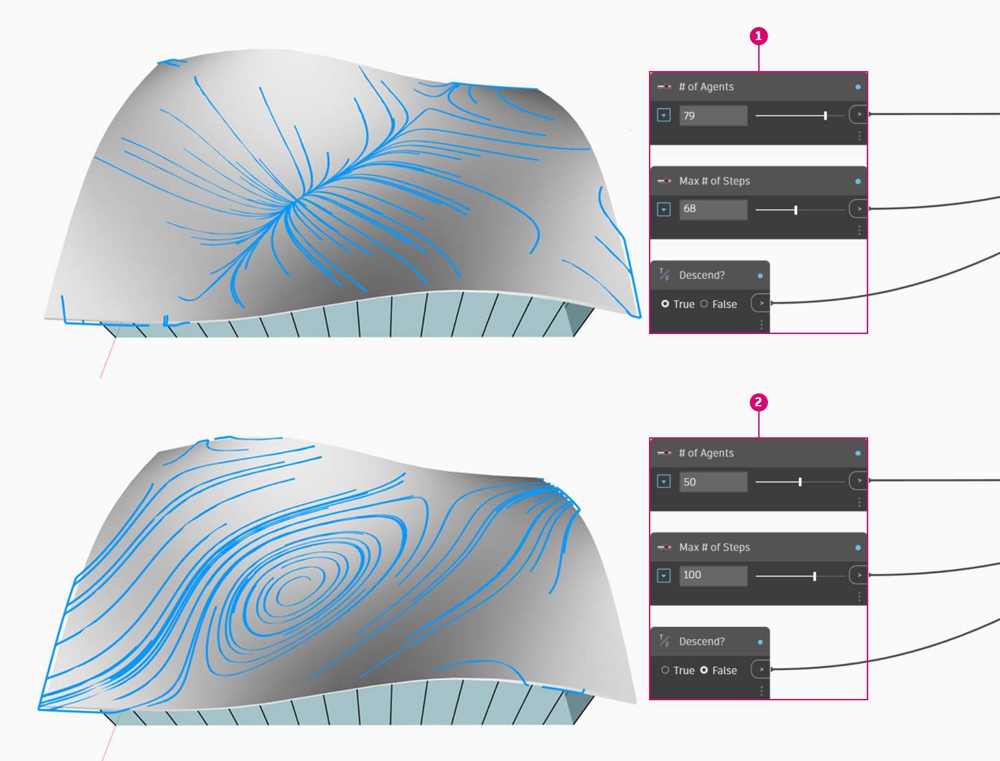

> 1. 在基本曲面上模擬降雨的預置。
> 2. 代理程式可切換為穿過基本曲面，而不是尋找最陡的路徑。

完整的 Python 文字指令碼。

```
### STEEPEST PATH ALGORITHM

# IMPORT LIBRARIES
import sys
sys.path.append('C:\Program Files (x86)\IronPython 2.7\Lib')
import random
import math
import clr
clr.AddReference('ProtoGeometry')
from Autodesk.DesignScript.Geometry import *

# DEFINE PARAMETER INPUTS
surfIn = IN[0]
numAgents = IN[1]
maxSteps = IN[2]
decendBoo = IN[3]


# DEFINE AGENT CLASS
class Agent(object):
    def get_step_size():
        area = surfIn.Area
        stepSize = math.sqrt(area)/100
        return stepSize

    zVec = Vector.ZAxis()
    stepSize = get_step_size()
    dupTol = 0.001


    def __init__(self,u,v):
        self.endBoo = False
        self.U = u
        self.V = v
        self.Z = None
        self.trailPts = []
        self.update_trail()

    def update(self):
        if not self.endBoo:
            positionPt01 = self.trailPts[-1]
            normalVec = surfIn.NormalAtParameter(self.U,self.V)
            gradientVec = Vector.Cross(self.zVec, normalVec)
            if decendBoo:
            	gradientVec = gradientVec.Rotate(normalVec,-90)

            gradientVec = gradientVec.Normalized()
            gradientVec = gradientVec.Scale(self.stepSize)
            positionPt02 = positionPt01.Add(gradientVec)
            newPt = surfIn.ClosestPointTo(positionPt02)
            newUV = surfIn.UVParameterAtPoint(newPt)
            newU, newV = newUV.U, newUV.V
            newZ = newPt.Z

            if decendBoo and (self.Z <= newZ):
            	self.endBoo = True
            else:
	            if ((abs(self.U-newU) <= self.dupTol) and (abs(self.V-newV) <= self.dupTol)):
	                self.endBoo = True
	            else:
	                self.U, self.V = newU, newV
	                self.update_trail()

    def update_trail(self):
        trailPt = surfIn.PointAtParameter(self.U,self.V)
        self.trailPts.append(trailPt)
        self.Z = trailPt.Z


# INITIALIZE AGENTS
agents = []
for i in range(numAgents):
	u = float(random.randrange(1000))/1000
	v = float(random.randrange(1000))/1000
	agent = Agent(u,v)
	agents.append(agent)


# UPDATE AGENTS
for i in range(maxSteps):
	for eachAgent in agents:
		eachAgent.update()

# DRAW TRAILS
trails = []
for eachAgent in agents:
	trailPts = eachAgent.trailPts
	if (len(trailPts) > 1):
		trail = PolyCurve.ByPoints(trailPts)
		trails.append(trail)

# OUTPUT TRAILS
OUT = trails
```
