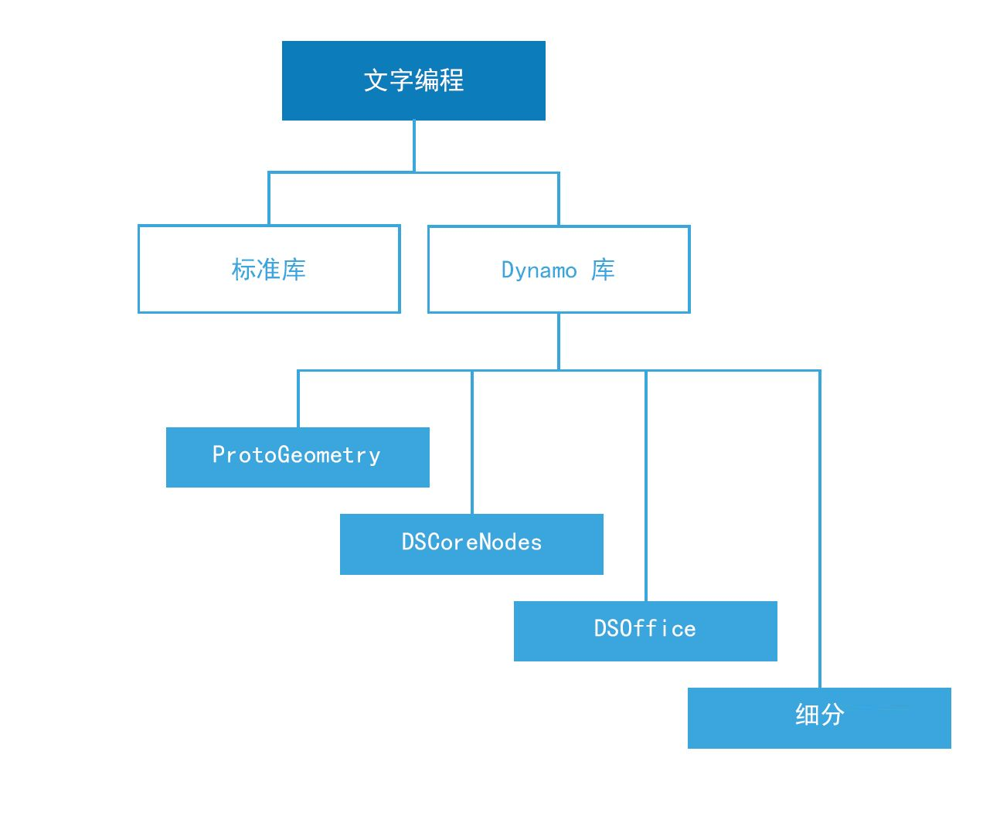

# 指令碼撰寫參考

此參考頁面延伸〈指令碼撰寫策略〉中涵蓋的最佳實踐，提供更多有關程式碼資源庫、標示和型式設定的詳細資料。我們將使用 Python 來說明以下的概念，但相同的原則適用於 Python 和 C# (Zerotouch) (但不同的語法)。

## 要使用的資源庫

標準資源庫位於 Dynamo 外部，存在於 Python 和 C# (Zerotouch) 等程式設計語言。Dynamo 還具有自己的一組資源庫，直接對應其節點架構，可讓使用者在程式碼中建置任何利用節點和線路來建置的內容。以下指南包含每個 Dynamo 資源庫允許存取的內容以及何時使用標準的資源庫。



**標準資源庫和 Dynamo 資源庫**

* Python 和 C# 的標準資源庫可用於在 Dynamo 環境中建置進階資料和流動結構。
* Dynamo 資源庫直接對應用於建立幾何圖形和其他 Dynamo 物件的節點架構。

**Dynamo 資源庫**

1.  ProtoGeometry*

    * 功能：弧、邊界框、圓形、圓錐體、座標系統、立方體、曲線、圓柱邊、邊緣、橢圓、橢圓弧、面、幾何圖形、螺旋線、索引群組、線、網格、Nurbs 曲線、Nurbs 曲面、平面、點、多邊形、矩形、實體、圓球、曲面、拓樸、T 雲形線、UV、向量、頂點。
    * 如何匯入：`import Autodesk.DesignScript.Geometry`

    \`\`
2. DSCoreNodes
   * 功能：顏色、顏色範圍 2D、日期時間、時間跨距、IO、公式、邏輯、清單、數學、四元樹狀目錄、字串、螺紋。
   * 如何匯入：`import DSCore`
3. 鑲嵌
   * 功能：凸面關聯線，Delaunay、Voronoi。
   * 如何匯入：`import Tessellation`
4. DSOffice
   * 功能：Excel。
   * 如何匯入：`import DSOffice`

 *注意：透過 Python 或 C# 使用 **ProtoGeometry** 時，您建立的是不受管理的物件，而這需要手動管理記憶體 - 請參閱以下一節： **不受管理的物件** ，以取得更多資訊。 


## 仔細標示

撰寫指令碼時，我們持續使用識別碼來表示變數、類型、函數和其他圖元等。透過此系統的符號表現法，在建築演算法時我們可以方便地使用標示的方式參考資訊，而標示通常由一系列的字元組成。有效地進行命名至關重要，可讓其他人及將來的自己輕鬆閱讀並瞭解所撰寫的程式碼！以下是在指令碼中進行命名時需謹記的一些秘訣：

**可以使用縮寫，但請加入註釋以解釋縮寫：**

```
### BAD
csfX = 1.6
csfY= 1.3
csfZ = 1.0
```

```
### GOOD
# column scale factor (csf)
csfX = 1.6
csfY= 1.3
csfZ = 1.0
```

**避免多餘的標示：**

```
### BAD
import car
seat = car.CarSeat()
tire = car.CarTire()
```

```
### GOOD
import car
seat = car.Seat()
tire = car.Tire()
```

**變數名稱使用正邏輯而不是負邏輯：**

```
### BAD
if 'mystring' not in text:
    print 'not found'
else:
    print 'found'
    print 'processing'
```

```
### GOOD
if 'mystring' in text:
    print 'found'
    print 'processing'
else:
    print 'not found'
```

**偏好「反轉標記法」：**

```
### BAD
agents = …
active_agents = …
dead_agents ...
```

```
### GOOD
agents = …
agents_active = …
agents_dead = ...
```

> 在結構而言比較合理。

**別名應用在縮短太長且經常重複的鏈：**

```
### BAD
from RevitServices.Persistence import DocumentManager

DocumentManager = DM

doc = DM.Instance.CurrentDBDocument
uiapp = DM.Instance.CurrentUIApplication
```

```
### GOOD
from RevitServices.Persistence import DocumentManager as DM

doc = DM.Instance.CurrentDBDocument
uiapp = DM.Instance.CurrentUIApplication
```

> 使用別名可能很快會產生非常混亂且不標準的程式。

**只使用必要的文字：**

```
### BAD
rotateToCoord = rotateFromCoord.Rotate(solid.ContextCoordinateSystem.Origin,Vector.ByCoordinates(0,0,1),5)
```

```
### GOOD
toCoord = fromCoord.Rotate(solid.ContextCoordinateSystem.Origin,Vector.ByCoordinates(0,0,1),5)
```

> 「所有事物都應該盡可能簡單，但不要太過於簡單。」– 愛因斯坦 (Albert Einstein)

## 型式一致

一般來說，程式設計有多種方法，因此您的「個人型式」的指令碼是無數個您選擇作出 (或不作出) 的小決定的結果。而您的程式碼的可讀性和可維護性碼是其內部一致性以及其遵循一般風格慣例的直接結果。基本原則是，在兩個位置看起來相同的程式碼亦應該擁有相同的工作方式。以下是撰寫清楚一致的程式碼的一些秘訣。

**命名慣例：**(為程式碼的每種實體選擇以下其中一種慣例，而且不要更改！)

* 變數、函數、方法、套件、模組：\
 `lower_case_with_underscores`
* 類別和例外情況：\
 `CapWords`
* 受保護的方法和內部函數：\
 `_single_leading_underscore(self, ...)`
* 私用方法：\
 `__double_leading_underscore(self, ...)`
* 常數：\
 `ALL_CAPS_WITH_UNDERSCORES`

> 秘訣：除非是非常短的區塊，可直接從上下文清楚看出涵義，否則請避免使用一個字母的變數 (例如 l、O、I）。

**使用空白行：**

* 用兩個空白行包圍頂層函數與類別定義。
  * 類別中的方式定義被一個空白行包圍。
  * 可以 (斟酌) 使用額外的空白行，來分隔有相關函數的群組。

**在下列位置避免出現多餘的空格：**

*   在括弧、方括弧或大括弧內：

    ```
    ### BAD
    function( apples[ 1 ], { oranges: 2 } )
    ```

    ```
    ### GOOD:
    function(apples[1], {oranges: 2})
    ```
*   在逗號、分號或冒號前：

    ```
    ### BAD
     if x == 2 : print x , y ; x , y = y , x
    ```

    ```
    ### GOOD
      if x == 2: print x, y; x, y = y, x
    ```
*   在開始函數呼叫的引數清單之左括弧前：

    ```
    ### BAD
    function (1)
    ```

    ```
    ### GOOD
    function(1)
    ```
*   在開始索引或切割之左括弧前：

    ```
    ### BAD
    dict ['key'] = list [index]
    ```

    ```
    ### GOOD
    dict['key'] = list[index]
    ```
*   務必在這些二進位運算子的兩側加入一個空格：

    ```
    assignment ( = )
    augmented assignment ( += , -= etc.)
    comparisons ( == , < , > , != , <> , <= , >= , in , not in , is , is not )
    Booleans ( and , or , not )
    ```

**Watch 一行長度：**

* 別擔心，有 ~ 79 個字元。
* 限制所需編輯器視窗寬度可以同時開啟多個檔案，並且適合使用在相鄰的欄顯示兩個版本的程式碼檢閱工具。
* 長的程式碼行可以使用括弧讓表示式換行而斷開成多行：

**避免明顯和多餘的註釋：**

* 有時更少的註釋使程式碼更容易閱讀，尤其是如果它強制您改用有意義的符號名稱。
*   採用好的程式碼習慣可減少依賴註釋：

    ```
    ### BAD
      # get the country code
      country_code = get_country_code(address)

      # if country code is US
      if (country_code == 'US'):
        # display the form input for state
        print form_input_state()
    ```

    ```
    ### GOOD
      # display state selection for US users
      country_code = get_country_code(address)
      if (country_code == 'US'):
        print form_input_state()
    ```

> 秘訣：註釋告知您「為什麼」，程式碼告知您「如何」。

**出庫使用開放原始碼：**

* 開放原始碼專案由大量開發人員協同合作建置。這些專案需要保持高度的程式碼可讀性，以便團隊可以盡可能地有效工作。因此，最好瀏覽這些專案的原始程式碼，以觀察這些開發人員的工作。
* 改善慣例：
  * 詢問自己，每個慣例是否能回應目前工作的需求。
  * 功能/效率有否受到影響？

## C# (Zerotouch) 標準

**請造訪這些 Wiki 頁面，以取得有關為 Zerotouch 寫入 C# 及貢獻 Dynamo 的指導：**

* 此 Wiki 包含一些記錄和測試程式碼的一般程式碼撰寫標準：[https://github.com/DynamoDS/Dynamo/wiki/Coding-Standards](https://github.com/DynamoDS/Dynamo/wiki/Coding-Standards)
* 此 Wiki 特別包含資源庫、品類、節點名稱、埠名稱和縮寫的命名標準：[https://github.com/DynamoDS/Dynamo/wiki/Naming-Standards](https://github.com/DynamoDS/Dynamo/wiki/Naming-Standards)

**不受管理的物件：**

從 Python 或 C# 使用 Dynamo 的幾何圖形資源庫 _(ProtoGeometry)_ 時，您建立的幾何圖形物件不會受虛擬機器管理，而且許多物件的記憶體都需要手動進行清理。若要清理原生或不受管理的物件，您可以使用 **Dispose** 方法或 **using** 關鍵字。請參閱此 Wiki 項目的概述：[https://github.com/DynamoDS/Dynamo/wiki/Zero-Touch-Plugin-Development#dispose--using-statement](https://github.com/DynamoDS/Dynamo/wiki/Zero-Touch-Plugin-Development#dispose--using-statement)。

您只需要處置不傳入圖表或儲存參考的不受管理的資源。在本節其餘部分，我們會將這些物件稱為 _中間幾何圖形_ 。您可以在以下的程式碼範例中查看有關此類別物件的範例。此 zero touch C# 函數 **singleCube** 會傳回一個立方塊，但在執行期間會額外建立 10000 個立方塊。我們可以假設這額外的幾何圖形是用作一些中間建構幾何圖形。

 **此 zero touch 功能很有可能會讓 Dynamo 當機。** 雖然我們建立了 10000 個實體，但只儲存其中一個並傳回這一個。我們應該改為處置所有中間立方塊，除了我們傳回的那一個。我們不想要處置我們傳回的內容，因為它會傳到圖表中並由其他節點使用。

```
public Cuboid singleCube(){

  var output = Cuboid.ByLengths(1,1,1);

  for(int i = 0; i<10000;i++){
    output = Cuboid.ByLengths(1,1,1);
  }
  return output;
}
```

修正後的程式碼將如下所示：

```
 public Cuboid singleCube(){

   var output = Cuboid.ByLengths(1,1,1);
   var toDispose = new List<Geometry>();

   for(int i = 0; i<10000;i++){
     toDispose.Add(Cuboid.ByLengths(1,1,1));
   }

   foreach(IDisposable item in toDispose ){
     item.Dispose();
   }

   return output;
 }
```

通常，您只需要處置幾何圖形 (例如 `Surfaces`、`Curves` 和 `Solids`)。為了安全起見，您可以處置所有幾何圖形類型 (`Vectors`、`Points`、`CoordinateSystems`)。
