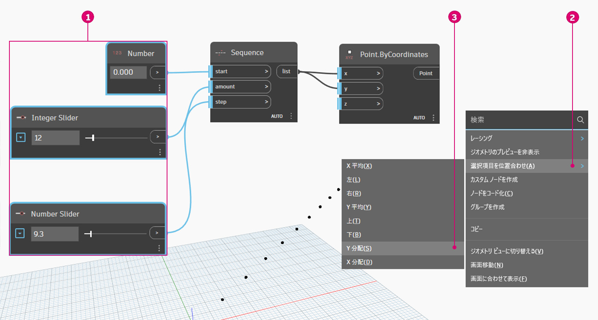
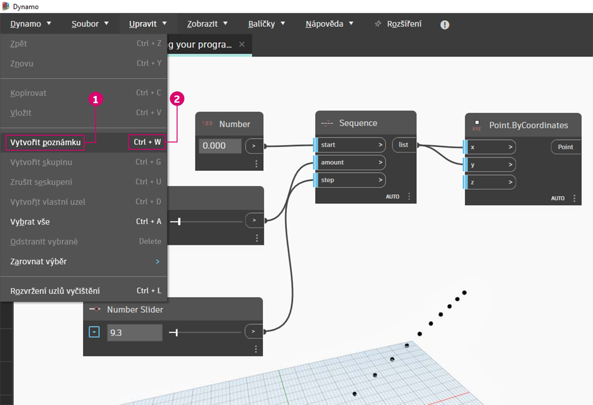
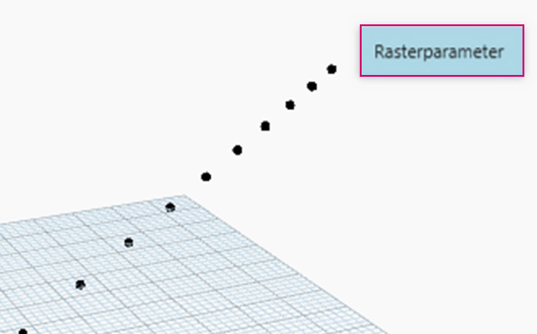
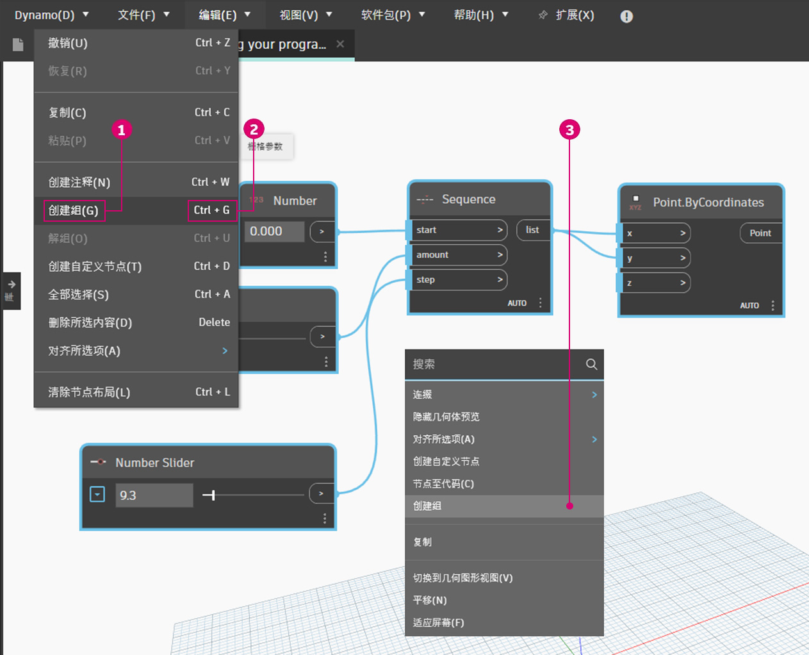
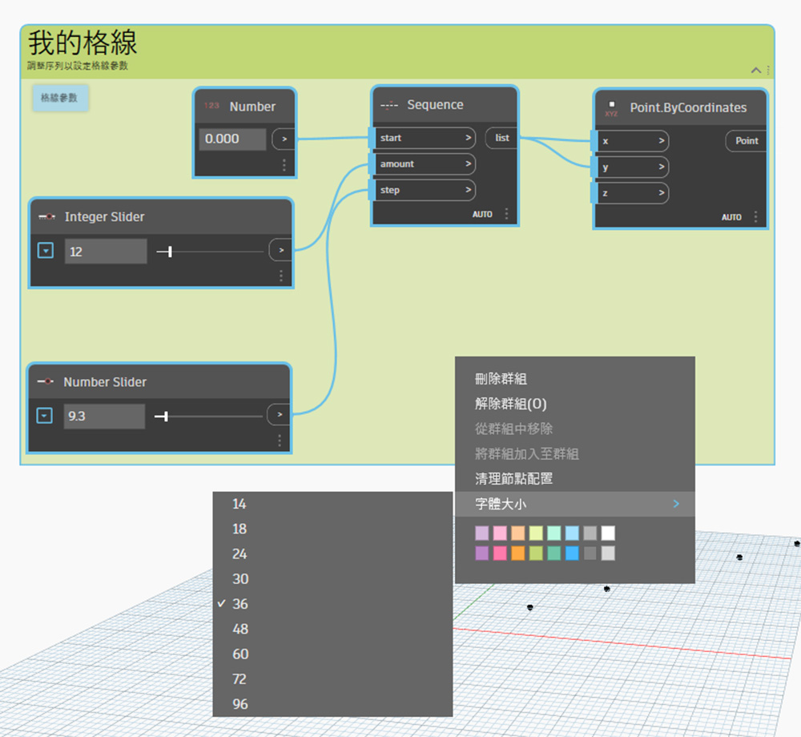
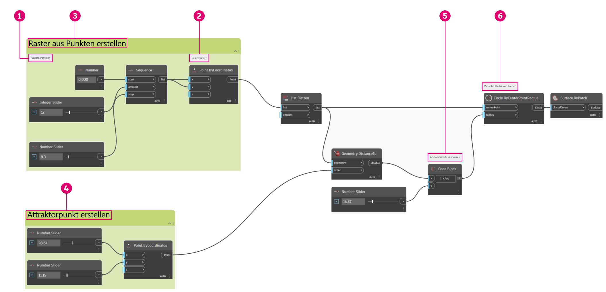

# Gestione del programma

Lavorare all'interno di un processo di programmazione visiva può essere una potente attività creativa, ma molto rapidamente il flusso di programma e gli input utente chiave possono essere oscurati dalla complessità e/o dal layout dell'area di lavoro. Saranno esaminate alcune procedure ottimali per la gestione del programma.

### Allineamento 

Dopo aver aggiunto più di qualche nodo all'area di lavoro, è possibile riorganizzare il layout dei nodi per maggiore chiarezza. Selezionando più nodi e facendo clic con il pulsante destro del mouse sull'area di lavoro, nella finestra a comparsa è disponibile un menu **Allinea selezione** con le opzioni di giustificazione e distribuzione in X e Y.

> 1. Selezionare più di un nodo.
> 2. Fare clic con il pulsante destro del mouse sulla area di lavoro.
> 3. Utilizzare le opzioni di **Allinea selezione**.

### Note 

Avendo maturato un po' di esperienza, si potrebbe "leggere" il programma visivo esaminando i nomi dei nodi e seguendo il flusso di programma. Per gli utenti di tutti i livelli di esperienza, è inoltre consigliabile includere etichette e descrizioni con linguaggio semplice. A tale scopo, in Dynamo è disponibile un nodo delle **note** con un campo di testo modificabile. È possibile aggiungere note all'area di lavoro in due modi:

> 1. Individuare il menu Modifica > Crea nota.
> 2. Utilizzare il tasto di scelta rapida da tastiera CTRL+W.

Una volta aggiunta la nota all'area di lavoro, verrà visualizzato un campo di testo che consente di modificare il testo nella nota. Una volta creata, è possibile modificare la nota facendo doppio clic o facendo clic con il pulsante destro del mouse sul nodo della nota.

### Raggruppamento 

Quando le dimensioni del programma visivo aumentano, è utile identificare i passaggi più lunghi che verranno eseguiti. È possibile evidenziare raccolte di nodi di dimensioni maggiori con un **gruppo** per etichettarle con un rettangolo colorato nello sfondo e un titolo. Esistono tre modi per creare un gruppo con più di un nodo selezionato:

> 1. Individuare il menu Modifica > Crea gruppo.
> 2. Utilizzare il tasto di scelta rapida da tastiera CTRL+G.
> 3. Fare clic con il pulsante destro del mouse sull'area di lavoro e selezionare Crea gruppo.

Una volta creato un gruppo, è possibile modificarne le impostazioni, come titolo e colore. 

 Suggerimento L'utilizzo di note e gruppi è un modo efficace per annotare il file e aumentare la leggibilità. 

Ecco un esempio di programma a cui sono stati aggiunti gruppi e note:

> 1. Nota: "Grid Parameters"
> 2. Nota: "Grid Points"
> 3. Gruppo: "Create a Grid of Points"
> 4. Gruppo: "Create an Attractor Point"
> 5. Nota: "Calibrate Distance Values"
> 6. Nota: "Variable Grid of Circles"
