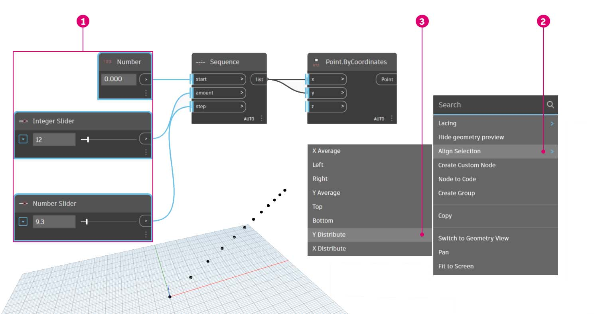
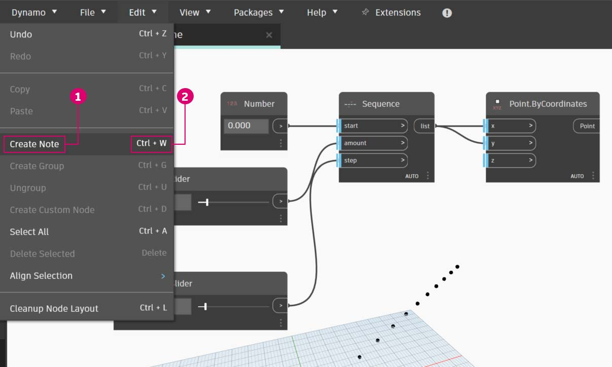

# Gerenciar o programa

Trabalhar dentro de um processo de programação visual pode ser uma poderosa atividade criativa, mas muito rapidamente o fluxo do programa e as principais entradas do usuário podem ser ofuscadas pela complexidade e/ou layout do espaço de trabalho. Vamos rever algumas práticas recomendadas para o gerenciamento do programa.

### Alinhamento 

Depois de adicionar alguns nós ao espaço de trabalho, convém reorganizar o layout dos nós por uma questão de clareza. Se selecionar mais de um nó e clicar com o botão direito do mouse no espaço de trabalho, a janela pop-up incluirá um menu **Alinhar seleção** com opções de justificação e distribuição em X e Y.

> 1. Selecione mais de um nó
> 2. Clique com o botão direito do mouse no espaço de trabalho
> 3. Use as opções **Alinhar seleção**

### Observações 

Com alguma experiência, podemos “ler” o programa visual, revisando os nomes dos nós e seguindo o fluxo do programa. Para usuários de todos os níveis de experiência, também é uma boa prática incluir descrições e legendas em linguagem simples. O Dynamo tem um nó **Notas** com um campo de texto editável para fazer isso. É possível adicionar notas ao espaço de trabalho de duas maneiras:

> 1. Navegue até o menu Editar > Criar nota
> 2. Use o atalho de teclado Ctrl+W

Após a nota ser adicionada ao espaço de trabalho, será exibido um campo de texto, permitindo editar o texto na nota. Após serem criadas, é possível editar as notas clicando duas vezes ou clicando com o botão direito do mouse no nó Nota.

### Agrupamento 

Quando nosso programa visual cresce, é útil identificar as etapas maiores que serão executadas. Podemos destacar conjuntos maiores de nós com um **Grupo** para incluir legendas com um retângulo colorido em segundo plano e um título. Existem três maneiras de criar um grupo com mais de um nó selecionado:

> 1. Navegue até o menu Editar > Criar grupo
> 2. Use o atalho de teclado Ctrl+G
> 3. Clique com o botão direito do mouse no espaço de trabalho e selecione “Criar grupo”

Uma vez criado um grupo, podemos editar suas configurações, como o título e a cor. 

Dica: Usar notas e grupos é uma forma eficaz de anotar o arquivo e aumentar a legibilidade. 

Veja um exemplo de programa com notas e grupos adicionados:

> 1. Nota: “Parâmetros da grade”
> 2. Nota: “Pontos da grade”
> 3. Nota: “Criar uma grade de pontos”
> 4. Grupo: “Criar um ponto atrativo”
> 5. Nota: “Calibrar valores de distância”
> 6. Nota: “Grade de círculos variável”
