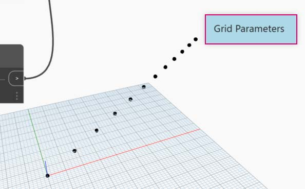

# 管理您的程式

使用視覺程式設計流程可能是一個功能強大的創意活動，但很快，程式流和關鍵使用者輸入就可被工作區的複雜度和/或配置遮蔽。讓我們先檢閱一些有關管理程式的最佳實務。

### 對齊 

當我們在工作區新增更多節點時，我們可能要重新組織節點的配置以使其更加清楚明瞭。透過選取多個節點，然後對工作區按一下右鍵，會顯示快顯視窗，其中包括**「對齊選項」**功能表，以及在 X 和 Y 方向的對正和分配選項。

> 1. 選取多個節點
> 2. 對工作區按一下右鍵。
> 3. 使用**「對齊選項」**選項

### 註釋 

具有一些經驗後，我們可以透過檢閱節點名稱並遵循程序流來「讀取」視覺程式。對經驗不一的使用者而言，放入純語言標籤和描述也是很好的做法。Dynamo 有**「註釋」**節點，該節點提供一個可編輯文字欄位來進行註釋。我們可以用兩種方式在工作區新增註釋：

> 1. 瀏覽至「編輯」功能表 >「建立註釋」
> 2. 使用鍵盤快速鍵 Ctrl + W

將註釋新增至工作區時，會蹦現一個文字欄位可讓我們編輯註釋中的文字。建立之後，我們可以按兩下「註釋」節點或按一下右鍵來編輯註釋。

### 分組 

當我們的視覺程式變得很大時，識別要執行的較重要步驟會很有幫助。我們可以將比較大的一組節點亮顯成一個**群組**，使用背景為彩色的一個矩形和一個標題加以標示。有三種方式可以選取多個節點來形成群組：

> 1. 瀏覽至「編輯」功能表 >「建立群組」
> 2. 使用鍵盤快速鍵 Ctrl + G
> 3. 在「工作區」上按一下右鍵並選取「建立群組 」

建立群組後，我們可以編輯其設定，例如標題和顏色。

 秘訣：使用註釋和群組是標註檔案並提高可讀性的有效方法。

以下是加入「註釋」和「群組」的程式範例：

> 1. 註釋：「格線參數」
> 2. 註釋：「格線點」
> 3. 群組：「建立點格線」
> 4. 群組：「建立牽引點」
> 5. 註釋：「校正距離值」
> 6. 註釋：「可變的圓格線」
