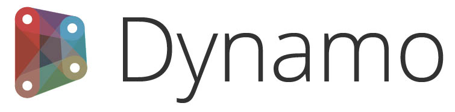

# Acerca de

 Dynamo Hype Video 

## Para Dynamo v2.13 y versiones posteriores

> Dynamo es una plataforma de programación visual de código abierto para diseñadores.

### Bienvenido

Acaba de abrir Dynamo Primer, una guía completa de programación visual en Autodesk Dynamo. Este manual de introducción es un proyecto continuo para compartir los conceptos básicos de programación. Entre los temas, se incluyen el trabajo con geometría computacional, los procedimientos recomendados para el diseño basado en reglas, las aplicaciones de programación interdisciplinarias y muchos más aspectos relacionados con la plataforma Dynamo.

La potencia de Dynamo se puede encontrar en una amplia variedad de actividades relacionadas con el diseño. Dynamo ofrece una lista ampliable de métodos accesibles para que dé sus primeros pasos:

* **Explore** la programación visual por primera vez.
* **Conecte** flujos de trabajo en varios programas.
* **Participe** en una comunidad activa de usuarios, colaboradores y desarrolladores.
* **Desarrolle** una plataforma de código abierto para seguir mejorando.

En medio de esta actividad y magnífica oportunidad para trabajar con Dynamo, necesitamos un documento del mismo calibre, Dynamo Primer.

Consulte el [manual de introducción](1_introduction/2-primer-user-guide-dynamo-community-and-platform.md) para obtener información sobre lo que puede aprender en esta guía.

Estamos mejorando continuamente Dynamo, por lo que algunas funciones pueden tener un aspecto diferente al que se representa en este manual de introducción. Sin embargo, todos los cambios de funcionalidades se representarán correctamente.

### Código abierto

El proyecto Dynamo Primer es de código abierto. Nos hemos dedicado a proporcionar contenido de calidad y agradeceremos cualquier comentario que pueda tener. Si desea informar de una incidencia sobre cualquier aspecto, publíquelo en la página de incidencias de GitHub: [https://github.com/DynamoDS/DynamoPrimerNew/issues](https://github.com/DynamoDS/DynamoPrimerNew/issues). 

Si desea contribuir con una nueva sección, modificaciones o cualquier otra aportación a este proyecto, consulte el repositorio de GitHub para empezar: [https://github.com/DynamoDS/DynamoPrimerNew](https://github.com/DynamoDS/DynamoPrimerNew). 

### El proyecto Dynamo Primer

Dynamo Primer es un proyecto de código abierto iniciado por Matt Jezyk y el equipo de desarrollo de Dynamo de Autodesk.

**Mode Lab** recibió el encargo de escribir la primera edición del manual de introducción. Les agradecemos todos sus esfuerzos para establecer este valioso recurso.

***

A **John Pierson de Parallax Team** se le encargó actualizar el manual de introducción para incluir las revisiones de Dynamo 2.0.

***

A **Matterlab** se le encargó actualizar el manual de introducción para incluir las revisiones de Dynamo 2.13.

***

A **Archilizer** se le encargó actualizar el manual de introducción para incluir las revisiones de Dynamo 2.17.

<figure><figcaption></figcaption></figure>

***

A **Wood Rodgers** se le encargó actualizar el manual de introducción con contenido sobre Dynamo for Civil 3D.

<figure><figcaption></figcaption></figure>

### Agradecimientos

Un agradecimiento especial a Ian Keough por iniciar y guiar el proyecto de Dynamo.

Deseamos agradecer a Matt Jezyk, Ian Keough, Zach Kron, Racel Amour y Colin McCrone su colaboración entusiasta y la oportunidad de participar en una amplia gama de proyectos de Dynamo.

### Software y recursos

**Dynamo** Consulte los siguientes sitios para obtener la versión **estable** más reciente de Dynamo.

[https://dynamobim.com/download/](https://dynamobim.com/download/) o [https://dynamobuilds.com](https://dynamobuilds.com/)

* Nota: A partir de Revit 2020, Dynamo se incluye en las versiones de Revit, por lo que no es necesaria la instalación manual. Hay más información disponible en esta [publicación del blog](https://dynamobim.org/dynamo-core-2-1-release/).

**DynamoBIM**: la mejor fuente de información adicional, contenido de aprendizaje y foros es el sitio web de DynamoBIM.

[https://dynamobim.org](https://dynamobim.org/)

**Dynamo en GitHub** Dynamo es un proyecto de código abierto en GitHub. Para colaborar, consulte DynamoDS.

[https://github.com/DynamoDS/Dynamo](https://github.com/DynamoDS/Dynamo)

**Contacto** Infórmenos de cualquier problema relacionado con este documento.

Dynamo@autodesk.com

### Licencia

Copyright 2023 Autodesk

Licensed under the Apache License, Version 2.0 (the "License"); you may not use this file except in compliance with the License. Puede obtener una copia de la licencia en

[https://www.apache.org/licenses/LICENSE-2.0](https://www.apache.org/licenses/LICENSE-2.0)

Unless required by applicable law or agreed to in writing, software distributed under the License is distributed on an "AS IS" BASIS, WITHOUT WARRANTIES OR CONDITIONS OF ANY KIND, either express or implied. See the License for the specific language governing permissions and limitations under the License.
