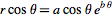
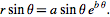
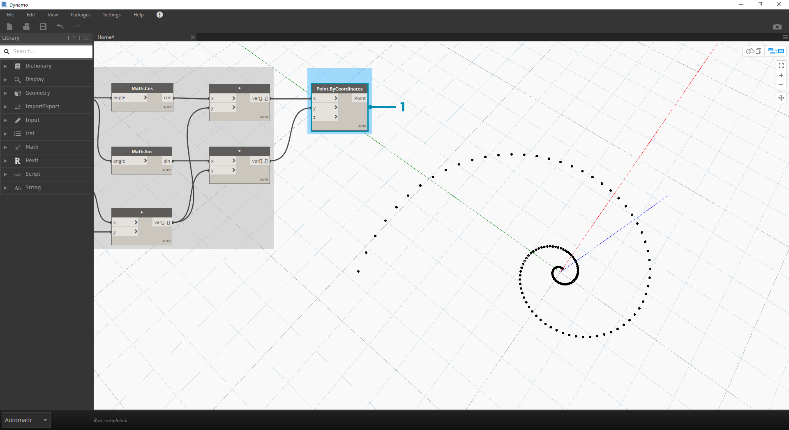
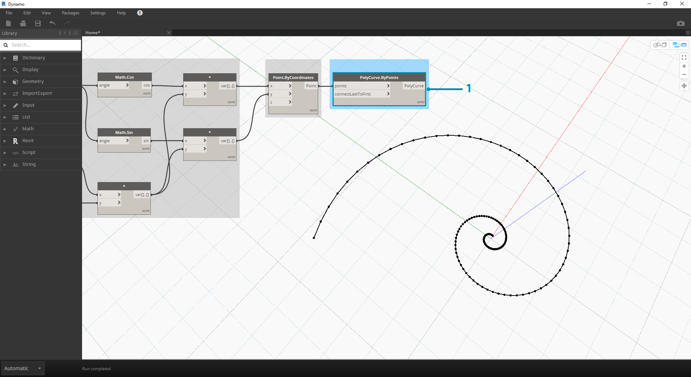

# Math

\##Math If the simplest form of data is numbers, the easiest way to relate those numbers is through Mathematics. From simple operators like divide to trigonometric functions, to more complex formulas, Math is a great way to start exploring numeric relationships and patterns.

\###Arithmetic Operators Operators are a set of components that use algebraic functions with two numeric input values, which result in one output value (addition, subtraction, multiplication, division, etc.). These can be found under Operators>Actions.

\| Icon | Name | Syntax| Inputs | Outputs | | -- | -- | -- | -- | -- | -- |-- | |  | Add | + | var\[]...\[], var\[]...\[] | var\[]...\[] | |  | Subtract | - | var\[]...\[], var\[]...\[] | var\[]...\[] | |  | Multiply | \* | var\[]...\[], var\[]...\[] | var\[]...\[] | |  | Divide | / | var\[]...\[], var\[]...\[] | var\[]...\[] |

\###Parametric Formula

> Download the example file that accompanies this exercise (Right click and "Save Link As..."): \[Building Blocks of Programs - Math.dyn]\(datasets/4-2/Building Blocks of Programs - Math.dyn). A full list of example files can be found in the Appendix.

From Operators, the next logical step is to combine operators and variables to form a more complex relationship through **Formulas**. Let's make a Formula that can be controlled by input parameters, like sliders.

> 1. **Number Sequence:** define a number sequence based on three inputs: _start, amount_ and _step_. This sequence represents the 't' in the parametric equation, so we want to use a list that's large enough to define a spiral.

The step above has created a list of numbers to define the parametric domain. The golden spiral is defined as the equation: = and =. The group of Nodes below represent this equation in visual programming form.

> When stepping through the group of Nodes, try to pay attention to the parallel between the visual program and written equation.

1. **Number Slider:** Add two number sliders to the canvas. These sliders will represent the _a_ and the _b_ variables of the parametric equation. These represent a constant which is flexible, or parameters which we can adjust towards a desired outcome.
2. \*\* \* :\*\* The multiplication Node is represented by an asterisk. We'll use this repeatedly to connect multiplying variables
3. **Math.RadiansToDegrees:** The '_t_' values need to be translated to degrees for their evaluation in the trigonometric functions. Remember, Dynamo defaults to degrees for evaluating these functions.
4. **Math.Pow:** as a function of the '_t_' and the number '_e_' this creates the Fibonacci sequence.
5. **Math.Cos and Math.Sin:** These two trigonmetric functions will differentiate the x-coordinate and the y-coordinate, respectively, of each parametric point.
6. \*\*Watch: \*\*We now see that our output is two lists, these will be the _x_ and _y_ coordinates of the points used to generate the spiral.

\###From Formula to Geometry Now, the bulk of Nodes from the previous step will work fine, but it is a lot of work. To create a more efficient workflow, have a look at **Code Blocks** (section 3.3.2.3) to define a string of Dynamo expressions into one node. In this next series of steps, we'll look at using the parametric equation to draw the Fibonacci spiral. 

> 1. **Point.ByCoordinates:** Connect the upper multiplication node into the '_x_' input and the lower into the '_y_' input. We now see a parametric spiral of points on the screen.

> 1. **Polycurve.ByPoints:** Connect Point.ByCoordinates from the previous step into _points_. We can leave _connectLastToFirst_ without an input because we aren't making a closed curve. This creates a spiral which passes through each point defined in the previous step.

We've now completed the Fibonacci Spiral! Let's take this further into two separate exercises from here, which we'll call the Nautilus and the Sunflower. These are abstractions of natural systems, but the two different applications of the Fibonacci spiral will be well represented.

\###From Spiral to Nautilus

> 1. As a jumping-off point, let's start with the same step from the previous exercise: creating a spiral array of points with the **Point.ByCoordinates** Node.

> 1. **Polycurve.ByPoints:** Again, this is the Node from the pervious exercise, which we'll use as a reference.

1. **Circle.ByCenterPointRadius:** We'll use a circle Node here with the same inputs as the previous step. The radius value defaults to _1.0_, so we see an immediate output of circles. It becomes immediately legible how the points diverge further from the origin.

> 1. **Circle.ByCenterPointRadius:** To create a more dynamic array of circles, we plug the original number sequence (the '_t_' sequence) into the radius value.

1. **Number Sequence:** This is the original array of '_t_'. By plugging this into the radius value, the circle centers are still diverging further from the origin, but the radius of the circles is increasing, creating a funky Fibonacci circle graph. Bonus points if you make it 3D!

\###From Nautilus to Phyllotaxis Pattern Now that we've made a circular Nautilus shell, let's jump into parametric grids. We're going to use a basic rotate on the Fibonacci Spiral to create a Fibonacci grid, and the result is modeled after the [growth of sunflower seeds.](http://ms.unimelb.edu.au/\~segerman/papers/sunflower\_spiral\_fibonacci\_metric.pdf)

> 1. Again, as a jumping-off point, let's start with the same step from the previous exercise: creating a spiral array of points with the **Point.ByCoordinates** Node.

.png>)

> 1. **Geometry.Rotate:** There are several Geometry.Rotate options; be certain you've chosen the Node with _geometry_,_basePlane_, and _degrees_ as its inputs. Connect **Point.ByCoordinates** into the geometry input.

1. **Plane.XY:** Connect to the _basePlane_ input. We will rotate around the origin, which is the same location as the base of the spiral.
2. **Number Range:** For our degree input, we want to create multiple rotations. We can do this quickly with a Number Range component. Connect this into the _degrees_ input.
3. **Number:** And to define the range of numbers, add three number nodes to the canvas in vertical order. From top to bottom, assign values of _0.0,360.0,_ and _120.0_ respectively. These are driving the rotation of the spiral. Notice the output results from the **Number Range** node after connecting the three number nodes to the Node.

Our output is beginning to resemble a whirlpool. Let's adjust some of the **Number Range** parameters and see how the results change: 

> 1. Change the step size of the **Number Range** node from _120.0_ to _36.0_. Notice that this is creating more rotations and is therefore giving us a denser grid.

.png>)

> 1. Change the step size of the **Number Range** node from _36.0_ to _3.6_. This now gives us a much denser grid, and the directionality of the spiral is unclear. Ladies and gentlemen, we've created a sunflower.
