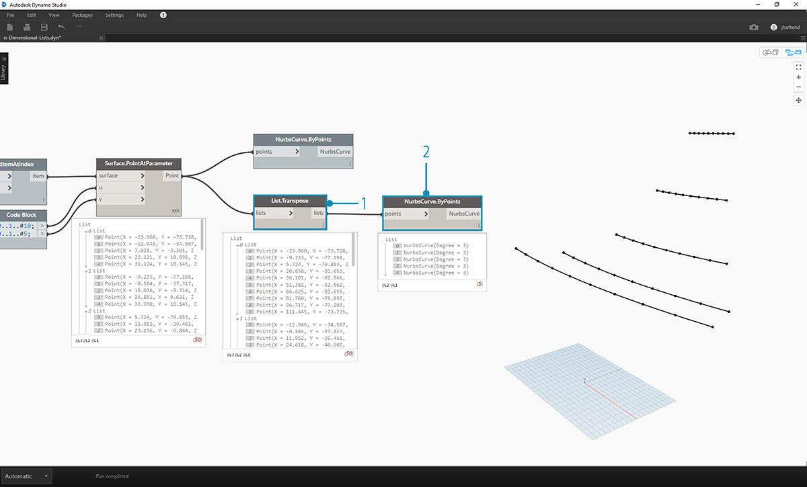
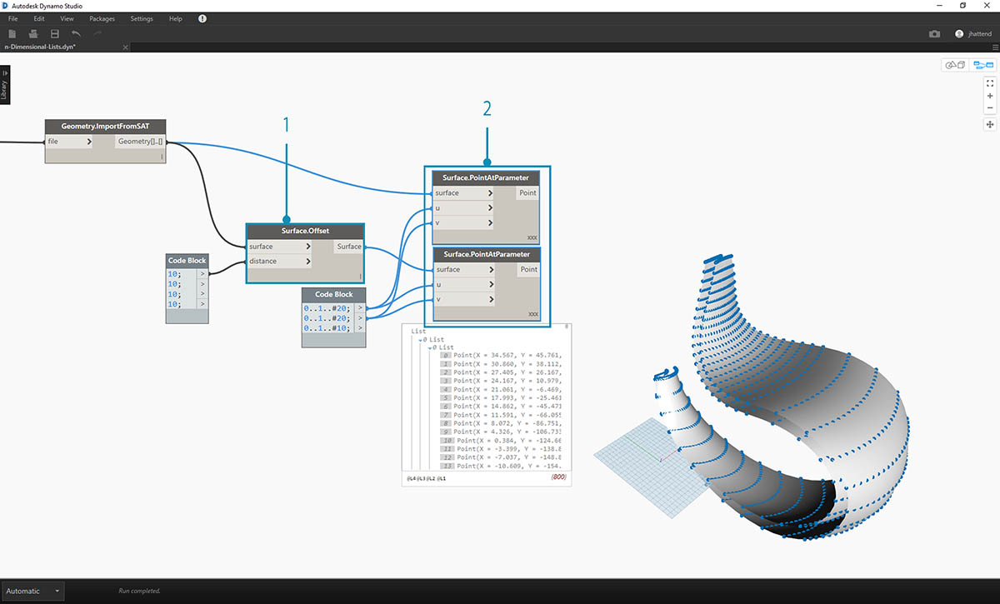
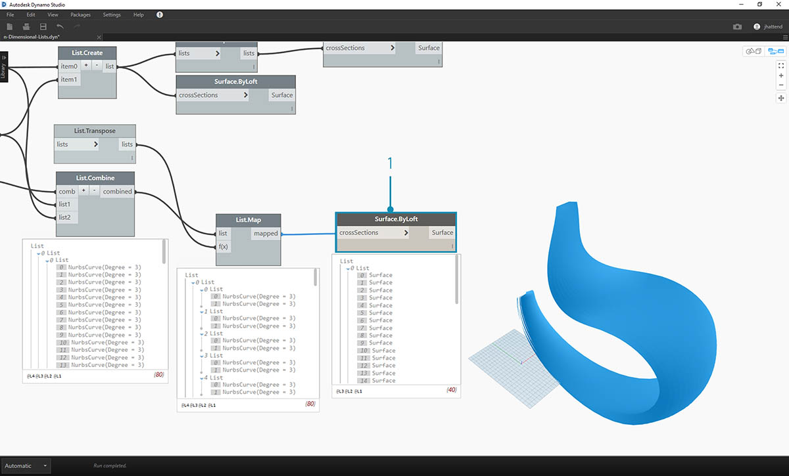
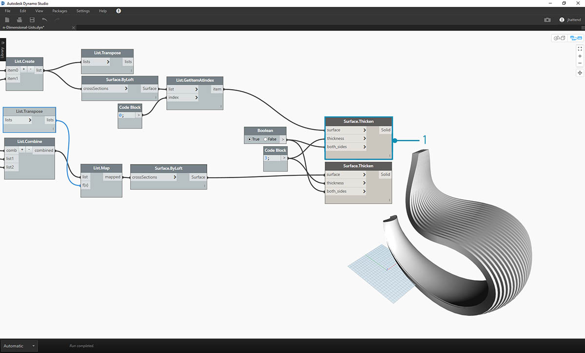
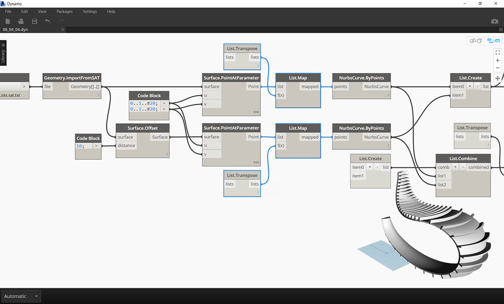
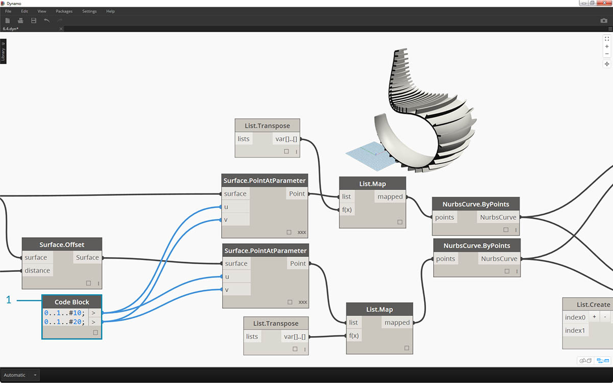

# n-Dimensional Lists

Further down the rabbit-hole, let's add even more tiers to hierarchy. Data structure can expand far beyond a two-dimensional list of lists. Since lists are items in and of themselves in Dynamo, we can create data with as many dimensions as possible.

The analogy we'll work with here are Russian Nesting Dolls. Each list can be regarded as one container holding multiple items. Each list has its own properties and is also regarded as its own object.


> A set of Russian Nesting Dolls (Photo by [Zeta](https://www.flickr.com/photos/beppezizzi/145493363)) is an analogy for n-Dimensional lists. Each layer represents a list, and each list contains items within it. In Dynamo's case, each container can have multiple containers inside (representing the items of each list).

n-Dimensional lists are difficult to explain visually, but we've set up a few exercises in this chapter which focus on working with lists which venture beyond two dimensions.

\##Mapping and Combinations Mapping is arguably the most complex part of data management in Dynamo, and is especially relevant when working with complex hierarchies of lists. With the series of exercises below, we'll demonstrate when to use mapping and combinations as data becomes multi-dimensional.

Preliminary introductions to List.Map and List.Combine can be found in the previous section. In the last exercise below, we'll use these nodes on a complex data structure.

\###Exercise - 2D Lists - Basic

> Download the example files that accompanies this exercise (Right click and "Save Link As..."). A full list of example files can be found in the Appendix. 1.[n-Dimensional-Lists.dyn](https://github.com/h-iL/ForkedDynamoPrimerReorganized/blob/main/06\_Designing-with-Lists/datasets/6-4/n-Dimensional-Lists.dyn) 2.[n-Dimensional-Lists.sat](https://github.com/h-iL/ForkedDynamoPrimerReorganized/blob/main/06\_Designing-with-Lists/datasets/6-4/n-Dimensional-Lists.sat)

This exercise is the first in a series of three which focuses on articulating imported geometry. Each part in this series of exercises will increase in the complexity of data structure.

.jpg>)

> 1. Let's begin with the .sat file in the exercise file folder. We can grab this file using the _File Path_ node.

1. With _Geometry.ImportFromSAT_, the geometry is imported into our Dynamo preview as two surfaces.

.jpg>)

> For this exercise, we want to keep it simple and work with one of the surfaces.

1. Let's select the index of \*1 \*to grab the upper surface. We do this with _List.GetItemAtIndex_ node.

.jpg>)

> The next step is to divide the surface into a grid of points.

1. Using _code block_, insert these two lines of code:

```
0..1..#10;
0..1..#5;
```

1. With the _Surface.PointAtParameter_, connect the two code block values to \*u \*and _v_. Change the _lacing_ of this node to _"Cross Product"_.
2. The output reveals the data structure, which is also visible in the Dynamo preview.

.jpg>)

> 1. To get a look at how the data structure is organized, let's connect a _NurbsCurve.ByPoints_ to the output of _Surface.PointAtParameter_.

1. Notice we have ten curves running vertically along the surface.



> 1. A basic _List.Transpose_ will flip the columns and rows of a list of lists.

1. Connecting the output of _List.Transpose_ to _NurbsCurve.ByPoints_, we now get five curves running horizontally across the surface.

\###Exercise - 2D Lists - Advanced Let's increase the complexity. Suppose we wanted to perform an operation on the curves created from the previous exercise. Perhaps we want to relate these curves to another surface and loft between them. This requires more attention to data structure, but the underlying logic is the same.

.jpg>)

> 1. Begin with a step from the previous exercise, isolating the upper surface of the imported geometry with the _List.GetItemAtIndex_ node.

.jpg>)

> 1. Using _Surface.Offset_, offset the surface by a value of _10_.

.jpg>)

> 1. In the same manner as the previous exercise, define a _code block_ with these two lines of code:

```
0..1..#10;
0..1..#5;
```

1. Connect these outputs to two \*Surface.PointAtParameter \*nodes, each with _lacing_ set to _"Cross Product"_. One of these nodes is connected to the original surface, while the other is connected to the offset surface.

.jpg>)

> 1. As in the previous exercise, connect the outputs to two _NurbsCurve.ByPoints_ nodes.

1. Our Dynamo preview shows two curves, corresponding to two surfaces.

.jpg>)

> 1. By using _List.Create_, we can combine the two sets of curves into one list of lists.

1. Notice from the output, we have two lists with ten items each, representing each connect set of nurbs curves.
2. By performing a _Surface.ByLoft_, we can visually make sense of this data structure. The node lofts all of the curves in each sublist.

.jpg>)

> 1. By using _List.Transpose_, remember, we are flipping all of the columns and rows. This node will transfer two lists of ten curves into ten lists of two curves. We now have each nurbs curve related to the neighboring curve on the other surface.

1. Using _Surface.ByLoft_, we arrive at a ribbed structure.

.jpg>)

> 1. An alternative to _List.Transpose_ uses _List.Combine_. This will operate a _"combinator"_ on each sublist.

1. In this case, we're using \*List.Create \*as the _"combinator"_, which will create a list of each item in the sublists.
2. Using the _Surface.ByLoft_ node, we get the same surfaces as in the previous step. Transpose is easier to use in this case, but when the data structure becomes even more complex, _List.Combine_ is more reliable.

.jpg>)

> 1. Stepping back a few steps, if we want to switch the orientation of the curves in the ribbed structure, we want to use a List.Transpose before connect to _NurbsCurve.ByPoints_. This will flip the columns and rows, giving us 5 horizontal ribs.

\###Exercise - 3D Lists Now, we're going to go even one step further. In this exercise, we'll work with both imported surfaces, creating a complex data hierarchy. Still, our aim is to complete the same operation with the same underlying logic.


> 1. Begin with the imported file from previous exercise.

.jpg>)

> 1. As in the previous exercise, use the _Surface.Offset_ node to offset by a value of _10_.

1. Notice from the output, that we've created two surfaces with the offset node.



> 1. In the same manner as the previous exercise, define a code block with these two lines of code:

```
0..1..#20;
0..1..#10;
```

1. Connect these outputs to two _Surface.PointAtParameter_ nodes, each with lacing set to _"Cross Product"_. One of these nodes is connected to the original surfaces, while the other is connected to the offset surfaces.

.jpg>)

> 1. As in the previous exercise, connect the outputs to two _NurbsCurve.ByPoints_ nodes.

1. Looking at the output of the _NurbsCurve.ByPoints_, notice that this is a list of two lists, which is more complex than the previous exercise. The data is categorized by the underlying surface, so we've added another tier to the data structured.
2. Notice that things become more complex in the _Surface.PointAtParameter_ node. In this case we have a list of lists of lists.

.jpg>)

> 1. Using the _List.Create_ node, we merge the nurbs curves into one data structure, creating a list of lists of lists.

1. By connecting a _Surface.ByLoft_ node, we get a version of the original surfaces, as they each remain in their own list as created from the original data structure.

.jpg>)

> 1. In the previous exercise, we were able to use a _List.Transpose_ to create a ribbed structure. This won't work here. A transpose should be used on a two-dimensional list, and since we have a three-dimensional list, an operation of "flipping columns and rows" won't work as easily. Remember, lists are objects, so _List.Transpose_ will flip our lists with out sublists, but won't flip the nurbs curves one list further down in the hierarchy.

.jpg>)

> 1. _List.Combine_ will work better for us here. We want to use _List.Map_ and _List.Combine_ nodes when we get to more complex data structures.

1. Using \*List.Create \*as the _"combinator"_, we create a data structure that will work better for us.

.jpg>)

> 1. The data structure still needs to be transposed at one step down on the hierarchy. To do this we'll use _List.Map_. This is working like _List.Combine_, except with one input list, rather than two or more.

1. The function we'll apply to _List.Map_ is _List.Transpose_, which will flip the columns and rows of the sublists within our main list.



> 1. Finally, we can loft the nurbs curves together with a proper data hierarchy, giving us a ribbed structure.


> 1. Let's add some depth to the geometry with a _Surface.Thicken_ node.

.jpg>)

> 1. It'll be nice to add a surface backing two this structure, so we'll use _List.GetItemAtIndex_ to select the back surface from the lofted surfaces from the previous steps.



> 1. And thickening these selected surfaces, our articulation is complete.

.jpg>)

> Not the most comfortable rocking chair ever, but it's got a lot of data going on.



> Last step, let's reverse the direction of the striated members. As we used transpose in the previous exercise, we'll do something similar here.

1. Since we have one more tier to the hierarchy, so we need to use _List.Map_ with a _List.Tranpose_ function to change the direction of our nurbs curves.



> 1. We may want to increase the number of treads, so we can change the code block to

```
0..1..#20;
0..1..#10;
```


> The first version of the rocking chair was sleek, so our second model offers an off-road, sport-utility version of recumbency.
