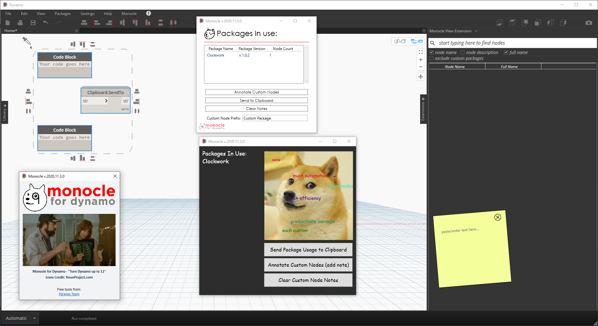

# Užitečné balíčky

Zde je seznam některých oblíbenějších balíčků v komunitě Dynamo. Vývojáři, doplňujte tento seznam. Nezapomeňte, že [Dynamo Primer](https://github.com/DynamoDS/DynamoPrimer) je projekt s otevřeným zdrojovým kódem!

| **ARCHI-LAB** | [Navštivte oficiální web archi-lab](http://archi-lab.net) |
| -------------------------------------------------------------------------------------------------------------------------------------------------------------------------------------------------------------------------------------------------------------------------------------------------- | --------------------------------------------------------- |
| archi-lab je sada více než 50+ vlastních balíčků, které výrazně rozšiřují schopnost aplikace Dynamo pracovat s aplikací Revit. Uzly obsažené v balíčku archi-lab se liší od základních operací se seznamem po pokročilé uzly Analysis Visualization Framework pro aplikaci Revit. Balíček archi-lab je k dispozici v nástroji Package Manager. |  |

|  **BIMORPH NODES** | [Navštivte slovník BimorphNodes](https://bimorph.com/bimorph-nodes/) |
| ------------------------------------------------------------------------------------------------------------------------------------------------------------------------------------------------------------------------------------------------------------------------------------------------------------------------------------------------------------------------------------------------------------------------------ | ----------------------------------------------------------------------- |
| Uzly BimorphNodes jsou univerzální kolekcí výkonných uzlů inženýrských sítí. Balíček obsahuje vysoce efektivní detekci kolizí a uzly průsečíků geometrie, uzly převodu křivek ImportInstance (CAD) a kolektory propojených prvků, které řeší omezení v rozhraní API aplikace Revit. Chcete-li se dozvědět o celém rozsahu dostupných uzlů, navštivte slovník BimorphNodes. Balíček BimorphNodes je k dispozici v nástroji Package Manager. |  |

|  **BUMBLEBEE FOR DYNAMO** | [Navštivte oficiální web BumbleBee](http://archi-lab.net/bumblebee-dynamo-and-excel-interop/) |
| ----------------------------------------------------------------------------------------------------------------------------- | --------------------------------------------------------------------------------------------- |
| Bumblebee je modul plug-in pro interoperabilitu aplikací Excel a Dynamo, který významně zvyšuje schopnost aplikace Dynamo číst a zapisovat soubory aplikace Excel. |  |

| **CLOCKWORK FOR DYNAMO** | [Navštivte GitHub softwaru Clockwork For Dynamo](https://github.com/CAAD-RWTH/ClockworkForDynamo) |
| ------------------------------------------------------------------------------------------------------------------------------------------------------------------------------------------------------------------------------------------------------------------------------------------------------------------------------------------------------------------------------------- | ---------------------------------------------------------------------------------------- |
| Clockwork je kolekce vlastních uzlů pro prostředí vizuálního programování aplikace Dynamo. Obsahuje mnoho uzlů souvisejících s aplikací Revit, ale také řadu uzlů pro různé účely, například správu seznamu, matematické operace, řetězcové operace, převody jednotek, geometrické operace (zejména ohraničující kvádry, sítě, roviny, body, povrchy, UV a vektory) a obložení. |  |

|  **DATA\|SHAPES** | [Navštivte Github softwaru Data\Shapes](https://github.com/MostafaElAyoubi/Data-shapes) |
| ------------------------------------------------------------------------------------------------------------------------------------------------------------------------------------------------------------------------------------------------------------------------------- | ------------------------------------------------------------------------------ |
| DataShapes je balíček, který má za cíl rozšířit funkčnost vlastních skriptů aplikace Dynamo. Klade velký důraz na přidání větších funkcí do přehrávače skriptů Dynamo. Další informace najdete na adrese https://data-shapes.net/. Chcete vytvořit úžasné pracovní postupy aplikace Dynamo Player? Použijte tento balíček. |  |

|  **DYNAMO SAP** | [Navštivte projekt aplikace DynamoSAP na webu Core Studio](http://core.thorntontomasetti.com/dynamosap-is-now-open-source/) |
| ---------------------------------------------------------------------------------------------------------------------------------------------------------------------------------------------------------------------------------------------------------------------------------------------------------------------------------------------------------------------------------------------------------- | ------------------------------------------------------------------------------------------------------------- |
| DynamoSAP je parametrické rozhraní pro SAP2000, které je vytvořeno na vrcholu aplikace Dynamo. Projekt umožňuje návrhářům a inženýrům generovat a analyzovat konstrukční systémy v aplikaci SAP pomocí aplikace Dynamo, která umožňuje řídit model SAP. Projekt předepisuje několik běžných pracovních postupů, které jsou popsány v zahrnutých vzorových souborech, a poskytuje řadu možností automatizace typických úloh v rámci programu SAP. |  |

|  **DYNAMO UNFOLD** | [Navštivte GitHub softwaru DynamoUnfold](https://github.com/mjkkirschner/DynamoUnfold) |
| --------------------------------------------------------------------------------------------------------------------------------------------------------------------------------------------------------------------------------------------------------------------------------------------------------------------------------------------------- | ----------------------------------------------------------------------------- |
| Tato knihovna rozšiřuje funkce aplikace Dynamo/Revit tím, že uživatelům umožňuje rozvinout geometrii povrchu a polypovrchu. Knihovna umožňuje uživatelům nejprve převést povrchy do rovinné mozaikové topologie a potom je rozvinout pomocí nástrojů protogeometrie v aplikaci Dynamo. Tento balíček také obsahuje některé experimentální uzly a několik základních vzorových souborů. |  |

|  **DYNASTRATOR** | [Stáhněte si balíček Dynastrator v aplikaci Package Manager](http://dynamopackages.com) |
| ---------------------------------------------------------------------------------------------------------------------------------------------------- | ------------------------------------------------------------------------ |
| Importujte vektorové obrázky z aplikace Illustrator nebo z webu pomocí souboru .svg. To umožňuje importovat ručně vytvořené výkresy do aplikace Dynamo pro parametrické operace. |  |

|  **ENERGY ANALYSIS FOR DYNAMO** | [Navštivte GitHub projektu Energy Analysis for Dynamo](https://github.com/tt-acm/EnergyAnalysisForDynamo) |
| ------------------------------------------------------------------------------------------------------------------------------------------------------------------------------------------------------------------------------------------------------------------------------------------------------------------------------------------------------------------------------------------------------------- | ----------------------------------------------------------------------------------------------------------- |
| Aplikace Energy Analysis for Dynamo umožňuje parametrické energetické modelování a pracovní postupy energetické analýzy celé budovy v aplikaci Dynamo 0.8. Energy Analysis for Dynamo umožňuje uživateli konfigurovat energetický model z aplikace Autodesk Revit, odeslat do aplikace Green Building Studio pro energetickou analýzu DOE2 a přejít na výsledky z analýzy. Balíček je vyvinut Thorntonem Tomasettiovým studiem CORE. |  |

|  **FIREFLY FOR DYNAMO** | [Stáhněte si balíček Firefly v aplikaci Dynamo Package Manager](http://dynamopackages.com) |
| ------------------------------------------------------------------------------------------------------------------------------------------------------------------------------------------------------------------------------------------------------------------------------------------------------------------------------------------- | --------------------------------------------------------------------------- |
| Firefly je kolekce uzlů, které umožňují aplikaci Dynamo komunikovat s vstupními/výstupními zařízeními, jako je například mikrokontrolér Arduino. Protože tok dat probíhá v reálném čase, Firefly otvírá spoustu příležitostí pro interaktivní prototypování mezi digitálním a fyzikálním světem prostřednictvím webových kamer, mobilních telefonů, herních ovladačů, senzorů atd. |  |

|  **GENIUS LOCI** | [Navštivte GitHub projektu softwaru Genius Loci](https://github.com/albandechasteigner/GeniusLociForDynamo) |
| -------------------------------------------------------------------------------------------------------------------------------------------------------------------------------------------------------------------------- | ----------------------------------------------------------------------------------------- |
| Genius Loci je kompilace uzlů pro aplikaci Dynamo. Obsahuje užitečné uzly, které jsou přínosem pro uživatele aplikace Revit. Nainstalujte si tento balíček a prozkoumejte některé funkce, například snadnou interakci s připojenými soubory a dokumenty aplikace Revit. |  |

|  **MANTIS SHRIMP** | [Navštivte oficiální web projektu Mantis Shrimp.](http://archi-lab.net/mantis-shrimp-getting-started/) |
| ---------------------------------------------------------------------------------------------------------------------------- | --------------------------------------------------------------------------------------------- |
| Mantis Shrimp je projekt interoperability, který umožňuje snadný import geometrie Grasshopper a/nebo Rhino do aplikace Dynamo. |  |

|  **MESH TOOLKIT** | [Navštivte GitHub sady Dynamo Mesh Toolkit](https://github.com/DynamoDS/Dynamo/wiki/Dynamo-Mesh-Toolkit) |
| -------------------------------------------------------------------------------------------------------------------------------------------------------------------------------------------------------------------------------------------------------------------------------------------------------------------------------------------------------------------------------------------------------- | --------------------------------------------------------------------------------------------------- |
| Sada Dynamo Mesh Toolkit poskytuje mnoho užitečných nástrojů pro práci s geometrií sítě. Funkce tohoto balíčku zahrnuje možnost importovat sítě z externích formátů souborů, generovat sítě z existujících objektů geometrie aplikace Dynamo a ručně vytvořit sítě pomocí vrcholů a informací o konektivitě. Tato sada nástrojů dále obsahuje nástroje pro úpravy a opravy geometrie sítě. |  |

| ?? **MONOCLE** | [Navštivte GitHub balíčku Monocle](https://github.com/johnpierson/MonocleForDynamo) |
| -------------------------------------------------------------------------------------------------------------------------------------------------------------------------------------------------------------------------------------------------------------------------------------------------------------------- | --------------------------------------------------------------------------- |
| Monocle je rozšíření pohledu pro aplikaci Dynamo 2.0.x. Monocle obsahuje sadu užitečných nástrojů pro identifikaci balíčku, čištění grafů a mnoho dalšího. Cílem rozšíření Monocle je přidat do uživatelského rozhraní aplikace Dynamo funkce takovým způsobem, abyste si říkali: _„Je tohle zabudované v aplikaci Dynamo?“_. Balíček Monocle je k dispozici v nástroji Package Manager. |  |

|  **OPTIMO** | [Navštivte GitHub balíčku Optimo](https://github.com/BPOpt/Optimo/wiki/0\_Home) |
| -------------------------------------------------------------------------------------------------------------------------------------------------------------------------------------------------------------------------------------- | ------------------------------------------------------------------------ |
| Optimo poskytuje uživatelům aplikace Dynamo možnost optimalizovat problémy návrhu definovaného vlastním nastavením pomocí různých evolučních algoritmů. Uživatelé mohou definovat cíl nebo sadu cílů problému a také specifické funkce vhodnosti. |  |

|  **RHYNAMO** | [Navštivte Bitbucket balíčku Rhynamo](https://bitbucket.org/caseinc/rhynamo) |
| --------------------------------------------------------------------------------------------------------------------------------------------------------------------------------------------------------------------------------------------------------------------------------------------------------------------------------------------------------------------------------------------------------------------------- | -------------------------------------------------------------------- |
| Knihovna uzlů Rhynamo umožňuje uživatelům číst a zapisovat soubory Rhino 3DM z aplikace Dynamo. Nástroj Rhynamo převádí geometrii Rhino na použitelnou geometrii aplikace Dynamo použitím McNeelovy knihovny OpenNURBS, která umožňuje plynulou výměnu geometrie a dat mezi aplikacemi Rhino a Revit. Tento balíček obsahuje také některé experimentální uzly, které umožňují „živý“ přístup k příkazovému řádku Rhino. |  |

|  **RHYTHM** | [Navštivte Github balíčku Rhythm](https://github.com/sixtysecondrevit/RhythmForDynamo) |
| ----------------------------------------------------------------------------------------------------------------------------------------------------------------------------------------------------------------------------------------------------------------------------------------------------------- | ----------------------------------------------------------------------------- |
| Rytmus je sada užitečných uzlů, které pomáhají vašemu projektu Revit udržovat správný rytmus pomocí aplikace Dynamo. Tento balíček nabízí velmi zajímavé funkce. Rhythm je balíček s otevřeným zdrojovým kódem, který je primárně vytvořen v jazyce C. Do aplikace Dynamo přidává uzly aplikace Revit, základní uzly a rozšíření pohledu. Balíček Rhythm je k dispozici v nástroji Package Manager. |  |

|  **Spring Nodes** | [Navštivte Github balíčku Spring](https://github.com/dimven/SpringNodes)[Nodes](https://github.com/dimven/SpringNodes) |
| ---------------------------------------------------------------------------------------------------------------------------------------------------------------------------------------------------------------------------------------------------------------------------------------------------------------------------------------------------------------------------- | -------------------------------------------------------------------------------------------------------------- |
| Hlavní cílem balíčku Spring Nodes je zlepšit spolupráci aplikací Dynamo a Revit. Obecnějším cílem je prozkoumat všechny prostředky, které mohou pomoci urychlit pracovní postupy zaměřené na BIM. Mnoho uzlů používá jazyk IronPython nebo DesignScript a mohou být dobrým výchozím bodem pro studium specifické syntaxe a jemných detailů obou jazyků. Balíček Spring Nodes je k dispozici v nástroji Package Manager. |  |
