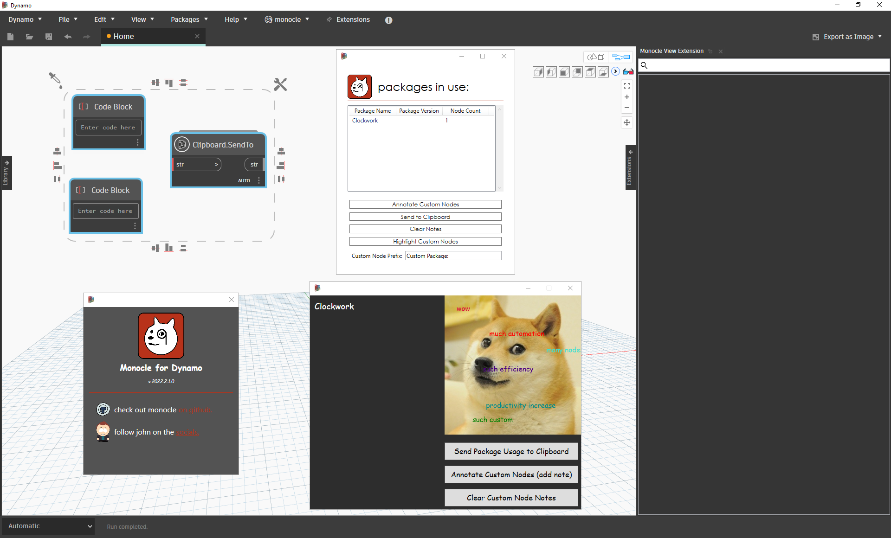

# 유용한 패키지

다음은 Dynamo 커뮤니티에서 널리 사용되는 몇 가지 패키지 리스트입니다. 개발자라면 리스트에 추가하십시오. [Dynamo Primer](https://github.com/DynamoDS/DynamoPrimer)는 오픈 소스라는 점을 기억하십시오.

| **ARCHI-LAB**                                                                                                                                                                                                                                                       | [공식 archi-lab 사이트 방문](http://archi-lab.net) |
| -------------------------------------------------------------------------------------------------------------------------------------------------------------------------------------------------------------------------------------------------------------------------------------------------- | --------------------------------------------------------- |
| archi-lab은 Revit과 상호 작용하는 Dynamo의 기능을 획기적으로 확장하는 50개 이상의 사용자 패키지 모음입니다. archi-lab 패키지에 포함된 노드는 기본 리스트 작업부터 Revit용 고급 해석 시각화 프레임워크 노드까지 다양합니다. archi-lab은 Package Manager에서 사용할 수 있습니다. |                          |

|  **BIMORPH NODES**                                                                                                                                                                                                                                                                                                                                                     | [BimorphNodes 사전 방문](https://bimorph.com/bimorph-nodes/) |
| ------------------------------------------------------------------------------------------------------------------------------------------------------------------------------------------------------------------------------------------------------------------------------------------------------------------------------------------------------------------------------------------------------------------------------ | ----------------------------------------------------------------------- |
| BimorphNodes는 다양한 용도의 강력한 유틸리티 노드 모음입니다. 이 패키지의 주요 기능에는 초 효율적인 간섭 감지 및 형상 교차 노드, ImportInstance(CAD) 곡선 변환 노드 및 Revit API에서 제한 요인을 해결하는 링크된 요소 수집기가 포함됩니다. 사용 가능한 전체 노드 범위에 대해 알아보려면 BimorphNodes 사전을 방문하십시오. BimorphNodes는 Package Manager에서 사용할 수 있습니다. |            |

|  **BUMBLEBEE FOR DYNAMO**                                                                           | [공식 BumbleBee 사이트 방문](http://archi-lab.net/bumblebee-dynamo-and-excel-interop/) |
| ----------------------------------------------------------------------------------------------------------------------------- | --------------------------------------------------------------------------------------------- |
| Bumblebee는 Excel 및 Dynamo 상호 운용성 플러그인으로, Excel 파일을 읽고 쓸 수 있는 Dynamo의 기능을 획기적으로 개선합니다. |                                                               |

| **CLOCKWORK FOR DYNAMO**                                                                                                                                                                                                                                                                                                                                    | [Clockwork For Dynamo GitHub 방문](https://github.com/CAAD-RWTH/ClockworkForDynamo) |
| ------------------------------------------------------------------------------------------------------------------------------------------------------------------------------------------------------------------------------------------------------------------------------------------------------------------------------------------------------------------------------------- | ---------------------------------------------------------------------------------------- |
| Clockwork는 Dynamo 시각적 프로그래밍 환경을 위한 사용자 노드의 모음입니다. 여기에는 많은 Revit 관련 노드뿐만 아니라, 리스트 관리, 수학적 연산, 문자열 작업, 단위 변환, 형상 작업(주로 경계 상자, 메쉬, 평면, 점, 표면, UV 및 벡터) 및 패널과 같은 다양한 용도의 많은 노드도 포함됩니다. |                                                          |

|  **DATA|SHAPES**                                                                                                                                                                                                                              | [GitHub에서 Data|Shapes 방문](https://github.com/MostafaElAyoubi/Data-shapes) |
| ------------------------------------------------------------------------------------------------------------------------------------------------------------------------------------------------------------------------------------------------------------------------------- | ------------------------------------------------------------------------------ |
| DataShapes는 Dynamo 스크립트의 사용자 기능을 확장하기 위한 패키지입니다. 이 패키지는 Dynamo 플레이어에 더 많은 기능을 추가하는 데 보다 주안점을 둡니다. 자세한 내용은 https://data-shapes.net/을 참조하십시오. 유용한 Dynamo 플레이어 워크플로우를 작성하고 싶으십니까? 이 패키지를 사용하십시오. |                                   |

|  **DYNAMO SAP**                                                                                                                                                                                                                                                                                                                                                           | [Core Studio에서 DynamoSAP 프로젝트 방문](http://core.thorntontomasetti.com/dynamosap-is-now-open-source/) |
| ---------------------------------------------------------------------------------------------------------------------------------------------------------------------------------------------------------------------------------------------------------------------------------------------------------------------------------------------------------------------------------------------------------- | ------------------------------------------------------------------------------------------------------------- |
| DynamoSAP는 Dynamo를 토대로 구축된 SAP2000용 파라메트릭 인터페이스입니다. 이 프로젝트를 통해 설계자와 엔지니어는 SAP에서 구조 시스템을 가변적으로 작성하고 분석하며, Dynamo를 사용하여 SAP 모델을 구동할 수 있습니다. 이 프로젝트에서는 포함된 샘플 파일에 설명된 몇 가지 일반적인 워크플로우를 규정하며, SAP에서 일반적인 작업을 자동화할 수 있는 광범위한 기회를 제공합니다. |                                                                                   |

|  **DYNAMO UNFOLD**                                                                                                                                                                                                                                                                                       | [DynamoUnfold GitHub 방문](https://github.com/mjkkirschner/DynamoUnfold) |
| --------------------------------------------------------------------------------------------------------------------------------------------------------------------------------------------------------------------------------------------------------------------------------------------------------------------------------------------------- | ----------------------------------------------------------------------------- |
| 이 라이브러리에서는 사용자가 표면 및 폴리 표면 형상을 펼칠 수 있도록 하여 Dynamo/Revit 기능을 확장합니다. 이 라이브러리를 통해 사용자는 먼저 표면을 평면형으로 테셀레이트된 위상으로 변환한 다음, Dynamo의 Protogeometry 도구를 사용하여 펼칠 수 있습니다. 이 패키지에는 일부 실험적 노드와 몇 가지 기본 샘플 파일도 포함되어 있습니다. |                                    |

|  **DYNASTRATOR**                                                                                                   | [Package Manager에서 Dynastrator 다운로드](http://dynamopackages.com) |
| ---------------------------------------------------------------------------------------------------------------------------------------------------- | ------------------------------------------------------------------------ |
| .svg를 사용하여 Illustrator 또는 웹에서 벡터 아트를 가져옵니다. 이를 통해 수동으로 작성한 도면을 Dynamo로 가져와 파라메트릭 작업을 수행할 수 있습니다. |                              |

|  **ENERGY ANALYSIS FOR DYNAMO**                                                                                                                                                                                                                                                                                                                                              | [GitHub에서 Energy Analysis for Dynamo 프로젝트 방문](https://github.com/tt-acm/EnergyAnalysisForDynamo) |
| ------------------------------------------------------------------------------------------------------------------------------------------------------------------------------------------------------------------------------------------------------------------------------------------------------------------------------------------------------------------------------------------------------------- | ----------------------------------------------------------------------------------------------------------- |
| Energy Analysis for Dynamo는 Dynamo 0.8에서 파라메트릭 에너지 모델링 및 전체 건물 에너지 해석 워크플로우를 지원합니다. Energy Analysis for Dynamo를 사용하면 사용자가 Autodesk Revit에서 에너지 모델을 구성하고, DOE2 에너지 해석을 위해 Green Building Studio에 제출하고, 해석에서 반환된 결과를 확인할 수 있습니다. 이 패키지는 Thornton Tomasetti의 CORE 스튜디오에서 개발 중입니다. |                                                                                  |

|  **FIREFLY FOR DYNAMO**                                                                                                                                                                                                                                                                                       | [Dynamo Package Manager에서 Firely 다운로드](http://dynamopackages.com) |
| ------------------------------------------------------------------------------------------------------------------------------------------------------------------------------------------------------------------------------------------------------------------------------------------------------------------------------------------- | --------------------------------------------------------------------------- |
| Firefly는 Dynamo에서 Arduino 마이크로컨트롤러 같은 입/출력 장치와 통신할 수 있도록 하는 노드 모음입니다. 데이터 흐름은 "실시간"으로 수행되므로 Firefly에서는 웹 캠, 모바일 휴대폰, 게임 컨트롤러, 센서 등을 통해 디지털 세계와 물리적 세계 간에 다양한 대화식 프로토타입 제작 기회를 열어줍니다. |                                               |

|  **GENIUS LOCI**                                                                                                                                                                    | [Genius Loci GitHub 방문](https://github.com/albandechasteigner/GeniusLociForDynamo) |
| ------------------------------------------------------------------------------------------------------------------------------------------------------------------------------------------------------------------------- | ----------------------------------------------------------------------------------------- |
| Genius Loci는 Dynamo용 노드를 컴파일한 것입니다. 이 노드는 Revit 사용자에게 유용한 노드로 구성되어 있습니다. 패키지를 설치하여 링크된 파일 및 Revit 문서와 쉽게 상호 작용하는 것과 같은 일부 기능을 살펴봅니다. |                             |

|  **MANTIS SHRIMP**                                                                       | [공식 Mantis Shrimp 사이트 방문](http://archi-lab.net/mantis-shrimp-getting-started/) |
| ---------------------------------------------------------------------------------------------------------------------------- | --------------------------------------------------------------------------------------------- |
| Mantis Shrimp는 Grasshopper 및/또는 Rhino 형상을 Dynamo로 쉽게 가져올 수 있는 상호 운용성 프로젝트입니다. |                                                                    |

|  **MESH TOOLKIT**                                                                                                                                                                                                                                                                                                                                              | [Dynamo Mesh Toolkit GitHub 방문](https://github.com/DynamoDS/Dynamo/wiki/Dynamo-Mesh-Toolkit) |
| -------------------------------------------------------------------------------------------------------------------------------------------------------------------------------------------------------------------------------------------------------------------------------------------------------------------------------------------------------------------------------------------------------- | --------------------------------------------------------------------------------------------------- |
| Dynamo Mesh Toolkit에서는 메시 형상 작업을 위한 여러 유용한 도구를 제공합니다. 이 패키지의 기능에는 외부 파일 형식에서 메쉬를 가져오고, 기존 Dynamo 형상 객체에서 메쉬를 생성하고, 정점 및 연결 정보를 통해 메쉬를 수동으로 작성하는 기능이 포함되어 있습니다. 또한 이 툴킷에는 메시 형상을 수정 및 복구하는 도구가 포함되어 있습니다. |                                                           |

| 🧐 **MONOCLE**                                                                                                                                                                                                                                                                                                       | [Monocle GitHub 방문](https://github.com/johnpierson/MonocleForDynamo) |
| -------------------------------------------------------------------------------------------------------------------------------------------------------------------------------------------------------------------------------------------------------------------------------------------------------------------- | --------------------------------------------------------------------------- |
| Monocle은 Dynamo 2.0.x용 뷰 확장입니다. Monocle에는 패키지 식별, 그래프 정리 등을 위한 유용한 도구 세트가 포함되어 있습니다. Monocle은 _"Dynamo에 내장되어 있는가?"_ 라는 생각이 들 정도로 원활한 방식으로 Dynamo UI에 기능을 추가하는 것을 목표로 합니다. Monocle은 Package Manager에서 사용할 수 있습니다. |                                     |

|  **OPTIMO**                                                                                                                                                                                       | [Optimo GitHub 방문](https://github.com/BPOpt/Optimo/wiki/0\_-Home) |
| -------------------------------------------------------------------------------------------------------------------------------------------------------------------------------------------------------------------------------------- | ------------------------------------------------------------------------ |
| Optimo에서는 Dynamo 사용자에게 혁신적인 다양한 알고리즘을 사용하여 자체 정의된 설계 문제를 최적화할 수 있는 기능을 제공합니다. 사용자는 문제 목적 또는 목표 세트와 특정 적합성 함수를 정의할 수 있습니다. |                                             |

|  **RHYNAMO**                                                                                                                                                                                                                                                                                                                                                                          | [Rhynamo Bitbucket 방문](https://bitbucket.org/caseinc/rhynamo) |
| --------------------------------------------------------------------------------------------------------------------------------------------------------------------------------------------------------------------------------------------------------------------------------------------------------------------------------------------------------------------------------------------------------------------------- | -------------------------------------------------------------------- |
| Rhynamo 노드 라이브러리에서는 Dynamo 내에서 Rhino 3DM 파일을 읽고 쓸 수 있는 기능을 제공합니다. Rhynamo에서는 McNeel의 OpenNURBS 라이브러리를 사용하여 Rhino 및 Revit 간에 형상과 데이터를 유연하게 교환할 수 있는 새 워크플로우를 지원하여 Rhino 형상을 유용한 Dynamo 형상으로 변환합니다. 또한 이 패키지에는 Rhino 명령줄에 "실시간으로" 액세스할 수 있도록 허용하는 일부 실험적 노드가 포함되어 있습니다. |                                        |

|  **RHYTHM**                                                                                                                                                                                                                                                                    | [GitHub에서 Rhythm 방문](https://github.com/sixtysecondrevit/RhythmForDynamo) |
| ----------------------------------------------------------------------------------------------------------------------------------------------------------------------------------------------------------------------------------------------------------------------------------------------------------- | ----------------------------------------------------------------------------- |
| Rhythm은 Revit 프로젝트가 Dynamo를 통해 적절한 리듬을 유지하도록 지원하는 유용한 노드 세트입니다. 기본적으로 상당히 적절한 기능을 수행합니다. Rhythm은 오픈 소스로, 주로 C#에 내장되며 Revit 노드, 코어 노드 및 뷰 확장을 Dynamo에 추가합니다. Rhythm은 Package Manager에서 사용할 수 있습니다. |                                              |

|  **Spring 노드**                                                                                                                                                                                                                                                                                                                      | [GitHub의 ](https://github.com/dimven/SpringNodes)[Spring 노드 방문](https://github.com/dimven/SpringNodes) |
| ---------------------------------------------------------------------------------------------------------------------------------------------------------------------------------------------------------------------------------------------------------------------------------------------------------------------------------------------------------------------------- | -------------------------------------------------------------------------------------------------------------- |
| Spring 노드의 주요 초점은 Dynamo와 Revit의 상호 작용을 개선하는 것입니다. 좀 더 포괄적인 목표는 BIM 중심의 워크플로우를 가속화하는 데 도움이 되는 모든 수단을 알아내는 것입니다. 대부분의 노드는 IronPython 또는 DesignScript를 사용하며, 특정 구문과 이러한 두 기능의 보다 미세한 측면을 학습하기 위한 좋은 시작점이 될 수 있습니다. Spring 노드는 Package Manager에서 사용할 수 있습니다. |                                                                          |
