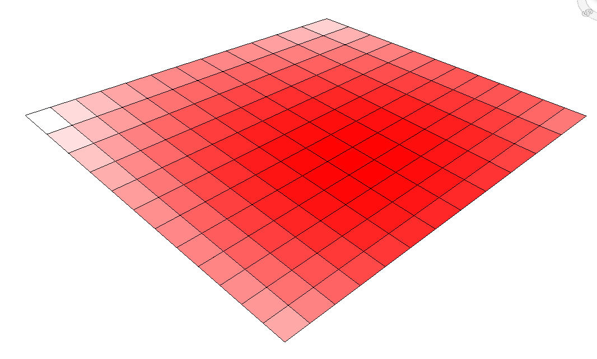

# Полезные пакеты

Ниже приведен список пакетов, наиболее популярных среди пользователей Dynamo. Разработчики, не стесняйтесь пополнять этот список. Помните, что [Dynamo Primer](https://github.com/DynamoDS/DynamoPrimer) — это ресурс с открытым с исходным кодом.

| **ARCHI-LAB** | [Официальный сайт archi-lab](http://archi-lab.net) |
| -------------------------------------------------------------------------------------------------------------------------------------------------------------------------------------------------------------------------------------------------------------------------------------------------- | --------------------------------------------------------- |
| archi-lab — это более 50 пользовательских пакетов, которые позволяют существенно расширить возможности взаимодействия Dynamo с Revit. В пакетах archi-lab доступны как узлы с наборами базовых операций, так и узлы визуальной среды расчетов для Revit. Коллекция archi-lab доступна в Package Manager. |  |

|  **УЗЛЫ BIMORPH** | [См. словарь BimorphNodes](https://bimorph.com/bimorph-nodes/) |
| ------------------------------------------------------------------------------------------------------------------------------------------------------------------------------------------------------------------------------------------------------------------------------------------------------------------------------------------------------------------------------------------------------------------------------ | ----------------------------------------------------------------------- |
| BimorphNodes — это универсальная коллекция мощных вспомогательных узлов. Среди них можно найти высокоэффективные узлы для выявления конфликтов и управления пересечениями геометрии, узлы преобразования кривых ImportInstance (САПР) и средства для сбора связанных элементов, решающие проблему ограничений в API Revit. Чтобы подробнее узнать о всех доступных узлах, ознакомьтесь с каталогом BimorphNodes. Коллекция BimorphNodes доступна в Package Manager. |  |

|  **BUMBLEBEE FOR DYNAMO** | [Перейти на официальный сайт BumbleBee](http://archi-lab.net/bumblebee-dynamo-and-excel-interop/) |
| ----------------------------------------------------------------------------------------------------------------------------- | --------------------------------------------------------------------------------------------- |
| Bumblebee — это подключаемый модуль для обеспечения взаимодействия между Excel и Dynamo, значительно расширяющий возможности Dynamo в плане чтения и записи файлов Excel. |  |

| **CLOCKWORK FOR DYNAMO** | [Перейти на страницу Clockwork For Dynamo на сайте GitHub](https://github.com/CAAD-RWTH/ClockworkForDynamo) |
| ------------------------------------------------------------------------------------------------------------------------------------------------------------------------------------------------------------------------------------------------------------------------------------------------------------------------------------------------------------------------------------- | ---------------------------------------------------------------------------------------- |
| Clockwork — это набор пользовательских узлов для среды визуального программирования Dynamo. В нем представлено множество узлов для работы с Revit и решения других задач, например управления списками, математических операций, строковых операций, преобразования единиц измерения, геометрических операций (ограничивающие рамки, сетки, плоскости, точки, поверхности, UV и векторы) и разбивки на панели. |  |

|  **DATA\|SHAPES** | [Перейти на страницу Data\|Shapes на сайте GitHub](https://github.com/MostafaElAyoubi/Data-shapes) |
| ------------------------------------------------------------------------------------------------------------------------------------------------------------------------------------------------------------------------------------------------------------------------------- | ------------------------------------------------------------------------------ |
| DataShapes — это пакет для расширения пользовательских функций в сценариях Dynamo. Основной целью пакета является увеличение спектра функциональных возможностей проигрывателя Dynamo. Дополнительные сведения см. на странице https://data-shapes.net/. Если вам нужно создать мощные рабочие процессы для проигрывателя Dynamo, обратите внимание на этот пакет. |  |

|  **DYNAMO SAP** | [См. проект DynamoSAP на сайте Core Studio](http://core.thorntontomasetti.com/dynamosap-is-now-open-source/) |
| ---------------------------------------------------------------------------------------------------------------------------------------------------------------------------------------------------------------------------------------------------------------------------------------------------------------------------------------------------------------------------------------------------------- | ------------------------------------------------------------------------------------------------------------- |
| DynamoSAP — это параметрический интерфейс для SAP2000, встраиваемый в Dynamo. Этот проект позволяет инженерам осуществлять генеративное проектирование и анализ строительных систем в SAP, используя Dynamo для управления моделью SAP. Проект содержит несколько типовых рабочих процессов, описанных в прилагаемых файлах примеров, а также предоставляет возможности для автоматизации типовых задач в SAP. |  |

|  **DYNAMO UNFOLD** | [Перейти на страницу DynamoUnfold на сайте GitHub](https://github.com/mjkkirschner/DynamoUnfold) |
| --------------------------------------------------------------------------------------------------------------------------------------------------------------------------------------------------------------------------------------------------------------------------------------------------------------------------------------------------- | ----------------------------------------------------------------------------- |
| Эта библиотека позволяет расширить функциональные возможности Dynamo/Revit за счет развертывания геометрии поверхностей и сложных поверхностей. Библиотека позволяет пользователям сначала преобразовывать поверхности в плоскую мозаичную топологию, а затем выполнить их развертку с помощью инструментов Protogeometry в Dynamo. В этом пакете также содержится несколько экспериментальных узлов и файлов с простыми примерами. |  |

|  **DYNASTRATOR** | [Скачать Dynastrator на сайте Package Manager](http://dynamopackages.com) |
| ---------------------------------------------------------------------------------------------------------------------------------------------------- | ------------------------------------------------------------------------ |
| Импортируйте векторные изображения из Illustrator или из интернета в формате SVG. Этот инструмент позволяет импортировать созданные вручную чертежи в модуль Dynamo для параметрических операций. |  |

|  **ENERGY ANALYSIS FOR DYNAMO** | [См. проект Energy Analysis for Dynamo на сайте GitHub](https://github.com/tt-acm/EnergyAnalysisForDynamo) |
| ------------------------------------------------------------------------------------------------------------------------------------------------------------------------------------------------------------------------------------------------------------------------------------------------------------------------------------------------------------------------------------------------------------- | ----------------------------------------------------------------------------------------------------------- |
| Energy Analysis for Dynamo позволяет выполнять параметрическое моделирование энергопотребления и создавать рабочие процессы для расчета энергопотребления всего здания в Dynamo 0.8. Пакет Energy Analysis for Dynamo позволяет настроить модель энергопотребления в Autodesk Revit, отправить ее в Green Building Studio для расчета энергопотребления DOE2 и изучить результаты, полученные после расчета. Пакет разрабатывается компанией Thornton Tomasetti в рамках проекта CORE Studio. |  |

|  **FIREFLY FOR DYNAMO** | [Скачать Firefly на сайте Dynamo Package Manager](http://dynamopackages.com) |
| ------------------------------------------------------------------------------------------------------------------------------------------------------------------------------------------------------------------------------------------------------------------------------------------------------------------------------------------- | --------------------------------------------------------------------------- |
| Firefly — это набор узлов, позволяющих Dynamo обмениваться данными с устройствами ввода/вывода, такими как микроконтроллер Arduino. Поскольку поток данных передается в режиме реального времени, Firefly открывает множество возможностей для интерактивного создания прототипов на стыке между цифровыми и физическими системами с помощью веб-камер, мобильных телефонов, игровых контроллеров, датчиков и т. д. |  |

|  **GENIUS LOCI** | [Перейти на страницу Genius Loci на сайте GitHub](https://github.com/albandechasteigner/GeniusLociForDynamo) |
| -------------------------------------------------------------------------------------------------------------------------------------------------------------------------------------------------------------------------- | ----------------------------------------------------------------------------------------- |
| Genius Loci — это компиляция узлов для Dynamo. Она содержит узлы, полезные для пользователей Revit. Установите пакет для изучения таких функций, как удобное взаимодействие со связанными файлами и документами Revit. |  |

|  **MANTIS SHRIMP** | [Перейти на официальный сайт Mantis Shrimp](http://archi-lab.net/mantis-shrimp-getting-started/) |
| ---------------------------------------------------------------------------------------------------------------------------- | --------------------------------------------------------------------------------------------- |
| Mantis Shrimp — это проект по поддержке совместимости, который позволяет легко импортировать геометрию Grasshopper и/или Rhino в Dynamo. |  |

|  **MESH TOOLKIT** | [Перейти на страницу Dynamo Mesh Toolkit на сайте GitHub](https://github.com/DynamoDS/Dynamo/wiki/Dynamo-Mesh-Toolkit) |
| -------------------------------------------------------------------------------------------------------------------------------------------------------------------------------------------------------------------------------------------------------------------------------------------------------------------------------------------------------------------------------------------------------- | --------------------------------------------------------------------------------------------------- |
| Инструментарий Dynamo Mesh Toolkit содержит множество полезных инструментов для работы с геометрией сети. В этом пакете имеются возможности для импорта сетей из внешних файлов в других форматах, формирования сетей из существующих геометрических объектов Dynamo и построения сетей вручную на основе данных о вершинах и соединениях. Кроме этого, в пакет входят инструменты для изменения и восстановления геометрии сети. |  |

| ?? **MONOCLE** | [Перейти на страницу Monocle на сайте GitHub](https://github.com/johnpierson/MonocleForDynamo) |
| -------------------------------------------------------------------------------------------------------------------------------------------------------------------------------------------------------------------------------------------------------------------------------------------------------------------- | --------------------------------------------------------------------------- |
| Monocle — это расширение вида для Dynamo 2.0.x. Monocle содержит набор полезных инструментов для идентификации пакетов, очистки графиков и многих других операций. Monocle переносит функциональные возможности в пользовательский интерфейс Dynamo для их использования _как встроенных_. Расширение Monocle доступно в Package Manager. |  |

|  **OPTIMO** | [Перейти на страницу Optimo на сайте GitHub](https://github.com/BPOpt/Optimo/wiki/0\_-Home) |
| -------------------------------------------------------------------------------------------------------------------------------------------------------------------------------------------------------------------------------------- | ------------------------------------------------------------------------ |
| Optimo обеспечивает пользователей Dynamo возможностями для оптимизации решения самостоятельно поставленных проектных задач с помощью различных адаптируемых алгоритмов. Пользователи могут определять не только одну задачу или несколько задач, но и отдельные функции пригодности. |  |

|  **RHYNAMO** | [Перейти на страницу Rhynamo на сайте Bitbucket](https://bitbucket.org/caseinc/rhynamo) |
| --------------------------------------------------------------------------------------------------------------------------------------------------------------------------------------------------------------------------------------------------------------------------------------------------------------------------------------------------------------------------------------------------------------------------- | -------------------------------------------------------------------- |
| Библиотека узлов Rhynamo предоставляет пользователям возможность чтения и записи файлов Rhino 3DM из Dynamo. Rhynamo преобразует геометрию Rhino в пригодную к использованию геометрию Dynamo с помощью библиотеки OpenNURBS от компании McNeel, позволяя создавать новые рабочие процессы для беспрепятственного обмена геометрией и данными между Rhino и Revit. Этот пакет также содержит несколько экспериментальных узлов, которые обеспечивают прямой доступ к командной строке Rhino. |  |

|  **RHYTHM** | [Перейти на страницу Rhythm на сайте GitHub](https://github.com/sixtysecondrevit/RhythmForDynamo) |
| ----------------------------------------------------------------------------------------------------------------------------------------------------------------------------------------------------------------------------------------------------------------------------------------------------------- | ----------------------------------------------------------------------------- |
| Rhythm — это набор полезных узлов, которые помогают поддерживать взаимодействие проекта Revit с Dynamo. Он содержит интересные решения. Rhythm — это приложение с открытым исходным кодом, созданное на базе C#. С его помощью в Dynamo можно добавлять узлы Revit, базовые узлы и расширение вида. ПО Rhythm доступно в Package Manager. |  |

|  **Узлы Spring** | [Перейти на страницу Spring ](https://github.com/dimven/SpringNodes)[на сайте GitHub](https://github.com/dimven/SpringNodes) |
| ---------------------------------------------------------------------------------------------------------------------------------------------------------------------------------------------------------------------------------------------------------------------------------------------------------------------------------------------------------------------------- | -------------------------------------------------------------------------------------------------------------- |
| Узлы Spring в первую очередь предназначены для улучшения взаимодействия Dynamo с Revit. Их более общая цель — изучение всех средств, которые помогают ускорить рабочие процессы, ориентированные на BIM. Во многих узлах используются средства IronPython или DesignScript, что может послужить хорошей отправной точкой для изучения синтаксиса и тонких моментов этих языков программирования. Узлы Spring доступны в Package Manager. |  |
