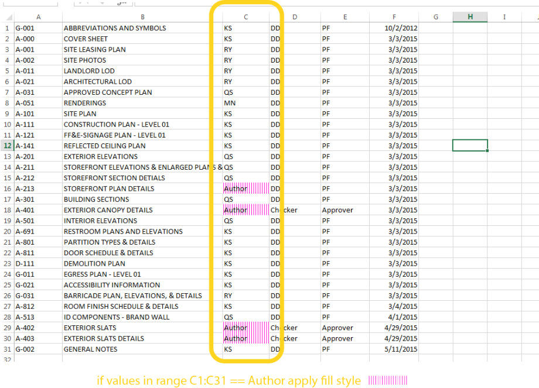

# 有用的套件

以下是 Dynamo 社群中一些較常用套件的清單。開發人員，請加入至清單！請記住，[Dynamo Primer]( 是開放原始碼產品！)

| **ARCHI-LAB** | [造訪官方 archi-lab 網站]() |
| -------------------------------------------------------------------------------------------------------------------------------------------------------------------------------------------------------------------------------------------------------------------------------------------------- | --------------------------------------------------------- |
| archi-lab 是超過 50 種自訂套件的集合，可大幅提升 Dynamo 與 Revit 互動的能力。archi-lab 套件中包含的節點各不相同，從基本清單作業到 Revit 的進階分析可視化框架節點，不一而足。  |  |

|  |
| ------------------------------------------------------------------------------------------------------------------------------------------------------------------------------------------------------------------------------------------------------------------------------------------------------------------------------------------------------------------------------------------------------------------------------ | ----------------------------------------------------------------------- |
| BimorphNodes 收集各種功能強大的公用程式節點。此套件的重點功能包括非常有效率的衝突偵測和幾何圖形相交節點、ImportInstance (CAD) 曲線轉換節點，以及可解決 Revit API 局限性的連結元素收集器。若要瞭解可用的完整節點範圍，請造訪 BimorphNodes 字典。  |  |

|  **BUMBLEBEE FOR DYNAMO** | [造訪官方 BumbleBee 網站]() |
| ----------------------------------------------------------------------------------------------------------------------------- | --------------------------------------------------------------------------------------------- |
| Bumblebee 是實現 Excel 與 Dynamo 之間互通性的外掛程式，可大幅提升 Dynamo 讀取及寫入 Excel 檔案的能力。 |  |

| **CLOCKWORK FOR DYNAMO** | [造訪 Clockwork For Dynamo GitHub]() |
| ------------------------------------------------------------------------------------------------------------------------------------------------------------------------------------------------------------------------------------------------------------------------------------------------------------------------------------------------------------------------------------- | ---------------------------------------------------------------------------------------- |
| Clockwork 是適用於 Dynamo 視覺程式設計環境的自訂節點集合。它不但包含許多 Revit 相關節點，還包含許多適用於諸如以下各種其他用途的節點：清單管理、數學作業、字串作業，單位轉換、幾何作業 (主要是邊界框、網面、平面、點、曲面、UV 與向量) 及面板化。 |  |

|  **DATA|SHAPES** | [請造訪 Github 上的 Data|Shapes]() |
| ------------------------------------------------------------------------------------------------------------------------------------------------------------------------------------------------------------------------------------------------------------------------------- | ------------------------------------------------------------------------------ |
| DataShapes 是一套件，旨在延伸 Dynamo 腳本的使用者功能。其聚焦在為 Dynamo 播放器加入更強大的功能。若要取得更多資訊，請造訪 https://data-shapes.net/。要建立精彩 Dynamo 播放器工作流程？使用此套件。 |  |

|  **DYNAMO SAP** | [在核心工作室造訪 DynamoSAP 專案]() |
| ---------------------------------------------------------------------------------------------------------------------------------------------------------------------------------------------------------------------------------------------------------------------------------------------------------------------------------------------------------------------------------------------------------- | ------------------------------------------------------------------------------------------------------------- |
| DynamoSAP 是在 Dynamo 基礎上建置的適用於 SAP2000 的參數式介面。藉由該專案，設計師與工程師能以高生產力的方式建立及分析 SAP 中的結構系統，同時使用 Dynamo 來驅動 SAP 模型。該專案指定了一些通用工作流程 (在隨附的範例檔案中對這些工作流程進行了描述)，並提供在 SAP 中自動執行典型工作的諸多機會。 |  |

|  **DYNAMO UNFOLD** | [造訪 DynamoUnfold GitHub]() |
| --------------------------------------------------------------------------------------------------------------------------------------------------------------------------------------------------------------------------------------------------------------------------------------------------------------------------------------------------- | ----------------------------------------------------------------------------- |
| 藉由此資源庫，使用者可以展開曲面與 polysurface 幾何圖形，從而延伸 Dynamo/Revit 的功能。藉由該資源庫，使用者可以先將曲面轉換為平面嵌合拓樸，然後使用 Dynamo 中的 ProtoGeometry 工具將其展開。此套件還包括一些實驗節點與一些基本範例檔案。 |  |

| **** | [在 Package Manager 下載 Dynastrator]() |
| ---------------------------------------------------------------------------------------------------------------------------------------------------- | ------------------------------------------------------------------------ |
| 使用 .svg 從 Illustrator 或網路匯入向量作品。您可藉此將手動建立的圖面匯入至 Dynamo 以執行參數式作業。 |  |

|  **ENERGY ANALYSIS FOR DYNAMO** | [在 GitHub 上造訪 Energy Analysis for Dynamo 專案]() |
| ------------------------------------------------------------------------------------------------------------------------------------------------------------------------------------------------------------------------------------------------------------------------------------------------------------------------------------------------------------------------------------------------------------- | ----------------------------------------------------------------------------------------------------------- |
| 藉由 Energy Analysis for Dynamo，可以在 Dynamo 0.8 中執行參數式能源塑型與整棟建築的能源分析工作流程。藉由 Energy Analysis for Dynamo，使用者可以在 Autodesk Revit 中設定能源模型，提交至 Green Building Studio 進行 DOE2 能源分析，然後深入研究分析傳回的結果。此套件的開發者是 Thornton Tomasetti 的核心工作室。 |  |

|  **FIREFLY FOR DYNAMO** | [在 Dynamo Package Manager 下載 Firefly]() |
| ------------------------------------------------------------------------------------------------------------------------------------------------------------------------------------------------------------------------------------------------------------------------------------------------------------------------------------------- | --------------------------------------------------------------------------- |
| Firefly 是節點的集合，藉由這些節點，Dynamo 可以與輸入/輸出裝置 (例如 Arduino 微控制器) 通訊。由於會「即時」發生資料流動，因此 Firefly 會為透過網路攝影機、行動電話、遊戲控制器、感應器等在數位與實體環境之間進行互動式原型開發帶來許多機會。 |  |

|  |
| -------------------------------------------------------------------------------------------------------------------------------------------------------------------------------------------------------------------------- | ----------------------------------------------------------------------------------------- |
| Genius Loci is a compilation of Nodes for Dynamo. It consists useful Nodes that benefits Revit users. Install the package  to explore some of the features, such as interact easily with linked files and Revit Documents. |  **MANTIS SHRIMP** | [造訪官方 Mantis Shrimp 網站。]() |
| ---------------------------------------------------------------------------------------------------------------------------- | --------------------------------------------------------------------------------------------- |
| Mantis Shrimp 是互通性專案，您可藉此將 Grasshopper 及/或 Rhino 幾何圖形輕鬆匯入至 Dynamo。 |  |

|  **MESH TOOLKIT** | [造訪 Dynamo Mesh Toolkit GitHub]() |
| -------------------------------------------------------------------------------------------------------------------------------------------------------------------------------------------------------------------------------------------------------------------------------------------------------------------------------------------------------------------------------------------------------- | --------------------------------------------------------------------------------------------------- |
| Dynamo Mesh Toolkit 可提供對網面幾何圖形進行處理的許多有用工具。此套件的功能包括匯入外部檔案格式的網面、根據預先存在的 Dynamo 幾何圖形物件產生網面，以及根據頂點與連接資訊手動建置網面。此外，該工具套件還包括用於修改及修復網面幾何圖形的工具。 |  |

| **** |  |
| -------------------------------------------------------------------------------------------------------------------------------------------------------------------------------------------------------------------------------------------------------------------------------------------------------------------- | --------------------------------------------------------------------------- |
| __.  |  |

| **** |  |
| -------------------------------------------------------------------------------------------------------------------------------------------------------------------------------------------------------------------------------------- | ------------------------------------------------------------------------ |
| 藉由 Optimo，Dynamo 使用者可以使用各種演化演算法，以最佳化自己定義的設計問題。使用者可以定義問題目標或目標組，以及特定的健康度函數。 |  |

| **** | [造訪 Rhynamo Bitbucket]() |
| --------------------------------------------------------------------------------------------------------------------------------------------------------------------------------------------------------------------------------------------------------------------------------------------------------------------------------------------------------------------------------------------------------------------------- | -------------------------------------------------------------------- |
| 藉由 Rhynamo 節點資源庫，使用者可以在 Dynamo 內，讀取及寫入 Rhino 3DM 檔案。Rhynamo 透過使用 McNeel 的 OpenNURBS 資源庫，可以採用能在 Rhino 與 Revit 之間順利交換幾何圖形及資料的新工作流程，從而將 Rhino 幾何圖形轉換為可使用的 Dynamo 幾何圖形。此套件也包含一些實驗節點，藉此可「即時」存取 Rhino 指令行。 |  |

| **** | [在 GitHub 上造訪 Rhythm]() |
| ----------------------------------------------------------------------------------------------------------------------------------------------------------------------------------------------------------------------------------------------------------------------------------------------------------- | ----------------------------------------------------------------------------- |
| Rhythm is a set of useful nodes to help your Revit project maintain a good rhythm with Dynamo. basically it does some pretty okay stuff. Rhythm is open source and primarily built in C#, and adds Revit nodes, core nodes and a view extension to your Dynamo. Rhythm is available on the package manager. |  |

| **** |  |
| ---------------------------------------------------------------------------------------------------------------------------------------------------------------------------------------------------------------------------------------------------------------------------------------------------------------------------------------------------------------------------- | -------------------------------------------------------------------------------------------------------------- |
| Spring nodes main focus is to improve Dynamo's interaction with Revit. The wider goal is to explore any and all means that can help accelerate BIM focused work-flows. Many of the nodes use either IronPython or DesignScript and can be a good starting point for learning the specific syntax and finer points of both. Spring nodes is available on the package manager. |  |
