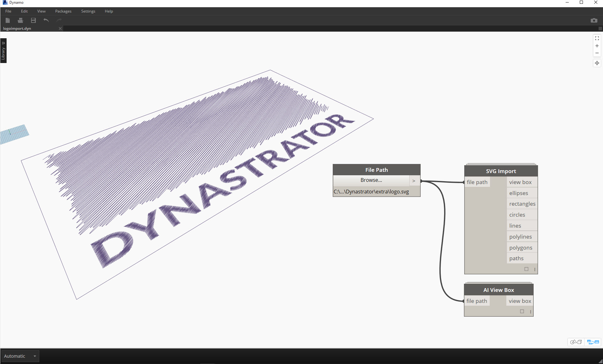

# 有用的软件包

下面列出了 Dynamo 社区中一些更受欢迎的软件包。开发人员，请添加到列表！请记住，[Dynamo Primer]( 是开源的！)

| **ARCHI-LAB** | [访问官方 archi-lab 网站]() |
| -------------------------------------------------------------------------------------------------------------------------------------------------------------------------------------------------------------------------------------------------------------------------------------------------- | --------------------------------------------------------- |
| archi-lab 是包含 50 多个自定义软件包的集合，这些软件包极大扩展了 Dynamo 与 Revit 交互的能力。archi-lab 软件包中包含的节点种类繁多，从基本的列表操作到适用于 Revit 的高级分析可视化框架节点。  |  |

|  |
| ------------------------------------------------------------------------------------------------------------------------------------------------------------------------------------------------------------------------------------------------------------------------------------------------------------------------------------------------------------------------------------------------------------------------------ | ----------------------------------------------------------------------- |
| BimorphNodes 是一个万能的功能强大的工具节点的集合。该软件包的亮点包括超高效的碰撞检测和几何图形相交节点、ImportInstance (CAD) 曲线转换节点以及解决 Revit API 中限制的链接图元收集器。要全面了解可用的节点，请访问 BimorpNodes 词典。  |  |

|  **BumbleBee for Dynamo** | [访问官方 BumbleBee 网站]() |
| ----------------------------------------------------------------------------------------------------------------------------- | --------------------------------------------------------------------------------------------- |
| Bumblebee 是一种 Excel 和 Dynamo 互操作性插件，可显着提高 Dynamo 读取和写入 Excel 文件的能力。 |  |

| **Clockwork For Dynamo** | [访问 Clockwork For Dynamo GitHub]() |
| ------------------------------------------------------------------------------------------------------------------------------------------------------------------------------------------------------------------------------------------------------------------------------------------------------------------------------------------------------------------------------------- | ---------------------------------------------------------------------------------------- |
| Clockwork 是用于 Dynamo 可视化编程环境的自定义节点集合。它包含许多与 Revit 相关的节点，但还包含许多用于其他目的节点，例如列表管理、数学运算、字符串操作、单位转换、几何操作（主要是边界框、网格、平面、点、曲面、UV 和向量）和嵌板。 |  |

|  **DataShapes** | [访问 GitHub 上的 DataShapes]() |
| ------------------------------------------------------------------------------------------------------------------------------------------------------------------------------------------------------------------------------------------------------------------------------- | ------------------------------------------------------------------------------ |
| DataShapes 是一个用于扩展 Dynamo 脚本用户功能的软件包。这一软件包侧重于为 Dynamo 播放器添加更多功能。有关详细信息，请访问 https://data-shapes.net/。要创建出色的 Dynamo 播放器工作流？使用此软件包。 |  |

|  **DynamoSAP** | [访问 Core Studio 中的 DynamoSAP 项目]() |
| ---------------------------------------------------------------------------------------------------------------------------------------------------------------------------------------------------------------------------------------------------------------------------------------------------------------------------------------------------------------------------------------------------------- | ------------------------------------------------------------------------------------------------------------- |
| DynamoSAP 是 SAP2000 的参数化界面，基于 Dynamo 构建。该项目使设计师和工程师能够使用 Dynamo 来驱动 SAP 模型，从而在 SAP 中大量生成和分析结构系统。该项目规定了一些常见的工作流（这些工作流在随附的示例文件中进行了介绍），并为自动执行 SAP 中的典型任务提供了各种机会。 |  |

|  **DynamoUnfold** | [访问 DynamoUnfold GitHub]() |
| --------------------------------------------------------------------------------------------------------------------------------------------------------------------------------------------------------------------------------------------------------------------------------------------------------------------------------------------------- | ----------------------------------------------------------------------------- |
| 该库通过让用户可以展开曲面和多边形曲面几何图形，从而扩展 Dynamo/Revit 功能。该库允许用户先将曲面转换为平面镶嵌拓扑，然后在 Dynamo 中使用 Protogeometry 工具展开它们。此软件包中还包含一些实验节点以及一些基本示例文件。 |  |

| **** | [从 Package Manager 下载 Dynastrator]() |
| ---------------------------------------------------------------------------------------------------------------------------------------------------- | ------------------------------------------------------------------------ |
| 将向量图从 Illustrator 输入到使用 .svg 的 Web。这让您可以将手动创建的图形输入到 Dynamo 中，以便进行参数化操作。 |  |

|  **Energy Analysis for Dynamo** | [访问 GitHub 上的 Energy Analysis for Dynamo 项目]() |
| ------------------------------------------------------------------------------------------------------------------------------------------------------------------------------------------------------------------------------------------------------------------------------------------------------------------------------------------------------------------------------------------------------------- | ----------------------------------------------------------------------------------------------------------- |
| Energy Analysis for Dynamo 允许在 Dynamo 0.8 中进行参数化能量建模和整体建筑能量分析工作流。Energy Analysis for Dynamo 允许用户从 Autodesk Revit 配置能量模型、提交到 Green Building Studio for DOE2 能量分析，以及深入研究分析返回的结果。该软件包由 Thornton Tomasetti 的核心工作室开发。 |  |

|  **Firefly for Dynamo** | [从 Dynamo Package Manager 下载 Firefly]() |
| ------------------------------------------------------------------------------------------------------------------------------------------------------------------------------------------------------------------------------------------------------------------------------------------------------------------------------------------- | --------------------------------------------------------------------------- |
| Firefly 是一组节点，这些节点使 Dynamo 能够与输入/输出设备（如 Arduino 微控制器）交流。由于数据流“实时”发生，因此 Firefly 通过 Web 摄像头、移动电话、游戏控制器、传感器等为数字世界和物理世界之间的交互式原型开发提供了许多机会。 |  |

|  |
| -------------------------------------------------------------------------------------------------------------------------------------------------------------------------------------------------------------------------- | ----------------------------------------------------------------------------------------- |
| Genius Loci is a compilation of Nodes for Dynamo. It consists useful Nodes that benefits Revit users. Install the package  to explore some of the features, such as interact easily with linked files and Revit Documents. |  **Mantis Shrimp** | [访问官方 Mantis Shrimp 网站。]() |
| ---------------------------------------------------------------------------------------------------------------------------- | --------------------------------------------------------------------------------------------- |
| Mantis Shrimp 是一个互操作性项目，使您可以轻松将 Grasshopper 和/或 Rhino 几何图形输入到 Dynamo。 |  |

|  **Mesh Toolkit** | [访问 Dynamo Mesh Toolkit GitHub]() |
| -------------------------------------------------------------------------------------------------------------------------------------------------------------------------------------------------------------------------------------------------------------------------------------------------------------------------------------------------------------------------------------------------------- | --------------------------------------------------------------------------------------------------- |
| Dynamo Mesh Toolkit 提供了许多有用工具，用于处理网格几何图形。此软件包的功能包括能够输入外部文件格式的网格、从已有的 Dynamo 几何图形对象生成网格，以及通过顶点和连接信息手动构建网格。此外，此工具包中还包含用于修改和修复网格几何图形的工具。 |  |

| **** |  |
| -------------------------------------------------------------------------------------------------------------------------------------------------------------------------------------------------------------------------------------------------------------------------------------------------------------------- | --------------------------------------------------------------------------- |
| __.  |  |

| **** |  |
| -------------------------------------------------------------------------------------------------------------------------------------------------------------------------------------------------------------------------------------- | ------------------------------------------------------------------------ |
| Optimo 为 Dynamo 用户提供了使用各种进化算法来优化自定义设计问题的功能。用户可以定义问题目标或目标集以及特定的适应度函数。 |  |

| **** | [访问 Rhynamo Bitbucket]() |
| --------------------------------------------------------------------------------------------------------------------------------------------------------------------------------------------------------------------------------------------------------------------------------------------------------------------------------------------------------------------------------------------------------------------------- | -------------------------------------------------------------------- |
| Rhynamo 节点库为用户提供了从 Dynamo 中读取和写入 Rhino 3DM 文件的功能。Rhynamo 使用 McNeel 的 OpenNURBS 库将 Rhino 几何图形转换为可用的 Dynamo 几何图形，从而支持可以在 Rhino 和 Revit 之间流畅地交换几何图形和数据的新工作流。此软件包中还包含一些实验节点，这些节点允许对 Rhino 命令行进行“实时”访问。 |  |

| **** | [访问 GitHub 上的 Rhythm]() |
| ----------------------------------------------------------------------------------------------------------------------------------------------------------------------------------------------------------------------------------------------------------------------------------------------------------- | ----------------------------------------------------------------------------- |
| Rhythm is a set of useful nodes to help your Revit project maintain a good rhythm with Dynamo. basically it does some pretty okay stuff. Rhythm is open source and primarily built in C#, and adds Revit nodes, core nodes and a view extension to your Dynamo. Rhythm is available on the package manager. |  |

| **** |  |
| ---------------------------------------------------------------------------------------------------------------------------------------------------------------------------------------------------------------------------------------------------------------------------------------------------------------------------------------------------------------------------- | -------------------------------------------------------------------------------------------------------------- |
| Spring nodes main focus is to improve Dynamo's interaction with Revit. The wider goal is to explore any and all means that can help accelerate BIM focused work-flows. Many of the nodes use either IronPython or DesignScript and can be a good starting point for learning the specific syntax and finer points of both. Spring nodes is available on the package manager. |  |
