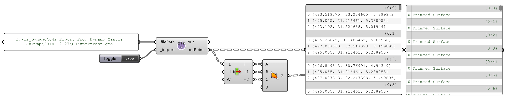

# 有用的套件

以下是 Dynamo 社群中一些較常用套件的清單。開發人員，請加入清單！請記住，[Dynamo Primer](https://github.com/DynamoDS/DynamoPrimer) 是開放原始碼！

| **ARCHI-LAB**                                                                                                                                                                                                                                                       | [造訪官方 archi-lab 網站](http://archi-lab.net) |
| -------------------------------------------------------------------------------------------------------------------------------------------------------------------------------------------------------------------------------------------------------------------------------------------------- | --------------------------------------------------------- |
| archi-lab 收集了超過 50 種自訂套件，可大幅提升 Dynamo 與 Revit 互動的能力。archi-lab 套件中包含的節點各不相同，從基本清單作業到 Revit 進階的分析視覺化架構節點，不一而足。archi-lab 可從 Package Manager 取得 |                          |

|  **BIMORPH NODES**                                                                                                                                                                                                                                                                                                                                                     | [造訪 BimorphNodes 字典](https://bimorph.com/bimorph-nodes/) |
| ------------------------------------------------------------------------------------------------------------------------------------------------------------------------------------------------------------------------------------------------------------------------------------------------------------------------------------------------------------------------------------------------------------------------------ | ----------------------------------------------------------------------- |
| BimorphNodes 收集各種功能強大的公用程式節點。此套件的重點功能包括非常有效率的衝突偵測和幾何圖形相交節點、ImportInstance (CAD) 曲線轉換節點，以及可解決 Revit API 局限性的連結元素收集器。若要瞭解可用的完整節點範圍，請造訪 BimorphNodes 字典。BimorphNodes 可從 Package Manager 取得。 |            |

|  **BUMBLEBEE FOR DYNAMO**                                                                           | [造訪官方 BumbleBee 網站](http://archi-lab.net/bumblebee-dynamo-and-excel-interop/) |
| ----------------------------------------------------------------------------------------------------------------------------- | --------------------------------------------------------------------------------------------- |
| Bumblebee 是提供 Excel 與 Dynamo 之間互通性的外掛程式，可大幅提升 Dynamo 讀取及寫入 Excel 檔案的能力。 |                                                               |

| **CLOCKWORK FOR DYNAMO**                                                                                                                                                                                                                                                                                                                                    | [造訪 Clockwork For Dynamo GitHub](https://github.com/CAAD-RWTH/ClockworkForDynamo) |
| ------------------------------------------------------------------------------------------------------------------------------------------------------------------------------------------------------------------------------------------------------------------------------------------------------------------------------------------------------------------------------------- | ---------------------------------------------------------------------------------------- |
| Clockwork 收集適用於 Dynamo 視覺程式設計環境的自訂節點。它不但包含許多 Revit 相關節點，還包含許多適用於諸如以下各種其他用途的節點：清單管理、數學作業、字串作業，單位轉換、幾何作業 (主要是邊界框、網格、平面、點、曲面、UV 與向量) 及面板化。 |                                                          |

|  **DATA|SHAPES**                                                                                                                                                                                                                              | [造訪 Github 上的 Data|Shapes](https://github.com/MostafaElAyoubi/Data-shapes) |
| ------------------------------------------------------------------------------------------------------------------------------------------------------------------------------------------------------------------------------------------------------------------------------- | ------------------------------------------------------------------------------ |
| DataShapes 是一個套件，目標是延伸 Dynamo 指令碼的使用者功能。其聚焦在為 Dynamo 播放器加入更強大的功能。如需更多資訊，請造訪 https://data-shapes.net/。想建立精彩的 Dynamo 播放器工作流程？那就使用這個套件。 |                                   |

|  **DYNAMO SAP**                                                                                                                                                                                                                                                                                                                                                           | [造訪 Core Studio 的 DynamoSAP 專案](http://core.thorntontomasetti.com/dynamosap-is-now-open-source/) |
| ---------------------------------------------------------------------------------------------------------------------------------------------------------------------------------------------------------------------------------------------------------------------------------------------------------------------------------------------------------------------------------------------------------- | ------------------------------------------------------------------------------------------------------------- |
| DynamoSAP 是一個以 Dynamo 為基礎建置，適用於 SAP2000 的參數式介面。藉由該專案，設計師與工程師能以高生產力的方式建立及分析 SAP 中的結構系統，同時使用 Dynamo 來驅動 SAP 模型。該專案指定了一些常見工作流程 (在隨附的範例檔案中對這些工作流程有所描述)，並提供在 SAP 中自動執行典型工作的諸多機會。 |                                                                                   |

|  **DYNAMO UNFOLD**                                                                                                                                                                                                                                                                                       | [造訪 DynamoUnfold GitHub](https://github.com/mjkkirschner/DynamoUnfold) |
| --------------------------------------------------------------------------------------------------------------------------------------------------------------------------------------------------------------------------------------------------------------------------------------------------------------------------------------------------- | ----------------------------------------------------------------------------- |
| 藉由此資源庫，使用者可以展開曲面與 polysurface 幾何圖形，從而延伸 Dynamo/Revit 的功能。藉由該資源庫，使用者可以先將曲面轉換為平面嵌合拓樸，然後使用 Dynamo 中的 ProtoGeometry 工具將其展開。此套件還包括一些實驗節點與一些基本範例檔案。 |                                    |

|  **DYNASTRATOR**                                                                                                   | [在 Package Manager 下載 Dynastrator](http://dynamopackages.com) |
| ---------------------------------------------------------------------------------------------------------------------------------------------------- | ------------------------------------------------------------------------ |
| 使用 .svg 從 Illustrator 或網路匯入向量作品。您可藉此將手動建立的圖面匯入 Dynamo 以執行參數式作業。 |                              |

|  **ENERGY ANALYSIS FOR DYNAMO**                                                                                                                                                                                                                                                                                                                                              | [造訪 GitHub 上的 Energy Analysis for Dynamo 專案](https://github.com/tt-acm/EnergyAnalysisForDynamo) |
| ------------------------------------------------------------------------------------------------------------------------------------------------------------------------------------------------------------------------------------------------------------------------------------------------------------------------------------------------------------------------------------------------------------- | ----------------------------------------------------------------------------------------------------------- |
| Energy Analysis for Dynamo 允許在 Dynamo 0.8 中進行參數式能源塑型和整棟建築的能源分析工作流程。藉由 Energy Analysis for Dynamo，使用者可以在 Autodesk Revit 中設定能源模型，提交至 Green Building Studio 進行 DOE2 能源分析，然後深入研究分析傳回的結果。此套件的開發者是 Thornton Tomasetti 的 CORE Studio。 |                                                                                  |

|  **FIREFLY FOR DYNAMO**                                                                                                                                                                                                                                                                                       | [在 Dynamo Package Manager 下載 Firefly](http://dynamopackages.com) |
| ------------------------------------------------------------------------------------------------------------------------------------------------------------------------------------------------------------------------------------------------------------------------------------------------------------------------------------------- | --------------------------------------------------------------------------- |
| Firefly 收集了許多節點，藉由這些節點，Dynamo 可以與輸入/輸出裝置 (例如 Arduino 微控制器) 通訊。由於會「即時」發生資料流動，因此 Firefly 會為透過網路攝影機、行動電話、遊戲控制器、感應器等在數位與實體環境之間進行互動式原型開發帶來許多機會。 |                                               |

|  **GENIUS LOCI**                                                                                                                                                                    | [造訪 Genius Loci GitHub](https://github.com/albandechasteigner/GeniusLociForDynamo) |
| ------------------------------------------------------------------------------------------------------------------------------------------------------------------------------------------------------------------------- | ----------------------------------------------------------------------------------------- |
| Genius Loci 是適用於 Dynamo 的節點編譯。它包含有用的節點，可讓 Revit 使用者受益。安裝套件可探索某些功能，例如輕鬆與連結的檔案和 Revit 文件互動。 |                             |

|  **MANTIS SHRIMP**                                                                       | [造訪官方 Mantis Shrimp 網站](http://archi-lab.net/mantis-shrimp-getting-started/)。 |
| ---------------------------------------------------------------------------------------------------------------------------- | --------------------------------------------------------------------------------------------- |
| Mantis Shrimp 是互通性專案，您可藉此將 Grasshopper 及/或 Rhino 幾何圖形輕鬆匯入 Dynamo。 |                                                                    |

|  **MESH TOOLKIT**                                                                                                                                                                                                                                                                                                                                              | [造訪 Dynamo Mesh Toolkit GitHub](https://github.com/DynamoDS/Dynamo/wiki/Dynamo-Mesh-Toolkit) |
| -------------------------------------------------------------------------------------------------------------------------------------------------------------------------------------------------------------------------------------------------------------------------------------------------------------------------------------------------------------------------------------------------------- | --------------------------------------------------------------------------------------------------- |
| Dynamo Mesh Toolkit 提供許多對網格幾何圖形進行處理的有用工具。此套件的功能包括匯入外部檔案格式的網格、根據預先存在的 Dynamo 幾何圖形物件產生網格，以及根據頂點與連接資訊手動建置網格。此外，該工具套件還包括用於修改及修復網格幾何圖形的工具。 |                                                           |

| 🧐 **MONOCLE**                                                                                                                                                                                                                                                                                                       | [造訪 Monocle GitHub](https://github.com/johnpierson/MonocleForDynamo) |
| -------------------------------------------------------------------------------------------------------------------------------------------------------------------------------------------------------------------------------------------------------------------------------------------------------------------- | --------------------------------------------------------------------------- |
| Monocle 是適用於 Dynamo 2.0.x 的一個檢視延伸。Monocle 包含一組有用的工具，可用於套件識別、圖表清理等！Monocle 的目標是以一種無縫方式將功能加入 Dynamo UI，您會覺得：_「這是內建在 Dynamo 中嗎？」_。Monocle 可從 Package Manager 取得。 |                                     |

|  **OPTIMO**                                                                                                                                                                                       | [造訪 Optimo GitHub](https://github.com/BPOpt/Optimo/wiki/0\_-Home) |
| -------------------------------------------------------------------------------------------------------------------------------------------------------------------------------------------------------------------------------------- | ------------------------------------------------------------------------ |
| 藉由 Optimo，Dynamo 使用者可以使用各種演化演算法，以最佳化自己定義的設計問題。使用者可以定義問題目標或一組目標，以及特定的適合度函數。 |                                             |

|  **RHYNAMO**                                                                                                                                                                                                                                                                                                                                                                          | [造訪 Rhynamo Bitbucket](https://bitbucket.org/caseinc/rhynamo) |
| --------------------------------------------------------------------------------------------------------------------------------------------------------------------------------------------------------------------------------------------------------------------------------------------------------------------------------------------------------------------------------------------------------------------------- | -------------------------------------------------------------------- |
| 藉由 Rhynamo 節點資源庫，使用者可以在 Dynamo 內，讀取及寫入 Rhino 3DM 檔案。Rhynamo 透過使用 McNeel 的 OpenNURBS 資源庫，可以採用能在 Rhino 與 Revit 之間順利交換幾何圖形及資料的新工作流程，從而將 Rhino 幾何圖形轉換為可使用的 Dynamo 幾何圖形。此套件也包含一些實驗節點，藉此可「即時」存取 Rhino 指令行。 |                                        |

|  **RHYTHM**                                                                                                                                                                                                                                                                    | [造訪 GitHub 上的 Rhythm](https://github.com/sixtysecondrevit/RhythmForDynamo) |
| ----------------------------------------------------------------------------------------------------------------------------------------------------------------------------------------------------------------------------------------------------------------------------------------------------------- | ----------------------------------------------------------------------------- |
| Rhythm 是一組有用的節點，可協助您的 Revit 專案與 Dynamo 維持良好的節奏。基本上，它可以執行一些非常好的作業。Rhythm 是開放原始碼，主要內建 C#，並在 Dynamo 中加入 Revit 節點、核心節點和檢視延伸。Rhythm 可從 Package Manager 取得。 |                                              |

|  **Spring Nodes**                                                                                                                                                                                                                                                                                                                      | [造訪 GitHub 上的 Spring ](https://github.com/dimven/SpringNodes)[Nodes](https://github.com/dimven/SpringNodes) |
| ---------------------------------------------------------------------------------------------------------------------------------------------------------------------------------------------------------------------------------------------------------------------------------------------------------------------------------------------------------------------------- | -------------------------------------------------------------------------------------------------------------- |
| Spring Nodes 主要焦點是改善 Dynamo 與 Revit 的互動。更廣泛的目標是探索所有有助於加速以 BIM 為重點之工作流程的方法。許多節點使用 IronPython 或 DesignScript，是學習這兩種語言特定語法和進階特點的好起點。Spring Nodes 可從 Package Manager 取得。 |                                                                          |
