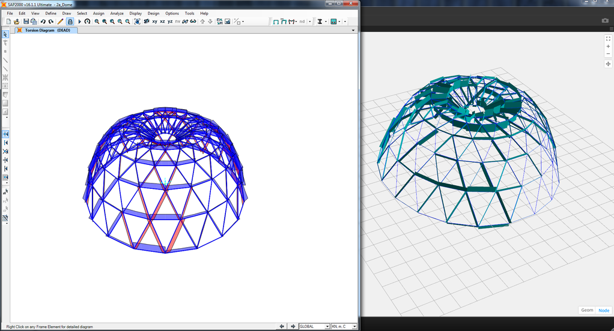

# 便利なパッケージ

このセクションでは、Dynamo コミュニティで人気のあるパッケージをいくつか紹介します。これ以外にも便利なパッケージがあれば、リストに追加してください。[Dynamo Primer](https://github.com/DynamoDS/DynamoPrimer) は、オープンソース型のドキュメントです。開発者の皆様の積極的な参加をお待ちしています。

| **ARCHI-LAB**                                                                                                                                                                                                                                                       | [archi-lab の公式サイトにアクセス](http://archi-lab.net) |
| -------------------------------------------------------------------------------------------------------------------------------------------------------------------------------------------------------------------------------------------------------------------------------------------------- | --------------------------------------------------------- |
| archi-lab には、Dynamo と Revit との対話機能を大幅に拡張する 50 個超のカスタム パッケージが含まれています。archi-lab パッケージには、基本的なリスト操作用のノードから、Revit 用の高度な Analysis Visualization Framework ノードまで、さまざまなノードが含まれています。archi-lab は Dynamo Package Manager で入手できます。 |                          |

|  **BIMORPH NODES**                                                                                                                                                                                                                                                                                                                                                     | [BimorphNodes ディクショナリにアクセス](https://bimorph.com/bimorph-nodes/) |
| ------------------------------------------------------------------------------------------------------------------------------------------------------------------------------------------------------------------------------------------------------------------------------------------------------------------------------------------------------------------------------------------------------------------------------ | ----------------------------------------------------------------------- |
| BimorphNodes は強力なユーティリティ ノードを集めたもので、汎用性があります。パッケージの特徴は、きわめて効率的な干渉検出とジオメトリの交差ノード、ImportInstance (CAD)の曲線変換ノード、そして、Revit API での制限を解決するリンクされた要素のコレクタにあります。利用可能なすべての範囲のノードについては、BimorphNodes Dictionary を参照してください。BimorphNodes は Dynamo Package Manager で入手できます。 |            |

|  **BUMBLEBEE FOR DYNAMO**                                                                           | [BumbleBee の公式サイトにアクセス](http://archi-lab.net/bumblebee-dynamo-and-excel-interop/) |
| ----------------------------------------------------------------------------------------------------------------------------- | --------------------------------------------------------------------------------------------- |
| Bumblebee は、Dynamo で Excel ファイルを読み書きする際の機能を大幅に向上させる、Excel と Dynamo の相互運用性プラグインです。 |                                                               |

| **CLOCKWORK FOR DYNAMO**                                                                                                                                                                                                                                                                                                                                    | [GitHub の Clockwork For Dynamo にアクセス](https://github.com/CAAD-RWTH/ClockworkForDynamo) |
| ------------------------------------------------------------------------------------------------------------------------------------------------------------------------------------------------------------------------------------------------------------------------------------------------------------------------------------------------------------------------------------- | ---------------------------------------------------------------------------------------- |
| Clockwork は、Dynamo ビジュアル プログラミング環境用のカスタム ノードが集まったものです。Clockwork には、Revit に関連する多数のノードに加え、リスト管理、算術演算、文字列処理、単位変換、ジオメトリの操作(主に、境界ボックス、メッシュ、平面、点、サーフェス、UV、ベクトル)、パネル作成など、さまざまな用途のノードが豊富に用意されています。 |                                                          |

|  **DATA\|SHAPES**                                                                                                                                                                                                                              | [GitHub の Data\|Shapes にアクセス](https://github.com/MostafaElAyoubi/Data-shapes) |
| ------------------------------------------------------------------------------------------------------------------------------------------------------------------------------------------------------------------------------------------------------------------------------- | ------------------------------------------------------------------------------ |
| DataShapes は、Dynamo スクリプトのユーザ機能を拡張するためのパッケージです。このパッケージにより、Dynamo プレーヤの機能が大幅に拡張されます。詳細については、https://data-shapes.net/ をご覧ください。このパッケージを使用すれば、Dynamo プレーヤで高度なワークフローを作成できます。 |                                   |

|  **DYNAMO SAP**                                                                                                                                                                                                                                                                                                                                                           | [Core Studio の DynamoSAP プロジェクトにアクセス](http://core.thorntontomasetti.com/dynamosap-is-now-open-source/) |
| ---------------------------------------------------------------------------------------------------------------------------------------------------------------------------------------------------------------------------------------------------------------------------------------------------------------------------------------------------------------------------------------------------------- | ------------------------------------------------------------------------------------------------------------- |
| DynamoSAP は、Dynamo 上に構築された、SAP2000 用のパラメトリック インタフェースです。このプロジェクトにより、設計者とエンジニアは Dynamo で SAP モデルを駆動し、SAP 上の構造システムを生成的なアプローチで作成して解析することができます。このプロジェクトでは、付属のサンプル ファイルで説明されているように、一般的なワークフローが事前に用意されています。これらのワークフローにより、SAP における多くの一般的なタスクを自動化できます。 |                                                                                   |

|  **DYNAMO UNFOLD**                                                                                                                                                                                                                                                                                       | [GitHub の DynamoUnfold にアクセス](https://github.com/mjkkirschner/DynamoUnfold) |
| --------------------------------------------------------------------------------------------------------------------------------------------------------------------------------------------------------------------------------------------------------------------------------------------------------------------------------------------------- | ----------------------------------------------------------------------------- |
| このライブラリを使用すると、ユーザ自身がサーフェスとポリサーフェスのジオメトリを展開できるようになり、Dynamo と Revit の機能が拡張されます。ユーザはこのライブラリを使用して、最初にサーフェスを平らな Tessellate トポロジに変換し、次に Dynamo の ProtoGeometry ツールを使用して Tessellate トポロジを展開することができます。このパッケージには、いくつかのサンプル ノードと、基本的なサンプル ファイルも含まれています。 |                                    |

|  **DYNASTRATOR**                                                                                                   | [Dynamo Package Manager で Dynastrator をダウンロード](http://dynamopackages.com) |
| ---------------------------------------------------------------------------------------------------------------------------------------------------- | ------------------------------------------------------------------------ |
| Illustrator または Web からベクター アートを .svg 形式で読み込むことにより、手作業で作成したイラストを Dynamo に取り込み、パラメトリック操作を行うことができます。 |                              |

|  **ENERGY ANALYSIS FOR DYNAMO**                                                                                                                                                                                                                                                                                                                                              | [GitHub の Energy Analysis for Dynamo プロジェクトにアクセス](https://github.com/tt-acm/EnergyAnalysisForDynamo) |
| ------------------------------------------------------------------------------------------------------------------------------------------------------------------------------------------------------------------------------------------------------------------------------------------------------------------------------------------------------------------------------------------------------------- | ----------------------------------------------------------------------------------------------------------- |
| Energy Analysis for Dynamo を使用すると、Dynamo 0.8 でパラメトリック エネルギー モデリングと建物全体のエネルギー解析ワークフローを実行できます。また、Autodesk Revit でエネルギー モデルを設定し、そのモデルを Green Building Studio に送信して DOE2 エネルギー解析を行ったり、解析結果を詳しく分析することもできます。このパッケージは、Thornton Tomasetti の CORE studio で開発されています。 |                                                                                  |

|  **FIREFLY FOR DYNAMO**                                                                                                                                                                                                                                                                                       | [Dynamo Package Manager で Firefly をダウンロード](http://dynamopackages.com) |
| ------------------------------------------------------------------------------------------------------------------------------------------------------------------------------------------------------------------------------------------------------------------------------------------------------------------------------------------- | --------------------------------------------------------------------------- |
| ノードの集まりである Firefly を使用すると、Dynamo で Arduino マイコンなどの入出力デバイスと通信を行うことができます。データがリアルタイムに処理されるため、Web カメラ、携帯電話、ゲーム コントローラ、センサなどを使用して、ディジタルの世界と現実の世界を連携させるためのさまざまなプロトタイプを作成できます。 |                                               |

|  **GENIUS LOCI**                                                                                                                                                                    | [GitHub の Genius Loci にアクセス](https://github.com/albandechasteigner/GeniusLociForDynamo) |
| ------------------------------------------------------------------------------------------------------------------------------------------------------------------------------------------------------------------------- | ----------------------------------------------------------------------------------------- |
| Genius Loci は、Dynamo 用ノードを集めたものです。Revit ユーザに役立つノードで構成されています。リンク ファイルや Revit ドキュメントとの連携などの機能があります。パッケージをインストールしてご確認ください。 |                             |

|  **MANTIS SHRIMP**                                                                       | [Mantis Shrimp の公式サイトにアクセス](http://archi-lab.net/mantis-shrimp-getting-started/) |
| ---------------------------------------------------------------------------------------------------------------------------- | --------------------------------------------------------------------------------------------- |
| Mantis Shrimp は、Grasshopper ジオメトリや Rhino ジオメトリを Dynamo に簡単に読み込むことができる、相互運用性プロジェクトです。 |                                                                    |

|  **MESH TOOLKIT**                                                                                                                                                                                                                                                                                                                                              | [GitHub の Dynamo Mesh Toolkit にアクセス](https://github.com/DynamoDS/Dynamo/wiki/Dynamo-Mesh-Toolkit) |
| -------------------------------------------------------------------------------------------------------------------------------------------------------------------------------------------------------------------------------------------------------------------------------------------------------------------------------------------------------------------------------------------------------- | --------------------------------------------------------------------------------------------------- |
| Dynamo Mesh Toolkit には、メッシュ ジオメトリを操作するための便利な各種ツールが用意されています。このパッケージには、外部のファイル形式からメッシュを読み込む機能、既存の Dynamo ジオメトリ オブジェクトからメッシュを生成する機能、頂点と接続に関する情報からメッシュを手動で作成する機能が含まれています。また、このツールキットには、メッシュ ジオメトリの修正や修復を行うためのツールが含まれています。 |                                                           |

| 🧐 **MONOCLE**                                                                                                                                                                                                                                                                                                       | [GitHub の Monocle にアクセス](https://github.com/johnpierson/MonocleForDynamo) |
| -------------------------------------------------------------------------------------------------------------------------------------------------------------------------------------------------------------------------------------------------------------------------------------------------------------------- | --------------------------------------------------------------------------- |
| Monocle は、Dynamo 2.0.x. 用のビューの拡張機能です。Monocle には、パッケージの識別やグラフのクリーンアップなど、有用なツール セットが含まれています。Monocle は、Dynamo UI に機能を追加することを目的としていますが、_Dynamo に初めから組み込まれているのかと思えるほどシームレスに追加されています_。Monocle は Dynamo Package Manager で入手できます。 |                                     |

|  **OPTIMO**                                                                                                                                                                                       | [GitHub の Optimo にアクセス](https://github.com/BPOpt/Optimo/wiki/0\_-Home) |
| -------------------------------------------------------------------------------------------------------------------------------------------------------------------------------------------------------------------------------------- | ------------------------------------------------------------------------ |
| Dynamo ユーザは、Optimo で各種の高度なアルゴリズムを使用して、自分で定義した設計上の問題を最適化できます。また、問題の目的と適応度関数を定義することができます。 |                                             |

|  **RHYNAMO**                                                                                                                                                                                                                                                                                                                                                                          | [Rhynamo Bitbucket にアクセス](https://bitbucket.org/caseinc/rhynamo) |
| --------------------------------------------------------------------------------------------------------------------------------------------------------------------------------------------------------------------------------------------------------------------------------------------------------------------------------------------------------------------------------------------------------------------------- | -------------------------------------------------------------------- |
| Rhynamo ノード ライブラリを使用すると、Rhino 3DM ファイルを Dynamo 内で読み書きすることができます。Rhynamo は、McNeel の OpenNURBS ライブラリを使用して、Rhino のジオメトリを Dynamo で使用できるジオメトリに変換します。これにより、Rhino と Revit 間でジオメトリやデータを柔軟に交換するための新しいワークフローが作成されます。このパッケージには、Rhino コマンド ラインへの「ライブ」アクセスが可能なサンプル ノードも含まれています。 |                                        |

|  **RHYTHM**                                                                                                                                                                                                                                                                    | [GitHub の Rhythm にアクセス](https://github.com/sixtysecondrevit/RhythmForDynamo) |
| ----------------------------------------------------------------------------------------------------------------------------------------------------------------------------------------------------------------------------------------------------------------------------------------------------------- | ----------------------------------------------------------------------------- |
| Rhythm は、Dynamo を使用した Revit プロジェクトを順調に進めるために役立つノードをセットにしたものです。基本的な機能は十分です。主に C# で構築された Rhythm はオープン ソースで、Revit ノード、コア ノード、およびビュー拡張機能を Dynamo に追加します。Rhythm は Dynamo Package Manager で入手できます。 |                                              |

|  **Spring Nodes**                                                                                                                                                                                                                                                                                                                      | [GitHub の Spring ](https://github.com/dimven/SpringNodes)[Nodes にアクセス](https://github.com/dimven/SpringNodes) |
| ---------------------------------------------------------------------------------------------------------------------------------------------------------------------------------------------------------------------------------------------------------------------------------------------------------------------------------------------------------------------------- | -------------------------------------------------------------------------------------------------------------- |
| SpringNodes は、Dynamo と Revit との連携機能を改善することを主な目的としています。さらに、BIM に重点を置いたワークフローを高速化する上で役立つ手段となることを目指しています。多くのノードは IronPython または DesignScript を使用しており、それぞれに特有の構文と機能を理解するための出発点として適しています。SpringNodes は Dynamo Package Manager で入手できます。 |                                                                          |
