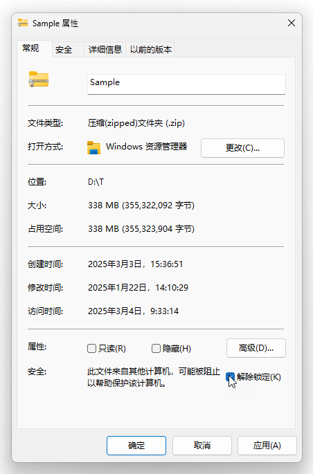
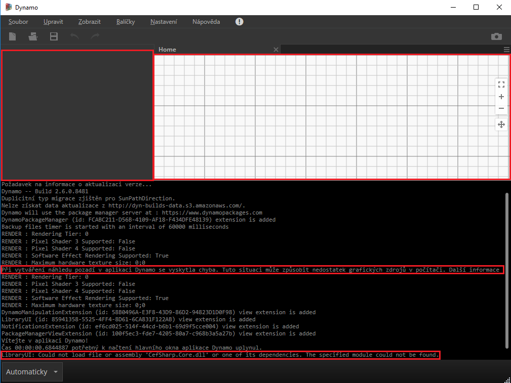
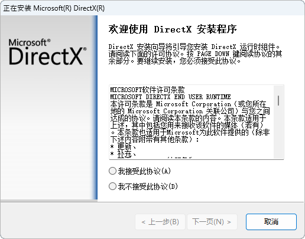
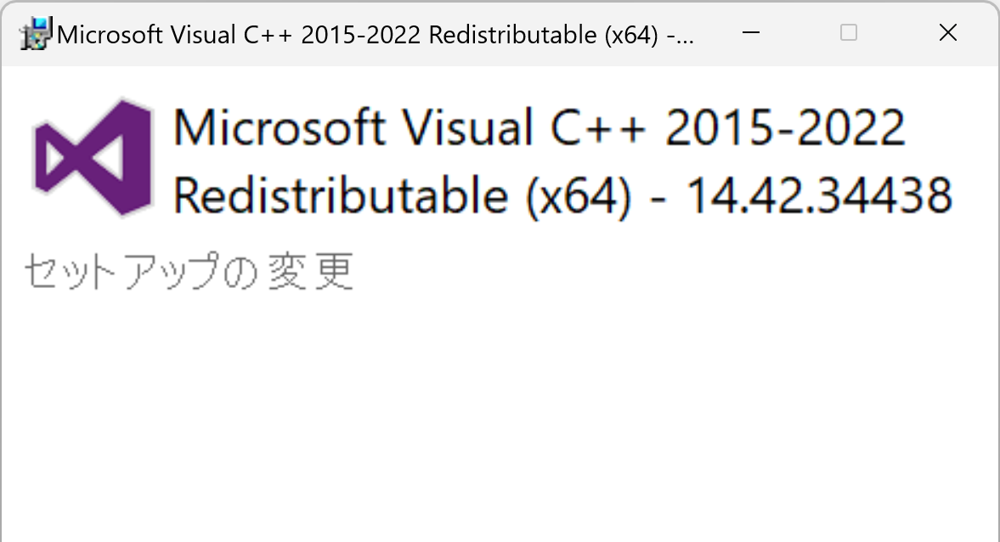
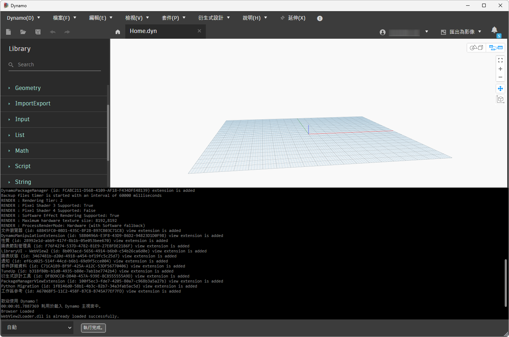
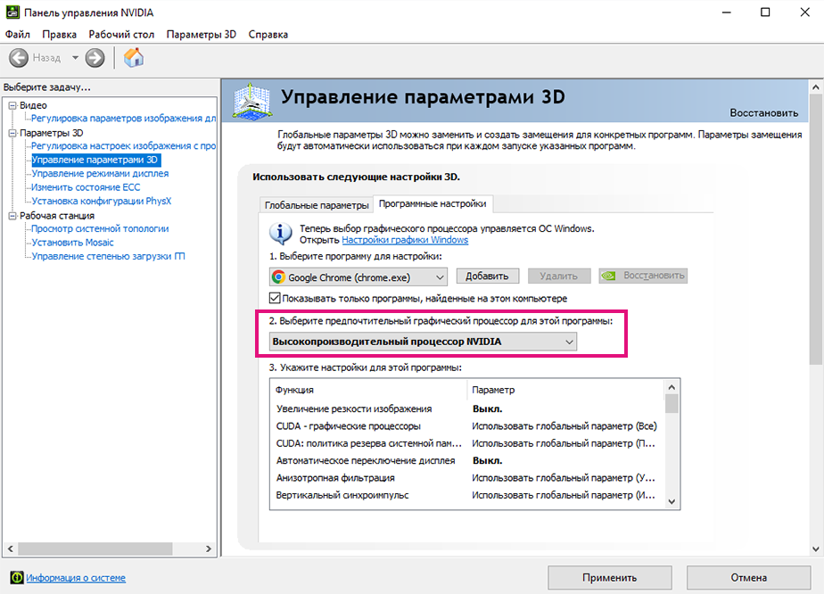
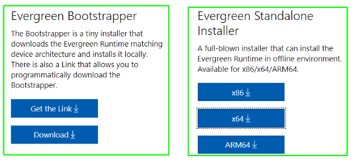

# Frequently Asked Questions (FAQ)

## How to Utilise Dynamo Builds

### Daily builds versus Stable builds
It is a tradition that the Dynamo at Autodesk team keeps up a fast pace of iteration by releasing both daily builds per commit, and also stable release builds after our system testing and release cycle. Our team would love to restart the daily and stable builds so that users can control where DynamoCore is extracted on their disk locally, so users can have confidence using it, without impacting Dynamo for other ADSK products. There are a few natural candidates for this purpose, including .nupkg, .zip file, or a dedicated installer where users can choose install path or other options. 

Given our goal of getting users our latest code in the most simple way possible we have decided to deliver a .zip file containing the DynamoCore binaries and Dynamo Sandbox that can be used without Revit (with some constraints).

### Dynamo Zip builds
#### Definition and Source
The DynamoCoreRuntime zip build is a snapshot of DynamoCore binaries which is made during our automated builds. 

You should be able to launch DynamoSandbox.exe in the extracted folder to use Dynamo with minimal setup.

#### Required components

| Dynamo Version  |Microsoft Visual C++  | DirectX  |   |   |   |   |
|---|---|---|---|---|---|---|
|  2.0 - 2.6 |  2015 Redistributable  | 10  |   |   |   |   |
| 2.7  | 2019 Redistributable  | 11/12 (included with windows 10  |   |   |   |   |
| >=2.8  | 2019 Redistributable  | 11/12 (included with windows 10  |   |   |   |   |
##### Microsoft DirectX which is also available publicly in our Dynamo Github Repo [here](https://github.com/DynamoDS/Dynamo/tree/master/tools/install/Extra/DirectX)

##### 7zip used for unzipping the package [here](https://www.7-zip.org/download.html)

##### Microsoft Visual C++ 2015-2024 Redistributable (x64) [link](https://aka.ms/vs/17/release/vc_redist.x64.exe)

##### Optional components
Geometry Library (It will only be available with particular Autodesk modeling tools like Revit, Civil 3D, Advanced Steel, etc)

### Troubleshooting
If you unzipped the build and could not launch DynamoSandbox.exe at all, please make sure to use [7zip](https://www.7-zip.org/download.html) to unzip the build.
You may also manually unblock the .zip archive *before* extracting it - if you have permissions on your machine.

If you are missing any of the required components, you may encounter problems using Dynamo, and certain parts of the UI may fail to load.

Using the following screenshot as an example, unzipping our build on a clean Windows 10 VM without GPU, the machine is missing both required components. This is indicated in the Dynamo Console.

##### Installing DirectX
Please follow the Microsoft instructions here to check if you have DirectX installed already. If not, you can open DXSETUP.exe in our Dynamo Github Repository [here](https://github.com/DynamoDS/Dynamo/tree/master/tools/install/Extra/DirectX). Once you see the dialog below, feel free to hit next to install DirectX to the default location.

##### Installing Microsoft Visual C++ 2015-2024 Redistributable (x64)
Please download the latest [here](https://aka.ms/vs/17/release/vc_redist.x64.exe). Then you should be able to run the installer named vc_redist.x64.exe in your browser download location. Once you see the dialog below, feel free to click install to put this component in the default location.

After installing both required components from the link above, re-launch DynamoSandbox.exe, you should see the following result:

##### Missing 3d graphics. 

You may also run into graphics issues running sandbox for the fist time, you can follow the standard graphics issues FAQ here:

https://github.com/DynamoDS/Dynamo/wiki/Dynamo-FAQ

In general you will likely need to force high performance GPU mode for your graphics card when using the DynamoSandbox.exe

_example nvidia control panel:_

##### Installing WebView2 Runtime
Right now the next Dynamo modules are using the WebView2 component: Documentation Browser, Guided Tours and Library, so in order to ensure that this parts of Dynamo display correctly the Web content we need to install the WebView2 Evergreen Runtime installer ( you will need to validate if is already installed in the computer or needs to be installed).

This is the link for installing the WebView2 Runtime:
https://developer.microsoft.com/en-us/microsoft-edge/webview2/#download-section

The ones that should be installed (just one of them) are the Evergreen Bootstrapper or the Evergreen Standalone Installer, the first one downloads a 1.50 MB installer and the second one downloads a 130 MB installer.

After the Runtime is installed the next components of Dynamo should be working correctly:

##### Dynamo Excel Nodes Issues
You can refer to this [article](https://knowledge.autodesk.com/support/revit-products/troubleshooting/caas/sfdcarticles/sfdcarticles/Warning-Data-ImportExcel-operation-failed-Could-not-load-file-or-assembly-Microsoft-Office-Interop-Excel-when-running-the-Dynamo-script-in-Revit.html) for diagnostics.

### Dynamo Builds Location
Stable Releases

https://dynamobim.org/download/

https://github.com/DynamoDS/Dynamo/releases

Daily Builds and Stable Releases

https://dynamobuilds.com/

## Efficiently Working With Large Data Sets In Dynamo

This page introduces you to some rules of thumb for efficiently working with large data sets in Dynamo. Hopefully you can use the tips to identify bottlenecks in your graphs, so that your graph will execute in a matter of minutes, rather than a matter of hours.

Contents:
* Geometry generation vs tessellation
* Memory use
* Revit API

### Geometry generation vs tessellation

In Dynamo, creating a piece of geometry and drawing it are two completely different events. In general, creating geometry is much quicker and uses less memory than drawing the object. You can think of the geometry as a list of measurements to make a suit, while the tessellation is the suit itself. You can tell quite a lot about the suit from its measurements: how long the arms are, how much it costs, etc., but you almost always need to see and try on the finished suit to see if it is correct or not. Similarly, with untessellated geometry, you can determine its bounding box, area, volume; intersect it with other geometry; and export it to SAT or Revit. However, you almost always have to tessellate the geometry to get a feel it it is correct or not. 

If your Dynamo graph has many objects, and is slowing down during execution, you may be able to remove the tessellation steps from your graph to speed things up.  

Geometry nodes in Dynamo are always tessellated*. This leaves you with two options to work with untessellated geometry: Python nodes and ZeroTouch nodes. As long as you don't return a geometry object out of your Python or ZeroTouch node, the geometry will not be tessellated. For instance, if your graph has several point nodes, connected to several line nodes, connected to several loft nodes, connected to several thicken nodes, the geometry will be tessellated at each step. Instead, you can bundle this logic into a Python or ZeroTouch node, and only return the final object out of the node.

More information about using ZeroTouch nodes can be found in the [Developing for Dynamo](11\_developer\_primer/3\_developing\_for\_dynamo/README.md) section of this Primer.

### Memory Use

If you are no longer tessellating geometry, you may run into a memory bottleneck from excess geometry accumulation. Geometry objects in Dynamo consume a minor, but not insignificant amount of memory on creation. If you are working with hundreds of thousands or millions of objects, this can add up and cause Dynamo or Revit to crash. In Dynamo version 2.5 and later this is handled implicitly by disposing off the unused objects, but if you are using a version older than 2.5 then one way to avoid creating lots of geometry is to dispose of the objects when you are done with them. For instance, let's say you were creating hundreds of thousands of NurbsCurves, each requiring dozens of Points. One way to create them is a 2 dimensional list in Dynamo, and feed that into a NurbsCurve.ByPoints node. However, that requires creating millions of Points. Another way is to use a Python or ZeroTouch node. In this node, you can create a dozen points, feed that into NurbsCurve.ByPoints, and then dispose of the dozen points with the .Dispose() method call. More information about using ZeroTouch nodes can be found in the [Developing for Dynamo](11\_developer\_primer/3\_developing\_for\_dynamo/README.md) section of this Primer. Disposing of your geometry objects after you create them can drastically cut down on the amount of memory you use in certain circumstances, and although we do handle this for users on Dynamo 2.5 and later, we do recommend that the user still disposes geometry explicitly, if the use case requires to cut down on memory at a deterministic time. See [Dynamo Geometry Stability Improvements](https://forum.dynamobim.com/t/dynamo-geometry-stability-improvements-request-for-feedback/39297) to read more about the new stability features introduced in Dynamo 2.5.

### Revit API

If you are aggressively Disposing objects in a ZeroTouch or Python node, and still running into memory or performance problems, it may be necessary to bypass Dynamo entirely and create Revit objects directly through the API. For instance, you may parse an Excel file for point information, and use this information to create XYZ, and other Revit Elements, through their API. At this point, Revit will become the ultimate bottleneck, which can't be avoided.