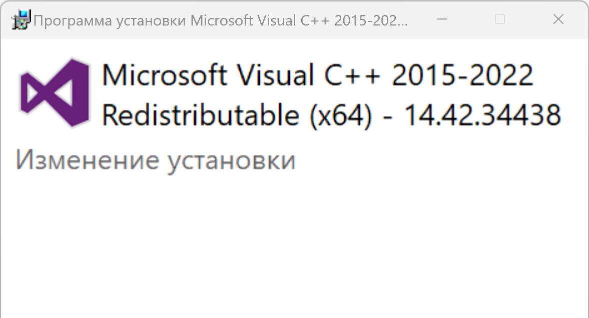

# Perguntas frequentes (FAQ)

## Como usar as compilações do Dynamo

### Compilações diárias versus compilações estáveis
É uma tradição que a equipe do Dynamo na Autodesk mantenha um ritmo rápido de iteração, lançando compilações diárias por confirmação e também compilações de lançamento estáveis ​​após nosso ciclo de testes e lançamentos do sistema. Nossa equipe adoraria reiniciar as compilações diárias e estáveis ​​para que os usuários possam controlar onde o DynamoCore é extraído em seu disco localmente, para que os usuários possam ter confiança ao usá-lo, sem impactar o Dynamo para outros produtos ADSK. Existem alguns candidatos naturais para essa finalidade, incluindo .nupkg, arquivo .zip ou um instalador dedicado onde os usuários podem escolher o caminho de instalação ou outras opções. 

Dado nosso objetivo de fornecer aos usuários nosso código mais recente da forma mais simples possível, decidimos entregar um arquivo .zip contendo os binários do DynamoCore e o Dynamo Sandbox que pode ser usado sem o Revit (com algumas restrições).

### Compilações em zip do Dynamo
#### Definição e origem
A compilação em zip do DynamoCoreRuntime é um instantâneo dos binários do DynamoCore que é feito durante nossas compilações automatizadas. 

Você deve ser capaz de iniciar o DynamoSandbox.exe na pasta extraída para usar o Dynamo com configuração mínima.

#### Componentes necessários

| Versão do Dynamo  |Microsoft Visual C++  | DirectX  |   |   |   |   |
|---|---|---|---|---|---|---|
|  2.0 – 2.6 |  Redistribuível 2015  | 10  |   |   |   |   |
| 2.7  | Redistribuível 2019  | 11/12 (incluído com o Windows 10)  |   |   |   |   |
| >=2.8  | Redistribuível 2019  | 11/12 (incluído com o Windows 10)  |   |   |   |   |
##### Microsoft DirectX, que também está disponível publicamente em nosso repositório Github do Dynamo [aqui](https://github.com/DynamoDS/Dynamo/tree/master/tools/install/Extra/DirectX)

##### 7zip usado para descompactar o pacote [aqui](https://www.7-zip.org/download.html)

##### Microsoft Visual C++ 2015-2024 Redistribuível (x64) [link](https://aka.ms/vs/17/release/vc_redist.x64.exe)

##### Componentes opcionais
Biblioteca de geometria (estará disponível apenas com ferramentas de modelagem específicas da Autodesk, como Revit, Civil 3D, Advanced Steel etc.)

### Solução de problemas
Se você descompactou a compilação e não conseguiu iniciar o DynamoSandbox.exe, certifique-se de usar o [7zip](https://www.7-zip.org/download.html) para descompactar a compilação. Você também poderá desbloquear manualmente o arquivo .zip *antes* de extraí-lo, se tiver permissões no computador.

Se estiver faltando algum dos componentes necessários, você poderá ter problemas ao usar o Dynamo, e talvez algumas partes da interface do usuário não sejam carregadas.

Usando a captura de tela a seguir como exemplo, ao descompactar nossa compilação em uma VM limpa do Windows 10 sem GPU, a máquina virtual está sem os dois componentes necessários. Isso é indicado no Console do Dynamo.

##### Instalar o DirectX
Siga as instruções da Microsoft aqui para verificar se você já tem o DirectX instalado. Caso não tenha, será possível abrir o DXSETUP.exe em nosso repositório Github do Dynamo [aqui](https://github.com/DynamoDS/Dynamo/tree/master/tools/install/Extra/DirectX). Quando a caixa de diálogo abaixo aparecer, clique em Próximo para instalar o DirectX na localização padrão.

##### Instalar o Microsoft Visual C++ 2015-2024 Redistribuível (x64)
Faça o download da versão mais recente [aqui](https://aka.ms/vs/17/release/vc_redist.x64.exe). Em seguida, será possível executar o instalador chamado vc_redist.x64.exe na localização de download do navegador. Quando a caixa de diálogo abaixo aparecer, clique em Instalar para colocar esse componente na localização padrão.

Após instalar os dois componentes necessários usando o link acima, reinicie o DynamoSandbox.exe. Você deverá ver o seguinte resultado:

##### Gráficos 3D ausentes. 

Você também pode ter problemas gráficos ao executar o Sandbox pela primeira vez. Você pode seguir as perguntas frequentes padrão sobre problemas gráficos aqui:

[https://github.com/DynamoDS/Dynamo/wiki/Dynamo-FAQ](https://github.com/DynamoDS/Dynamo/wiki/Dynamo-FAQ)

Provavelmente será necessário forçar o modo GPU de alto desempenho para a placa gráfica ao usar o DynamoSandbox.exe

_exemplo de painel de controle nvidia:_

##### Instalar o WebView2 Runtime
No momento, os próximos módulos do Dynamo estão usando o componente WebView2: Navegador de documentação, Visitas guiadas e Biblioteca. Para garantir que essas partes do Dynamo mostrem corretamente o conteúdo da Web, é necessário instalar o instalador do WebView2 Evergreen Runtime (será necessário validar se já está instalado no computador ou se precisa ser instalado).

Este é o link para instalar o WebView2 Runtime: [https://developer.microsoft.com/pt-br/microsoft-edge/webview2/#download-section](https://developer.microsoft.com/en-us/microsoft-edge/webview2/#download-section)

Os que devem ser instalados (apenas um deles) são o Evergreen Bootstrapper ou o Evergreen Standalone Installer, o primeiro faz o download de um instalador de 1,50 MB e o segundo de um instalador de 130 MB.

Após a instalação do Runtime, os próximos componentes do Dynamo deverão estar funcionando corretamente:

##### Problemas de nós do Excel do Dynamo
Consulte este [artigo](https://www.autodesk.com/br/support/technical/article/caas/sfdcarticles/sfdcarticles/PTB/Warning-Data-ImportExcel-operation-failed-Could-not-load-file-or-assembly-Microsoft-Office-Interop-Excel-when-running-the-Dynamo-script-in-Revit.html) para obter os diagnósticos.

### Localização das compilações do Dynamo
Versões estáveis

[https://dynamobim.org/download/](https://dynamobim.org/download/)

[https://github.com/DynamoDS/Dynamo/releases](https://github.com/DynamoDS/Dynamo/releases)

Compilações diárias e versões estáveis

[https://dynamobuilds.com/](https://dynamobuilds.com/)

