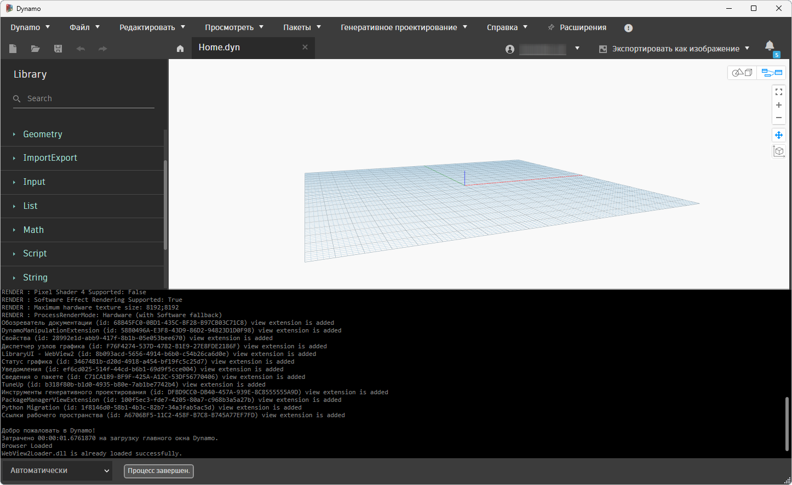
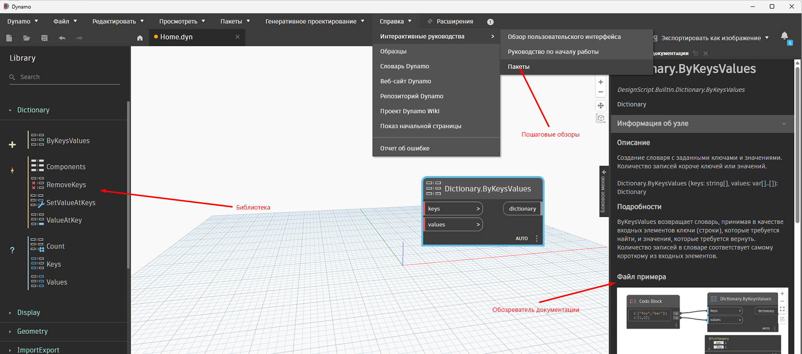

# Časté otázky

## Jak používat sestavení aplikace Dynamo

### Denní sestavení versus stabilní sestavení
Je tradicí, že tým aplikace Dynamo udržuje rychlé tempo iterací vydáváním jak denních sestavení pro každou revizi, tak i stabilních sestavení po našem cyklu testování systému a vydání nové verze. Náš tým by při vydávání denních a stabilních sestavení rád docílil toho, aby uživatelé mohli řídit, kde je komponenta DynamoCore na disku lokálně extrahována, a uživatelé ji tak mohli bez obav používat, aniž by to ovlivnilo aplikaci Dynamo pro jiné produkty Autodesk. Pro tento účel existuje několik přirozených kandidátů, včetně .nupkg, souboru .zip nebo vyhrazeného instalátoru, kde si uživatelé mohou zvolit instalační cestu nebo další možnosti. 

Vzhledem k tomu, že naším cílem je poskytovat uživatelům nejnovější kód co nejjednodušším způsobem, rozhodli jsme se dodat soubor .zip obsahující binární soubory DynamoCore a Dynamo Sandbox, který lze používat bez aplikace Revit (s určitými omezeními).

### Sestavení aplikace Dynamo v souboru .zip
#### Definice a zdroj
Sestavení .zip DynamoCoreRuntime je výběr binárních souborů DynamoCore vytvořený během našich automatizovaných sestavení. 

Měli byste být schopni spustit soubor DynamoSandbox.exe v extrahované složce a používat aplikaci Dynamo s minimálním nastavením.

#### Požadované komponenty

| Verze aplikace Dynamo  |Microsoft Visual C++  | DirectX  |   |   |   |   |
|---|---|---|---|---|---|---|
|  2.0– 2.6 |  2015 Redistributable  | 10  |   |   |   |   |
| 2.7  | 2019 Redistributable  | 11/12 (součást systému Windows 10)  |   |   |   |   |
| >=2.8  | 2019 Redistributable  | 11/12 (součást systému Windows 10)  |   |   |   |   |
##### Rozhraní Microsoft DirectX, které je také veřejně dostupné v našem úložišti aplikace Dynamo na Githubu – [zde](https://github.com/DynamoDS/Dynamo/tree/master/tools/install/Extra/DirectX)

##### Program 7zip slouží k rozbalení balíčku – [zde](https://www.7-zip.org/download.html)

##### Microsoft Visual C++ 2015-2024 Redistributable (x64) – [odkaz](https://aka.ms/vs/17/release/vc_redist.x64.exe)

##### Volitelné komponenty
Knihovna geometrie (bude k dispozici pouze s určitými nástroji Autodesk pro modelování, jako je Revit, Civil 3D, Advanced Steel atd.)

### Řešení potíží
Pokud jste sestavení rozbalili a soubor DynamoSandbox.exe se vám vůbec nepodařilo spustit, použijte k rozbalení sestavení program 7zip. Archiv .zip můžete také ručně odblokovat *před* extrahováním – pokud máte na svém počítači příslušná oprávnění.

Jestliže vám některá z požadovaných komponent chybí, může při používání aplikace Dynamo dojít k problémům a některé části uživatelského rozhraní se nemusí načíst.

Na následujícím snímku obrazovky je zobrazena situace, kdy bylo sestavení rozbaleno na virtuálním počítači s čistým systémem Windows 10 bez grafického procesoru a v počítači chybí obě požadované komponenty. Příslušné informace jsou uvedeny v konzole aplikace Dynamo.

##### Instalace rozhraní DirectX
Postupujte podle pokynů společnosti Microsoft a zkontrolujte, zda je již nainstalováno rozhraní DirectX. Pokud tomu tak není, můžete otevřít soubor DXSETUP.exe v našem úložišti aplikace Dynamo na Githubu [zde](https://github.com/DynamoDS/Dynamo/tree/master/tools/install/Extra/DirectX). Poté, co se zobrazí níže uvedený dialog, můžete kliknout na tlačítko Další a nainstalovat rozhraní DirectX do výchozího umístění.

##### Instalace Microsoft Visual C++ 2015-2024 Redistributable (x64)
Nejnovější verzi si můžete stáhnout [zde](https://aka.ms/vs/17/release/vc_redist.x64.exe). Poté byste měli být schopni spustit instalační program s názvem vc_redist.x64.exe, který naleznete v umístění pro stahování nastaveném ve vašem prohlížeči. Poté, co se zobrazí následující dialog, můžete kliknout na tlačítko Instalovat a umístit tuto komponentu do výchozího umístění.

Po instalaci obou požadovaných komponent z výše uvedeného odkazu a opětovném spuštění souboru DynamoSandbox.exe byste měli vidět následující výsledek:

##### Chybějící 3D grafika 

Při prvním spuštění sandboxu můžete také narazit na problémy s grafikou. Při jejich řešení můžete postupovat podle nejčastějších dotazů týkajících se problémů s grafikou, které naleznete zde:

[https://github.com/DynamoDS/Dynamo/wiki/Dynamo-FAQ](https://github.com/DynamoDS/Dynamo/wiki/Dynamo-FAQ)

Obecně platí, že při použití souboru DynamoSandbox.exe budete pravděpodobně muset pro svou grafickou kartu vynutit režim vysokého výkonu GPU.

_Příklad ovládacích panelů NVIDIA:_

##### Instalace WebView2 Runtime
V současné době následující moduly Dynamo používají komponentu WebView2: Prohlížeč dokumentace, Prohlídky s průvodcem a Knihovna. Abychom zajistili, že tyto části aplikace Dynamo správně zobrazují webový obsah, je nutné nainstalovat instalační program WebView2 Evergreen Runtime ( je třeba ověřit, zda je již v počítači nainstalován, nebo je třeba jej nainstalovat).

Zde je odkaz pro instalaci WebView2 Runtime: [https://developer.microsoft.com/en-us/microsoft-edge/webview2/#download-section](https://developer.microsoft.com/en-us/microsoft-edge/webview2/#download-section)

Měli byste nainstalovat instalační program Evergreen Bootstrapper nebo Evergreen Standalone Installer (stačí jeden z nich). První z těchto programů stáhne instalační program o velikosti 1.5 MB, druhý pak o velikosti 130 MB.

Po instalaci modulu runtime by následující komponenty Dynamo měly fungovat správně:

##### Problémy s uzly Dynamo aplikace Excel
V tomto [článku](https://knowledge.autodesk.com/support/revit-products/troubleshooting/caas/sfdcarticles/sfdcarticles/Warning-Data-ImportExcel-operation-failed-Could-not-load-file-or-assembly-Microsoft-Office-Interop-Excel-when-running-the-Dynamo-script-in-Revit.html) naleznete informace o diagnostice.

### Umístění sestavení Dynamo
Stabilní verze

[https://dynamobim.org/download/](https://dynamobim.org/download/)

[https://github.com/DynamoDS/Dynamo/releases](https://github.com/DynamoDS/Dynamo/releases)

Denní sestavení a stabilní verze

[https://dynamobuilds.com/](https://dynamobuilds.com/)

