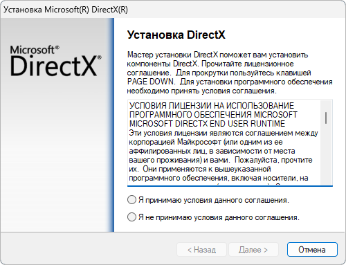

# Вопросы и ответы

## Использование сборок Dynamo

### Сравнение ежедневных сборок со стабильными сборками

Это уже стало традицией, когда команда Dynamo в Autodesk поддерживает быстрый темп итераций, выпуская как ежедневные сборки для каждого коммита, так и стабильные сборки после тестирования системы и цикла выпуска. Наша команда с удовольствием перезапустит ежедневные стабильные сборки, чтобы пользователи могли управлять расположением DynamoCore на своем локальном диске, чтобы они могли уверенно использовать его, не влияя на Dynamo для других программ ADSK. Существует несколько естественных кандидатов для этой цели, включая файлы NUPKG, ZIP или выделенный установщик, в котором пользователи могут выбрать путь установки или другие параметры.

Стремясь максимально упростить доступ к последней версии кода, мы решили предоставить файл ZIP, содержащий двоичные файлы DynamoCore и песочницу Dynamo Sandbox, которые можно использовать без Revit (с некоторыми ограничениями).

### Сборки Dynamo в формате ZIP

#### Определение и источник

ZIP-сборка DynamoCoreRuntime — это моментальный снимок двоичных файлов DynamoCore, создаваемый во время автоматизированных сборок.

Вы должны иметь возможность запустить DynamoSandbox.exe в извлеченной папке, чтобы использовать Dynamo с минимальными настройками.

#### Требуемые компоненты

| Версия Dynamo | Microsoft Visual C++ | DirectX | | | | | | -------------- | -------------------- | ------------------------------- | - | - | - | - | | 2.0–2.6 | Распространяемый пакет 2015 | 10 | | | | | | 2.7 | Распространяемый пакет 2019 | 11/12 (входит в состав Windows 10) | | | | | | >=2.8 | Распространяемый пакет 2019 | 11/12 (входит в состав Windows 10) | | | | |

**Файл Microsoft DirectX, который также доступен в репозитории Dynamo на Github** [**здесь**](https://github.com/DynamoDS/Dynamo/tree/master/tools/install/Extra/DirectX)

**Компонент 7zip, используемый для распаковки пакета:** [**здесь**](https://www.7-zip.org/download.html)

**Распространяемый пакет Microsoft Visual C++ 2015–2024 (x64):** [**здесь**](https://aka.ms/vs/17/release/vc_redist.x64.exe)

**Дополнительные компоненты**

Библиотека геометрии (доступна только с определенными инструментами моделирования Autodesk, такими как Revit, Civil 3D, Advanced Steel и т. д.)

### Устранение неполадок

Если вы распаковали сборку и не смогли запустить DynamoSandbox.exe, используйте [7zip](https://www.7-zip.org/download.html) для распаковки. Вы также можете вручную разблокировать архив ZIP _перед_ его извлечением, если у вас есть соответствующие права на компьютере.

Если какой-либо из необходимых компонентов отсутствует, могут возникнуть проблемы с Dynamo и может произойти сбой загрузки некоторых частей пользовательского интерфейса.

На следующем снимке экрана приведен пример распаковки нашей сборки на чистой виртуальной машине Windows 10 без GPU, на компьютере отсутствуют оба необходимых компонента. Это указано в консоли Dynamo.

**Установка DirectX**

Следуйте инструкциям Microsoft, приведенным здесь, чтобы проверить, установлен ли у вас программный продукт DirectX. Если это не так, можете открыть DXSETUP.exe в репозитории Dynamo на Github [здесь](https://github.com/DynamoDS/Dynamo/tree/master/tools/install/Extra/DirectX). При появлении приведенного ниже диалогового окна нажмите кнопку «Далее», чтобы установить DirectX в папку по умолчанию.

**Установка распространяемого пакета Microsoft Visual C++ 2015–2024 (x64)**

Скачайте последнюю версию [здесь](https://aka.ms/vs/17/release/vc_redist.x64.exe). После этого вы сможете запустить установщик с именем vc_redist.x64.exe в папке загрузок браузера. При появлении приведенного ниже диалогового окна нажмите кнопку «Установить», чтобы поместить этот компонент в папку по умолчанию.

После установки обоих необходимых компонентов по ссылке выше, перезапустите DynamoSandbox.exe. Должен отобразиться следующий результат:

**Отсутствует 3D-графика.**

При первом запуске песочницы также могут возникнуть проблемы с графикой. Стандартные вопросы и ответы о проблемах с графикой представлены по следующей ссылке:

[https://github.com/DynamoDS/Dynamo/wiki/Dynamo-FAQ](https://github.com/DynamoDS/Dynamo/wiki/Dynamo-FAQ)

В целом, при использовании DynamoSandbox.exe вам, скорее всего, потребуется принудительно включить режим высокой производительности GPU для вашей видеокарты

_Пример панели управления NVIDIA:_

**Установка среды выполнения WebView2**

В настоящее время компонент WebView2 используется в следующих модулях Dynamo: «Обозреватель документации», «Интерактивные руководства» и «Библиотека». Чтобы обеспечить правильное отображение веб-содержимого в этих компонентах Dynamo, необходимо установить установщик среды выполнения WebView2 Evergreen (потребуется проверить, установлен ли он уже на компьютере или его требуется установить).

Ниже приведена ссылка для установки среды выполнения WebView2: [https://developer.microsoft.com/ru-ru/microsoft-edge/webview2/#download-section](https://developer.microsoft.com/ru-ru/microsoft-edge/webview2/#download-section)

Компоненты, которые должны быть установлены (только один из них), — это загрузчик Evergreen Bootstrapper или автономный установщик Evergreen. Первый загружает установщик на 1,50 МБ, а второй загружает установщик на 130 МБ.

После установки среды выполнения следующие компоненты Dynamo должны работать правильно.

**Проблемы с узлами Excel в Dynamo**

Для диагностики можно обратиться к этой [статье](https://knowledge.autodesk.com/support/revit-products/troubleshooting/caas/sfdcarticles/sfdcarticles/Warning-Data-ImportExcel-operation-failed-Could-not-load-file-or-assembly-Microsoft-Office-Interop-Excel-when-running-the-Dynamo-script-in-Revit.html).

### Расположение сборок Dynamo

Стабильные выпуски

[https://dynamobim.org/download/](https://dynamobim.org/download/)

[https://github.com/DynamoDS/Dynamo/releases](https://github.com/DynamoDS/Dynamo/releases)

Ежедневные сборки и стабильные выпуски

[https://dynamobuilds.com/](https://dynamobuilds.com/)
