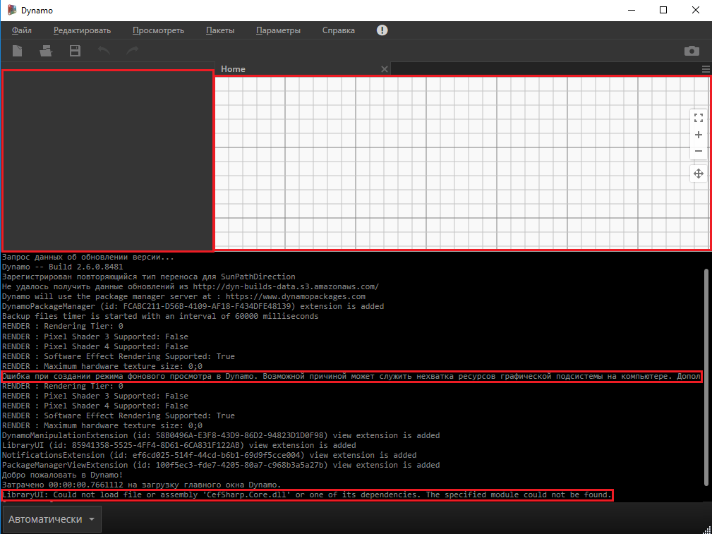

# Frequently Asked Questions (FAQ)

## How to Utilise Dynamo Builds

### Daily builds versus Stable builds
It is a tradition that the Dynamo at Autodesk team keeps up a fast pace of iteration by releasing both daily builds per commit, and also stable release builds after our system testing and release cycle. Our team would love to restart the daily and stable builds so that users can control where DynamoCore is extracted on their disk locally, so users can have confidence using it, without impacting Dynamo for other ADSK products. There are a few natural candidates for this purpose, including .nupkg, .zip file, or a dedicated installer where users can choose install path or other options. 

Given our goal of getting users our latest code in the most simple way possible we have decided to deliver a .zip file containing the DynamoCore binaries and Dynamo Sandbox that can be used without Revit (with some constraints).

### Dynamo Zip builds
#### Definition and Source
The DynamoCoreRuntime zip build is a snapshot of DynamoCore binaries which is made during our automated builds. 

You should be able to launch DynamoSandbox.exe in the extracted folder to use Dynamo with minimal setup.

#### Required components

| Dynamo Version  |Microsoft Visual C++  | DirectX  |   |   |   |   |
|---|---|---|---|---|---|---|
|  2.0 - 2.6 |  2015 Redistributable  | 10  |   |   |   |   |
| 2.7  | 2019 Redistributable  | 11/12 (included with windows 10  |   |   |   |   |
| >=2.8  | 2019 Redistributable  | 11/12 (included with windows 10  |   |   |   |   |
##### Microsoft DirectX which is also available publicly in our Dynamo Github Repo [here](https://github.com/DynamoDS/Dynamo/tree/master/tools/install/Extra/DirectX)

##### 7zip used for unzipping the package [here](https://www.7-zip.org/download.html)

##### Microsoft Visual C++ 2015-2024 Redistributable (x64) [link](https://aka.ms/vs/17/release/vc_redist.x64.exe)

##### Optional components
Geometry Library (It will only be available with particular Autodesk modeling tools like Revit, Civil 3D, Advanced Steel, etc)

### Troubleshooting
If you unzipped the build and could not launch DynamoSandbox.exe at all, please make sure to use [7zip](https://www.7-zip.org/download.html) to unzip the build.
You may also manually unblock the .zip archive *before* extracting it - if you have permissions on your machine.

If you are missing any of the required components, you may encounter problems using Dynamo, and certain parts of the UI may fail to load.

Using the following screenshot as an example, unzipping our build on a clean Windows 10 VM without GPU, the machine is missing both required components. This is indicated in the Dynamo Console.

##### Installing DirectX
Please follow the Microsoft instructions here to check if you have DirectX installed already. If not, you can open DXSETUP.exe in our Dynamo Github Repository [here](https://github.com/DynamoDS/Dynamo/tree/master/tools/install/Extra/DirectX). Once you see the dialog below, feel free to hit next to install DirectX to the default location.

##### Installing Microsoft Visual C++ 2015-2024 Redistributable (x64)
Please download the latest [here](https://aka.ms/vs/17/release/vc_redist.x64.exe). Then you should be able to run the installer named vc_redist.x64.exe in your browser download location. Once you see the dialog below, feel free to click install to put this component in the default location.

After installing both required components from the link above, re-launch DynamoSandbox.exe, you should see the following result:

##### Missing 3d graphics. 

You may also run into graphics issues running sandbox for the fist time, you can follow the standard graphics issues FAQ here:

https://github.com/DynamoDS/Dynamo/wiki/Dynamo-FAQ

In general you will likely need to force high performance GPU mode for your graphics card when using the DynamoSandbox.exe

_example nvidia control panel:_

##### Installing WebView2 Runtime
Right now the next Dynamo modules are using the WebView2 component: Documentation Browser, Guided Tours and Library, so in order to ensure that this parts of Dynamo display correctly the Web content we need to install the WebView2 Evergreen Runtime installer ( you will need to validate if is already installed in the computer or needs to be installed).

This is the link for installing the WebView2 Runtime:
https://developer.microsoft.com/en-us/microsoft-edge/webview2/#download-section

The ones that should be installed (just one of them) are the Evergreen Bootstrapper or the Evergreen Standalone Installer, the first one downloads a 1.50 MB installer and the second one downloads a 130 MB installer.

After the Runtime is installed the next components of Dynamo should be working correctly:

##### Dynamo Excel Nodes Issues
You can refer to this [article](https://knowledge.autodesk.com/support/revit-products/troubleshooting/caas/sfdcarticles/sfdcarticles/Warning-Data-ImportExcel-operation-failed-Could-not-load-file-or-assembly-Microsoft-Office-Interop-Excel-when-running-the-Dynamo-script-in-Revit.html) for diagnostics.

### Dynamo Builds Location
Stable Releases

https://dynamobim.org/download/

https://github.com/DynamoDS/Dynamo/releases

Daily Builds and Stable Releases

https://dynamobuilds.com/

