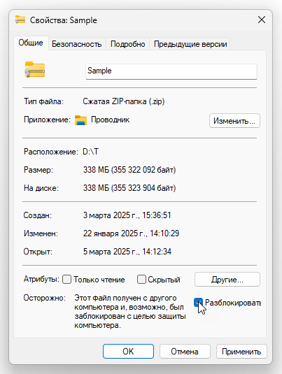

# Często zadawane pytania (FAQ)

## Jak korzystać z kompilacji dodatku Dynamo

### Kompilacje codzienne a kompilacje stabilne
Tradycją jest, że zespół dodatku Dynamo w firmie Autodesk utrzymuje szybkie tempo iteracji, wydając zarówno kompilacje codzienne przez zatwierdzanie (commit), jak i kompilacje stabilne po testowaniu systemowym i cyklu wersji. Nasz zespół chciałby ponownie przystąpić do publikowania kompilacji codziennych i stabilnych, aby użytkownicy mogli sterować tym, gdzie dodatek DynamoCore jest lokalnie wyodrębniany na dysku, i komfortowo z niego korzystać, bez wpływu na dodatek Dynamo dla innych produktów ADSK. Istnieje kilka naturalnych formatów do tego celu, w tym plik .nupkg, plik .zip lub dedykowany instalator, który pozwala użytkownikom wybrać ścieżkę instalacji lub inne opcje. 

W związku z tym, że naszym celem jest udostępnienie użytkownikom najnowszego kodu w jak najprostszy sposób, zdecydowaliśmy się dostarczyć plik .zip zawierający pliki binarne dodatku DynamoCore i środowiska Dynamo Sandbox, którego można używać bez programu Revit (z pewnymi ograniczeniami).

### Kompilacje w pliku zip dodatku Dynamo
#### Definicja i źródło
Kompilacja w pliku zip DynamoCoreRuntime to migawka plików binarnych dodatku DynamoCore, która jest tworzona podczas zautomatyzowanych kompilacji. 

Powinno być możliwe uruchomienie programu DynamoSandbox.exe w wyodrębnionym folderze, aby używać dodatku Dynamo z konfiguracją minimalną.

#### Wymagane komponenty

| Wersja dodatku Dynamo  |Microsoft Visual C++  | DirectX  |   |   |   |   |
|---|---|---|---|---|---|---|
|  2.0–2.6 |  2015 Redistributable  | 10  |   |   |   |   |
| 2,7  | 2019 Redistributable  | 11/12 (dołączony do systemu Windows 10  |   |   |   |   |
| >=2.8  | 2019 Redistributable  | 11/12 (dołączony do systemu Windows 10  |   |   |   |   |
##### Program Microsoft DirectX, który jest również publicznie dostępny w repozytorium dodatku Dynamo w serwisie GitHub [tutaj](https://github.com/DynamoDS/Dynamo/tree/master/tools/install/Extra/DirectX)

##### Program 7zip służący do rozpakowywania pakietu [tutaj](https://www.7-zip.org/download.html)

##### Microsoft Visual C++ 2015–2024 Redistributable (x64) — [łącze](https://aka.ms/vs/17/release/vc_redist.x64.exe)

##### Komponenty opcjonalne
Biblioteka geometrii (będzie dostępna tylko z określonymi narzędziami do modelowania firmy Autodesk, takimi jak Revit, Civil 3D, Advanced Steel itp.)

### Rozwiązywanie problemów
Jeśli po rozpakowaniu kompilacji w ogóle nie możesz uruchomić programu DynamoSandbox.exe, koniecznie rozpakuj kompilację za pomocą programu [7zip](https://www.7-zip.org/download.html). Możesz również ręcznie odblokować archiwum .zip *przed* wyodrębnieniem jego zawartości — jeśli masz uprawnienia na używanym komputerze.

W przypadku braku któregokolwiek z wymaganych komponentów mogą wystąpić problemy podczas korzystania z dodatku Dynamo, a niektóre części interfejsu użytkownika mogą nie zostać wczytane.

Przyjrzyjmy się poniższemu zrzutowi ekranu z przykładem: po rozpakowaniu pliku zip z kompilacją na czystej maszynie wirtualnej z systemem Windows 10 bez procesora graficznego (GPU) na maszynie brakuje obu wymaganych komponentów. Jest to wskazane w konsoli dodatku Dynamo.

##### Instalowanie programu DirectX
Postępuj zgodnie z instrukcjami firmy Microsoft, aby sprawdzić, czy masz już zainstalowany program DirectX. Jeśli nie, możesz otworzyć program DXSETUP.exe z naszego repozytorium dodatku Dynamo w serwisie Github [tutaj](https://github.com/DynamoDS/Dynamo/tree/master/tools/install/Extra/DirectX). Gdy zobaczysz poniższe okno dialogowe, możesz kliknąć przycisk Dalej, aby zainstalować program DirectX w lokalizacji domyślnej.

##### Instalowanie komponentu Microsoft Visual C++ 2015–2024 Redistributable (x64)
Pobierz najnowszą wersję [stąd](https://aka.ms/vs/17/release/vc_redist.x64.exe). Następnie powinno być możliwe uruchomienie instalatora o nazwie vc_redist.x64.exe w lokalizacji pobierania przeglądarki. Po wyświetleniu poniższego okna dialogowego możesz kliknąć przycisk Zainstaluj, aby umieścić ten komponent w lokalizacji domyślnej.

Po zainstalowaniu obu wymaganych komponentów pobranych za pomocą powyższego łącza ponownie uruchom program DynamoSandbox.exe. Powinien być widoczny następujący wynik:

##### Brak grafiki 3D. 

W razie problemów z grafiką podczas uruchamiania środowiska Sandbox po raz pierwszy możesz śledzić standardowe problemy z grafiką w często zadawanych pytaniach tutaj:

[https://github.com/DynamoDS/Dynamo/wiki/Dynamo-FAQ](https://github.com/DynamoDS/Dynamo/wiki/Dynamo-FAQ)

Ogólnie rzecz biorąc, podczas korzystania ze środowiska DynamoSandbox.exe prawdopodobnie konieczne będzie wymuszenie trybu wysokiej wydajności procesora graficznego (GPU) dla karty graficznej

_przykładowy panel sterowania nvidia:_

##### Instalowanie środowiska uruchomieniowego WebView2
Obecnie kolejne moduły dodatku Dynamo korzystają z komponentu WebView2: przeglądarka dokumentacji, przewodniki i biblioteka. W związku z tym, aby zapewnić, że te części dodatku Dynamo będą poprawnie wyświetlać zawartość internetową, należy zainstalować instalator środowiska uruchomieniowego WebView2 Evergreen (należy sprawdzić, czy nie jest już zainstalowany na komputerze lub czy nie trzeba go zainstalować).

To jest łącze służące do instalacji środowiska uruchomieniowego WebView2: [https://developer.microsoft.com/pl-pl/microsoft-edge/webview2/#download-section](https://developer.microsoft.com/en-us/microsoft-edge/webview2/#download-section)

Komponenty, które powinny być zainstalowane (tylko jeden z nich) to Evergreen Bootstrapper lub Evergreen Standalone Installer — pierwszy pobiera instalator o rozmiarze 1,50 MB, a drugi pobiera instalator o rozmiarze 130 MB.

Po zainstalowaniu środowiska uruchomieniowego kolejne komponenty dodatku Dynamo powinny działać poprawnie:

##### Problemy dotyczące węzłów programu Excel dodatku Dynamo
W tym [artykule](https://knowledge.autodesk.com/support/revit-products/troubleshooting/caas/sfdcarticles/sfdcarticles/Warning-Data-ImportExcel-operation-failed-Could-not-load-file-or-assembly-Microsoft-Office-Interop-Excel-when-running-the-Dynamo-script-in-Revit.html) możesz zapoznać się z diagnostyką.

### Lokalizacja kompilacji dodatku Dynamo
Wersje stabilne

[https://dynamobim.org/download/](https://dynamobim.org/download/)

[https://github.com/DynamoDS/Dynamo/releases](https://github.com/DynamoDS/Dynamo/releases)

Kompilacje codzienne i wersje stabilne

[https://dynamobuilds.com/](https://dynamobuilds.com/)

