# Additional Prompts

The table below outlines some prompts that were used when testing and developing Autodesk Assistant. They should hopefully provide some guidance when deciding what to generate with Autodesk Assistant. 

| **Prompt**   | **Results**     | **Comments**       |   
| -------------- | -------------------------------|----------------------- | 
|Generate the Fibonacci series in Dynamo nodes |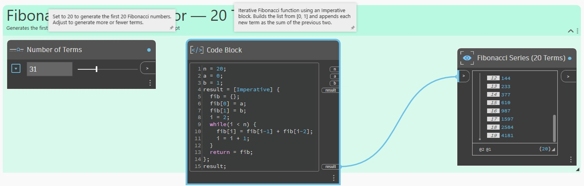| requires a hard-coded value to set the number of items |
|Compute 100 random numbers using a seed input and Dynamo nodes |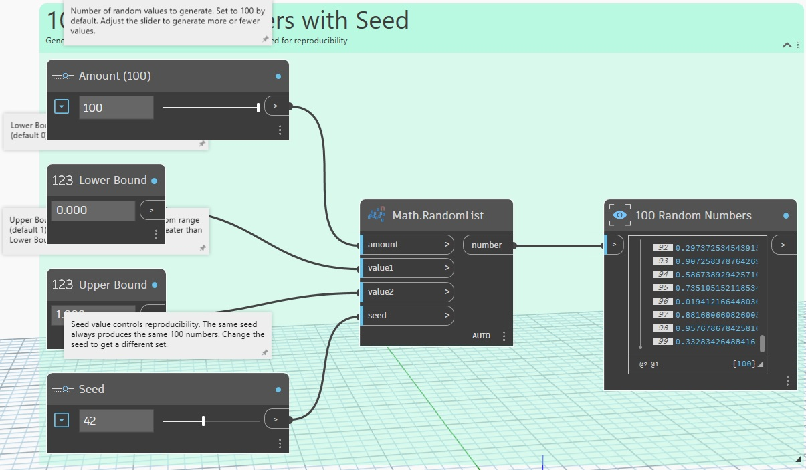| numbers require a range | 
|Create a Koch curve using a Dynamo Python node |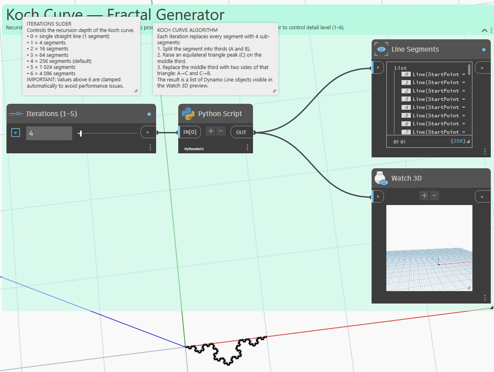| |
|Use a Python node with math to compute sine of 100 evenly spaced angles |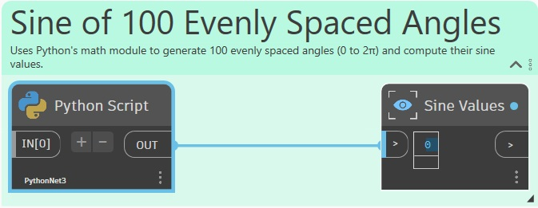|  |
|Use a Python node to return the sum of input list elements |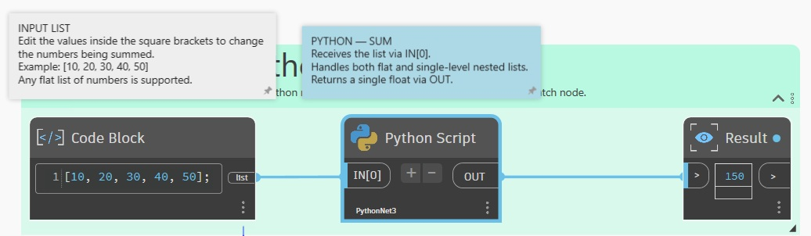|  |
|Compute the first 100 prime numbers using an algorithm with a Python node |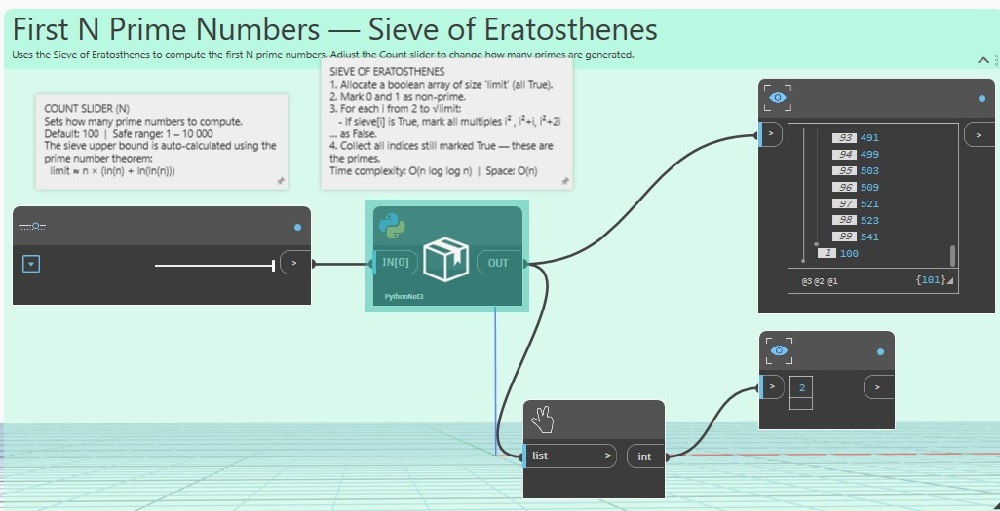|  |
|Create a solid from the union of a sphere and a cuboid that overlap |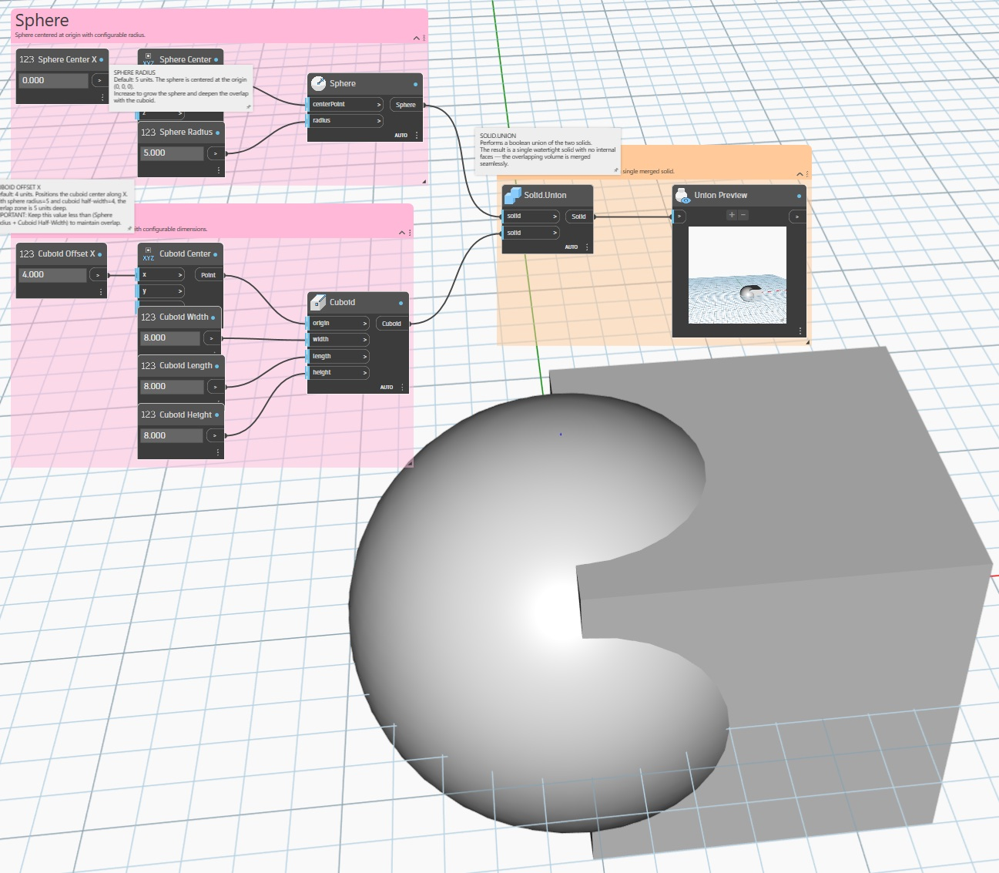|  |
|Subtract a cylinder from a cuboid centered at the origin |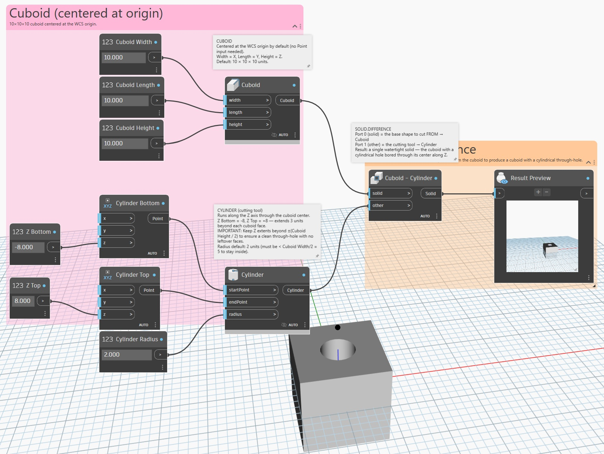|  |
|Place a sphere at every vertex of a 10×10 point grid lying on the XY plane|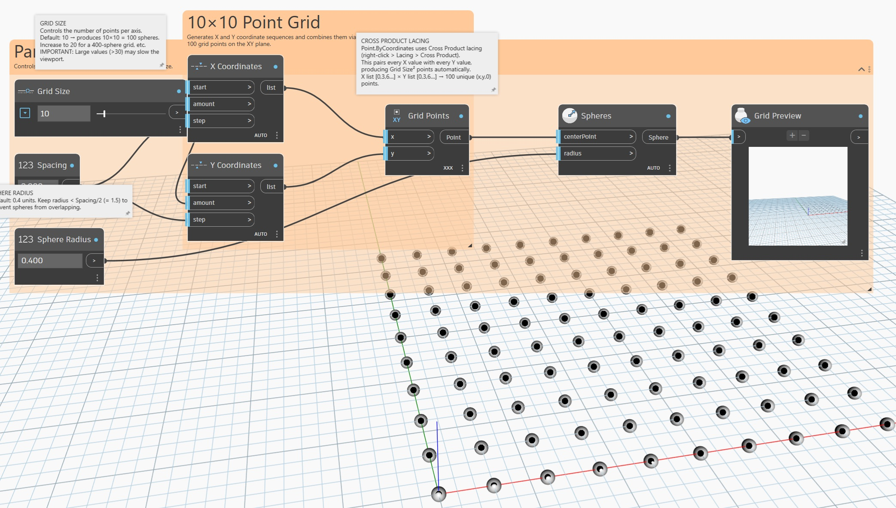|  |
|Create a Menorah using Dynamo nodes|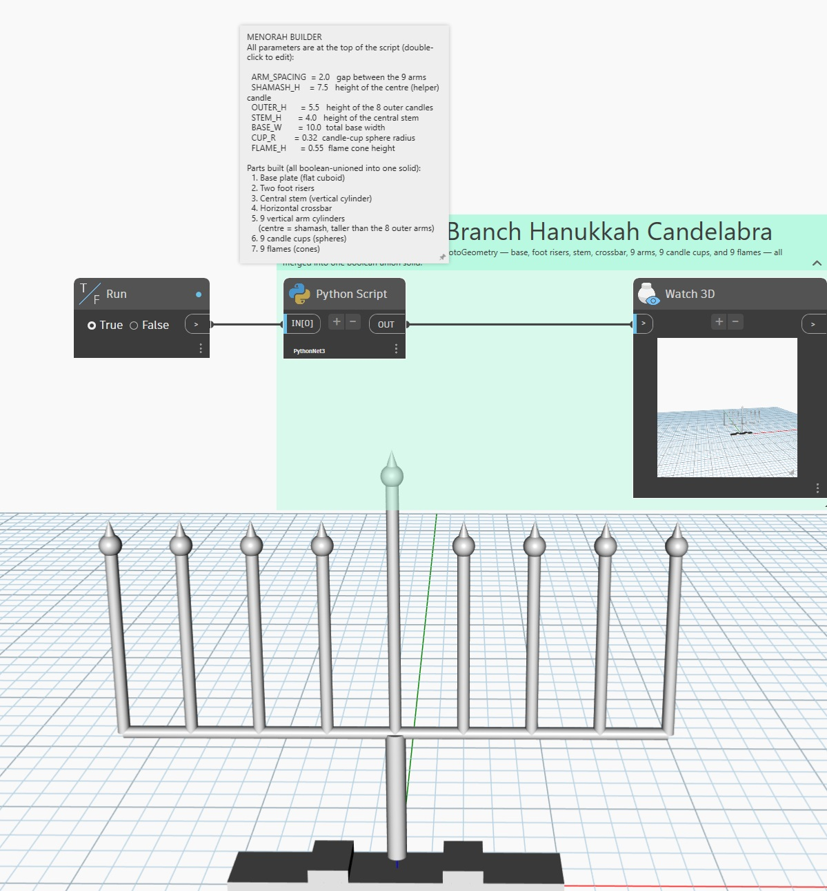|  |
|Using Dynamo nodes construct the Eiffel tower|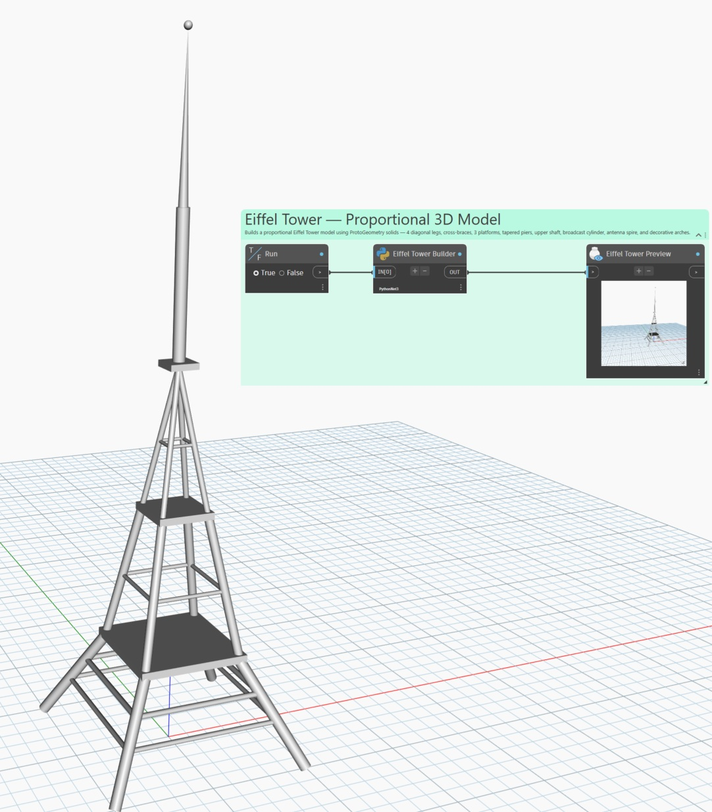|  |
|Pair every point in list A with every point in list B and draw a line between them" (cross-product lacing)||  |
|Take a 5×5 grid of points, transpose it, and shift every other row by 2 units in X.|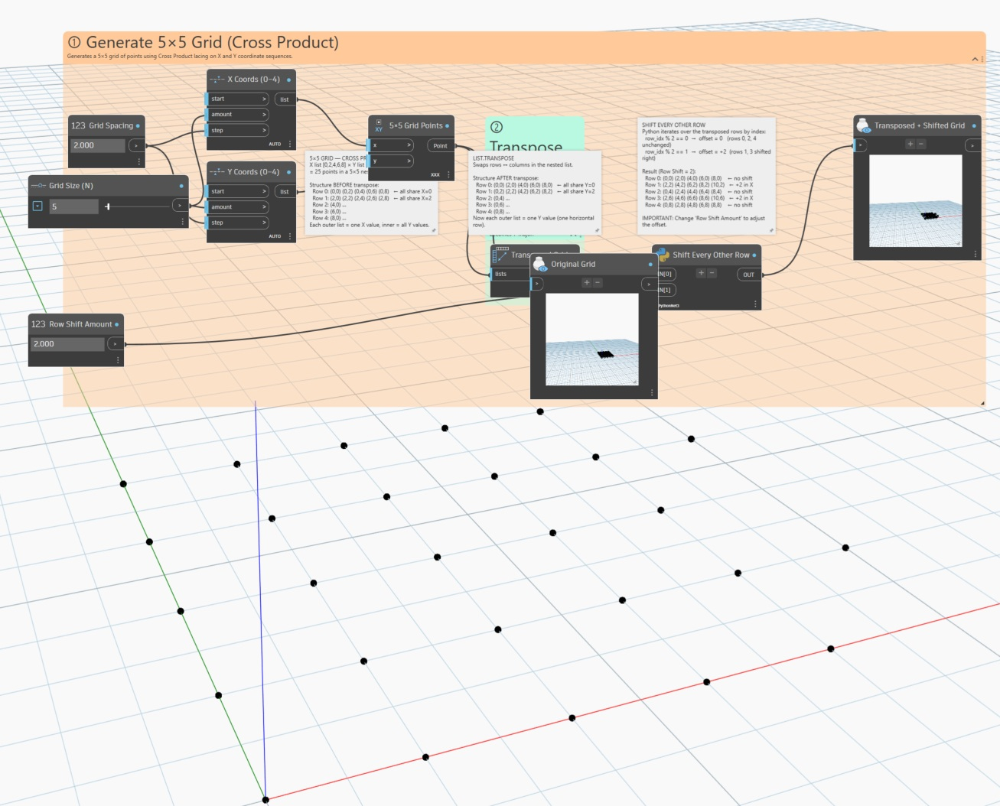|  |

