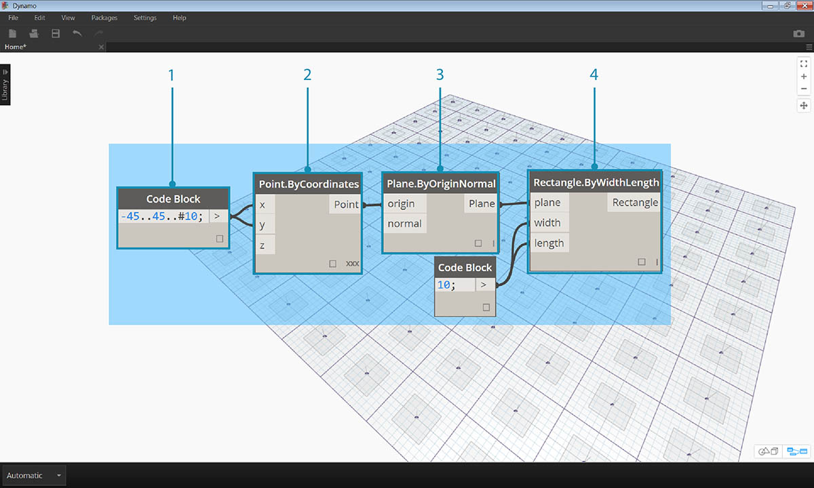
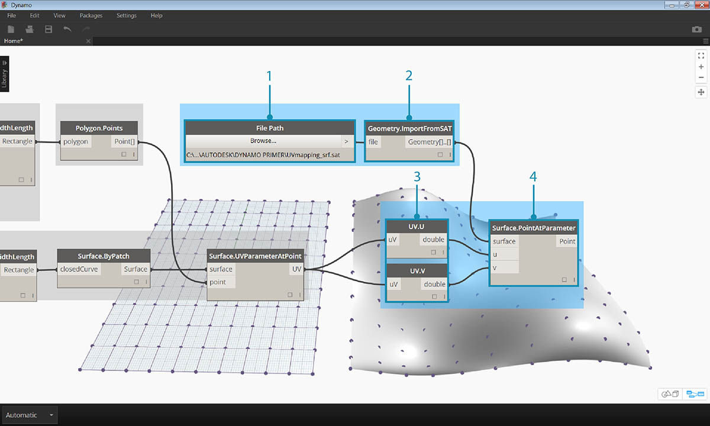
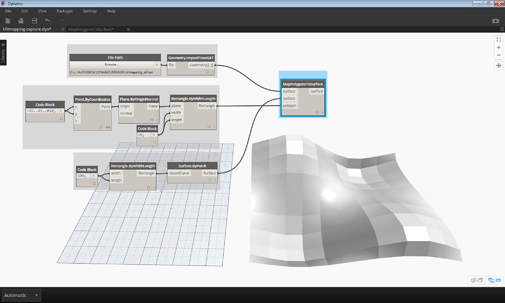

# Creating a Custom Node

Dynamo offers several different methods for creating custom nodes. You can build custom nodes from scratch, from an existing graph, or explicitly in C#. In this section we will cover building a custom node in the Dynamo UI from an existing graph. This method is ideal for cleaning up the workspace, as well as packaging a sequence of nodes to reuse elsewhere.

\###Custom Nodes for UV Mapping In the image below, we map a point from one surface to another using UV coordinates. We'll use this concept to create a panelized surface which references curves in the XY plane. We'll create quad panels for our panelization here, but using the same logic, we can create a wide variety of panels with UV mapping. This is a great opportunity for custom node development because we will be able to repeat a similar process more easily in this graph or in other Dynamo workflows.

## Creating a Custom Node from an Existing Graph

> Download and unzip the example files for this exercise (Right click and choose "Save Link As..."). A full list of example files can be found in the Appendix. [UV-CustomNode.zip](https://github.com/h-iL/ForkedDynamoPrimerReorganized/blob/main/10\_Custom-Nodes/datasets/10-2/UV-CustomNode.zip)

Let’s start by creating a graph that we want to nest into a custom node. In this example, we will create a graph that maps polygons from a base surface to a target surface, using UV coordinates. This UV mapping process is something we use frequently, making it a good candidate for a custom node. For more information on surfaces and UV space, see section 5.5. The complete graph is _UVmapping\_Custom-Node.dyn_ from the .zip file downloaded above.

> 1. **Code Block:** Create a range of 10 numbers between 45 and negative 45 using a code block.

1. **Point.ByCoordinates:** Connect the output of the Code Block to the ‘x’ and ‘y’ inputs and set the lacing to cross-reference. You should now have a grid of points.
2. **Plane.ByOriginNormal:** Connect the _‘Point’_ output to the _‘origin’_ input to create a plane at each of the points. The default normal vector of (0,0,1) will be used.
3. **Rectangle.ByWidthLength:** Connect the planes from the previous step into the _‘plane’_ input, and use a Code Block with a value of _10_ to specify the width and length.

You should now see a grid of rectangles. Let’s map these rectangles to a target surface using UV coordinates.

> 1. **Polygon.Points:** Connect the Rectangle output from the previous step to the _‘polygon’_ input to extract the corner points of each rectangle. These are the points that we will map to the target surface.

1. **Rectangle.ByWidthLength:** Use a Code Block with a value of _100_ to specify the width and length of a rectangle. This will be the boundary of our base surface.
2. **Surface.ByPatch:** Connect the Rectangle from the previous step to the _‘closedCurve’_ input to create a base surface.
3. **Surface.UVParameterAtPoint:** Connect the _‘Point’_ output of the _Polygon.Points_ node and the _‘Surface’_ output of the _Surface.ByPatch_ node to return the UV parameter at each point.

Now that we have a base surface and a set of UV coordinates, we can import a target surface and map the points between surfaces.

> 1. **File Path:** Select the file path of the surface you want to import. The file type should be .SAT. Click the _"Browse..."_ button and navigate to the _UVmapping\_srf.sat_ file from the .zip file downloaded above.

1. **Geometry.ImportFromSAT:** Connect the file path to import the surface. You should see the imported surface in the geometry preview.
2. **UV:** Connect the UV parameter output to a _UV.U_ and a _UV.V_ node.
3. **Surface.PointAtParameter:** Connect the imported surface as well as the u and v coordinates. You should now see a grid of 3D points on the target surface.

The final step is to use the 3D points to construct rectangular surface patches.

> 1. **PolyCurve.ByPoints:** Connect the points on the surface to construct a polycurve through the points.

1. **Boolean:** Add a Boolean to the workspace and connect it to the _‘connectLastToFirst’_ input and toggle to True to close the polycurves. You should now see rectangles mapped to the surface.
2. **Surface.ByPatch:** Connect the polycurves to the _‘closedCurve’_ input to construct surface patches.

Now let’s select the nodes that we want to nest into a Custom Node, thinking about what we want to be the inputs and outputs of our node. We want our Custom Node to be as flexible as possible, so it should be able to map any polygons, not just rectangles.

> Select the above nodes (beginning with _Polygon.Points_), right click on the workspace and select _‘node from selection’_.

> In the Custom Node Properties dialog, assign a name, description, and category to the Custom Node.

> The Custom Node has considerably cleaned up the workspace. Notice that the inputs and outputs have been named based on the original nodes. Let’s edit the Custom Node to make the names more descriptive.

> Double click the Custom Node to edit it. This will open a workspace with a yellow background representing the inside of the node.

1. **Inputs:** Change the input names to _baseSurface_ and _targetSurface_.
2. **Outputs:** Add an additional output for the mapped polygons.

> Save the custom node and return to the home workspace.

> The **MapPolygonsToSurface** node reflects the changes we just made.

We can also add to the robustness of the Custom Node by adding in **Custom Comments**. Comments can help to hint at the input and output types or explain the functionality of the node. Comments will appear when the user hovers over an input or output of a Custom Node.

> Double click the Custom Node to edit it. This will re-open the yellow background workspace.

1. Begin editing the Input Code Block. To start a Comment, type "//" followed by the comment text. Type anything that may help to clarify the Node - Here we will describe the _targetSurface_.
2. Let's also set the default value for the _inputSurface_ by setting the input type equal to a value. Here, we will set the default value to the original Surface.ByPatch set.

> Comments can also be applied to the Outputs. Begin editing the text in the Output Code Block. To start a Comment, type "//" followed by the comment text. Here we will clarify the _Polygons_ and the _surfacePatches_ Outputs by adding a more in-depth description.

>

1. Hover over the Custom Node Inputs to see the Comments.
2. With the default value set on our _inputSurface_, we can also run the definition without a surface input.
