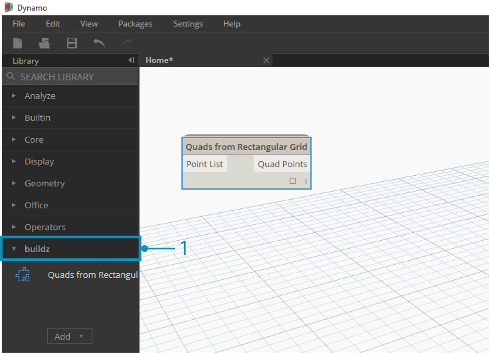
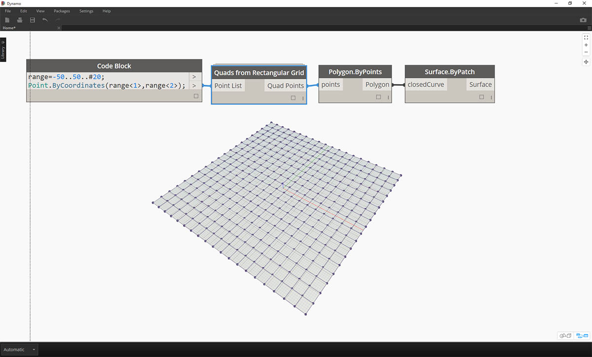
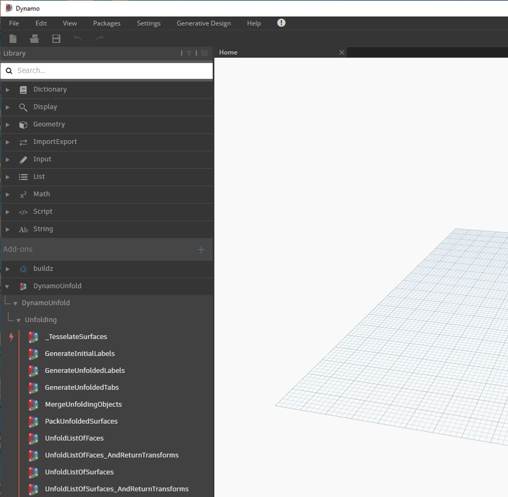
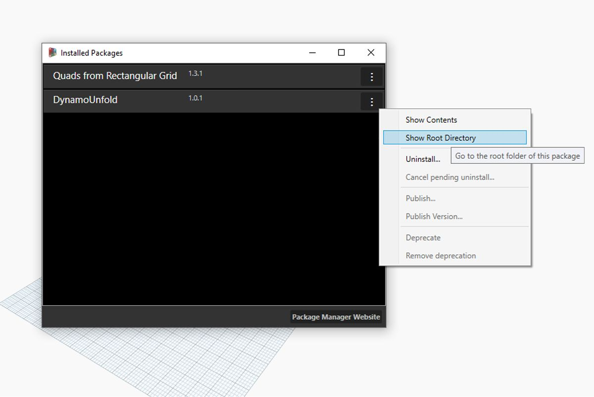
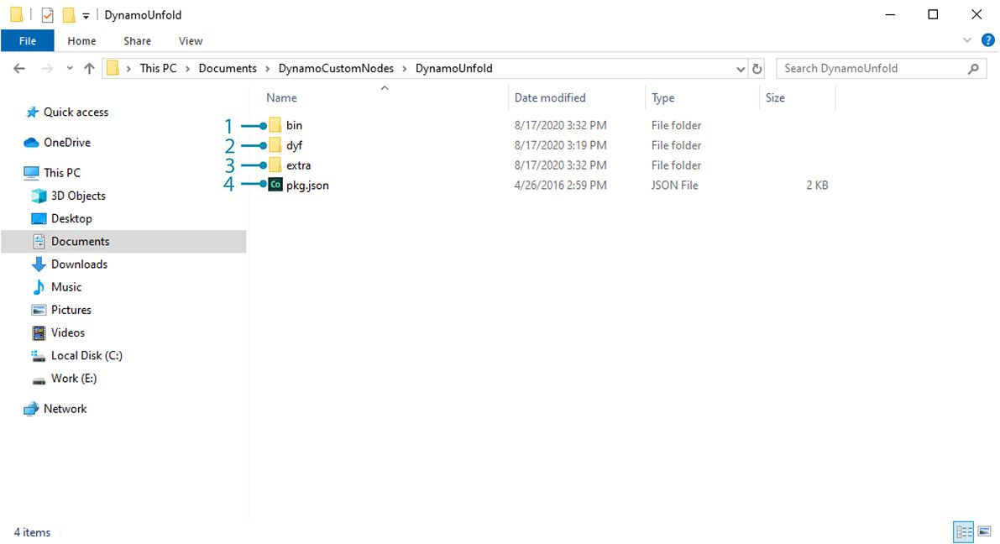
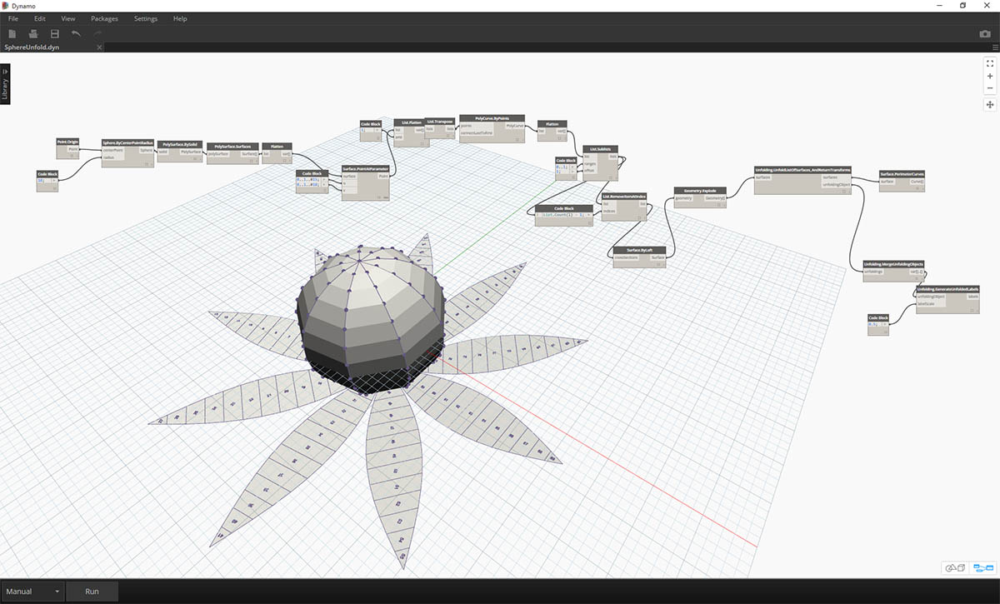

# Package Introduction

\##Packages In short, a Package is a collection of Custom Nodes. The Dynamo Package Manager is a portal for the community to download any package which has been published online. These toolsets are developed by third parties in order to extend Dynamo's core functionality, accessible to all, and ready to download at the click of the button.

An open-source project such as Dynamo thrives on this type of community involvement. With dedicated third party developers, Dynamo is able to extend its reach to workflows across a range of industries. For this reason, the Dynamo team has made concerted efforts to streamline package development and publishing (which will be discussed in more detail in the following sections).

\###Installing a Package The easiest way to install a package is by using the Packages toolbar in your Dynamo interface. Let's jump right into it and install one now. In this quick example, we'll install a popular package for creating quad panels on a grid. !\[]\(images/11-1/AddingToLibrary- 01.jpg)

> 1. In Dynamo, go to _Packages>Search For a Package..._

!\[]\(images/11-1/AddingToLibrary- 00.jpg)

> In the search bar, let's search for "quads from rectangular grid". After a few moments, you should see all of the packages which match this search query. We want to select the first package with the matching name.

1. Click on the download arrow to the left of the package name and the package will install. Done!

> 1. Notice that we now have another group in our Dynamo library called _"buildz"_. This name refers to the [developer](http://buildz.blogspot.com) of the package, and the custom node is placed in this group. We can begin to use this right away.

> With a quick code block operation to define a rectangular grid, we've create a list of rectangular panels.

\###Package Folders The example above focuses on a package with one custom node, but you use the same process for downloading packages with several custom nodes and supporting data files. Let's demonstrate that now with a more comprehensive package: Dynamo Unfold.

.jpg>)

> As in the example above, begin by selecting _Packages>Search for a Package..._. This time, we'll search for _"DynamoUnfold"_, one word, minding the caps. When we see the packages, download by clicking the arrow to the left of the package name. Dynamo Unfold will now be installed in your Dynamo Library.

> In the Dynamo Library, we have a _DynamoUnfold_ Group with multiple categories and custom nodes.

> Now, let's take a look at the package's file structure. Select _"Packages>Manage Packages..."_ in Dynamo. We'll see the window above with the two libraries we've installed. Click the button on the right of _DynamoUnfold_ and select _"Show Root Directory"._

> This will take us to the package's root directory. Notice that we have 3 folders and a file.

1. The _bin_ folder houses .dll files. This Dynamo package was developed using Zero-Touch, so the custom nodes are held in this folder.
2. The _dyf_ folder houses the custom nodes. This package was not developed using Dynamo custom nodes, so this folder is empty for this package.
3. The extra folder houses all additional files, including our example files.
4. The pkg file is a basic text file defining the package settings. We can ignore this for now.

> Opening the _"extra"_ folder, we see a bunch of example files that were downloaded with the install. Not all packages have example files, but this is where you can find them if they are part of a package. Let's open up _"SphereUnfold"_.

> After opening the file and hitting _"Run"_ on the solver, we have an unfolded sphere! Example files like these are helpful for learning how to work with a new Dynamo package.

\###Dynamo Package Manager Another way to discover Dynamo packages is to explore the [Dynamo Package Manager](http://dynamopackages.com) online. This is a good way to browse for packages, since the repository sorts packages in order of download count and popularity. Also, it's an easy way to gather information on recent updates for packages, as some Dynamo packages are subjected to versioning and dependencies of Dynamo builds.

> By clicking on _"Quads from Rectangular Grid"_ in the Dynamo Package Manager, you can see its descriptions, versions, the developer, and possible dependencies.

You can also download the package files from the Dynamo Package Manager, but doing so directly from Dynamo is a more seamless process.

\###Where are Files Stored Locally? If you do download files from the Dynamo package manager, or if you would like to see where all of your package files are kept, click on _Settings>Manage Node and Package Paths..._. By clicking on the ellipsis next to the folder directory, you can copy the root folder and delve into the package in your explorer window. By default, packages are installed in a location similar to this folder path: _C:/Users/\[username]/AppData/Roaming/Dynamo/\[Dynamo Version]_.

\###Going Further with Packages The Dynamo community is constantly growing and evolving. By exploring the Dynamo Package Manager from time to time, you'll find some exciting new developments. In the following sections, we'll take a more in-depth look at packages, from the end-user perspective to authorship of your own Dynamo Package.
