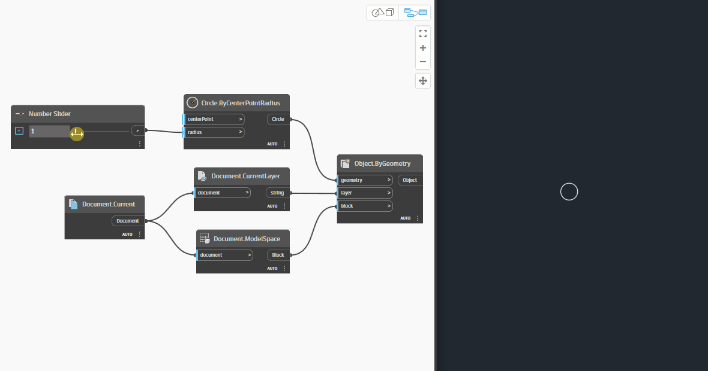
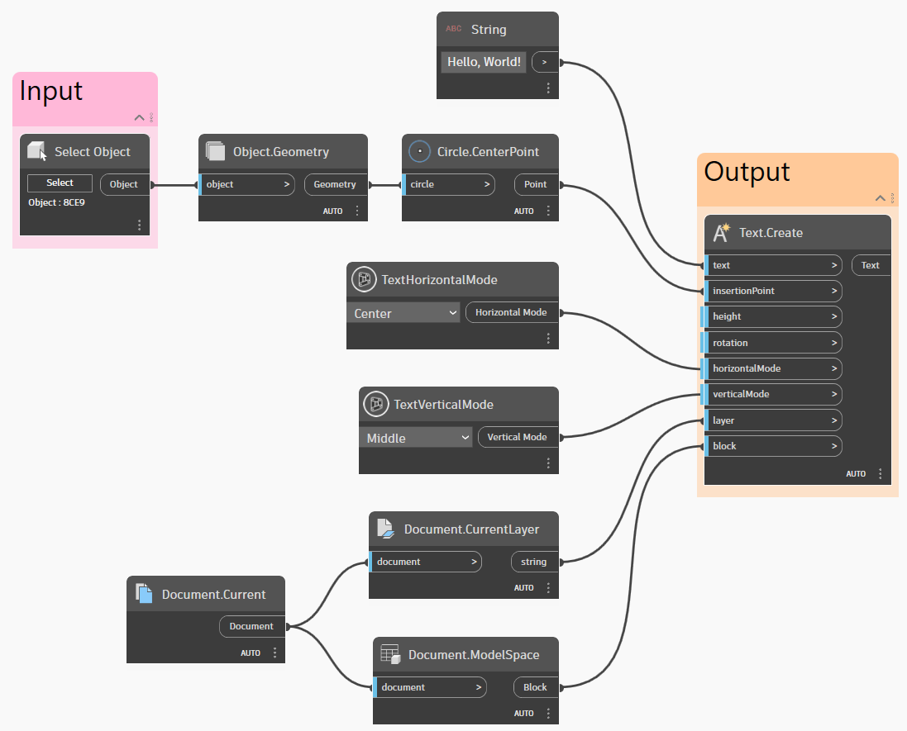
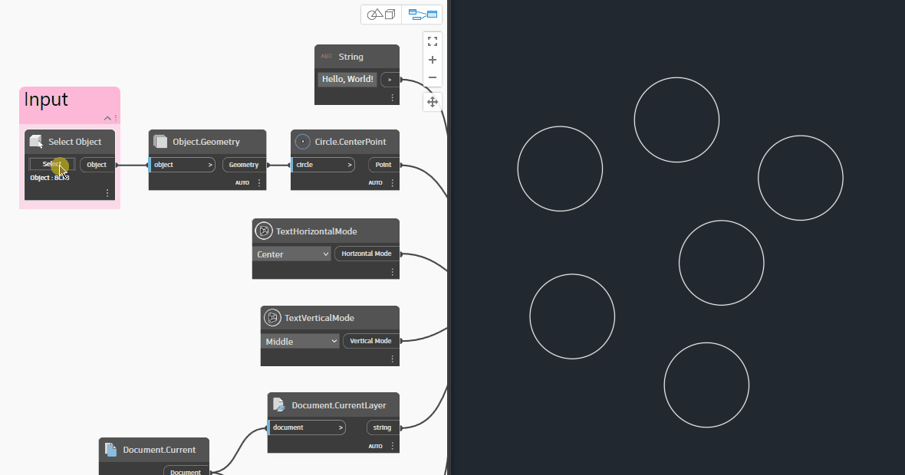
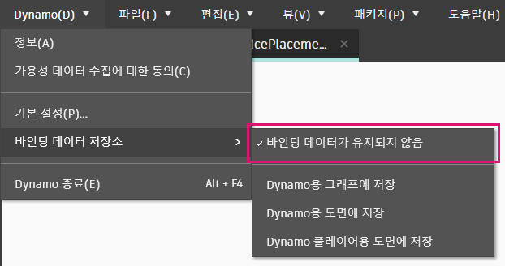
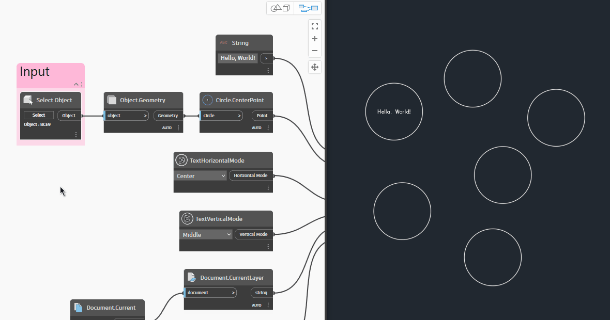

# Привязка объекта

Dynamo for Civil 3D содержит эффективный механизм «запоминания» объектов, создаваемых каждым узлом. Этот механизм называется **привязкой объекта**, и он позволяет получать последовательные результаты при каждом запуске графика Dynamo в определенном документе. Во многих случаях подобное поведение программы является желательным, однако в определенных ситуациях пользователям требуется возможность управлять аспектами работы Dynamo более детально. В этом разделе описывается, как работает функция привязки объектов и как ее можно использовать.

## Пример

Рассмотрим данный график, который позволяет создать окружность в пространстве модели на текущем слое.

<figure><figcaption>
Простой график для создания окружности
</figcaption></figure>

Посмотрим, что произойдет при изменении радиуса.

<figure><figcaption>
Изменение входного значения радиуса в Dynamo
</figcaption></figure>

Это функция привязки объекта в действии. По умолчанию программа Dynamo _изменяет_ радиус существующей окружности, а не создает новую окружность при каждом новом входном значении радиуса. Это происходит потому, что при каждом запуске графика узел **Object.ByGeometry** «вспоминает», что он создал эту _конкретную_ окружность. Кроме того, эта информация сохраняется в Dynamo, чтобы в следующий раз при открытии документа Civil 3D и запуске графика поведение программы было аналогичным.

## Другой пример

Рассмотрим пример, в котором требуется изменить стандартное поведение функции привязки объекта в Dynamo. Предположим, требуется создать график, позволяющий разместить текст внутри окружности. При этом предполагается, что график будет запускаться многократно, и при каждом его запуске новый текст должен вставляться в конкретную выбранную окружность. Вот как может выглядеть этот график.

<figure><figcaption>
Простой график, позволяющий разместить текст в центре выбранной окружности
</figcaption></figure>

Однако вот что происходит при выборе разных окружностей.

<figure><figcaption>
Поведение Dynamo по умолчанию при выборе новой окружности
</figcaption></figure>

Может показаться, что при каждом запуске графика текст удаляется и создается заново. На самом деле программа _изменяет_ положение текста в зависимости от того, какая окружность выбрана. Это тот же самый текст, который просто помещен в другое место. Чтобы текст создавался заново каждый раз при запуске графика, необходимо изменить параметры привязки объекта Dynamo так, чтобы данные привязки не сохранялись в программе (см. раздел [\#binding-settings](object-binding.md#binding-settings "mention") ниже).

<figure><figcaption>
Параметры привязки объекта
</figcaption></figure>

Изменив данный параметр, мы получаем нужное поведение.

<figure><figcaption>
Поведение при отключенной привязке объекта
</figcaption></figure>

## Параметры привязки

Dynamo for Civil 3D позволяет изменить поведение привязки объектов по умолчанию с помощью параметров **Binding Data Storage** (Хранение данных привязки) в меню **Dynamo**.

 Обратите внимание, что параметры хранения данных привязки доступны в **Civil 3D 2022.1** и более поздних версиях. 

<figure><figcaption></figcaption></figure>

По умолчанию все параметры включены. Ниже приведен обзор каждого параметра.

### Параметр 1\. No Binding Data Retained (Данные привязки не сохраняются)

Если этот параметр включен, Dynamo будет «забывать» объекты, созданные при последнем запуске того или иного графика. Этот график можно запускать в любом чертеже и в любых условиях, и каждый раз при его запуске будут создаваться новые объекты.

 **Рекомендации по использованию**

Используйте этот параметр, если требуется, чтобы программа Dynamo «забывала» сделанное при предшествующих запусках графика и каждый раз создавала новые объекты. 

### Параметр 2\. Store in Graph for Dynamo (Сохранять в графике для Dynamo)

Если этот параметр выбран, метаданные привязки объекта будут проиндексированы в графике (файл DYN) при его сохранении. Если закрыть и заново открыть график, а затем запустить его в **том же чертеже**, он должен работать точно таким же образом, что и до закрытия. При запуске этого же графика в **другом чертеже** данные привязки будут из него удалены, и в чертеже будут созданы новые объекты. Это означает, что при открытии исходного чертежа и повторном запуске в нем графика в дополнение к старым объектам будут созданы новые.

 **Рекомендации по использованию**

Используйте этот параметр, если требуется, чтобы программа Dynamo «запоминала» объекты, созданные при последнем запуске графика в **конкретном чертеже**. 

 Этот параметр оптимален для ситуаций, когда определенный график Dynamo используется только в **конкретном чертеже** и больше нигде. Параметры 1 и 3 больше подходят для графиков, предназначенных для использования в нескольких чертежах. 

### Параметр 3\. Store in Drawing For Dynamo (Сохранить в чертеже для Dynamo)

Этот параметр похож на параметр 2, однако при его выборе данные привязки объекта индексируются не в графике (файл DYN), а в чертеже. Если закрыть и заново открыть график, а затем запустить его в **том же чертеже**, он должен работать точно таким же образом, что и до закрытия. Если запустить этот график в **другом чертеже**, данные привязки будут по-прежнему доступны в исходном чертеже, поскольку они сохраняются в нем, а не в графике.

 **Рекомендации по использованию**

Используйте этот параметр, если требуется, чтобы программа Dynamo «запоминала» все полученные результаты при запуске определенного графика в **нескольких чертежах**. 

### Параметр 4\. Store in Drawing For Dynamo Player (Сохранить в чертеже для проигрывателя Dynamo)

Первое, что следует учесть при выборе этого параметра, — это то, он не влияет на взаимодействие графика с чертежом при запуске графика через основной интерфейс Dynamo. Этот параметр применяется _только_ при запуске графика с помощью проигрывателя Dynamo.

 Если вы еще не знакомы с проигрывателем Dynamo, см. раздел [dynamo-player.md](../dynamo-player.md "mention"). 

Если запустить график в основном интерфейсе Dynamo, а затем закрыть и запустить его снова, но уже в проигрывателе Dynamo, то в дополнение к созданным изначально объектам будут созданы новые. Однако после того, как график будет выполнен в проигрывателе Dynamo, данные привязки объектов будут индексированы в чертеже. Таким образом, если запустить один и тот же график несколько раз в проигрывателе Dynamo, то вместо создания новых объектов будут обновляться уже существующие. Если запустить этот же график через проигрыватель Dynamo в **другом чертеже**, данные привязки будут по-прежнему доступны в исходном чертеже, поскольку они сохраняются в нем, а не в графике.

 **Рекомендации по использованию**

Используйте этот параметр, если требуется, чтобы проигрыватель Dynamo «запоминал» все полученные результаты при запуске определенного графика в нескольких чертежах. 
