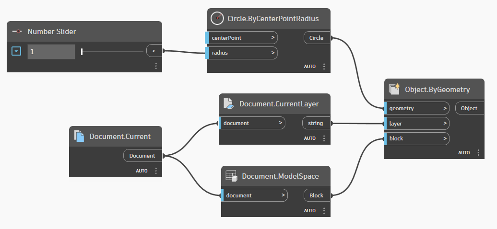

# 对象绑定

Dynamo for Civil 3D 包含一个非常强大的机制，用于“记住”每个节点创建的对象。此机制称为 **“对象绑定”**，它使 Dynamo 图形能够每次在同一文档中运行时生成一致的结果。尽管这一机制在许多情况下都是非常需要的，但在其他情况下，您可能希望更好地控制 Dynamo 的行为。本部分将帮助您了解对象绑定的工作方式以及如何利用它。

## 示例

请考虑此图形，该图形会在模型空间中的当前图层上创建一个圆。

<figure><figcaption>
一个用于创建圆的简单图形
</figcaption></figure>

注意半径发生更改时会出现什么情况。

<figure><figcaption>
在 Dynamo 中修改半径输入
</figcaption></figure>

这是正在进行对象绑定。Dynamo 的默认行为是 _修改_ 圆的半径，而不是每次半径输入发生更改时都创建一个新圆。这是因为 **Object.ByGeometry** 节点“记住”：每次运行图形时，它都创建此 _特定_ 圆。此外，Dynamo 会存储此信息，以便下次打开 Civil 3D 文档并运行图形时，它将具有完全相同的行为。

## 另一个示例

让我们看一个示例，在其中您可能希望更改 Dynamo 的默认对象绑定行为。假定您要构建一个将文字放置在圆中间的图形。但您使用此图形的目的是，该图形可以反复不断地运行，并每次为选定的任何圆都放置新文字。该图形可能如下所示。

<figure><figcaption>
一个将文字放置在选定圆的圆心的简单图形
</figcaption></figure>

但是，当选择其他圆时，实际上会发生这种情况。

<figure><figcaption>
选择一个新圆时 Dynamo 的默认行为
</figcaption></figure>

似乎每次运行图形时都会删除并重新创建文字。实际上，文字的位置会根据选择的圆进行 _修改_。如此一来，就是文字相同，位置却不同！为了每次都创建新文字，我们需要修改 Dynamo 的对象绑定设置，以便不保留绑定数据（请参见下文的[\#绑定设置](object-binding.md#binding-settings "mention")）。

<figure><figcaption>
对象绑定设置
</figcaption></figure>

进行更改后，我们会获得所需的行为。

<figure><figcaption>
对象绑定禁用时的行为
</figcaption></figure>

## 绑定设置

Dynamo for Civil 3D 允许通过 **“Dynamo”** 菜单中的 **“绑定数据存储”** 设置来修改默认对象绑定行为。


请注意，“绑定数据存储”选项在 **Civil 3D 2022.1** 及更高版本中可用。


<figure><figcaption></figcaption></figure>

默认情况下，所有选项都处于启用状态。以下是每个选项的作用摘要。

### 选项 1：不保留绑定数据

启用此选项后，Dynamo 将“忘记”上次运行图形时创建的对象。因此，图形可以在任何情况下在任何图形中运行，每次都会创建新对象。


**何时使用**

如果希望 Dynamo“忘记”以前运行时所执行的所有操作并每次都创建新对象，请使用此选项。


### 选项 2：存储在 Dynamo 的图形中

此选项意味着对象绑定元数据会在保存时序列化到图形（.dyn 文件）中。如果关闭/重新打开图形并在**同一图形**中运行该图形，则所有操作都应与离开时相同。如果在**其他图形**中运行图形，则绑定数据会从该图形中删除，并创建新对象。这意味着，如果打开原始图形并再次运行图形，则除了旧对象外，还会创建新对象。


**何时使用**

如果希望 Dynamo“记住”上次它在**特定图形**中运行时创建的对象，请使用此选项。



此选项最适合在 **特定图形** 和 Dynamo 图形之间保持 1:1 关系的情况。选项 1 和 3 更适用于设计为在多个图形上运行的图形。


### 选项 3：存储在 Dynamo 的图形中

此选项类似于选项 2，不同之处在于对象绑定数据在图形中序列化，而不是在图形（.dyn 文件）中序列化。如果关闭/重新打开图形并在**同一图形**中运行该图形，则所有操作都应与离开时相同。如果在**其他图形**中运行图形，则由于绑定数据保存在图形 (drawing)（而不是图形 (graph)）中，因此该绑定数据仍保留在原始图形中。


**何时使用**

如果要在**多个图形**中使用相同的图形，并让 Dynamo“记住”它在每个图形中执行的操作，请使用此选项。


### 选项 4：存储在 Dynamo 播放器的图形中

使用此选项时，首先要注意的是，当通过主 Dynamo 界面运行图形时，该选项对图形与图形的交互方式没有影响。_仅_ 当使用 Dynamo 播放器运行图形时，此选项才适用。


如果您对使用 Dynamo 播放器不熟悉，请参见 [Dynamo 播放器.md](../dynamo-player.md "mention") 部分。


如果使用主 Dynamo 界面运行图形，然后关闭并使用 Dynamo 播放器运行同一图形，则它将在之前创建的对象之上创建新对象。但是，Dynamo 播放器执行一次图形后，该播放器将序列化图形中的对象绑定数据。因此，如果通过 Dynamo 播放器多次运行图形，则该播放器会更新对象，而不是创建新对象。如果通过 Dynamo 播放器对  **其他图形** 运行图形，则由于绑定数据保存在图形 (drawing)（而不是图形 (graph)）中，因此该绑定数据仍保留在原始图形中。

 **何时使用**

如果要在多个图形中使用 Dynamo 播放器运行图形，并让它“记住”在每个图形中执行的操作，请使用此选项。
