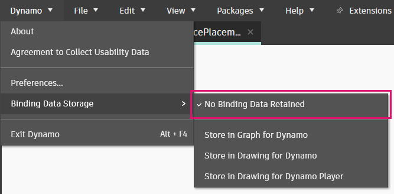

# Object Binding

Dynamo for Civil 3D contains a very powerful mechanism for "remembering" the objects that are created by each node. This mechanism is called **Object Binding**, and it enables a Dynamo graph to produce consistent results every time it is run in the same document. While this is highly desirable in many situations, there are other situations where you may want to have more control over Dynamo's behavior. This section will help you understand how object binding works and how you can take advantage of it.

## Example

Consider this graph that creates a Circle in Model Space on the current layer.

<figure><figcaption>
A simple graph for creating a circle
</figcaption></figure>

Notice what happens when the radius is changed.

<figure><figcaption>
Modifying the radius input in Dynamo
</figcaption></figure>

This is object binding in action. Dynamo's default behavior is to _modify_ the Circle's radius, rather than creating a new Circle each time the radius input is changed. This is because the **Object.ByGeometry** node "remembers" that it created this _specific_ Circle each time the graph is run. Furthermore, Dynamo will store this information away so that the next time you open the Civil 3D document and run the graph, it will have the exact same behavior.

## Another Example

Let's look at an example where you might want to change Dynamo's default object binding behavior. Let's say you want to build a graph that places Text in the middle of a Circle. However, your intent with this graph is that it can be run over and over again and place new Text each time for whatever Circle is selected. Here's what that graph might look like.

<figure><figcaption>
A simple graph that places Text in the center of a selected Circle
</figcaption></figure>

However, this is actually what happens when a different Circle is selected.

<figure><figcaption>
Dynamo's default behavior when selecting a new Circle
</figcaption></figure>

It seems like the Text is deleted and re-created with each run of the graph. In reality, the position of the Text is being _modified_ depending on which Circle is selected. So it is the same Text, just in a different spot! In order to create new Text every time, we need to modify Dynamo's object binding settings so that no binding data is retained (see [#binding-settings](object-binding.md#binding-settings "mention") below).

<figure><figcaption>
Object binding settings
</figcaption></figure>

After making that change, we get the behavior that we're looking for.

<figure><figcaption>
Behavior with object binding disabled
</figcaption></figure>

## Binding Settings

Dynamo for Civil 3D allows for modifying the default object binding behavior through the **Binding Data Storage** settings in the **Dynamo** menu.


Note that the Binding Data Storage options are available in **Civil 3D 2022.1** and above.


<figure><figcaption></figcaption></figure>

All of the options are enabled by default. Here's a summary of what each option does.

### Option 1: No Binding Data Retained

When this option is enabled, Dynamo will "forget" about the objects it created the last time the graph was run. So the graph can be run in any drawing in any situation and it will create new objects every time.


**When to Use**

Use this option when you want Dynamo to "forget" everything about what it did in previous runs and create new objects every time.


### Option 2: Store in Graph for Dynamo

This option means that object binding metadata will be serialized into the graph (.dyn file) when it is saved. If you close/reopen the graph and run it in the **same drawing**, then everything should work the same as you left it. If you run the graph in a **different drawing**, the binding data will be removed from the graph and new objects will be created. This means that if you open the original drawing and run the graph again, new objects will be created in addition to the old ones.


**When to Use**

Use this option when you want Dynamo to “remember” the objects it created the last time it ran in a **specific drawing**.



This option is best suited for situations where it is possible to maintain a 1:1 relationship between a **specific drawing** and a Dynamo graph. Options 1 and 3 are better suited for graphs that are designed to run on multiple drawings.


### Option 3: Store in Drawing For Dynamo

This is similar to Option 2, except that the object binding data is serialized in the drawing instead of the graph (.dyn file). If you close/reopen the graph and run it in the **same drawing**, then everything should work the same as you left it. If you run the graph in a **different drawing**, the binding data is still preserved in the original drawing since it is saved in the drawing and not the graph.


**When to Use**

Use this option when you want to use the same graph across **multiple drawings** and have Dynamo “remember” what it did in each one.


### Option 4: Store in Drawing For Dynamo Player

The first thing to note with this option is that it has no effect on how the graph interacts with the drawing when running the graph through the main Dynamo interface. This option _only_ applies when the graph is run using Dynamo Player.


If Dynamo Player is new to you, take a look at the [dynamo-player.md](../dynamo-player.md "mention") section.


If you run the graph using the main Dynamo interface and then close out and run the same graph using Dynamo Player, it will create new objects on top of the ones it created before. However, once Dynamo Player has executed the graph once, it will serialize object binding data in the drawing. So if you run the graph multiple times through Dynamo Player, it will update objects instead of creating new ones. If you run the graph through Dynamo Player on a **different drawing**, the binding data is still preserved in the original drawing since it is saved in the drawing and not the graph.


**When to Use**

Use this option when you want to run a graph using Dynamo Player across multiple drawings and have it “remember” what it did in each one.

