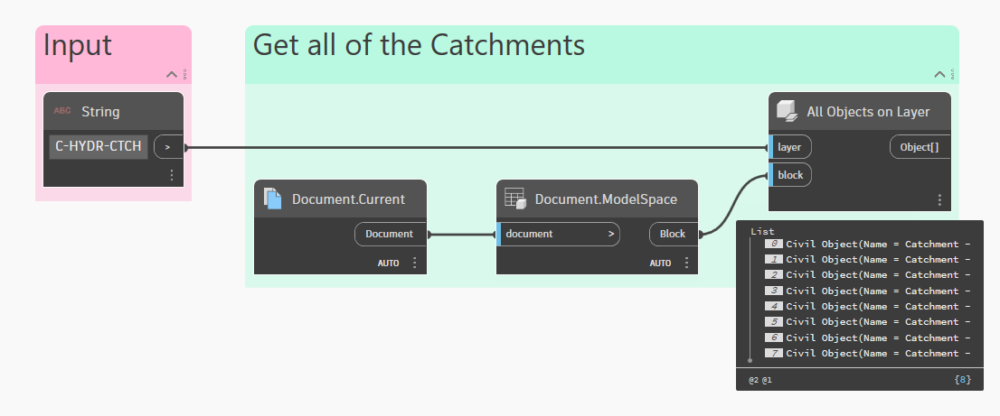
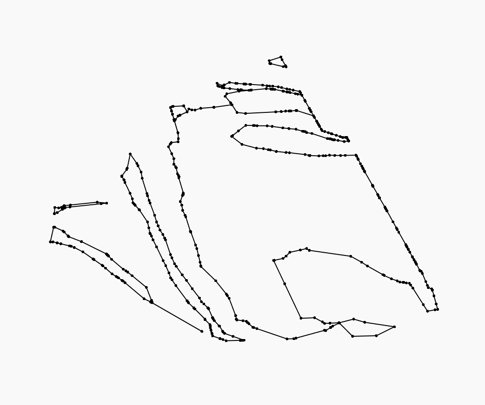

# Python 和 Civil 3D

虽然 Dynamo 是一款功能非常强大的[可视化编程](../../a\_appendix/a-1\_visual-programming-and-dynamo.md)工具，但也可以越过节点和导线，以文本形式编写代码。有两种方法可以执行此操作：

1. 使用代码块编写 **DesignScript**
2. 使用 Python 节点编写 **Python**

本部分将重点介绍如何在 Civil 3D 环境中利用 Python，来利用 AutoCAD 和 Civil 3D .NET API。


 有关如何在 Dynamo 中使用 Python 的更多常规信息，请参见 [8-3_Python](../../8\_coding\_in\_dynamo/8-3\_python/ "提及")部分。


## API 文档

AutoCAD 和 Civil 3D 都提供了多个 API，使像您这样的开发人员能够使用自定义功能扩展核心产品。在 Dynamo 的上下文中，相关的**托管 .NET API** 可用。以下链接对于了解 API 的结构及其工作方式至关重要。

[AutoCAD .NET API 开发人员手册](https://help.autodesk.com/view/OARX/2024/CHS/?guid=GUID-C3F3C736-40CF-44A0-9210-55F6A939B6F2)

[AutoCAD .NET API 参考手册](https://help.autodesk.com/view/OARX/2024/CHS/?guid=OARX-ManagedRefGuide-What_s_New)

[Civil 3D .NET API 开发人员手册](https://help.autodesk.com/view/CIV3D/2024/CHS/?guid=GUID-DA303320-B66D-4F4F-A4F4-9FBBEC0754E0)

[Civil 3D .NET API 参考手册](https://help.autodesk.com/view/CIV3D/2024/CHS/?guid=73fd1950-ee31-00b8-4872-c3f328ea1331)


在您浏览此部分时，可能会有一些您不熟悉的概念（如数据库、事务、方法、特性等）。其中许多概念是使用 .NET API 的核心，并不是 Dynamo 或 Python 特有的。本 Primer 的此部分不会详细讨论这些项目，因此建议您经常参见上述链接以了解详细信息。


## 代码模板

当第一次编辑一个新的 Python 节点时，该节点会预填充模板代码以便于您快速开始。以下是模板的详细介绍，其中包含有关每个块的说明。

<figure><figcaption>
Civil 3D 中的默认 Python 模板
</figcaption></figure>

> 1. 输入 `sys` 和 `clr` 模块，这两个模块都是 Python 解释器能够正常运行所必需的。特别是，`clr` 模块使 .NET 名称空间能够基本上被视为 Python 软件包。
> 2. 加载标准程序集（即 DLL），以使托管 .NET API 能够用于 AutoCAD 和 Civil 3D。
> 3. 添加对标准 AutoCAD 和 Civil 3D 名称空间的引用。这些引用分别相当于 C# 或 VB.NET 中的 `using` 或 `Imports` 指令。
> 4. 可使用名为 `IN` 的预定义列表来访问节点的输入端口。可以使用特定端口的索引号来访问该端口中的数据（例如，`dataInFirstPort = IN[0]`）。
> 5. 获取活动文档和编辑器。
> 6. 锁定文档并启动数据库事务。
> 7. 在此应放置脚本的大部分逻辑。
> 8. 在主要工作完成后，取消注释此行以提交事务。
> 9. 如果要输出节点中的任何数据，请在脚本末尾将该节点指定给 `OUT` 变量。


 **要自定义？**\
可以通过编辑位于 `C:\ProgramData\Autodesk\C3D <version>\Dynamo` 中的 `PythonTemplate.py` 文件，来修改默认 Python 模板。


## 示例

让我们通过一个示例来演示在 Dynamo for Civil 3D 中编写 Python 脚本的一些基本概念。

### 目标

> :dart: 获取图形中所有汇流的边界几何图形。

### 数据集

以下是可以在本次练习中参照的示例文件。





### 解决方案概述

下面概述了此图形中的逻辑。

> 1. 查看 Civil 3D API 文档
> 2. 按图层名称选择文档中的所有汇流
> 3. “展开”Dynamo 对象以访问 Civil 3D API 内部成员
> 4. 从 AutoCAD 点创建 Dynamo 点
> 5. 从点创建 PolyCurve

开始吧！

### 查看 API 文档

在我们开始构建图形和编写代码之前，最好先查看 Civil 3D API 文档，了解 API 的可用内容。在这种情况下，[Catchment 类中有一个特性](https://help.autodesk.com/view/CIV3D/2024/CHS/?guid=d3140831-672f-d9bb-3be7-9886a0e19f5c)，该特性会返回汇流的边界点。请注意，此特性会返回一个 `Point3dCollection` 对象，而 Dynamo 并不会知道该如何处理该对象。换句话说，我们将无法从 `Point3dCollection` 创建 PolyCurve，因此最终需要将所有内容都转换为 Dynamo 点。稍后会对此进行详细介绍。

### 获取所有汇流

现在，我们可以开始构建图形逻辑。首先，获取文档中所有汇流的列表。有节点可用于此操作，因此我们不需要将其包含在 Python 脚本中。使用节点可以为可能读取图形的其他人提供更好的可见性（而不是在 Python 脚本中隐藏大量代码），它还使 Python 脚本能够专注于一件事：返回汇流的边界点。

<figure><figcaption>
按图层获取文档中的所有汇流
</figcaption></figure>

请注意，**All Objects on Layer** 节点的输出内容是 CivilObject 的列表。这是因为 Dynamo for Civil 3D 当前没有任何用于处理汇流的节点，这正是我们需要通过 Python 访问 API 的原因。

### 展开对象

在进一步介绍之前，我们需要简要介绍一个重要概念。在[节点库.md](../node-library.md "提及")部分中，我们讨论了 Objects 和 CivilObject 之间的关系。对此详加说明，**Dynamo Object** 是 **AutoCAD Entity** 的包裹器。同样，**Dynamo CivilObject** 是 **Civil 3D Entity** 的包裹器。可以通过访问对象的 `InternalDBObject` 或 `InternalObjectId` 特性来“展开”该对象。

<table data-full-width="false"><thead><tr><th width="377.3333333333333">Dynamo 类型</th><th width="373">包裹</th></tr></thead><tbody><tr><td><strong>Object</strong> Autodesk.AutoCAD.DynamoNodes.Object</td><td><strong>Entity</strong> Autodesk.AutoCAD.DatabaseServices.Entity</td></tr><tr><td><strong>CivilObject</strong> Autodesk.Civil.DynamoNodes.CivilObject</td><td><strong>Entity</strong> Autodesk.Civil.DatabaseServices.Entity</td></tr></tbody></table>


根据经验，通常使用 `InternalObjectId` 特性获取对象 ID，然后在事务中访问包裹对象更安全。这是因为 `InternalDBObject` 特性会返回一个不处于可写状态的 AutoCAD DBObject。


### Python 脚本

以下是一个完整的 Python 脚本，用于访问内部汇流对象以获取其边界点。亮显行表示基于默认模板代码修改/添加的行。


单击脚本中带下划线的文字，可了解每行的说明。


<pre class="language-python" data-line-numbers><code class="lang-python"># 加载 Python 标准库和 DesignScript 库
import sys
import clr

# 添加 AutoCAD 和 Civil 3D 的程序集
clr.AddReference('AcMgd')
clr.AddReference('AcCoreMgd')
clr.AddReference('AcDbMgd')
clr.AddReference('AecBaseMgd')
clr.AddReference('AecPropDataMgd')
clr.AddReference('AeccDbMgd')

<strong><a data-footnote-ref href="#user-content-fn-1">clr.AddReference('ProtoGeometry')</a>
</strong>
# 从 AutoCAD 输入参照
from Autodesk.AutoCAD.Runtime import *
from Autodesk.AutoCAD.ApplicationServices import *
from Autodesk.AutoCAD.EditorInput import *
from Autodesk.AutoCAD.DatabaseServices import *
from Autodesk.AutoCAD.Geometry import *

# 从 Civil3D 输入参照
from Autodesk.Civil.ApplicationServices import *
from Autodesk.Civil.DatabaseServices import *

<strong><a data-footnote-ref href="#user-content-fn-2">from Autodesk.DesignScript.Geometry import Point as DynPoint</a>
</strong>
# 此节点的输入内容将以列表形式存储在 IN 变量中。
<strong><a data-footnote-ref href="#user-content-fn-3">objs</a> = <a data-footnote-ref href="#user-content-fn-4">IN[0]</a>
</strong>
<strong><a data-footnote-ref href="#user-content-fn-5">output = []</a>
</strong>
<strong><a data-footnote-ref href="#user-content-fn-6">if objs is None:</a>
</strong><strong>    <a data-footnote-ref href="#user-content-fn-7">sys.exit("The input is null or empty.")</a>
</strong>
<strong><a data-footnote-ref href="#user-content-fn-8">if not isinstance(objs, list):</a>
</strong><strong>    <a data-footnote-ref href="#user-content-fn-9">objs = [objs]</a>
</strong>   
adoc = Application.DocumentManager.MdiActiveDocument
editor = adoc.Editor

with adoc.LockDocument():
    with adoc.Database as db:
        
        with db.TransactionManager.StartTransaction() as t:
<strong>            <a data-footnote-ref href="#user-content-fn-10">for obj in objs:</a>             
</strong><strong>                <a data-footnote-ref href="#user-content-fn-11">id = obj.InternalObjectId</a>
</strong><strong>                <a data-footnote-ref href="#user-content-fn-12">aeccObj = t.GetObject(id, OpenMode.ForRead)</a>               
</strong><strong>                <a data-footnote-ref href="#user-content-fn-13">if isinstance(aeccObj, Catchment):</a>
</strong><strong>                    <a data-footnote-ref href="#user-content-fn-14">catchment = aeccObj</a>
</strong><strong>                    <a data-footnote-ref href="#user-content-fn-15">acPnts = catchment.BoundaryPolyline3d</a>                   
</strong><strong>                    <a data-footnote-ref href="#user-content-fn-16">dynPnts = []</a>
</strong><strong>                    <a data-footnote-ref href="#user-content-fn-17">for acPnt in acPnts:</a>
</strong><strong>                        <a data-footnote-ref href="#user-content-fn-18">pnt = DynPoint.ByCoordinates(acPnt.X, acPnt.Y, acPnt.Z)</a>
</strong><strong>                        <a data-footnote-ref href="#user-content-fn-19">dynPnts.append(pnt)</a>
</strong><strong>                    <a data-footnote-ref href="#user-content-fn-20">output.append(dynPnts)</a>
</strong>           
            # 在结束事务前提交
<strong>            <a data-footnote-ref href="#user-content-fn-21">t.Commit()</a>
</strong>            pass
            
# 将输出内容指定给 OUT 变量。
<strong><a data-footnote-ref href="#user-content-fn-22">OUT = output</a>
</strong></code></pre>


根据经验，最好将大部分脚本逻辑包含在事务中。这可确保安全访问脚本正在读/写的对象。在许多情况下，忽略事务可能会导致出现致命错误。


### 创建 PolyCurve

在此阶段，Python 脚本应该会输出可在后台预览中看到的 Dynamo 点列表。最后一步是从这些点创建 PolyCurve。请注意，这也可以直接在 Python 脚本中完成，但我们有意将其放置在脚本之外的节点中，以便它更明显。最终图形如下所示。

<figure><figcaption>
最终图形
</figcaption></figure>

### 结果

以下最终的 Dynamo 几何图形。

<figure><figcaption>
生成的汇流边界的 Dynamo PolyCurve
</figcaption></figure>

> :tada: 任务完成！

## IronPython 与 CPython

在我们结束之前，作一个简短说明。根据您正在使用的 Civil 3D 版本，Python 节点的配置可能会有所不同。在 **Civil 3D 2020 和 2021** 中，Dynamo 使用名为 **IronPython** 的工具在 .NET 对象和 Python 脚本之间移动数据。但在 **Civil 3D 2022** 中，Dynamo 转变为使用标准的本地 Python 解释器（也称为 **CPython**），而不是使用 Python 3。此转变的好处包括能够访问常用现代库和新平台功能、基本维护和安全修补程序。


可以在 [Dynamo 博客](https://dynamobim.org/why-has-dynamo-switched-to-python-3-should-i-update-too/)上，详细了解此转变以及如何升级旧脚本。如果要继续使用 IronPython，只需使用 Dynamo Package Manager 安装 **DynamoIronPython2.7** 软件包。


[^1]: 默认情况下，Dynamo 几何图形库不会添加到 Python 环境中。我们使用此脚本的目标是输出汇流边界的 Dynamo 点列表，因此我们需要添加此行以便稍后创建点。

[^1]: 此行从 Dynamo 几何图形库中获取我们需要的特定类。请注意，我们在此处指定 `import Point as DynPoint` 而不是 `import *`，因为后者会引发命名冲突。

[^3]: 此处，我们将默认变量 `dataEnteringNode` 重命名为 `objs`，以便该名称更具描述性。

[^4]: 在此处，我们准确指定哪个输入端口包含我们需要的数据，而不是使用默认的 `IN`，后者指的是所有输入的整个列表。

[^5]: 这将创建一个空列表，我们稍后会将输出数据添加到该列表中。

[^6]: 这是为了防止我们的脚本中可能出现空值或 null 输入。

[^7]: 我们将输出一条有用消息来说明脚本无法继续运行的原因，而不是中断运行脚本。

[^8]: 脚本的其余部分假定我们有一个要处理的对象列表（而不是单个对象）。但是，如果只有一个对象（即，具有单个汇流的图形），我们仍希望脚本能够运行。

[^9]: 如果输入不是一个列表（即，单个对象），我们只需创建一个新列表（其中该对象作为唯一项）。

[^10]: 为列表中的每个对象启动一个循环。

[^11]: 通过获取 Dynamo 对象的对象 ID，“展开”该对象。

[^12]: 从 AutoCAD 数据库中检索“包裹”对象。请注意，由于我们不打算对对象进行任何编辑，因此 OpenMode 在此处设置为 `ForRead`。我们只是在简单地“查询”数据。

[^13]: 输入的对象列表可能同时包含汇流和其他非汇流项目。我们需要检查是否存在此情况，并进行相应处理（即，仅当项目确实是汇流时，才继续循环的此迭代）。

[^14]: 如果脚本已运行到此处，那么我们就知道该对象确实是汇流。我们将在此处添加一个新变量，仅为了使命名保持清晰易懂。

[^15]: 此处是我们使用先前在 API 文档中查找的相应特性来检索汇流边界点的位置。如前所述，这将为我们提供一个 `Point3dCollection` 对象，它本质上是一个 AutoCAD 点列表。我们需要将这些点“转换”为 Dynamo 点，这样一来它们才可用。

[^16]: 创建一个空列表以存储此汇流的边界点。

[^17]: 为 `Point3dCollection` 中的每个 `Point3d` 对象启动循环。

[^18]: 使用 AutoCAD 点的坐标创建 Dynamo 点。

[^19]: 将点添加到列表中。

[^20]: 完成所有 AutoCAD 点到 Dynamo 点的“转换”后，我们将生成的列表添加到输出中。之后，外部循环将移动到输入列表中的下一个对象。

[^21]: 取消注释此行以提交事务。

[^22]: 最后但同样重要的是，我们输出 Dynamo 点列表。
