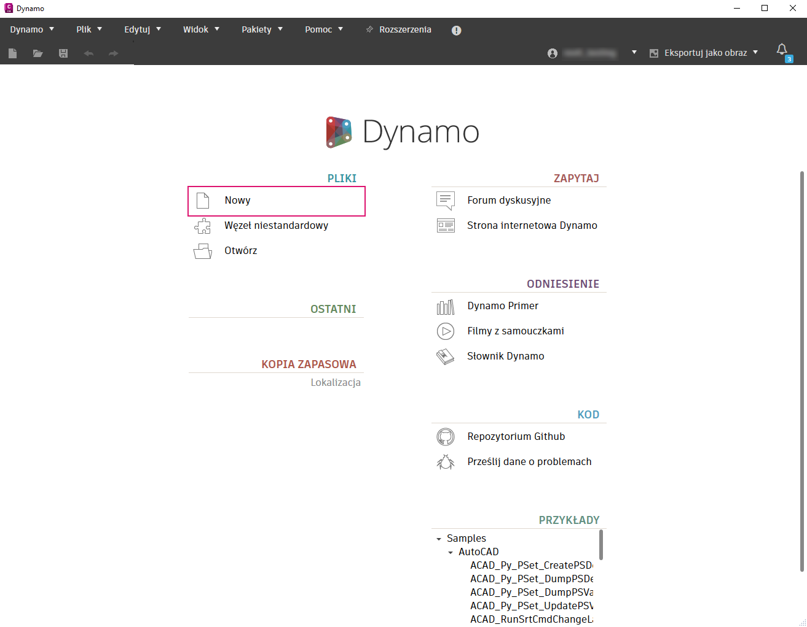
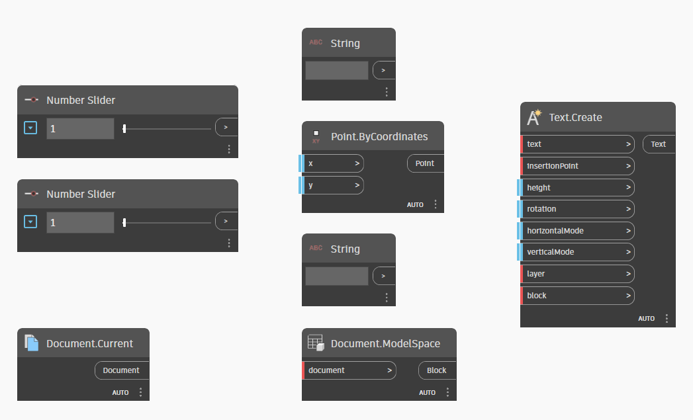
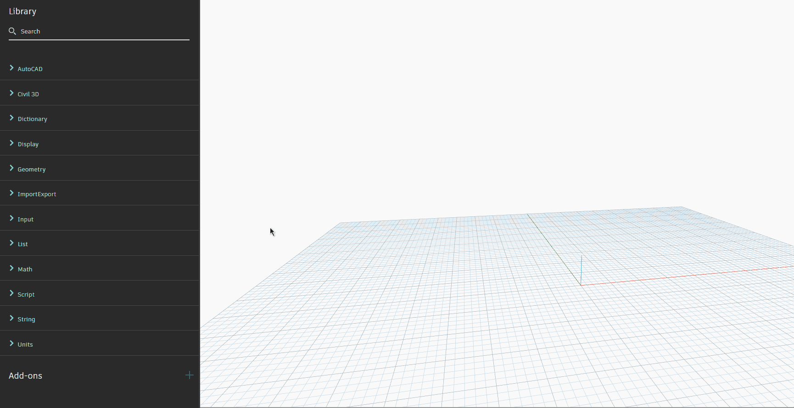
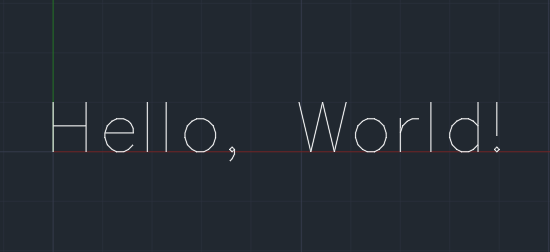
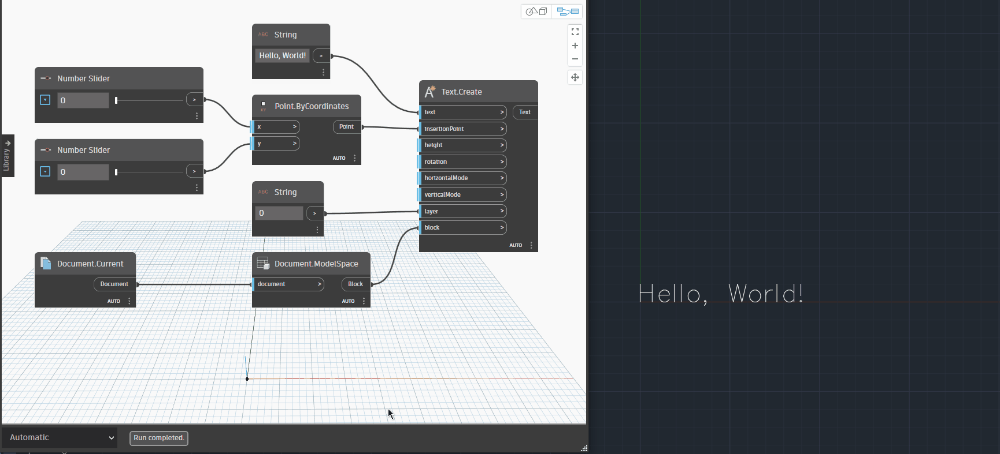

# Mise en route

Maintenant que vous en savez un peu plus sur la situation générale, nous allons nous lancer dans la création de votre premier graphique Dynamo dans Civil 3D !

 Il s’agit d’un exemple simple destiné à démontrer les fonctionnalités de base de Dynamo. Il est recommandé de suivre les étapes dans un nouveau document Civil 3D vide. 

## Ouvrir Dynamo

La première chose à faire est d’ouvrir un document vide dans Civil 3D. Une fois que vous y êtes, accédez à l’onglet **Gérer** dans le ruban de Civil 3D et recherchez le groupe de fonctions **Programmation visuelle**.

\.png>)

Cliquez sur le bouton **Dynamo**, qui lance Dynamo dans une fenêtre distincte.

 **Quelle est la différence entre Dynamo et le Lecteur Dynamo ?**

Dynamo est ce que vous utilisez pour créer et exécuter des graphiques. Le Lecteur Dynamo est un moyen facile d’exécuter des graphiques sans avoir à les ouvrir dans Dynamo.

Accédez à la section [dynamo-player.md](dynamo-player.md "mention") lorsque vous êtes prêt à l’essayer. 

## Commencer un nouveau graphique

Une fois Dynamo ouvert, l’écran d’accueil s’affiche. Cliquez sur **Nouveau** pour ouvrir un espace de travail vide.

<figure><figcaption>
Écran de démarrage de Dynamo
</figcaption></figure>

 **Et les exemples ?**

Dynamo for Civil 3D est fourni avec quelques graphiques prédéfinis qui peuvent vous donner des idées supplémentaires sur la façon dont vous pouvez utiliser Dynamo. Nous vous recommandons de les consulter ultérieurement, ainsi que les [sample-workflows](sample-workflows/ "mention") présentés dans le guide. 

## Ajouter des nœuds

Vous devriez maintenant disposer d’un espace de travail vide. Découvrez Dynamo en action ! Voici votre objectif :

>  :dart: **créer un graphique Dynamo qui insérera du texte dans un espace objet.**

C’est assez simple, non ? Toutefois, avant de commencer, il convient d’aborder quelques points fondamentaux.

Les blocs de construction principaux d’un graphique Dynamo sont appelés **nœuds**. Un nœud est comme une petite machine : vous y introduisez des données, il effectue un travail sur ces dernières et produit un résultat. Dynamo for Civil 3D dispose d’une **bibliothèque** de nœuds que vous pouvez connecter ensemble avec des **fils** pour former un **graphique**. Celui-ci effectue des opérations plus importantes et de manière plus efficace qu’un nœud seul.

 **Que faire si je n’ai jamais utilisé Dynamo auparavant ?**

Certaines fonctionnalités peuvent être nouvelles pour vous, mais ce n’est pas grave ! Ces sections vous seront utiles.

[3_user_interface](../3\_user\_interface/ "mention")\
 [4_nodes_and_wires](../4\_nodes\_and\_wires/ "mention")\
 [5_essential_nodes_and_concepts](../5\_essential\_nodes\_and\_concepts/ "mention") 

Commencez la création du graphique. Voici une liste de tous les nœuds dont vous aurez besoin.

<figure><figcaption></figcaption></figure>

Vous pouvez trouver ces nœuds en saisissant leur nom dans la barre de recherche de la bibliothèque, ou en effectuant une recherche après avoir cliqué avec le bouton droit de la souris n’importe où dans la zone de dessin.

<figure><figcaption>
Vous pouvez placer des nœuds à partir de la bibliothèque ou en cliquant avec le bouton droit de la souris dans la zone de dessin
</figcaption></figure>

 **Comment savoir quels nœuds utiliser et où les trouver ?**

Les nœuds de la bibliothèque sont regroupés en catégories logiques en fonction de leur fonction. Pour plus de détails, consultez la section [node-library.md](node-library.md "mention"). 

Voici à quoi devrait ressembler votre graphique final.

<figure><figcaption>
Graphique final
</figcaption></figure>

Voici un résumé de ce que vous avez fait ici :

> 1. vous avez choisi le document dans lequel vous vouliez travailler. Dans ce cas (et dans de nombreux autres cas), vous souhaitez travailler dans le document actif de Civil 3D ;
> 2. vous avez défini le bloc de destination dans lequel l’objet texte doit être créé (dans ce cas, l’espace objet) ;
> 3. vous avez utilisé un nœud _Chaîne_ pour spécifier le calque sur lequel le texte doit être placé ;
> 4. vous avez créé un point à l’aide du nœud _Point.ByCoordinates_ pour définir la position où le texte doit être placé ;
> 5. vous avez défini les coordonnées X et Y du point d’insertion du texte à l’aide de deux nœuds _Curseur de nombre_ ;
> 6. vous avez utilisé un autre nœud _Chaîne_ pour définir le contenu de l’objet texte ;
> 7. enfin, vous avez créé l’objet texte.

Voyons les résultats de votre nouveau graphique !

## Afficher le résultat

Une fois de retour dans Civil 3D, assurez-vous que l’onglet **Modèle** est sélectionné. Le nouvel objet texte créé par Dynamo doit s’afficher.

 Si le texte n’est pas visible, vous devrez peut-être exécuter la commande ZOOM -> VERS L’ÉTENDUE pour effectuer un zoom à l’endroit approprié. 

<figure><figcaption></figcaption></figure>

Bravo ! Vous allez maintenant modifier le texte.

Dans votre graphique Dynamo, modifiez quelques valeurs d’entrée, telles que la chaîne de texte, les coordonnées du point d’insertion, etc. Vous devriez voir le texte s’actualiser automatiquement dans Civil 3D. Notez également que si vous déconnectez l’un des ports d’entrée, le texte est supprimé. Si vous reconnectez tous les ports, le texte est à nouveau créé. 

<figure><figcaption>
Graphique terminé en action
</figcaption></figure>

 **Pourquoi Dynamo n’insère pas un nouvel objet texte à chaque exécution du graphique ?**

Par défaut, Dynamo se « souvient » des objets qu’il crée. Si vous modifiez les valeurs d’entrée du nœud, les objets dans Civil 3D sont mis à jour au lieu de créer de nouveaux objets. Pour en savoir plus sur ce comportement, consultez la section [object-binding.md](advanced-topics/object-binding.md "mention"). 

> :tada: Mission accomplie !

## Étapes suivantes

Cet exemple ne fait qu’effleurer les possibilités offertes par Dynamo for Civil 3D. Poursuivez votre lecture pour en savoir plus !
