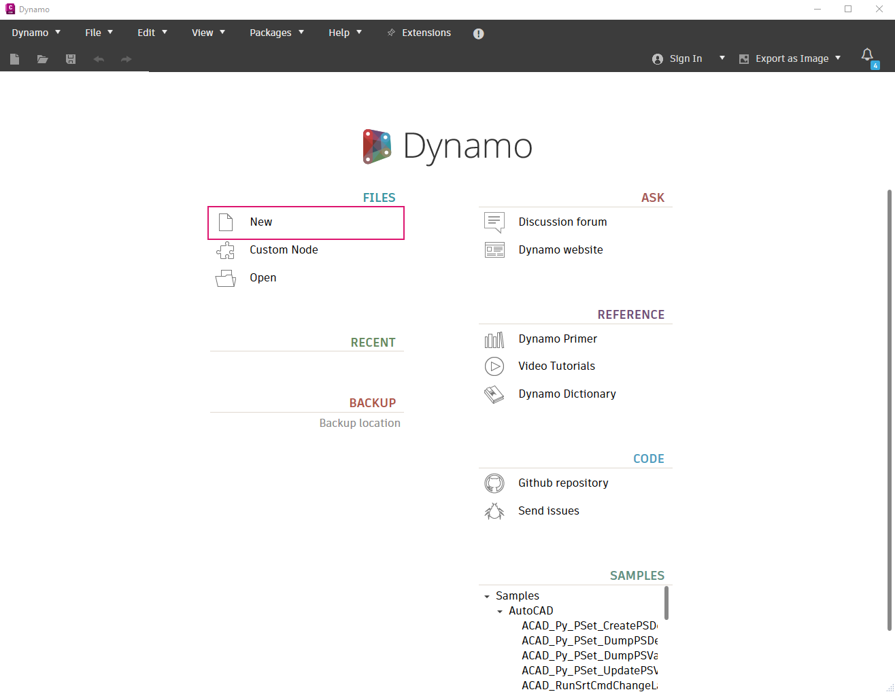

# 開始使用

您現在對整個圖像有一點瞭解，我們直接在 Civil 3D 中建置您的第一個 Dynamo 圖表！

 這是一個簡單的範例，旨在示範基本的 Dynamo 功能。建議您在新的空白 Civil 3D 文件中完成所有步驟。

## 開啟 Dynamo

首先在 Civil 3D 中開啟一個空白文件。開啟後，導覽到 Civil 3D 功能區的 **「管理」** 頁籤，並尋找 **「視覺程式設計」** 面板。

\.png>)

按一下 **「Dynamo」** 按鈕，這會在單獨的視窗中啟動 Dynamo。

 **Dynamo 與 Dynamo 播放器有何差異？**

Dynamo 是您用來建置和執行圖表的工具。Dynamo 播放器是一種無需在 Dynamo 中開啟圖表即可執行圖表的簡易方式。

當您準備好試用時，請前往 [dynamo-player.md](dynamo-player.md "mention")一節。

## 開始新圖表

開啟 Dynamo 後，您會看到開始畫面。按一下 **「新建」** 開啟空白工作區。

<figure><figcaption>
Dynamo 開始畫面
</figcaption></figure>

 **範例呢？**

Dynamo for Civil 3D 隨附一些預先建置的圖表，可協助您激發更多有關如何使用 Dynamo 的想法。我們建議您有時候可以查看這些內容，以及 Primer 中的[sample-workflows](sample-workflows/ "mention")。

## 加入節點

您現在應該會看到一個空白工作區。我們來看看 Dynamo 的運作！以下是我們的目標：

>  :dart: **建置一個將文字插入模型空間的 Dynamo 圖表。**

很簡單，對吧？但在開始之前，我們需要先討論一些基本知識。

Dynamo 圖表的核心建置圖塊稱為**節點**。節點就像一台小機器 - 您將資料放入其中，它對該資料執行某些作業，然後輸出結果。Dynamo for Civil 3D 有一個節點**資源庫**，您可以用**線路**將節點連接在一起形成**圖表**，圖表能做的事情比單獨任何一個節點所能做的更多、更好。

 **等一下，如果我以前從來沒使用過 Dynamo，該怎麼辦？**

有些內容對您來說可能非常陌生，沒關係！以下這些章節可以幫助您。

[3_user_interface](../3\_user\_interface/ "mention")\
 [4_nodes_and_wires](../4\_nodes\_and\_wires/ "mention")\
 [5_essential_nodes_and_concepts](../5\_essential\_nodes\_and\_concepts/ "mention") 

好，我們來建立圖表。以下是我們需要的所有節點的清單。

<figure><figcaption></figcaption></figure>

您可以在資源庫的搜尋列中鍵入這些節點的名稱，或在圖元區的任意位置按一下右鍵並在其中搜尋，以尋找這些節點。

<figure><figcaption>
您可以從資源庫，或在圖元區中按一下右鍵來放置節點
</figcaption></figure>

 **如何知道要使用哪些節點？以及在何處找到它們？**

資源庫中的節點會根據作用分成不同邏輯品類。請參閱[node-library.md](node-library.md "mention")一節，以取得更深入的導覽。

以下是您的最終圖表的外觀。

<figure><figcaption>
完成的圖表
</figcaption></figure>

我們總結一下到目前為止完成的工作：

> 1. 我們選擇要使用的文件。在此範例 (以及許多範例) 中，我們想要在 Civil 3D 中使用作用中的文件。
> 2. 我們定義建立文字物件的目標圖塊 (在此範例中為模型空間)。
> 3. 我們使用 _String_ 節點指定應放置文字的圖層。
> 4. 我們使用 _Point.ByCoordinates_ 節點建立一點，以定義應放置文字的位置。
> 5. 我們使用兩個 _Number Slider_ 節點定義文字插入點的 X 座標和 Y 座標。
> 6. 我們使用另一個 _String_ 節點定義文字物件的內容。
> 7. 最後，我們建立了文字物件。

我們來看看新圖表的結果！

## 查看結果

回到 Civil 3D，確保已選取 **「模型」** 頁籤。您應該會看到 Dynamo 建立的新文字物件。

 如果您沒看到文字，可能需要執行 ZOOM -> EXTENTS 指令以縮放至右側位置。

<figure><figcaption></figcaption></figure>

好酷！現在來更新一下文字。

回到 Dynamo 圖表中，繼續變更一些輸入值，例如文字字串、插入點座標等。您應該會看到文字在 Civil 3D 中自動更新。另請注意，如果您拔掉其中一個輸入埠，文字就會移除。如果將所有內容重新插入，則會再次建立文字。

<figure><figcaption>
執行中的完成圖表
</figcaption></figure>

 **為什麼 Dynamo 不在每次執行圖表時插入新的文字物件？**

Dynamo 預設會「記住」它建立的物件。如果您變更節點輸入值，Civil 3D 中的物件會更新，而不是建立全新物件。您可以在[object-binding.md](advanced-topics/object-binding.md "mention")一節閱讀有關此行為的更多資訊。

> :tada: 任務完成！

## 後續步驟

此範例只是一個您可以使用 Dynamo for Civil 3D 執行何種作業的入門。請繼續閱讀以瞭解更多資訊！
