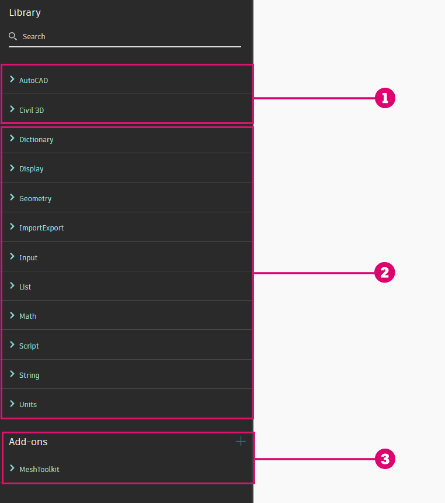
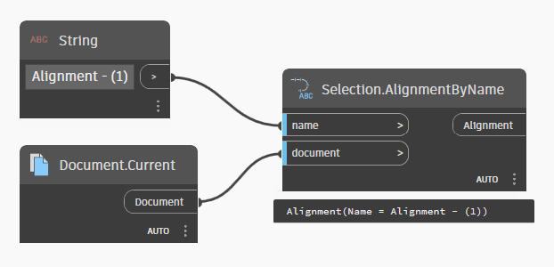
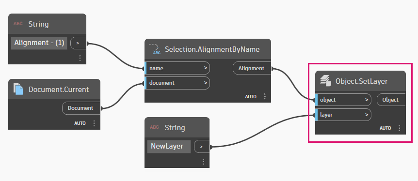

# 노드 라이브러리

앞서 **노드**는 Dynamo 그래프의 핵심 빌딩 블록이며, **라이브러리**에서 논리 그룹으로 구성된다고 언급했습니다. Dynamo for Civil 3D에는 라이브러리에 정렬, 프로파일, 코리더, 블록 참조 등과 같은 AutoCAD 및 Civil 3D 객체 작업을 위한 전용 노드가 포함된 두 개의 카테고리(또는 **선반**)가 있습니다. 라이브러리의 나머지 부분에는 보다 일반적인 성격의 노드가 포함되어 있으며, 이러한 노드는 Dynamo의 모든 "제품"(예: Revit용 Dynamo, Dynamo Sandbox 등) 간에 일관됩니다.


 코어 Dynamo 라이브러리의 노드 구성 방식에 대한 자세한 내용은 [2-library.md](../3\_user\_interface/2-library.md "mention") 섹션을 참조하십시오. 


<figure><figcaption>
Dynamo for Civil 3D의 노드 라이브러리
</figcaption></figure>

> 1. AutoCAD 및 Civil 3D 객체 작업을 위한 특정 노드
> 2. 범용 노드
> 3. 별도로 설치할 수 있는 타사 **패키지**의 노드


 AutoCAD 및 Civil 3D 선반 아래에 있는 노드를 사용하면 Dynamo 그래프가 Dynamo for Civil 3D에서만 작동합니다. Dynamo for Civil 3D 그래프를 다른 곳(예: Revit용 Dynamo)에서 열면 이러한 노드는 경고와 함께 플래그가 표시되고 실행되지 않습니다. 



 **AutoCAD와 Civil 3D를 위한 별도의 선반이 두 개 있는 이유는 무엇입니까?**

이 구성은 기본 AutoCAD 객체(선, 폴리선, 블록 참조 등)를 위한 노드와 Civil 3D 객체(선형, 코리더, 표면 등)를 위한 노드를 구분합니다. 기술적인 관점에서 볼 때 AutoCAD와 Civil 3D는 서로 다른 두 개의 제품이며, AutoCAD는 기본 응용프로그램이고 Civil 3D는 AutoCAD를 기반으로 하는 제품입니다. 


## 노드 계층

AutoCAD 및 Civil 3D 노드로 작업하려면 각 선반 내의 객체 계층을 확실히 이해하는 것이 중요합니다. 생물학의 분류법인 계, 문, 강, 목, 과, 속, 종을 기억하십니까? AutoCAD 및 Civil 3D 객체도 유사한 방식으로 분류됩니다. 몇 가지 예를 통해 설명하겠습니다.

### Civil 객체

예로 선형을 사용하겠습니다.

<figure><figcaption></figcaption></figure>

선형의 이름을 변경하는 것이 목표라고 가정해 보겠습니다. 여기에서 다음으로 추가할 노드는 **CivilObject.SetName** 노드입니다.

<figure><figcaption></figcaption></figure>

처음에는 직관적이지 않은 것처럼 보일 수 있습니다. **CivilObject**란 무엇이며, 라이브러리에 **Alignment.SetName** 노드가 없는 이유는 무엇입니까? 이 질문에 대한 답은 _재사용 가능성_ 및 _단순성_과 관련이 있습니다. 생각해 보면, Civil 3D 객체의 이름을 변경하는 절차는 객체가 선형, 코리더, 프로파일이든 다른 어떤 것이든 관계없이 동일합니다. 따라서 본질적으로 모두 동일한 작업을 수행하는 반복 노드(예: **Alignment.SetName, Corridor.SetName, Profile.SetName** 등)를 사용하는 대신, 해당 기능을 단일 노드로 묶는 것이 좋습니다. 이것이 바로 **CivilObject.SetName**의 기능입니다!

이에 대해 생각해 볼 수 있는 또 다른 방법은 _관계_ 의 관점에서 생각해 보는 것입니다. 사과와 배가 모두 과일의 종류인 것처럼 선형과 코리더는 모두 **Civil 객체**의 유형입니다. 사과와 배 모두 껍질을 벗길 때 하나의 껍질 벗기는 도구를 사용하는 것처럼, Civil 객체 노드는 모든 유형의 Civil 객체에 적용됩니다. 과일 종류마다 껍질 벗기는 도구가 따로 있다면 주방은 꽤 지저분해질 것입니다! 그런 의미에서 Dynamo 노드 라이브러리는 주방과 같습니다.

### 객체

이제 한 단계 더 나아가 보겠습니다. 정렬의 도면층을 변경한다고 가정합니다. 사용할 노드는 **Object.SetLayer** 노드입니다.

<figure><figcaption></figcaption></figure>

**CivilObject.SetLayer**라는 노드가 없는 이유는 무엇입니까? 앞서 언급한 재사용 가능성 및 단순성의 원칙이 여기에도 동일하게 적용됩니다. _도면층_ 특성은 선, 폴리선, 문자, 블록 참조 등 그리거나 삽입할 수 있는 AutoCAD의 모든 객체에 공통적으로 적용되는 특성입니다. 선형 및 코리더와 같은 Civil 3D 객체는 동일한 카테고리에 속하므로 **객체**에 적용되는 모든 노드는 모든 **Civil 객체**에도 사용할 수 있습니다.

