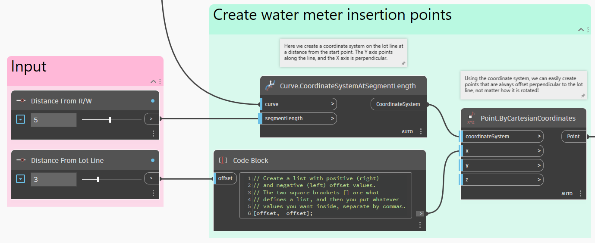

# サービスの配置

<figure><figcaption></figcaption></figure>

一般的な住宅開発のエンジニアリング設計には、汚水管、雨水排水、飲料水などの地下ユーティリティの使用が含まれます。この例では、Dynamo を使用して、配水本管から特定の区画にサービス接続を描画する方法を示します。これは、サービス接続を必要とするすべての区画で一般的であり、すべてのサービスを配置するには非常に面倒な作業が発生します。Dynamo を使用すると、必要なジオメトリを正確に自動的に描画したり、現地の関係機関の標準に合わせて調整できる柔軟な入力を提供したりすることで、プロセスをスピードアップすることができます。

## 目標

> :dart:水道メーターのブロック参照を区画線から指定したオフセットに配置し、配水本管に垂直に各サービス接続の線分を描画します。

## 主要な概念

> * ユーザ入力に **Select Object** ノードを使用する
> * 座標系を使用する
> * **Geometry.DistanceTo** や **Geometry.ClosestPointTo** などのジオメトリ操作を使用する
> * ブロック参照を作成する
> * オブジェクト バインド設定をコントロールする

## バージョンの互換性

 このグラフは **Civil 3D 2020** 以降で実行できます。 

## データセット

まず、以下のサンプル ファイルをダウンロードし、DWG ファイルと Dynamo グラフを開きます。





## 対処法

このグラフのロジックの概要を以下に示します。

> 1. 排水本管の曲線ジオメトリを取得する
> 2. ユーザ選択の区画線の曲線ジオメトリを取得し、必要に応じて反転する
> 3. サービス メーターの挿入点を生成する
> 4. サービス メーターの位置に最も近い配水本管上の点を取得する
> 5. モデル空間でブロック参照と線分を作成する

以上です。

### 配水本管のジオメトリを取得する

最初の手順では、Dynamo に配水本管のジオメトリを取得します。Lines または Polylines を個別に選択するのではなく、特定のレイヤ上のすべてのオブジェクトを取得し、Dynamo のポリカーブとしてそれらを結合します。

 Dynamo の曲線ジオメトリを初めて使用する場合は、「[4-curves.md](../../../5\_essential\_nodes\_and\_concepts/5-2\_geometry-for-computational-design/4-curves.md "mention")」 セクションを参照してください。 

<figure><figcaption>
Civil 3D からオブジェクトを取得し、すべてを単一のポリカーブに結合する
</figcaption></figure>

### 区画線ジオメトリを取得する

次に、選択した区画線のジオメトリを Dynamo に取り込んで、作業できるようにする必要があります。このジョブに適したツールは **Select Object** ノードで、グラフのユーザは、Civil 3D で特定のオブジェクトを選択できます。

また、発生する可能性のある潜在的な問題にも対処する必要があります。区画線には始点と終点があります。つまり、方向があります。グラフで一貫した結果を生成するには、すべての区画線の方向が一貫している必要があります。この条件はグラフ ロジックで直接考慮できるため、グラフの弾力性が向上します。

<figure><figcaption>
区画線を選択し、正しい方向を向くようにする
</figcaption></figure>

> 1. 区画線の始点と終点を取得します。
> 2. 各点から配水本管までの距離を測定し、どちらの距離が大きいかを特定します。
> 3. 望ましい結果は、線分の始点が配水本管に最も近くなることです。そうでない場合は、区画線の方向を反転します。それ以外の場合は、元の区画線を返します。

### 挿入点を生成する

次に、サービス メーターが配置される場所を決定します。通常、配置は現地の関係機関の要件によって決定されるため、さまざまな条件に合わせて変更できる入力値を指定します。点を作成するための参照として、区画線に沿って**座標系**を使用します。これにより、区画線に対するオフセットを、その向きに関係なく、非常に簡単に定義できます。

 座標系を初めて使用する場合は、「[2-vectors.md](../../../5\_essential\_nodes\_and\_concepts/5-2\_geometry-for-computational-design/2-vectors.md "mention")」 セクションを参照してください。 

<figure><figcaption>
サービス メーターの挿入点を作成する
</figcaption></figure>

### 接続点を取得する

次に、サービス メーターの位置に最も近い点を配水本管上で取得する必要があります。これにより、サービス接続が配水本管に対して常に垂直になるようにモデル空間にサービス接続を描画できます。**Geometry.ClosestPointTo** ノードは最適な対処法です。

<figure><figcaption>
配水本管上の垂直ポイントを取得する
</figcaption></figure>

> 1. これは配水本管のポリカーブです
> 2. これらは、サービス メーターの挿入点です

### オブジェクトを作成する

最後の手順は、モデル空間にオブジェクトを実際に作成することです。以前に生成した挿入点を使用してブロック参照を作成し、次に、配水本管上のポイントを使用してをサービス接続に線分を描画します。

<figure><figcaption></figcaption></figure>

### 結果

グラフを実行すると、モデル空間に新しいブロック参照とサービス接続線が表示されます。入力をいくつか変更して、すべてが自動的に更新されるのを確認してください。

<figure><figcaption>
Dynamo で入力パラメータを調整し、Civil 3D で結果を即座に確認する
</figcaption></figure>

### ボーナス: 順次配置を有効にする

1 つの区画線にオブジェクトを配置した後に、別の区画線を選択すると、オブジェクトが「移動」することがあります。

<figure><figcaption>
オブジェクト バインドがオンの場合の動作
</figcaption></figure>

これは Dynamo の既定の動作で、多くの場合に非常に便利です。ただし、複数のサービス接続を順番に配置し、元の接続を変更するのではなく、Dynamo に実行ごとに新しいオブジェクトを作成させたい場合があるかもしれません。この動作は、オブジェクト バインドの設定を変更することでコントロールできます。

<figure><figcaption>
Dynamo のオブジェクト バインド設定
</figcaption></figure>

 詳細については、[object-binding.md](../../advanced-topics/object-binding.md "mention") セクションを参照してください。 

この設定を変更すると、Dynamo は各実行で作成されるオブジェクトを「忘れる」ようになります。次に、**Dynamo プレーヤ**を使用してオブジェクト バインドをオフに設定した状態でグラフを実行する例を示します。

<figure><figcaption>
Dynamo プレーヤを使用してグラフを実行し、Civil 3D で結果を確認する
</figcaption></figure>

 Dynamo プレーヤを初めて使用する場合は、「[dynamo-player.md](../../dynamo-player.md "mention")」 セクションを参照してください。 

> :tada: ミッションが達成されました。

## アイデア

このグラフの機能を拡張する方法について、いくつかのアイデアを示します。

 各区画行を選択する代わりに、**複数のサービス接続** を同時に配置します。 

 入力を調整して、水道メーターの代わりに、**下水管の掃除口** を配置します。 

 **切り替えを追加** して、区画線の両側ではなく特定の側に単一のサービス接続を配置できるようにします。 
