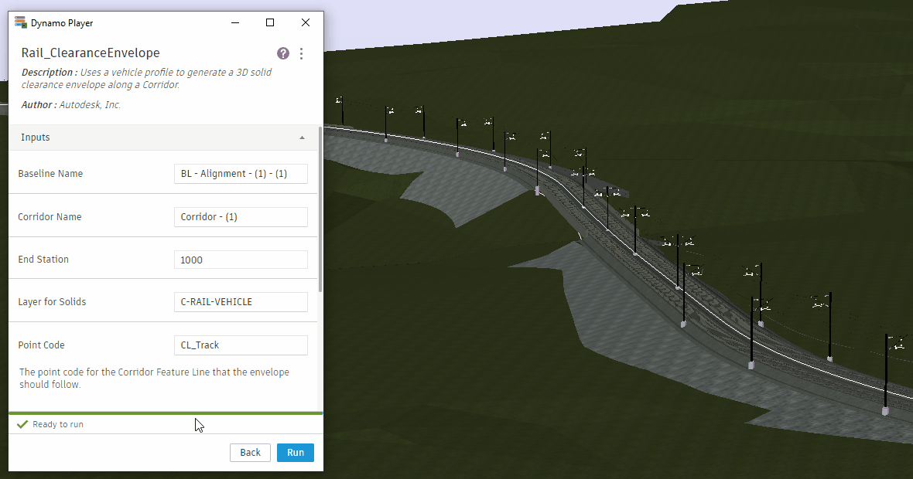
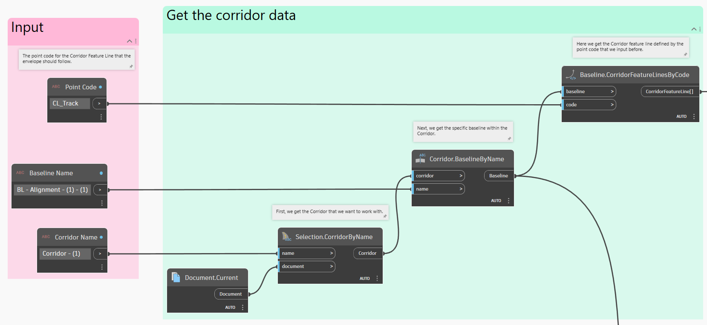
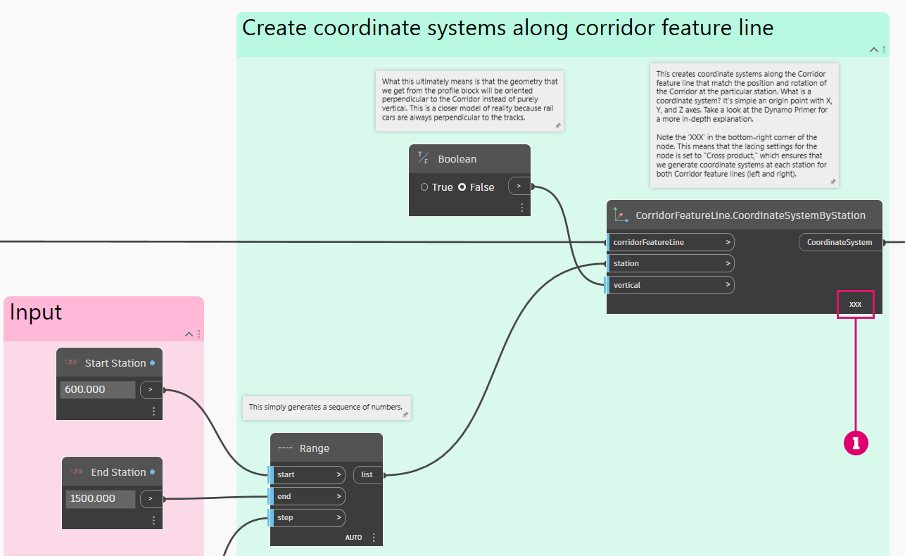
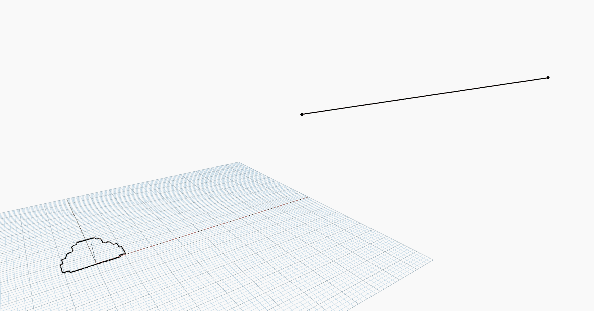
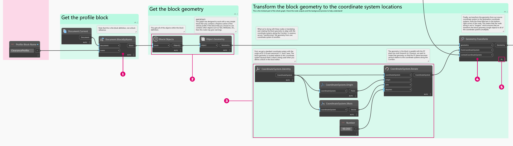
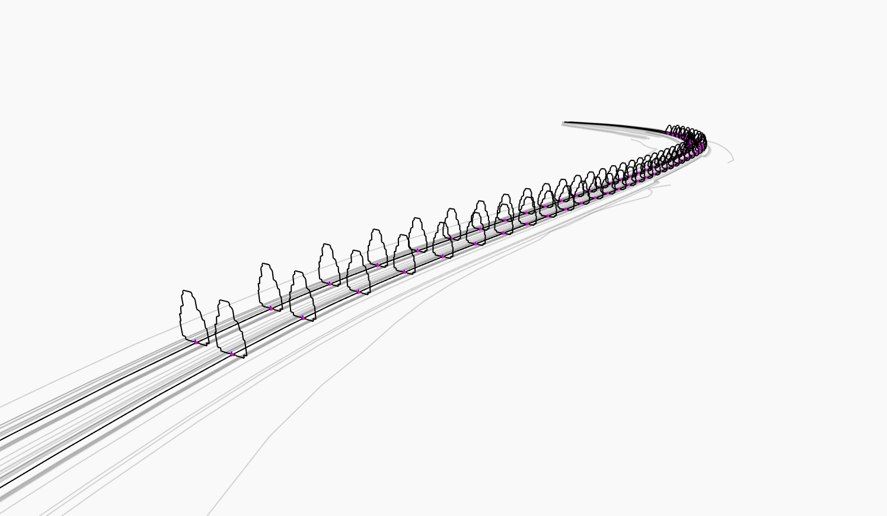
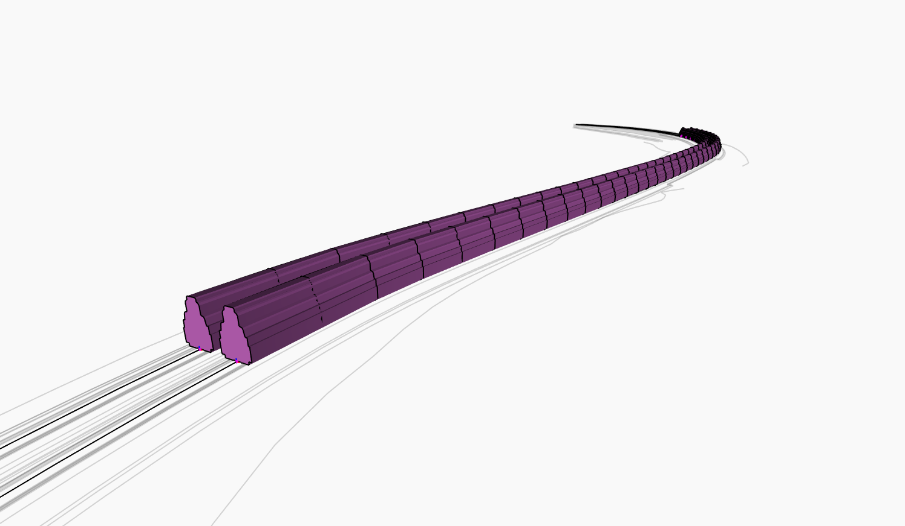
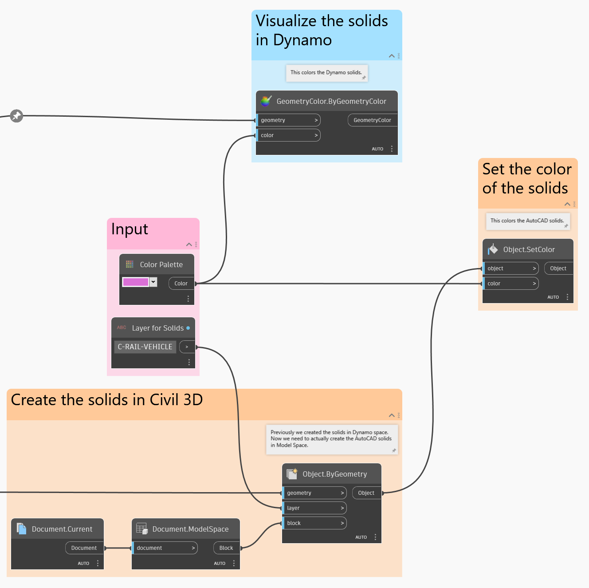

# Obwiednia prześwitu

<figure><figcaption></figcaption></figure>

Opracowywanie obwiedni kinematycznych do weryfikacji prześwitu jest ważną częścią projektów kolejowych. Za pomocą dodatku Dynamo można generować bryły dla obwiedni, zamiast tworzyć złożone podzespoły korytarzy i zarządzać nimi w celu wykonania tego zadania.

## Cel

> :dart: Wygenerowanie za pomocą bloku profilu pojazdu brył 3D obwiedni prześwitu wzdłuż korytarza.

## Kluczowe pojęcia

> * Praca z liniami charakterystycznymi korytarza
> * Przekształcanie geometrii między układami współrzędnych
> * Tworzenie brył przez wyciągnięcie
> * Kontrolowanie zachowania węzłów za pomocą ustawień skratowania

## Zgodność wersji

 Ten wykres będzie działać w programie **Civil 3D 2020** i w nowszych wersjach. 

## Zestaw danych

Najpierw pobierz pliki przykładów poniżej, a następnie otwórz plik DWG i wykres dodatku Dynamo.





## Rozwiązanie

Poniżej przedstawiono przegląd logiki na tym wykresie.

> 1. Pobieranie linii charakterystycznych z określonej linii bazowej korytarza
> 2. Generowanie układów współrzędnych wzdłuż linii charakterystycznej korytarza w żądanych odstępach
> 3. Przekształcanie geometrii bloku profilu do układów współrzędnych
> 4. Wyciąganie bryły między profilami
> 5. Tworzenie brył w programie Civil 3D

Zacznijmy!

### Pobieranie danych korytarza

Pierwszym krokiem jest pobranie danych korytarza. Wybierzemy model korytarza na podstawie jego nazwy, pobierzemy określoną linię bazową w korytarzu, a następnie pobierzemy linię charakterystyczną w linii bazowej na podstawie kodu punktu.

<figure><figcaption>
Wybieranie korytarza, linii bazowej i linii charakterystycznej
</figcaption></figure>

### Generowanie układów współrzędnych

Teraz wygenerujemy **układy współrzędnych** wzdłuż linii charakterystycznych korytarza między daną pikietą początkową a końcową. Te układy współrzędnych zostaną użyte do wyrównania geometrii bloku profilu pojazdu względem korytarza.

 Jeśli pierwszy raz masz do czynienia z układami współrzędnych, skorzystaj z sekcji [2-vectors.md](../../../5\_essential\_nodes\_and\_concepts/5-2\_geometry-for-computational-design/2-vectors.md "mention"). 

<figure><figcaption>
Pobieranie układów współrzędnych wzdłuż linii charakterystycznych korytarza
</figcaption></figure>

> 1. Zwróć uwagę na małą pozycję **XXX** w prawym dolnym rogu węzła. Oznacza to, że ustawienia skratowania węzła skonfigurowano jako _Iloczyn wektorowy_, co jest niezbędne do generowania układów współrzędnych przy tych samych wartościach pikiet dla obu linii charakterystycznych.

 Jeśli pierwszy raz masz do czynienia ze skratowaniem węzłów, skorzystaj z sekcji [1-whats-a-list.md](../../../5\_essential\_nodes\_and\_concepts/5-4\_designing-with-lists/1-whats-a-list.md "mention"). 

### Przekształcanie geometrii bloku

Teraz musimy w jakiś sposób utworzyć szyk profili pojazdów wzdłuż linii charakterystycznych. Przekształcimy geometrię z definicji bloku profilu pojazdu za pomocą węzła **Geometry.Transform**. Zwizualizowanie tej koncepcji jest trudne, więc zanim przyjrzymy się węzłom, przeanalizujmy grafikę pokazującą, co się stanie.

<figure><figcaption>
Wizualizacja przekształcania geometrii między układami współrzędnych.
</figcaption></figure>

Zasadniczo pobieramy geometrię dodatku Dynamo z _pojedynczej_ definicji bloku i przesuwamy/obracamy ją podczas tworzenia szyku wzdłuż linii charakterystycznej. Świetnie! Oto jak wygląda sekwencja węzłów.

<figure><figcaption></figcaption></figure>

> 1. Tutaj następuje pobranie definicji bloku z dokumentu.
> 2. Te węzły pobierają geometrię dodatku Dynamo obiektów w bloku.
> 3. Te węzły zasadniczo definiują układ współrzędnych, _z którego_ przekształcana jest geometria.
> 4. Ten węzeł wykonuje rzeczywistą pracę nad przekształceniem geometrii.
> 5. Zwróć uwagę na _najdłuższe_ skratowanie w tym węźle.

Oto co uzyskamy w dodatku Dynamo.

<figure><figcaption>
Geometria bloku profilu pojazdu po przekształceniu
</figcaption></figure>

### Generowanie brył

Dobra wiadomość! Najcięższą pracę mamy już za sobą. Teraz wystarczy wygenerować bryły między profilami. Można to łatwo zrobić za pomocą węzła **Solid.ByLoft**.

<figure><figcaption></figcaption></figure>

Oto wynik. Pamiętaj, że są to bryły dodatku Dynamo — nadal trzeba je utworzyć w programie Civil 3D.

<figure><figcaption>
Bryły dodatku Dynamo po wyciągnięciu złożonym
</figcaption></figure>

### Wyprowadzanie brył do programu Civil 3D

Ostatnią czynnością jest wyprowadzenie wygenerowanych brył do obszaru modelu. Nadamy im również kolor, który ułatwi ich oglądanie.

<figure><figcaption>
Wyprowadzanie brył do programu Civil 3D
</figcaption></figure>

### Wynik

Oto przykład uruchomienia wykresu za pomocą **Odtwarzacza Dynamo**.

<figure><figcaption>
Uruchamianie wykresu za pomocą Odtwarzacza Dynamo i wyświetlanie wyników w programie Civil 3D
</figcaption></figure>

 Jeśli nie znasz jeszcze Odtwarzacza Dynamo Player, skorzystaj z sekcji [dynamo-player.md](../../dynamo-player.md "mention"). 

> :tada: Misja wykonana!

## Pomysły

Oto kilka pomysłów na rozszerzenie możliwości tego wykresu.

 Dodaj możliwość używania **różnych zakresów pikiet** oddzielnie dla poszczególnych torów. 

 **Podziel bryły** na mniejsze segmenty, które można analizować indywidualnie pod kątem kolizji. 

 Sprawdź, czy bryły obwiedni **przecinają się z obiektami** i pokoloruj te, w przypadku których występują kolizje. 
