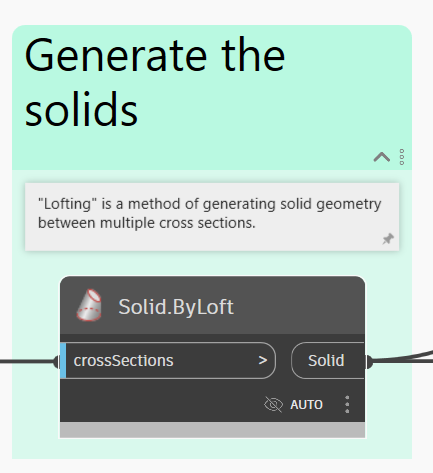

# Estrutura da altura livre

<figure><figcaption></figcaption></figure>

O desenvolvimento de envelopes cinemáticos para validação da altura livre é uma parte importante do projeto de ferrovia. É possível usar o Dynamo para gerar sólidos para o envelope, em vez de criar e gerenciar submontagens complexas de corredor para fazer o trabalho.

## Objetivo

> :dart: Usar um bloco de perfil de veículo para gerar sólidos 3D de estrutura de altura livre ao longo de um corredor.

## Principais conceitos

> * Trabalhar com linhas de recurso do corredor
> * Transformar a geometria entre sistemas de coordenadas
> * Criar sólidos por elevação
> * Controlar o comportamento do nó com configurações de amarra

## Compatibilidade de versão

\r\n Este gráfico será executado no **Civil 3D 2020** e versões superiores. \r\n

## Conjunto de dados

Comece fazendo o download dos arquivos de amostra abaixo e, em seguida, abrindo o arquivo DWG e o gráfico do Dynamo.





## Solução

Apresentamos a seguir uma visão geral da lógica no gráfico.

> 1. Obter linhas de recurso da linha base do corredor especificada
> 2. Gerar sistemas de coordenadas ao longo da linha de recurso do corredor no espaçamento desejado
> 3. Transformar a geometria do bloco do perfil para os sistemas de coordenadas
> 4. Elevar um sólido entre os perfis
> 5. Criar sólidos no Civil 3D

Vamos começar

### Obter os dados do corredor

Nossa primeira etapa é obter os dados do corredor. Selecionaremos o modelo de corredor pelo nome, obteremos uma linha base específica dentro do corredor e, em seguida, obteremos uma linha de recurso dentro da linha base pelo código de ponto.

<figure><figcaption>
Seleção do corredor, da linha base e da linha de recurso
</figcaption></figure>

### Gerar os sistemas de coordenadas

O que vamos fazer agora é gerar os **Sistemas de coordenadas** ao longo das linhas de recurso do corredor entre uma determinada estaca inicial e final. Esses sistemas de coordenadas serão usados para alinhar a geometria do bloco do perfil do veículo com o corredor.

\r\n Se os sistemas de coordenadas forem algo novo para você, veja a seção [2-vectors.md](../../../5\_essential\_nodes\_and\_concepts/5-2\_geometry-for-computational-design/2-vectors.md "mention"). \r\n

<figure><figcaption>
Obtenção dos sistemas de coordenadas ao longo das linhas de recurso do corredor
</figcaption></figure>

> 1. Observe os pequenos **XXX** no canto inferior direito do nó. Isso significa que as configurações de amarra do nó são definidas como _Produto transversal_, que é necessário para gerar os sistemas de coordenadas nos mesmos valores de estaca para ambas as linhas de recurso.

\r\n Se a amarra de nó for algo novo para você, veja a seção [1-whats-a-list.md](../../../5\_essential\_nodes\_and\_concepts/5-4\_designing-with-lists/1-whats-a-list.md "mention"). \r\n

### Transformar a geometria de bloco

Agora, precisamos de alguma forma criar uma matriz dos perfis de veículo ao longo das linhas do recurso. O que vamos fazer é transformar a geometria da definição do bloco do perfil do veículo usando o nó **Geometry.Transform**. Esse é um conceito complicado de visualizar, assim, antes de analisarmos os nós, veja a seguir um gráfico que mostra o que vai acontecer.

<figure><figcaption>
Visualização da transformação da geometria entre sistemas de coordenadas.
</figcaption></figure>

Basicamente, estamos usando a geometria do Dynamo de uma _única_ definição de bloco e movendo-a/girando-a, tudo isso enquanto criamos uma matriz ao longo da linha do recurso. Que legal. Veja como é a aparência da sequência de nós.

<figure><figcaption></figcaption></figure>

> 1. Isso obtém a definição de bloco do documento.
> 2. Esses nós obtêm a geometria do Dynamo dos objetos dentro do bloco.
> 3. Esses nós definem essencialmente o sistema de coordenadas _com base no qual_ estamos transformando a geometria.
> 4. E, por fim, esse nó faz o trabalho real de transformar a geometria.
> 5. Observe a amarra _Mais longa_ nesse nó.

E aqui está o que obtemos no Dynamo.

<figure><figcaption>
Geometria do bloco do perfil do veículo após a transformação
</figcaption></figure>

### Gerar sólidos

Temos boas notícias. O trabalho árduo está feito. Tudo o que precisamos fazer agora é gerar sólidos entre os perfis. Isso é facilmente obtido com o nó **Solid.ByLoft**.

<figure><figcaption></figcaption></figure>

E aqui está o resultado. Lembre-se de que esses são sólidos do Dynamo – ainda precisamos criá-los no Civil 3D.

<figure><figcaption>
Sólidos do Dynamo após a transição
</figcaption></figure>

### Sólidos de saída para o Civil 3D

Nossa última etapa é gerar os sólidos gerados no espaço do modelo. Também daremos a eles uma cor para torná-los muito fáceis de ver.

<figure><figcaption>
Geração de saída dos sólidos para o Civil 3D
</figcaption></figure>

### Resultado

Veja um exemplo de como executar o gráfico usando o **Reprodutor do Dynamo**.

<figure><figcaption>
Execução do gráfico usando o Reprodutor do Dynamo e visualização dos resultados no Civil 3D
</figcaption></figure>

\r\n Se o Reprodutor do Dynamo for algo novo para você, veja a seção [dynamo-player.md](../../dynamo-player.md "mention"). \r\n

> :tada: Missão cumprida.

## Ideias

Veja a seguir algumas ideias sobre como você pode expandir os recursos desse gráfico.

\r\n Adicione a capacidade de usar **diferentes intervalos de estacas** separadamente para cada trilha. \r\n

\r\n **Divida os sólidos** em segmentos menores que podem ser analisados individualmente para detectar interferências. \r\n

\r\n Verifique se os sólidos de envelope **fazem interseção com recursos** e colore os que apresentam interferência. \r\n
